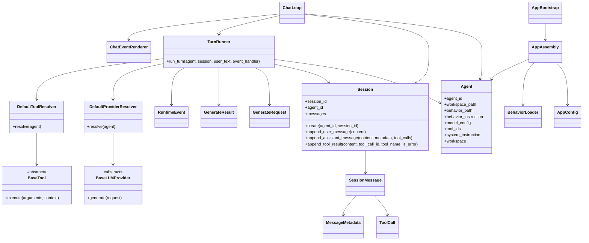
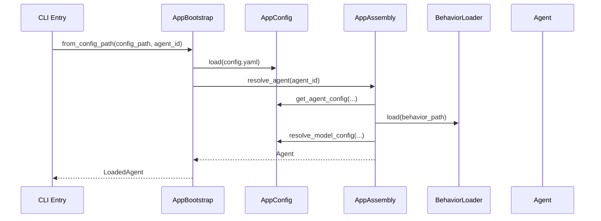
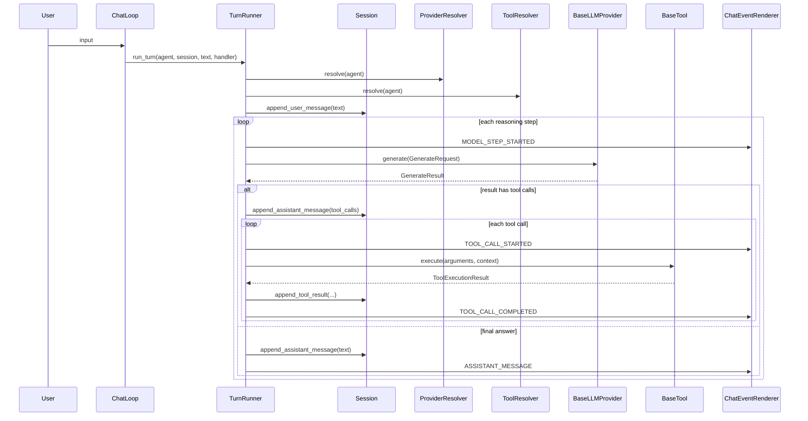
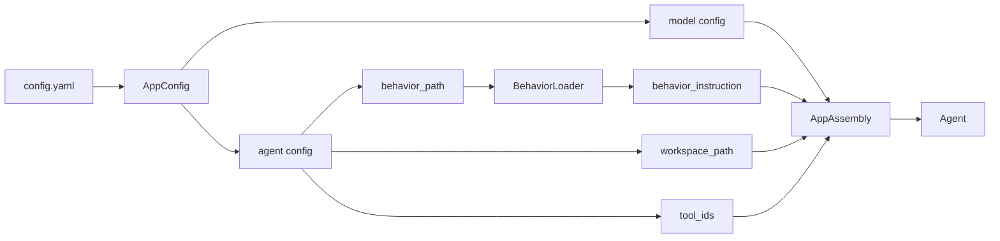
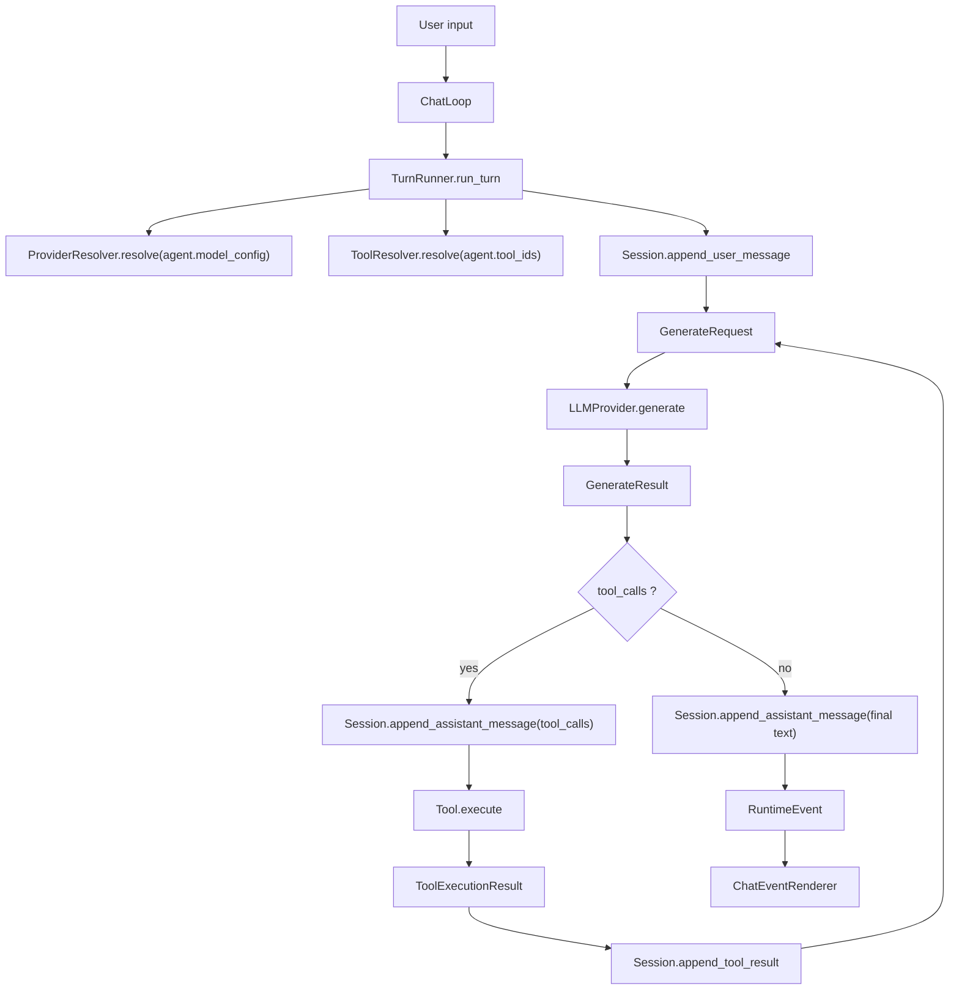

# MyOpenClaw

MyOpenClaw 是一个以 `Agent` 为核心的轻量 Agent 框架实现。

当前代码已经按下面这条主线收敛：

- `agent` 负责核心 Agent 实体
- `conversation` 负责会话与消息
- `runtime` 负责单轮执行与运行事件
- `llm` 负责模型抽象与 provider 适配
- `tools` 负责工具协议、注册与内置工具
- `app` 负责从配置和资源装配 Agent
- `interfaces.cli` 负责 CLI 呈现

这份 README 以当前仓库中的代码实现为准，描述当前结构、类关系和运行过程。

## 当前实现概览

当前系统的运行方式可以概括为：

1. `AppBootstrap` 从 `config.yaml` 加载配置
2. `AppAssembly` 读取 Agent 的 behavior 文件并构造 `Agent`
3. `ChatLoop` 创建 `Session`
4. `TurnRunner` 驱动一次用户输入对应的 ReAct 式工具循环
5. `BaseLLMProvider` 负责模型调用
6. `BaseTool` 负责工具执行
7. `Session` 持续累积消息历史

## 包职责

| 包 | 当前职责 |
| --- | --- |
| `myopenclaw.agent` | 声明式 `Agent` 核心实体 |
| `myopenclaw.conversation` | `Session`、`SessionMessage`、`ToolCall`、消息 metadata |
| `myopenclaw.runtime` | `TurnRunner`、运行事件、生成协议 |
| `myopenclaw.llm` | provider 抽象、模型配置、Gemini 适配 |
| `myopenclaw.tools` | tool 协议、catalog、registry、builtin tools |
| `myopenclaw.app` | behavior 加载、Agent 装配、bootstrap |
| `myopenclaw.config` | 配置解析与路径解析 |
| `myopenclaw.interfaces.cli` | CLI 主循环与事件渲染 |

## 关键类

### Agent Core

- `Agent`
  文件: `src/myopenclaw/agent/agent.py`
  当前是声明式核心实体，直接持有：
  - `agent_id`
  - `workspace_path`
  - `behavior_path`
  - `behavior_instruction`
  - `model_config`
  - `tool_ids`

### Conversation

- `Session`
  文件: `src/myopenclaw/conversation/session.py`
  负责维护某个 Agent 的消息历史，并提供 `Session.create(...)`

- `SessionMessage`
  文件: `src/myopenclaw/conversation/message.py`
  表示一条用户、助手或工具消息

- `ToolCall`
  文件: `src/myopenclaw/conversation/message.py`
  表示模型发出的工具调用

- `MessageMetadata`
  文件: `src/myopenclaw/conversation/metadata.py`
  记录 provider、model、token usage、耗时等元数据

### Runtime

- `TurnRunner`
  文件: `src/myopenclaw/runtime/runner.py`
  当前的单轮执行器，负责：
  - 校验 `Session` 与 `Agent` 的归属关系
  - 根据 `Agent.model_config` 解析 provider
  - 根据 `Agent.tool_ids` 解析工具
  - 生成 `GenerateRequest`
  - 执行 ReAct 式工具循环
  - 把输出写回 `Session`
  - 发出运行事件

- `DefaultProviderResolver`
  文件: `src/myopenclaw/runtime/runner.py`
  默认通过 `create_llm_provider(agent.model_config)` 构造 provider

- `DefaultToolResolver`
  文件: `src/myopenclaw/runtime/runner.py`
  默认通过 `ToolRegistry` + `builtin_tools()` 解析工具

- `RuntimeEvent`
- `RuntimeEventType`
  文件: `src/myopenclaw/runtime/events.py`
  定义运行中对 CLI 或其他消费者暴露的事件协议

- `GenerateRequest`
- `GenerateResult`
- `FinishReason`
- `TokenUsage`
  文件: `src/myopenclaw/runtime/generation.py`
  当前统一归属于 `runtime` 的生成协议

### LLM

- `BaseLLMProvider`
  文件: `src/myopenclaw/llm/provider.py`
  定义统一 `generate(request)` 接口

- `GeminiProvider`
  文件: `src/myopenclaw/llm/providers/gemini.py`
  当前唯一具体 provider 实现

- `ModelConfig`
  文件: `src/myopenclaw/llm/config.py`
  表示 Agent 的默认 brain 配置

### Tools

- `BaseTool`
- `ToolSpec`
- `ToolExecutionContext`
- `ToolExecutionResult`
  文件: `src/myopenclaw/tools/base.py`
  定义工具协议与执行上下文

- `ToolRegistry`
  文件: `src/myopenclaw/tools/registry.py`
  通过 id 解析工具

- `builtin_tools`
  文件: `src/myopenclaw/tools/catalog.py`
  当前内置工具集合入口

- `echo` / `read`
  文件: `src/myopenclaw/tools/builtin.py`
  当前内置工具实现

### App Assembly

- `AppConfig`
  文件: `src/myopenclaw/config/app_config.py`
  负责读取配置文件并解析 provider、agent 配置与路径

- `BehaviorLoader`
  文件: `src/myopenclaw/app/behavior_loader.py`
  负责从 behavior path 读取 `AGENT.md`

- `AppAssembly`
  文件: `src/myopenclaw/app/assembly.py`
  负责根据 `AppConfig` 组装 `Agent`

- `AppBootstrap`
  文件: `src/myopenclaw/app/bootstrap.py`
  负责给上层返回可直接使用的 `LoadedAgent`

### CLI

- `ChatLoop`
  文件: `src/myopenclaw/interfaces/cli/chat.py`
  负责 CLI 会话主循环

- `ChatEventRenderer`
  文件: `src/myopenclaw/interfaces/cli/event_renderer.py`
  负责消费 `RuntimeEvent` 并渲染到终端

## 当前类关系图



## 当前启动装配流程

当前 CLI 启动链路：



## 当前单轮执行流程

当前 `TurnRunner.run_turn(...)` 的核心流程：



## 当前数据流

### 配置到 Agent



### 单轮交互



## 工具 schema 如何传给 LLM

当前工具协议入口在 `src/myopenclaw/tools/base.py`：

- `ToolSpec.name`
- `ToolSpec.description`
- `ToolSpec.input_schema`

`TurnRunner` 会把解析出来的工具对象转换成 `GenerateRequest.tools`：

- `tools=[tool.spec for tool in tools]`

具体 provider 侧，`GeminiProvider` 会把 `ToolSpec.input_schema` 映射成 Gemini function declaration 的 `parameters_json_schema`。


## 当前目录结构

```text
src/myopenclaw/
  agent/
    agent.py
  app/
    assembly.py
    behavior_loader.py
    bootstrap.py
  config/
    app_config.py
  conversation/
    message.py
    metadata.py
    session.py
  interfaces/cli/
    chat.py
    event_renderer.py
    main.py
  llm/
    config.py
    factory.py
    metadata.py
    provider.py
    providers/gemini.py
  runtime/
    events.py
    generation.py
    runner.py
  tools/
    base.py
    builtin.py
    catalog.py
    registry.py
```

