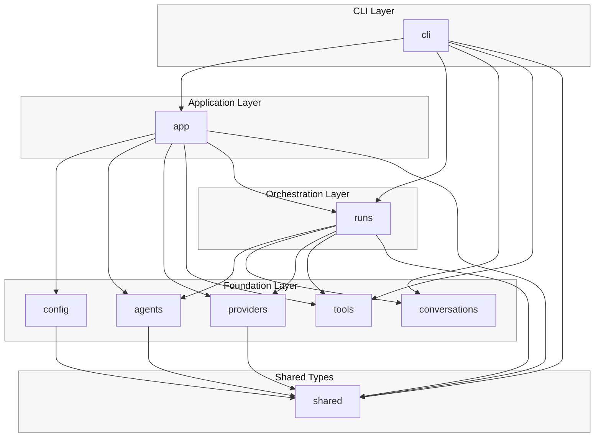

# MyOpenClaw Architecture

This project is organized around business-object packages, with orchestration and delivery separated from reusable domain and infrastructure code.

Current top-level packages:

- `shared`: cross-package value types and reusable configuration objects
- `config`: application config parsing and resolution
- `agents`: agent definition and behavior loading
- `conversations`: session, message, and transcript state
- `providers`: model provider abstractions and concrete provider implementations
- `tools`: tool abstractions and concrete tools
- `runs`: orchestration of model calls, tool execution, and runtime events
- `app`: composition root and application assembly
- `cli`: command-line user interaction

The architectural intent is:

- reusable types are kept in `shared`
- business-facing foundational packages stay below orchestration
- orchestration is isolated in `runs`
- object wiring is isolated in `app`
- user interaction is isolated in `cli`

## Dependency Diagram

## Runtime Flow

The main execution path is:

1. `cli` accepts user input and invokes `app`
2. `app` assembles configured agents, providers, tools, and runtime objects
3. `runs` coordinates model turns, tool calls, and event emission
4. `providers` and `tools` perform concrete work
5. `conversations` stores the turn transcript and metadata

## Notes

- The source of truth for dependency constraints lives in `AGENTS.md`.
- The source of truth for automated dependency validation lives in `scripts/check_layer_dependencies.py`.
