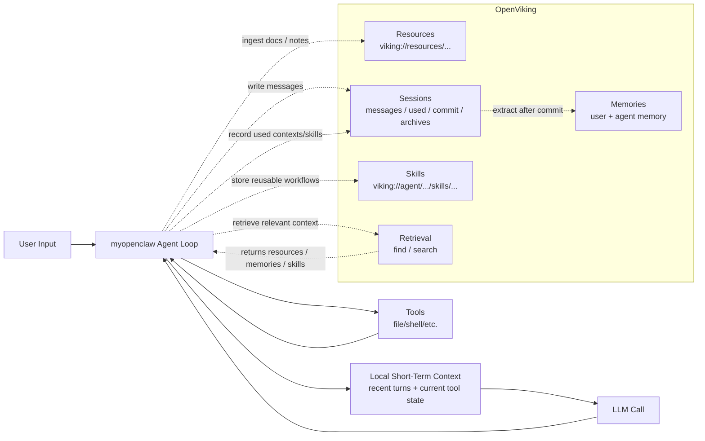

# OpenViking Current Understanding

Date: 2026-04-13

## Goal

This note captures our current understanding of OpenViking after:

- reading the official product documentation
- inspecting the HTTP API surface exposed by `https://openviking.sunxie.me`
- testing the deployed server directly with HTTP requests
- testing the official Python SDK against the deployed server

This is an internal engineering note. It is not a verbatim product description.

## Executive Summary

OpenViking is best understood as a **long-term context infrastructure layer for agents**, not as a standalone agent runtime.

Its job is not to decide how the agent reasons. Its job is to manage:

- long-lived external knowledge
- session history and archives
- extracted memories
- reusable skills
- retrieval over those assets

For our current `myopenclaw` architecture, the clean mental model is:

- `myopenclaw` manages **short-term runtime context**
- OpenViking manages **long-term context assets and session-backed recall**

## What OpenViking Is

At a product level, OpenViking provides:

- a filesystem-style namespace for context assets using `viking://...` URIs
- resource ingestion for documents, repos, URLs, and uploaded files
- semantic retrieval via `find()` and `search()`
- session lifecycle APIs
- session commit, archive, and memory extraction
- skill storage and retrieval
- tenant/user/account isolation with API keys
- a Console UI and system observability endpoints

This means it is closer to a context operating system than to a plain vector database.

## What OpenViking Is Not

OpenViking does not replace:

- the agent loop
- tool orchestration
- planning/execution logic
- the model provider
- the local prompt/runtime policy

It does not "think" for the agent. It prepares, stores, compresses, and retrieves context for the agent.

## How OpenViking Models Context

OpenViking treats context as structured assets, not as one big prompt string.

There are three primary asset classes:

1. `resources`
   External knowledge such as docs, repos, manuals, PDFs, and pages.

2. `memories`
   Long-term structured knowledge extracted from sessions.

3. `skills`
   Reusable workflows or tool/skill definitions that can be searched later.

Each asset lives under a `viking://...` URI. For example:

- `viking://resources/openviking-readme`
- `viking://user/<user_id>/memories/...`
- `viking://agent/<agent_id>/skills/...`
- `viking://session/<user_id>/<session_id>/...`

The important design point is that context becomes addressable and inspectable.

## How OpenViking Manages Context

### 1. Filesystem-Style Storage

Instead of storing context as anonymous chunks, OpenViking organizes it as a virtual filesystem.

That gives us:

- `ls`
- `tree`
- `stat`
- path-based organization
- stable URIs that can be recorded and reused

This is useful because agents can refer back to specific context assets rather than only relying on vector matches.

### 2. Layered Context: L0 / L1 / L2

OpenViking does not assume every retrieved object should be loaded in full immediately.

It uses layered representations:

- `L0`: short abstract
- `L1`: overview
- `L2`: detailed/full content

This is one of the main ways OpenViking reduces prompt waste.

Instead of:

- always loading the full source

it enables:

- retrieve cheap summaries first
- rerank/navigate
- load details only when needed

This is a different strategy from our current local context window trimming. It reduces prompt size before content ever reaches the model.

### 3. Session Lifecycle

OpenViking sessions are not just chat logs. A session can:

- receive messages
- record used contexts
- record used skills
- be committed
- produce archives
- feed memory extraction

The operational lifecycle looks like:

1. create session
2. add messages
3. record used context/skills
4. commit session
5. archive/compress old history
6. extract long-term memory

This is how OpenViking turns transient conversation into reusable context.

### 4. Memory Extraction

After session commit, OpenViking can extract structured memory from the interaction.

Based on docs and observed API surfaces, this includes categories such as:

- profile
- preferences
- entities
- events
- cases
- patterns
- tools
- skills

The important idea is that long-term context is not represented only as raw chat history. It is distilled into structured memory.

### 5. Retrieval

There are two main retrieval paths:

- `find()`
  Regular semantic retrieval over stored assets.

- `search()`
  Session-aware retrieval that uses current session state when deciding what is relevant.

This distinction matters:

- `find()` is a normal knowledge lookup
- `search()` is context-aware recall

## Our Current Agent vs OpenViking

The difference between our local architecture and OpenViking is easiest to see as a split between short-term and long-term context.

### What `myopenclaw` currently does well

Our current runtime already manages:

- recent turn history
- the current tool-use state
- summarized older tool traces inside the local conversation window
- direct prompt assembly for the next model call

That is short-term runtime context.

### What OpenViking adds

OpenViking adds:

- context persistence across sessions
- semantic retrieval over project knowledge
- archive/commit workflows
- extracted long-term memory
- skill storage and retrieval
- a system for tracking which contexts and skills were actually used

## Why OpenViking Is Useful For Us

If we integrate it well, it gives us four concrete capabilities we do not currently have in `myopenclaw`:

1. **Persistent project knowledge**
   Docs, runbooks, and repos can be ingested once and reused across sessions.

2. **Session-backed recall**
   The agent can use session-aware retrieval instead of relying only on the local prompt window.

3. **Long-term memory**
   Repeated user preferences and successful patterns can accumulate as memories.

4. **Reusable skill memory**
   Workflows can be stored as searchable skills instead of living only in prompt text or local docs.

## HTTP/API Surface We Verified

Against `https://openviking.sunxie.me`, we verified these major interface groups.

### System

- `GET /health`
- `GET /ready`
- `GET /api/v1/system/status`
- `POST /api/v1/system/wait`

### Admin / Tenant

- `GET /api/v1/admin/accounts`
- `POST /api/v1/admin/accounts`
- `POST /api/v1/admin/accounts/{account_id}/users`

### Filesystem

- `GET /api/v1/fs/ls`
- `GET /api/v1/fs/tree`
- `GET /api/v1/fs/stat`
- `POST /api/v1/fs/mkdir`
- `POST /api/v1/fs/mv`

### Retrieval

- `POST /api/v1/search/find`
- `POST /api/v1/search/search`
- `POST /api/v1/search/grep`
- `POST /api/v1/search/glob`

### Sessions

- `POST /api/v1/sessions`
- `GET /api/v1/sessions`
- `GET /api/v1/sessions/{session_id}`
- `GET /api/v1/sessions/{session_id}/context`
- `POST /api/v1/sessions/{session_id}/messages`
- `POST /api/v1/sessions/{session_id}/used`
- `POST /api/v1/sessions/{session_id}/commit`
- `POST /api/v1/sessions/{session_id}/extract`

### Resources / Skills

- `POST /api/v1/resources`
- `POST /api/v1/resources/temp_upload`
- `POST /api/v1/skills`

## Runtime Behaviors We Verified

### Verified Working

The following are working on our deployed server as of 2026-04-13:

- health and status endpoints
- tenant creation via root key
- user-key-based access to tenant-scoped APIs
- resource ingestion from URL
- filesystem browsing of ingested resources
- `find()` retrieval
- `search()` without session context
- session creation
- message append
- used-context / used-skill recording
- session-aware `search(session_id=...)`
- skill creation and skill retrieval
- session commit
- archive/context inspection after commit

### Operational Notes

- We created an account `myopenclaw` and user `ssunxie` for testing.
- We verified the official Python SDK with `SyncHTTPClient`.
- We added a local non-production SDK smoke test example:
  - [examples/openviking_sdk/smoke_test.py](/Users/ssunxie/code/myopenclaw/examples/openviking_sdk/smoke_test.py)

## Notable Observations

### 1. `search(session_id=...)` Was Initially Broken

Earlier in testing, session-aware search returned `500 INTERNAL` when the session contained messages.

That behavior is now fixed on the server and the following paths both work:

- direct HTTP call
- official SDK call

Our current interpretation is that this was a server-side bug in the session-aware retrieval path rather than a client-side request issue.

### 2. `wait=true` Is Less Operationally Stable Than Async + Polling

We observed at least one long-running request where:

- the resource was successfully ingested
- data appeared in the filesystem afterward
- but the waiting HTTP request behaved poorly on the client side

This suggests a response-path issue rather than an ingestion failure.

For production use, the safer pattern is:

1. submit work without blocking on a single long request
2. poll `POST /api/v1/system/wait` or check the resulting object afterward

This is especially relevant when traffic passes through:

- Caddy
- uvicorn
- HTTP/2

## Recommended Mental Model For Integration

We should not think of OpenViking as "our new context window."

That would be the wrong abstraction.

The better model is:

- local conversation window remains the short-term execution state
- OpenViking becomes the long-term context substrate

That implies this split:

- local runtime:
  - active turn state
  - prompt assembly
  - immediate tool-use loop

- OpenViking:
  - persistent knowledge base
  - session persistence
  - memory extraction
  - skill persistence
  - session-aware retrieval

## How We Should Use It First

Before attempting deep integration, the best initial use for us is:

1. ingest important project knowledge into `resources`
2. use `find()` for stable semantic recall
3. write session messages and `commit_session()`
4. record used contexts/skills
5. use session-aware `search()` selectively for higher-level recall

This keeps our existing agent loop intact while adding long-term context value.

## Open Questions

There are still questions we have not fully answered:

- how good the memory extraction quality is in practice over repeated sessions
- how stable `search(session_id=...)` remains under more realistic workload
- whether we want to trust SDK `wait=true` patterns in production
- how much of our skill system should stay local vs be mirrored into OpenViking
- whether we should inject retrieved OpenViking context directly into prompts or keep it tool-driven first

## Current Recommendation

Our current recommendation is:

- treat OpenViking as a promising long-term context layer
- do not replace the current `myopenclaw` short-term context runtime
- prefer incremental integration
- use the already-verified surfaces first:
  - resource ingestion
  - filesystem browsing
  - `find()`
  - sessions
  - commit/archive
  - skills

This gives us practical value without over-coupling our runtime to a single external service too early.

## References

Official references:

- [OpenViking Introduction](https://mintlify.wiki/volcengine/OpenViking/introduction)
- [OpenViking Retrieval](https://mintlify.wiki/volcengine/OpenViking/concepts/retrieval)
- [OpenViking Session Management](https://mintlify.wiki/volcengine/OpenViking/concepts/session)
- [OpenViking Python SDK](https://mintlify.wiki/volcengine/OpenViking/guides/python-sdk)
- [OpenViking Authentication](https://mintlify.wiki/volcengine/OpenViking/guides/authentication)

Local references:

- [SDK smoke test](/Users/ssunxie/code/myopenclaw/examples/openviking_sdk/smoke_test.py)
- [SDK smoke test README](/Users/ssunxie/code/myopenclaw/examples/openviking_sdk/README.md)
