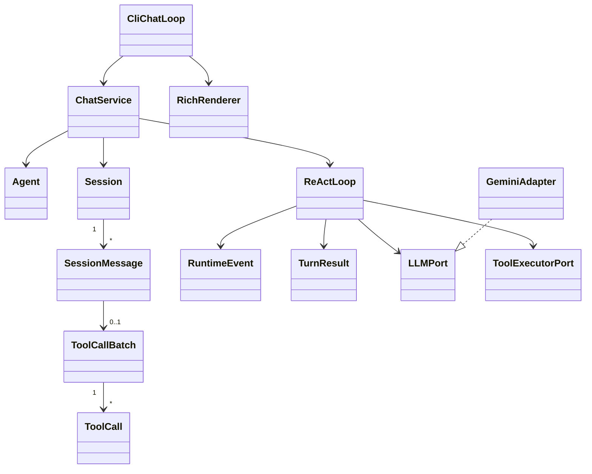
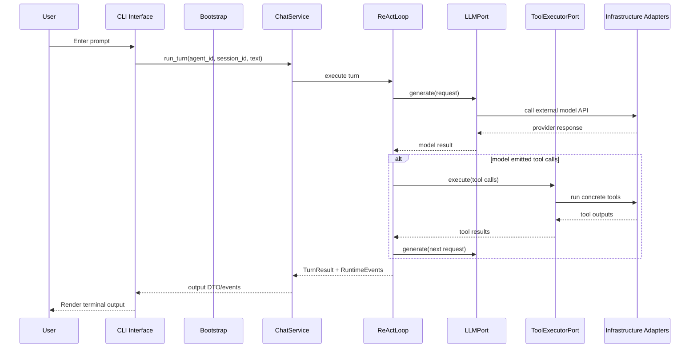

# MyOpenClaw Strict Layering Refactor

This document describes the target architecture after refactoring MyOpenClaw toward strict layering.

It is intentionally a target-state document, not a description of the current implementation.

## Goal

The refactor adopts a strict inward dependency model:

- business rules and core entities stay stable and framework-agnostic
- orchestration depends on abstract ports rather than concrete integrations
- infrastructure implements ports but does not own business flow
- CLI becomes a delivery adapter and no longer reaches into runtime internals
- composition is centralized in one bootstrap layer

The main objective is to remove cross-layer imports and make the dependency direction obvious from package boundaries.

## Target Layers

The target package structure is:

```text
interfaces -> application -> domain
infrastructure -> application -> domain
bootstrap -> interfaces/application/infrastructure/domain
shared -> domain/application/infrastructure/interfaces/bootstrap
```

The dependency rule is:

- `shared` may not import any project package
- `domain` may depend only on `shared`
- `application` may depend only on `domain` and `shared`
- `infrastructure` may depend only on `application`, `domain`, and `shared`
- `interfaces` may depend only on `application` and `shared`
- `bootstrap` may depend on all layers and is the only composition root

This means there is no direct `interfaces -> infrastructure` dependency and no direct `interfaces -> domain` dependency.

## Layer Responsibilities

### `shared`

`shared` contains only layer-neutral primitives and reusable value objects.

Examples:

- file access enums
- generic model-independent utility value types
- helper types that carry no application meaning

`shared` must not know what an agent, session, tool call, provider, or runtime event is.

### `domain`

`domain` contains core business entities and transcript state.

Examples:

- `Agent`
- `Session`
- `SessionMessage`
- `ToolCall`
- `ToolCallBatch`
- domain-facing metadata that is part of conversation state

The domain layer owns the shape of the conversation and agent state, but it does not know how turns are executed or how models are called.

### `application`

`application` contains use cases, orchestration, and port definitions.

Examples:

- `ChatService`
- `TurnRunner`
- `ReActLoop`
- `RuntimeEvent`
- `TurnResult`
- `LLMPort`
- `ToolExecutorPort`
- request and response DTOs for application-to-port communication

This layer is where the turn flow lives:

- append user input
- build model request from domain state
- call the model port
- execute tool calls through a tool port
- append assistant output
- emit UI-neutral runtime events

This layer must not depend on Gemini, YAML files, Rich, shell execution details, or concrete filesystem implementations.

### `infrastructure`

`infrastructure` contains concrete adapters for external systems and local IO.

Examples:

- Gemini adapter
- tool registry and concrete tool implementations
- YAML config loader
- behavior file loader
- workspace file service
- shell session manager

This layer implements application ports and translates external APIs into application DTOs.

It must not own the overall turn algorithm.

### `interfaces`

`interfaces` contains delivery adapters.

For now, the main delivery adapter is CLI.

Examples:

- Typer entrypoint
- chat loop
- Rich renderer
- command parsing

This layer converts user interaction into application requests and renders application events or results back to the terminal.

It must not directly manipulate session internals, tool implementations, or provider-specific result types.

### `bootstrap`

`bootstrap` is the composition root.

It wires together:

- config loading
- behavior loading
- agent construction
- application service construction
- infrastructure adapter registration
- CLI startup dependencies

All concrete assembly logic belongs here so the rest of the system can stay declarative and testable.

## Target Package Mapping

The current packages should evolve roughly into the following targets:

| Current package | Target layer | Notes |
| --- | --- | --- |
| `shared` | `shared` | Keep only layer-neutral values |
| `agents` | `domain` + `infrastructure` | `Agent` moves to domain; behavior loading moves to infrastructure |
| `conversations` | `domain` | Session and message entities become core domain state |
| `runs` | `application` | Orchestration and runtime events become application services |
| `providers` | `application` + `infrastructure` | Port interfaces move to application; Gemini stays infrastructure |
| `tools` | `application` + `infrastructure` | Tool execution port in application; concrete tools in infrastructure |
| `config` | `infrastructure` | Config parsing is IO and should not stay in the core |
| `app` | `bootstrap` | It is a composition root, not a business layer |
| `cli` | `interfaces` | CLI should depend only on application-facing contracts |

## Core Entity Relationships

The main target entity relationships are:



The important boundary is:

- domain owns state
- application owns behavior
- infrastructure owns implementation details
- interfaces owns presentation

## Key Runtime Flow

The target runtime flow from CLI input to CLI output is:



The CLI should not render directly from provider-specific or tool-specific internal objects. It should consume application output only.

## Port Boundaries

The most important application ports are:

- `LLMPort`
  - takes an application-owned request DTO
  - returns an application-owned response DTO
- `ToolExecutorPort`
  - takes application tool-call DTOs plus execution context
  - returns application tool result DTOs
- `ConfigPort` or bootstrap-only config loader
  - resolves runtime configuration into bootstrap inputs
- `BehaviorSource`
  - resolves agent instructions from files or other sources

These ports should be defined in `application`, not in `infrastructure`.

## Important Refactor Decisions

### `GenerateRequest` and `GenerateResult`

These should not stay in `shared`.

They represent application-to-LLM port contracts and belong in `application`.

They should also not be consumed directly by CLI. If CLI needs renderable output, application should expose a separate DTO such as `TurnResult` or renderable `RuntimeEvent`.

### Runtime events

`RuntimeEvent` should remain an application-level concept.

It is useful for streaming progress to CLI, but it must remain UI-neutral.

That means event payloads should avoid Rich types and avoid direct exposure of infrastructure objects.

### Config and behavior loading

YAML parsing and AGENT file reading are infrastructure concerns.

They may influence application behavior, but they are not themselves application logic.

### Tool execution

Tool execution currently mixes protocol definitions and concrete implementations.

After refactor:

- application defines the tool execution port
- infrastructure implements the registry and concrete tools
- application sees only tool execution contracts

## Rules for the Refactored Codebase

The following rules should remain true after the refactor:

- CLI imports only `interfaces`, `application`, and `shared`
- application never imports Rich, Typer, YAML, Gemini SDK, or concrete tool classes
- infrastructure never owns turn orchestration logic
- domain entities remain usable in tests without bootstrapping external services
- bootstrap is the only layer that knows all concrete implementations
- no package re-export should hide a forbidden dependency path

## Migration Direction

A safe migration order is:

1. Introduce target packages and application ports without deleting old packages.
2. Move request, response, and event contracts into `application`.
3. Move `Agent`, `Session`, and transcript entities into `domain`.
4. Move Gemini, tool implementations, config loading, and behavior loading into `infrastructure`.
5. Replace `app` with an explicit `bootstrap` module.
6. Reduce CLI imports until CLI depends only on application-facing services and DTOs.
7. Remove compatibility re-exports and tighten automated dependency checks.

## Non-Goals

This refactor does not require:

- changing user-facing CLI behavior
- changing the ReAct algorithm itself
- changing the provider API surface exposed to external services
- introducing multiple delivery interfaces before the layering is stable

The primary purpose is architectural clarity and enforceable dependency direction.
