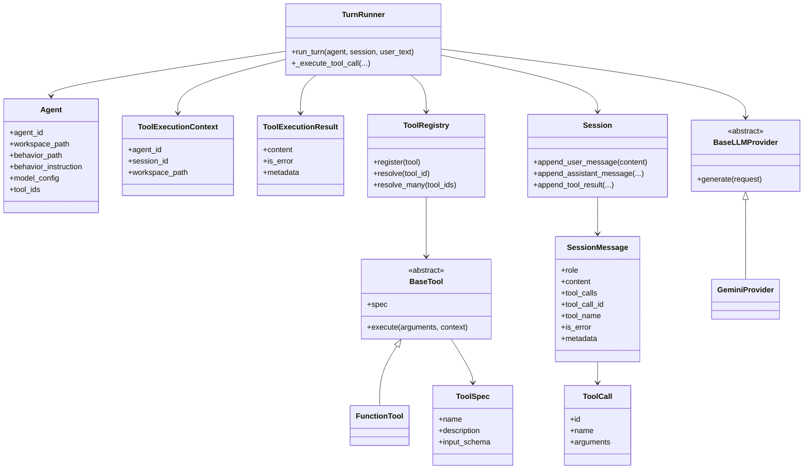
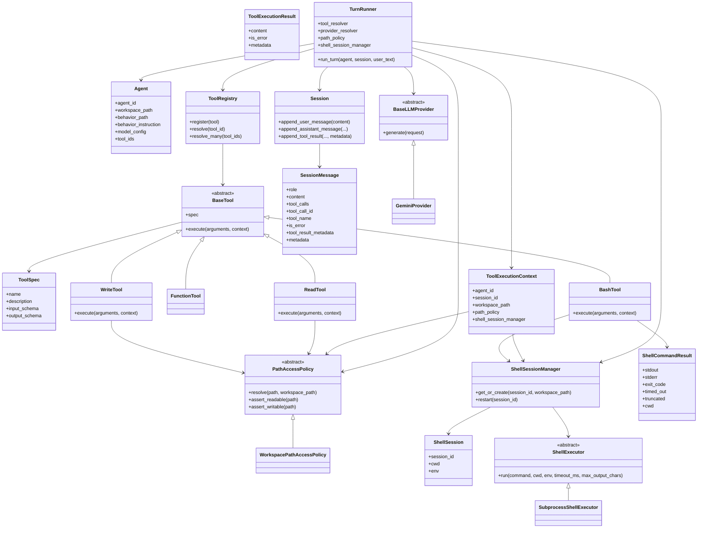
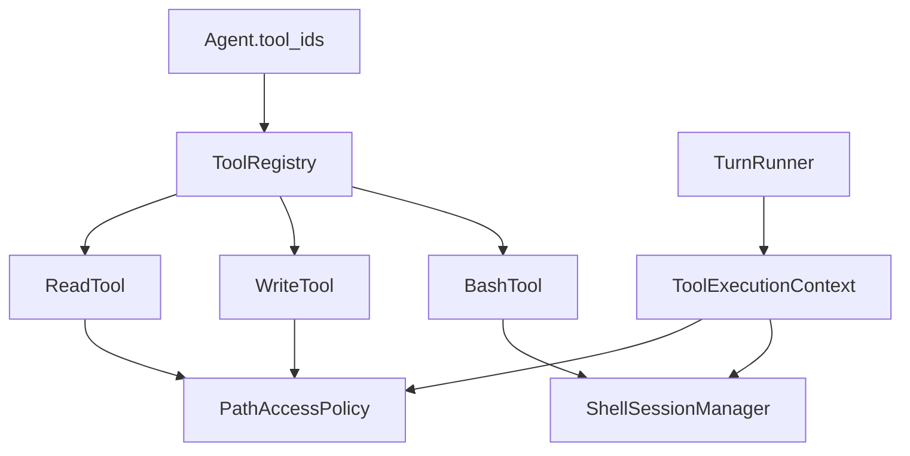
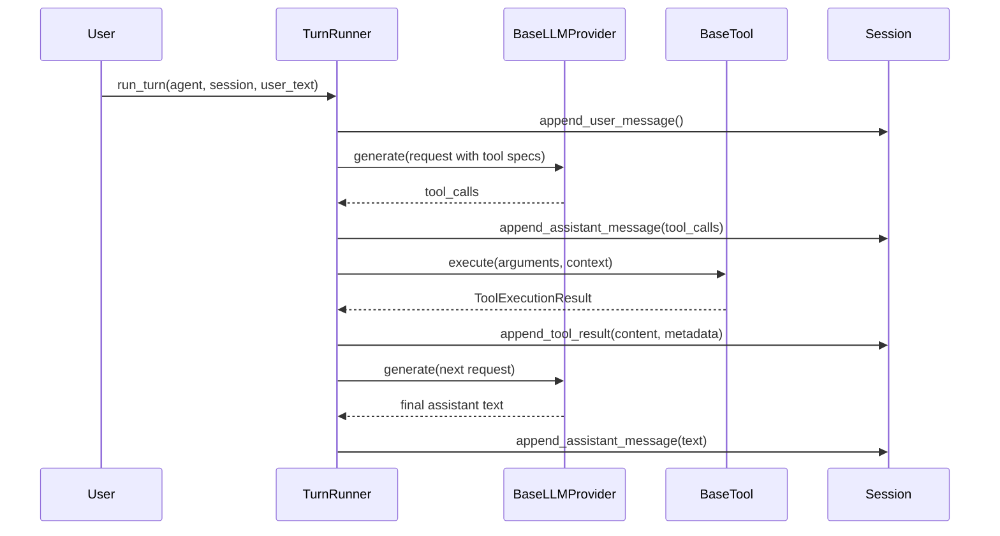

# Agent 内置工具升级架构设计

## 目标

定义 MyOpenClaw 从当前轻量工具层升级到生产可用的 `read`、`write`、`bash` 三个内置工具时，对应的类关系、抽象边界和配套改动。

本文档重点回答三件事：

- 工具系统里有哪些核心实体类和抽象类
- `session`、`runtime`、`cli` 这些外围类需要怎么配合调整
- 这些类之间的依赖关系应该如何收敛，避免过度抽象

## 当前状态

当前主链路已经存在：

1. `Agent` 声明 `tool_ids`
2. `TurnRunner` 根据 `tool_ids` 解析出工具
3. `TurnRunner` 把 `ToolSpec` 传给 provider
4. `GeminiProvider` 把 `ToolSpec` 转成 function declaration
5. 模型返回 `ToolCall`
6. `TurnRunner` 执行对应的工具
7. 工具结果写入 `Session`

也就是说，当前缺的不是“Agent 能不能调用工具”，而是 `read`、`write`、`bash` 本身的实现和支撑结构还不完整。

## 当前问题

- `read` 目前只是一个直接读文件的轻量实现，没有 workspace 边界约束
- `write` 和 `bash` 还没有实现
- `ToolExecutionContext` 目前只提供静态信息，不能把共享依赖传给工具
- `SessionMessage` 还不能保存结构化的 tool result metadata
- `bash` 相关的 shell 会话和执行后端还没有专门的类

## 设计原则

- `Agent` 保持声明式，只声明能力，不绑定运行时对象
- provider 只负责描述工具，不负责执行工具
- runtime 继续负责编排，工具只负责执行
- 文件访问策略和 shell 执行逻辑不要散落在工具函数里
- 当前阶段优先使用可理解、可测试、可落地的最小抽象

## 方案选择

### 方案 A：全部继续用 `FunctionTool`

把 `read`、`write`、`bash` 都写成装饰器函数。

优点：

- 实现最快
- 改动最小

缺点：

- 路径安全和 shell 状态会散落
- `bash` 不容易演进成会话式工具
- 测试边界不清晰

### 方案 B：保留统一工具契约，复杂工具显式建类

保留 `BaseTool` 作为统一契约，简单工具继续可用 `FunctionTool`，但 `read`、`write`、`bash` 使用显式工具类，同时增加少量辅助类。

优点：

- 与当前架构兼容
- 能把文件策略和 shell 执行抽出来
- 更适合 coding agent 的长期演进

缺点：

- 比纯函数工具多一层结构

### 方案 C：先做 MCP 风格适配层

先不让 runtime 直接调用本地工具，而是在本地工具前面加一层 MCP 风格的适配器。

它表达的是下面这种结构：

`TurnRunner -> Adapter -> Local Tool`

而不是现在的：

`TurnRunner -> Local Tool`

这个 adapter 会把本地工具包装成类似 `list_tools` / `call_tool` 的协议形式，方便以后对接外部 MCP 工具。

优点：

- 以后接第三方工具会更统一

缺点：

- 对当前阶段来说抽象过早
- 本地 `read/write/bash` 的实现收益不大，复杂度先上来了

## 推荐方案

推荐方案 B。

对于当前项目，最合适的做法不是再加一层协议，而是把本地工具先做扎实，并把类关系收敛清楚。

## 当前类图



## 升级后的目标类图

这版类图只保留当前阶段真正需要的核心抽象，不再引入聚合服务类，也不再加额外的文件工具抽象基类。



## 工具系统关系图

这张图只回答一个问题：工具是如何从配置进入执行阶段的。



## Runtime 与 Session 关系图

这张图回答 runtime、tool、session 三者之间的交互顺序。



## 关键类说明

### `Agent`

不改结构。

它仍然只是能力声明载体，继续保存：

- workspace
- behavior
- model
- tool ids

### `ToolSpec`

建议新增 `output_schema`。

这不是当前必须项，但建议现在把位置留出来，因为后续 `bash` 的返回值会比 `echo`、`read` 复杂得多。

### `ToolExecutionContext`

这是本次升级里最关键的改动点。

当前它只有静态信息：

- `agent_id`
- `session_id`
- `workspace_path`

升级后建议直接增加两个依赖：

- `path_policy`
- `shell_session_manager`

这样做的原因很直接：

- `read`、`write` 需要路径约束
- `bash` 需要会话级 shell 状态

这里不再额外包装一个 `ToolRuntimeServices` 聚合类，避免理解成本过高。

### `ToolExecutionResult`

主结构不变，继续保留：

- `content`
- `is_error`
- `metadata`

但需要明确约定复杂工具的 `metadata` 内容。

建议示例：

- `read`：`{"path": "...", "start_line": 1, "end_line": 80, "truncated": false}`
- `write`：`{"path": "...", "action": "replace", "bytes_written": 320}`
- `bash`：`{"cwd": "...", "exit_code": 0, "timed_out": false, "truncated": true}`

### `BaseTool`

不改接口。

当前的：

`execute(arguments, context)`

已经是合适的统一工具执行边界。

### `ReadTool`

新增具体工具类。

建议输入字段：

- `path`
- `start_line`
- `end_line`
- `max_chars`

依赖：

- `PathAccessPolicy`

职责：

- 解析路径
- 确保路径不越出 workspace
- 按行读取
- 对大文件结果做截断

### `WriteTool`

新增具体工具类。

建议输入字段：

- `path`
- `action`
- `content`
- `old_text`
- `new_text`
- `insert_line`

其中 `action` 建议支持：

- `create`
- `overwrite`
- `append`
- `replace`
- `insert`

依赖：

- `PathAccessPolicy`

职责：

- 安全路径解析
- 安全写入
- 支持更适合 coding workflow 的定点编辑

### `BashTool`

新增具体工具类。

建议输入字段：

- `command`
- `timeout_ms`
- `restart`
- `max_output_chars`

依赖：

- `ShellSessionManager`

职责：

- 获取当前 session 对应的 shell session
- 执行命令
- 返回 `stdout/stderr/exit_code/cwd` 等信息

### `PathAccessPolicy`

新增抽象类。

这是 `read` 和 `write` 的核心安全边界。

职责：

- 解析路径
- 拒绝越出 workspace
- 校验读权限和写权限

首个实现建议为：

- `WorkspacePathAccessPolicy`

说明：

不是所有工具都需要 workspace 约束，但 `read`、`write`、`bash` 这三个本地工具都需要以 workspace 作为默认边界。

### `ShellSessionManager`

新增支撑类。

职责：

- 为同一个 conversation session 维护 shell 状态
- 记录当前 `cwd`
- 管理 `env`
- 支持 `restart`

它的存在意义是让下面这种行为成立：

1. `bash("cd backend")`
2. `bash("pytest -q")`

第二条命令要能够继承第一条命令后的 shell 状态。

### `ShellExecutor`

新增 shell 执行后端抽象。

职责：

- 真正执行命令
- 处理 timeout
- 处理输出捕获与截断
- 返回统一结果

首个实现建议为：

- `SubprocessShellExecutor`

### `SessionMessage`

建议新增：

- `tool_result_metadata`

原因：

当前 CLI 能显示 tool result，是因为它只依赖：

- `tool_name`
- `content`
- `is_error`

但未来 `bash` 的 `exit_code`、`cwd`、`timed_out` 这些信息如果不单独保存，只能混在文本里，不利于：

- CLI 做更细致渲染
- 模型做下一步推理

### `Session`

建议把 `append_tool_result(...)` 扩展成支持 `metadata`。

目标不是改变当前 session 的职责，而是让它能保存更完整的工具观察结果。

### `TurnRunner`

需要新增两项 runtime 依赖：

- `path_policy`
- `shell_session_manager`

职责保持不变：

- 解析工具
- 调用 provider
- 构造 `ToolExecutionContext`
- 执行工具
- 将工具结果写入 session

换句话说，`TurnRunner` 仍然是唯一把下面几样东西绑定在一起的类：

- `Agent`
- `Session`
- `Provider`
- `Tool`

## Shell 选型说明

当前不在设计层面把 shell 最终写死。

建议分两阶段：

1. 第一阶段使用 `SubprocessShellExecutor`
2. 第二阶段再决定是否升级到更强的持久 shell 方案

第一阶段内部执行器可配置为：

- `/bin/zsh -lc`
- `/bin/bash -lc`

如果主要运行环境是 macOS 本地开发机，优先建议 `/bin/zsh -lc`，因为和当前用户环境更一致。

这里要区分两件事：

- 对外工具名字仍然叫 `bash`
- 内部执行后端不一定非得真用 `bash`

## 分层总结

### 声明层

- `Agent`
- `ToolSpec`
- `ToolCall`

描述能力和模型请求。

### 执行层

- `TurnRunner`
- `ToolExecutionContext`
- `ToolExecutionResult`
- `BaseTool`
- `ReadTool`
- `WriteTool`
- `BashTool`

负责单轮中的实际工具执行。

### 支撑层

- `PathAccessPolicy`
- `WorkspacePathAccessPolicy`
- `ShellSessionManager`
- `ShellSession`
- `ShellExecutor`
- `SubprocessShellExecutor`

负责安全边界和共享状态。

### Transcript 层

- `Session`
- `SessionMessage`

负责保存模型可见的会话记录和工具观察结果。

## 文件改动建议

### 需要修改的文件

- `src/myopenclaw/tools/base.py`
- `src/myopenclaw/tools/catalog.py`
- `src/myopenclaw/conversation/message.py`
- `src/myopenclaw/conversation/session.py`
- `src/myopenclaw/runtime/runner.py`
- `src/myopenclaw/interfaces/cli/chat.py`
- `src/myopenclaw/interfaces/cli/event_renderer.py`

### 建议新增的文件

- `src/myopenclaw/tools/filesystem.py`
- `src/myopenclaw/tools/shell.py`
- `src/myopenclaw/tools/policy.py`

## KISS 约束

这一版实现刻意遵守 `Unix philosophy` 和 `keep it simple and stupid`，因此明确约束如下：

- 一个类只负责一件事
- 不引入聚合服务容器类
- 不为了“未来可能扩展”提前加过多抽象
- 能用明确依赖注入解决的问题，不再额外包一层 manager-of-manager
- `read`、`write`、`bash` 先解决当前本地 Agent 场景，不提前设计成通用插件平台

具体体现为：

- `ToolExecutionContext` 直接放 `path_policy` 和 `shell_session_manager`
- 文件工具只共享一个 `PathAccessPolicy`
- shell 工具只共享一个 `ShellSessionManager`
- `TurnRunner` 只负责编排，不吸收文件和 shell 的实现细节

## 类到文件映射

这部分回答“类具体放哪里”。

### `src/myopenclaw/tools/base.py`

保留和扩展最基础的工具契约：

- `ToolSpec`
- `ToolExecutionContext`
- `ToolExecutionResult`
- `BaseTool`
- `FunctionTool`
- `tool`

建议改动：

- `ToolSpec` 增加可选 `output_schema`
- `ToolExecutionContext` 增加：
  - `path_policy`
  - `shell_session_manager`

这一层只放“所有工具都要共享的基础契约”，不放具体工具实现。

### `src/myopenclaw/tools/policy.py`

只放文件访问策略相关的类：

- `PathAccessPolicy`
- `WorkspacePathAccessPolicy`

原因：

- `read` 和 `write` 都依赖它
- 这是单独可测试的安全边界

不要把 shell 相关逻辑放到这个文件里。

### `src/myopenclaw/tools/filesystem.py`

只放文件工具：

- `ReadTool`
- `WriteTool`

允许放少量私有辅助函数，例如：

- `_read_lines(...)`
- `_truncate_text(...)`
- `_atomic_write(...)`

不要在这里再引入新的抽象基类。

### `src/myopenclaw/tools/shell.py`

只放 shell 相关类：

- `ShellCommandResult`
- `ShellSession`
- `ShellExecutor`
- `SubprocessShellExecutor`
- `ShellSessionManager`
- `BashTool`

这样文件边界很清楚：

- 文件工具在 `filesystem.py`
- shell 工具在 `shell.py`
- 安全策略在 `policy.py`

### `src/myopenclaw/tools/catalog.py`

继续作为 builtin tool 注册入口。

建议最终注册：

- `echo`
- `ReadTool`
- `WriteTool`
- `BashTool`

### `src/myopenclaw/runtime/runner.py`

继续保留运行时编排职责。

建议新增 runtime 持有依赖：

- `path_policy`
- `shell_session_manager`

并在 `_execute_tool_call(...)` 中创建完整的 `ToolExecutionContext`。

### `src/myopenclaw/conversation/message.py`

扩展 `SessionMessage`：

- 新增 `tool_result_metadata`

### `src/myopenclaw/conversation/session.py`

扩展 `append_tool_result(...)`：

- 增加 `metadata`

### `src/myopenclaw/interfaces/cli/chat.py`

当前 CLI 已经能显示 tool result，但后续可增加对 `tool_result_metadata` 的更细显示。

### `src/myopenclaw/interfaces/cli/event_renderer.py`

当前事件流也已经能显示 tool result，后续可按 metadata 渲染更清晰的 footer 或状态行。

## 每个类的最小方法集

这部分回答“类里到底保留哪些方法”。

### `ToolSpec`

字段即可，不增加行为方法。

### `ToolExecutionContext`

字段即可，不增加行为方法。

### `ToolExecutionResult`

字段即可，不增加行为方法。

### `BaseTool`

只保留一个抽象方法：

- `execute(arguments, context)`

### `PathAccessPolicy`

只保留 3 个必要方法：

- `resolve(path, workspace_path)`
- `assert_readable(path)`
- `assert_writable(path)`

如果未来要加更多规则，优先扩这 3 个方法背后的实现，不要先加更多接口。

### `WorkspacePathAccessPolicy`

只实现 `PathAccessPolicy` 的 3 个方法，不新增额外公开接口。

### `ReadTool`

只保留：

- `execute(arguments, context)`

如果有内部辅助逻辑，使用私有方法或模块私有函数，不再向外暴露额外 API。

### `WriteTool`

只保留：

- `execute(arguments, context)`

内部通过私有函数分发不同 `action` 即可，不需要额外再引入 action handler 类。

### `ShellExecutor`

只保留一个抽象方法：

- `run(command, cwd, env, timeout_ms, max_output_chars)`

### `SubprocessShellExecutor`

只实现：

- `run(...)`

### `ShellSession`

只保留状态字段：

- `session_id`
- `cwd`
- `env`

不要在这里再塞执行逻辑。

### `ShellSessionManager`

只保留两个公开方法：

- `get_or_create(session_id, workspace_path)`
- `restart(session_id, workspace_path)`

如果后续需要更新 cwd，可以由 `BashTool` 在执行后直接回写 session 对象，不额外再造一层接口。

### `BashTool`

只保留：

- `execute(arguments, context)`

它内部做 4 件事：

1. 取 session
2. 调 executor
3. 更新 session 状态
4. 返回 `ToolExecutionResult`

### `TurnRunner`

继续只保留运行时编排相关方法：

- `run_turn(...)`
- `_run_react_loop(...)`
- `_execute_tool_call(...)`
- `_emit_event(...)`

不要把路径处理或 shell 细节塞进 `TurnRunner`。

## 推荐的最小实现骨架

下面这个文件布局是当前最符合 KISS 的版本：

```text
src/myopenclaw/tools/
  base.py
  builtin.py
  catalog.py
  policy.py
  filesystem.py
  shell.py
```

对应职责：

- `base.py`：统一契约
- `builtin.py`：极简工具，例如 `echo`
- `catalog.py`：统一注册
- `policy.py`：文件访问边界
- `filesystem.py`：`read`、`write`
- `shell.py`：`bash` 及其支撑类

这个布局有两个好处：

- 新人一眼就能找到类在哪里
- 后续加 `list_dir`、`grep` 也知道应该进 `filesystem.py`，不会到处散

## 从类到实现的依赖链

这里把真正的实现链再压缩成一句话：

`TurnRunner`
-> 创建 `ToolExecutionContext`
-> 调用 `ReadTool` / `WriteTool` / `BashTool`
-> 文件工具依赖 `PathAccessPolicy`
-> shell 工具依赖 `ShellSessionManager`
-> 返回 `ToolExecutionResult`
-> 写回 `SessionMessage`

这就是当前实现阶段最核心、最简洁的关系。

## 实现顺序

1. 扩展 `ToolExecutionContext`，加入 `path_policy` 和 `shell_session_manager`
2. 扩展 `SessionMessage` 和 `Session.append_tool_result(...)`，支持保存 tool result metadata
3. 增加 `PathAccessPolicy` 和 `ReadTool`
4. 增加 `WriteTool`
5. 增加 `ShellExecutor`、`ShellSessionManager` 和 `BashTool`
6. 更新 `builtin_tools()`，注册所有 builtin tools
7. 最后补 CLI 渲染和测试
