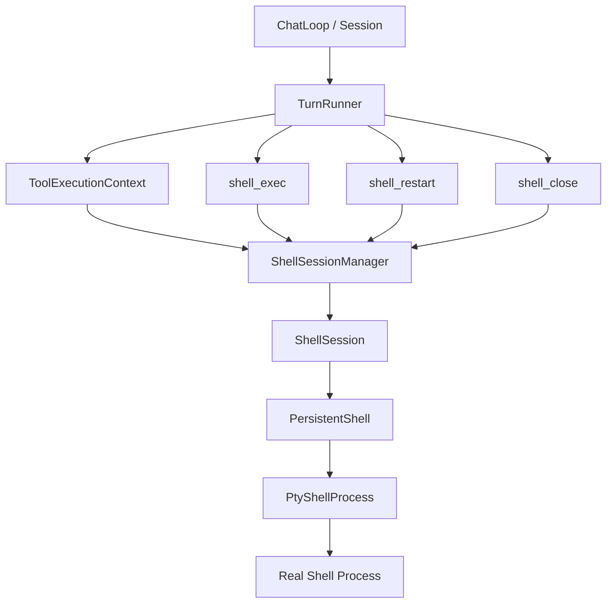
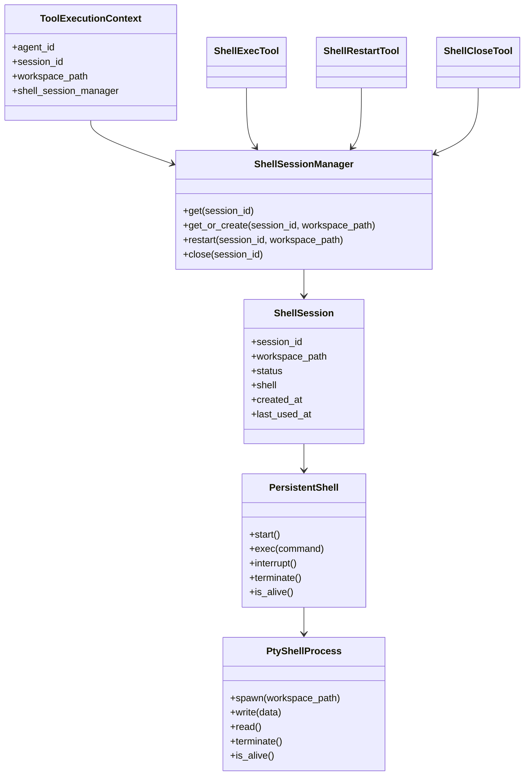
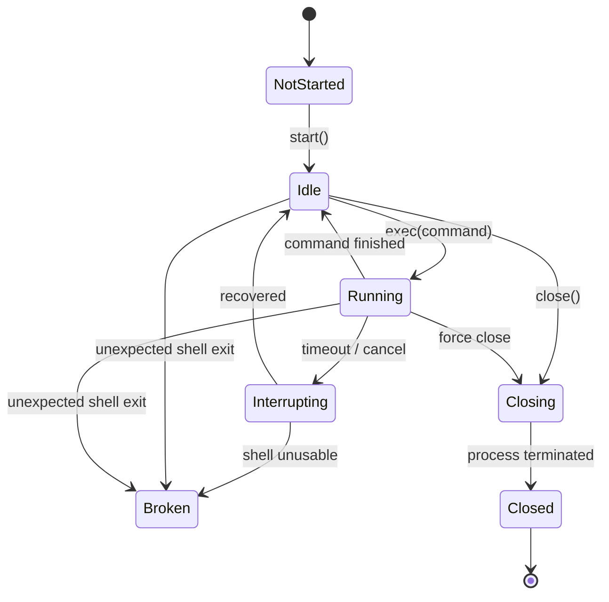
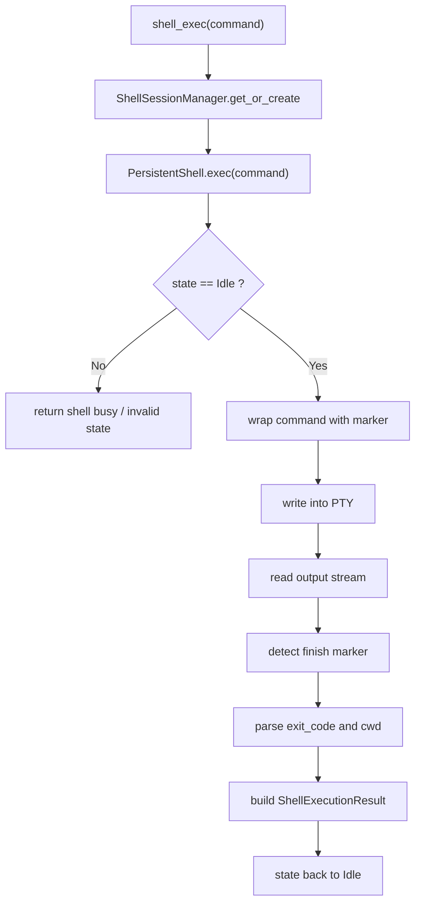
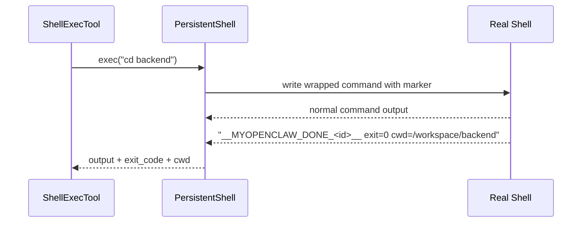
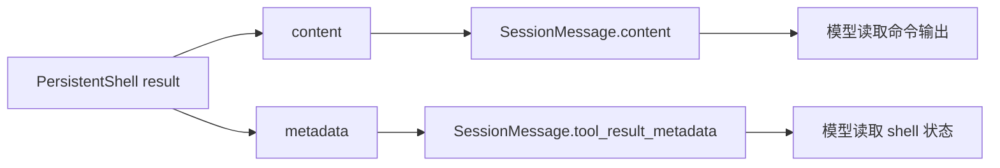
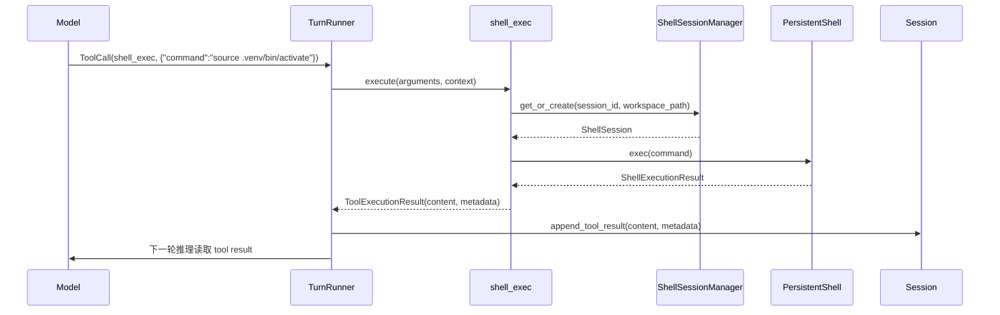

# 单 Session 持久 Shell 设计

## 目标

为 MyOpenClaw 设计一套与当前 Agent 架构对齐的本地 shell 工具方案，使 Agent 在一次活跃 session 内能够持续使用同一个真实 shell，而不是为每次工具调用临时拉起新的 shell 进程。

本文档只解决以下问题：

- 单个 `conversation session` 如何绑定一个持久 shell
- 这个 shell 在 `runtime`、`tools`、`model` 之间的交互边界是什么
- `shell_exec`、`shell_restart`、`shell_close` 三个工具的契约应该是什么
- 如何可靠判断一条命令执行结束，并把结果结构化回流给模型

本文档当前不解决：

- 多 shell 并存
- sandbox / 权限隔离
- MCP 工具接入
- 更严格的 tool schema 校验

## 问题背景

当前仓库中的 `bash` 工具本质上是一个“一次性命令执行器”：

- 每次工具调用都会新建一次 `/bin/zsh -lc ...`
- runtime 只额外保存了一个 `cwd`
- `cd` 可以被模拟延续
- `source`、`export`、alias、function 这类 shell 状态不能真正延续

这和我们期望的 shell 语义不一致。

我们真正想要的是：

- Agent 在一个 session 中拥有一个活跃 shell
- 这个 shell 默认工作目录是 `workspace_path`
- shell 只要没有被显式关闭、重启，且宿主 Agent 进程未退出，就持续存在
- 同一个 session 后续的 shell 工具调用都在这个真实 shell 中执行

换句话说，我们要的是“session 级 shell 资源”，不是“tool call 级命令执行器”。

## 设计原则

- 一个 `conversation session` 最多绑定一个 shell
- shell 必须是长期活着的真实 shell 进程
- tool 接口优先保持极简，先把语义做对
- runtime 只负责编排和注入依赖，不负责 shell 细节
- shell 生命周期应明确可控，不依赖隐式猜测
- 命令完成判定必须依赖系统注入的标记，不依赖 prompt 解析
- 先实现单 shell per session，再考虑更复杂能力

## 推荐方案

推荐采用“单 session 单持久 shell + 显式生命周期工具”的方案：

- `shell_exec(command)`
- `shell_restart()`
- `shell_close()`

其中：

- `shell_exec` 是主工具
- 同一个 session 第一次调用 `shell_exec` 时自动创建 shell
- shell 存在时，后续 `shell_exec` 复用同一个 shell
- `shell_restart` 显式杀掉旧 shell 并创建新 shell
- `shell_close` 显式关闭 shell 并释放 session 绑定关系

这比下面两个方案更合适：

### 方案 A：继续维持一次性 shell

优点：

- 改动最小

缺点：

- 不能真实支持 shell 状态持久化
- 与 `cd/source/export` 的预期不一致
- 后续补丁会越来越多

### 方案 B：纯显式生命周期

要求模型显式调用：

- `shell_open`
- `shell_exec`
- `shell_close`

优点：

- 生命周期非常明确

缺点：

- 模型负担偏大
- 首次使用 shell 的门槛偏高
- 对当前阶段来说过于啰嗦

### 方案 C：隐式单 shell + 显式重启/关闭

优点：

- 模型接口简单
- 默认行为接近真人终端
- 仍然保留自救能力

缺点：

- 需要 runtime 内部稳定管理 shell 生死状态

## 为什么选择方案 C

当前项目还在工具能力建设阶段，最重要的是把关键路径跑通。

如果一开始就要求模型显式 `open` 和 `close`，会给工具使用增加不必要的负担。如果继续沿用一次性 shell，又无法满足“真实 session shell”的要求。

因此，最合适的折中是：

- 把 shell 作为 session 的默认资源
- 通过 `shell_exec` 自动创建并复用
- 通过 `shell_restart` 和 `shell_close` 提供少量显式控制手柄

## 总体架构

## 核心对象

### `ShellSessionManager`

职责：

- 按 `session_id` 管理 shell 生命周期
- `get_or_create(session_id, workspace_path)`
- `restart(session_id, workspace_path)`
- `close(session_id)`
- `get(session_id)`

它是 shell 生命周期的唯一入口。

### `ShellSession`

职责：

- 保存 session 和 shell 的绑定关系
- 保存 shell 当前状态

建议字段：

- `session_id`
- `workspace_path`
- `status`
- `shell`
- `created_at`
- `last_used_at`

### `PersistentShell`

职责：

- 持有一个长期活着的真实 shell 进程
- 在同一个 shell 中顺序执行命令
- 通过 marker 判断一条命令是否执行结束
- 暴露 `exec()`、`interrupt()`、`terminate()`、`is_alive()`

### `PtyShellProcess`

职责：

- 负责和操作系统的 PTY / shell 进程交互
- 启动真实 shell
- 写入命令
- 读取输出
- 判断进程是否存活
- 终止进程

## 类图

## 生命周期设计

### Session 级生命周期

一个 `conversation session` 最多绑定一个活跃 shell。

其基本行为如下：

1. session 开始时，不主动创建 shell
2. 第一次 `shell_exec` 时自动创建 shell
3. 同一 session 后续 `shell_exec` 复用该 shell
4. `shell_restart` 时销毁旧 shell 并创建新 shell
5. `shell_close` 时终止 shell 并清理绑定关系
6. Agent 进程退出时，shell 一并退出

### `PersistentShell` 状态机

状态说明：

- `NotStarted`
  shell 尚未创建
- `Idle`
  shell 存活且空闲，可接受下一条命令
- `Running`
  当前正在执行一条命令
- `Interrupting`
  命令超时，正在尝试中断
- `Broken`
  shell 已不可信，需要重启
- `Closing`
  正在关闭 shell
- `Closed`
  shell 已关闭

## 为什么必须是真实持久 shell

当前需求不是“调用一个命令”，而是“在一次 session 中拥有一个会持续存在的终端环境”。

只有长期活着的真实 shell，才能天然支持下面这些行为：

- `cd backend`
- `export FOO=bar`
- `source .venv/bin/activate`
- shell function / alias
- 当前工作目录持续变化

也就是说，shell 状态的持久化不应该靠 runtime 手工模拟，而应该由 shell 自身提供。

## 为什么优先使用 PTY

推荐 `PersistentShell` 底层优先使用 PTY，而不是普通 pipes。

原因：

- PTY 更接近真实终端
- shell 更容易以“交互终端”方式运行
- 对后续 coding workflow 更友好
- 可以避免再次退化成“批处理命令执行器”

这次设计要做的是“一个像 terminal tab 的 shell”，而不是“一个后台命令执行器”。

## 工具契约

### `shell_exec`

输入：

- `command: string`

说明：

- 在当前 session 的持久 shell 中执行命令
- 如果 shell 不存在，则自动创建
- shell 初始工作目录为 `workspace_path`
- 之前执行过的 `cd/export/source` 会影响后续命令

输出：

- `content`
- `metadata`

推荐 `metadata` 字段：

- `exit_code`
- `cwd`
- `shell_status`
- `timed_out`
- `truncated`
- `created_new_shell`

### `shell_restart`

输入：

- 无

说明：

- 杀掉当前 session 绑定的旧 shell
- 在 `workspace_path` 创建一个新 shell

输出：

- `content`
- `metadata`

推荐 `metadata` 字段：

- `cwd`
- `shell_status=ready`
- `restarted=true`

### `shell_close`

输入：

- 无

说明：

- 关闭当前 session 绑定的 shell
- 清理 session 与 shell 的绑定关系

输出：

- `content`
- `metadata`

推荐 `metadata` 字段：

- `shell_status=terminated`
- `closed=true`

## 为什么不把 timeout 和 max_output_chars 暴露给模型

当前阶段不建议把以下内容暴露为模型输入：

- `timeout_ms`
- `max_output_chars`

原因：

- 这类字段是执行策略，不是任务意图
- 会增加 tool schema 复杂度
- 先做成内部默认策略更稳定

因此建议：

- 由 `PersistentShell.exec()` 内部使用默认超时策略
- 由工具或 shell runtime 内部控制输出截断
- 后续只有在真实使用中证明不足时，再扩展输入字段

## 命令执行模型

一个 shell 一次只允许执行一条命令。

第一版不做并发执行，不做命令队列。

基本执行流程如下：

## 为什么必须使用 marker 判定命令结束

不建议依赖以下方式判断命令结束：

- shell prompt
- 输出停顿
- 命令有无 stdout

这些方式都不稳定。

推荐做法是：

- 每次执行用户命令前，生成一个本次命令专属 marker
- 将用户命令包装后写入 shell
- 在命令结束后，由 shell 打印这个 marker
- marker 中带上 `exit_code` 和 `cwd`
- `PersistentShell` 只解析自己注入的 marker

示意流程：

这样做的好处是：

- `cd backend` 即使没有输出，也能知道命令结束
- 不需要解析用户自己的 prompt
- 能稳定拿到退出码和最终目录

## 结果结构

建议 shell runtime 内部先统一成一个结构化结果，再映射为 tool result。

### `ShellExecutionResult`

建议字段：

- `stdout`
- `stderr`
- `exit_code`
- `cwd`
- `shell_status`
- `timed_out`
- `truncated`

### `ToolExecutionResult`

映射规则建议为：

- `content`
  使用 `stdout/stderr` 的可读文本表示
- `is_error`
  当 `exit_code != 0` 或 `shell_status != ready` 时为 `true`
- `metadata`
  保存结构化 shell 状态

## Tool Result 回流

当前 shell 方案中，结构化 metadata 不是附属信息，而是推理闭环的一部分。

推荐的数据流如下：

`SessionMessage.tool_result_metadata` 至少应对模型可见以下字段：

- `exit_code`
- `cwd`
- `shell_status`
- `timed_out`
- `truncated`

如果这些字段不回流，模型无法准确理解 shell 当前状态。

## Runtime 交互

`TurnRunner` 不负责 shell 细节，只负责：

- 把 `session_id`、`workspace_path`、`shell_session_manager` 注入 `ToolExecutionContext`
- 执行 shell tool
- 将工具结果写入 `Session`

交互顺序如下：

## 错误与恢复语义

### 命令失败

当用户命令返回非零退出码时：

- `is_error=true`
- `shell_status` 仍可能是 `ready`

因为“命令失败”不等于“shell 已死”。

### 命令超时

推荐处理顺序：

1. 触发内部超时
2. 尝试中断当前前台命令
3. 给 shell 一个恢复窗口
4. 若恢复成功，状态回到 `Idle`
5. 若恢复失败，标记 `Broken`

### shell 异常退出

当 shell 在 `Idle` 或 `Running` 状态下意外退出：

- 标记为 `Broken`
- 不自动偷偷重建
- 由模型显式调用 `shell_restart()`

这种策略比隐式自动恢复更可预测。

## 与当前代码结构的映射

建议在当前仓库里按下面的边界落地：

- `src/myopenclaw/tools/shell.py`
  - `ShellExecTool`
  - `ShellRestartTool`
  - `ShellCloseTool`
  - `ShellSessionManager`
  - `ShellSession`
  - `PersistentShell`
  - `PtyShellProcess`

如后续文件过大，再考虑拆分为：

- `src/myopenclaw/tools/shell.py`
- `src/myopenclaw/tools/shell_runtime.py`
- `src/myopenclaw/tools/shell_pty.py`

`runtime` 层保持原有注入模式，不新增额外 service container。

## 非目标

本设计当前不包含：

- 多 shell per session
- 多命令并发执行
- 命令队列
- shell 沙箱和文件系统隔离
- 环境变量白名单
- 外部 MCP 工具桥接

这些能力都可以在单 session 持久 shell 路径跑通后再讨论。

## 实现阶段的最小完成标准

当以下条件全部成立时，可认为第一版设计落地成功：

1. 一个 `conversation session` 最多绑定一个 shell
2. 第一次 `shell_exec` 会自动创建 shell
3. 后续 `shell_exec` 复用同一个真实 shell
4. `cd/source/export` 对后续命令持续生效
5. `shell_restart` 能重建 shell
6. `shell_close` 能关闭 shell
7. 命令完成依赖 marker，而不是 prompt 解析
8. `exit_code/cwd/shell_status` 能作为结构化 metadata 回流

## 后续实现建议

建议实现顺序如下：

1. 替换现有一次性 shell 执行模型，建立 `PersistentShell`
2. 建立基于 PTY 的底层进程封装
3. 实现 marker 驱动的命令完成判定
4. 实现 `shell_exec / shell_restart / shell_close`
5. 让 tool result metadata 回流给模型
6. 补足面向状态机和恢复语义的测试

## 结论

当前项目的 shell 工具不应该继续沿着“一次性命令执行器 + 手工同步 cwd”的方向演进。

更合理的方向是：

- 把 shell 提升为 session 级 runtime 资源
- 一个 session 对应一个真实持久 shell
- 用 `shell_exec`、`shell_restart`、`shell_close` 作为最小生命周期接口
- 用 PTY 提供更接近真实终端的行为
- 用 marker 稳定判断命令完成并回收结构化结果

这套方案和现有 `TurnRunner -> ToolExecutionContext -> BaseTool` 的架构是兼容的，同时也为后续更完整的 coding agent shell 能力留出了清晰演进路径。
