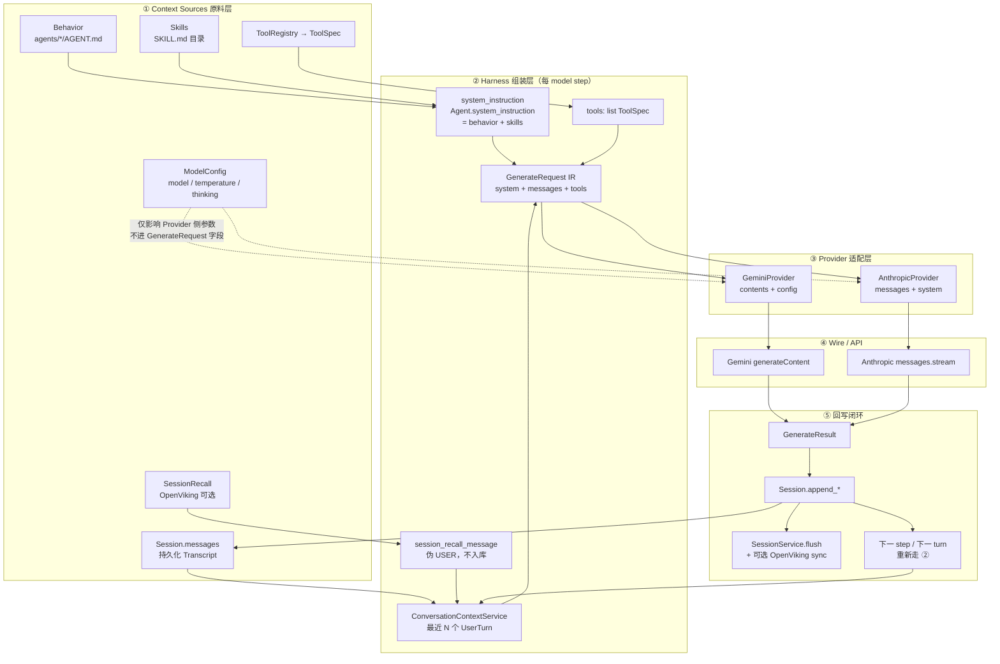
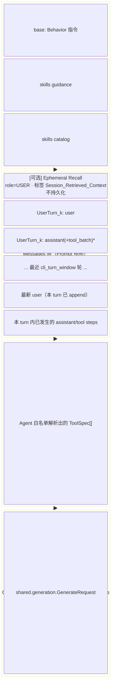
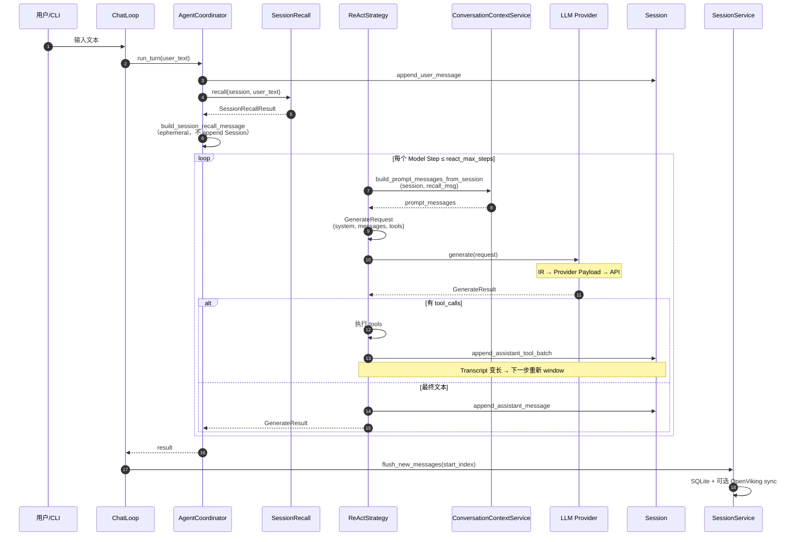
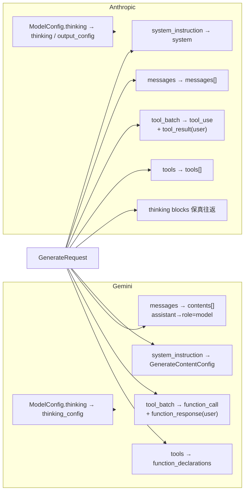
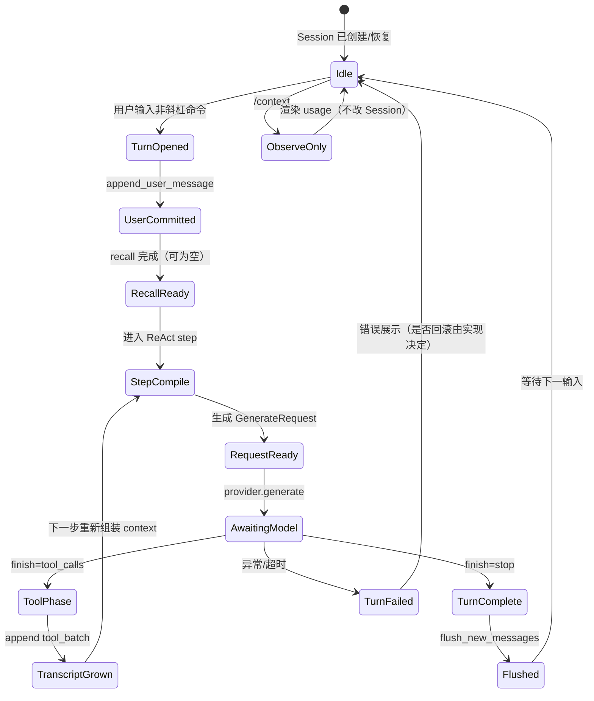

# P0：Model Context → Request 流水线透视图

**日期**: 2026-07-09  
**状态**: 文档冻结（As-Is 对齐当前实现；目标态边界在文末标出）  
**范围**: 只描述 **context 如何组成、如何流动、如何变成各模型 API request**  
**非目标**: 本篇不改代码；不展开 Session 写入重构、Runtime 拆包、OpenViking 异步化实现细节

---

## 1. 文档目的

Harness / Runtime 的最终产出不是「跑了多少 tool」，而是：

> 在某一时刻，把一份**确定的模型可见上下文（Model Context）**编译成 **GenerateRequest（IR）**，再由 Provider 适配成 **各模型 API 的 wire format** 发出去。

P0 的交付是把这条链路画清楚、对上代码锚点，作为后续改造的共同语言。

---

## 2. 术语与分层

| 术语 | 含义 | 代码锚点（当前） |
|------|------|------------------|
| **Session Transcript** | 会话事实日志：已发生的 user / assistant / tool 结果 | `conversations.session.Session.messages` |
| **Context Sources** | 参与「模型可见上下文」的原料来源 | Agent 行为、Skills、Session、Recall、Tools、ModelConfig |
| **Prompt Messages** | 本 step 窗口裁剪后的消息视图（可含 ephemeral recall） | `ConversationContextService.build_prompt_messages_from_session` |
| **Model Context（概念）** | 本 step 模型被允许看到的完整上下文：system + messages + tools（+ 元信息） | **尚未一等公民**；散落在 ReAct 拼装点 |
| **GenerateRequest（IR）** | Provider 无关的规范请求 | `shared.generation.GenerateRequest` |
| **Provider Payload（Wire）** | 各家 SDK/HTTP 实际参数 | `providers/gemini.py` / `providers/anthropic.py` |
| **GenerateResult** | 解码后的统一结果 | `shared.generation.GenerateResult` |
| **Runtime Bundle** | 执行依赖袋（provider/tools/shell/policy…） | `runs.context.AgentRuntimeContext`（**不是** Model Context） |

> 注意：`AgentRuntimeContext` 名字含 Context，但语义是 **运行时依赖**，不要与「发给模型的 context」混淆。

---

## 3. 总透视图：数据如何流过 Context



**读图要点**

1. 纵向是 **时间/因果**：原料 → 组装 → 适配 → API → 回写。  
2. 横向在 ③ 处分叉：同一 IR，两套 wire。  
3. 闭环箭头说明：tool 结果写回 Session 后，**不是修改上一份 request**，而是 **重新组装** 下一份 context。

---

## 4. Context 组成透视图（一跳 Request 里有什么）

把「发给模型的一跳」拆成可叠加的层：



### 4.1 组成明细表

| 组成块 | 是否进入 GenerateRequest | 是否写入 Session | 生命周期 | 组装位置 |
|--------|--------------------------|------------------|----------|----------|
| Behavior 系统提示 | `system_instruction` | 否 | Agent 级 | `Agent.system_instruction` |
| Skills 注入 | 并入 `system_instruction` | 否 | Agent 级 | `compose_system_instruction` |
| 历史 user/assistant/tool | `messages[]`（窗口内） | 是（原文） | Session 级 | `ConversationContextService` |
| Session Recall | `messages[]` 最前一条伪 USER | **否** | **单 user turn** | `AgentCoordinator` + `build_session_recall_message` |
| Tool 声明 | `tools[]` | 否 | Agent/Run 级 | `ReActStrategy` 从 `context.tools` |
| temperature / max_tokens / thinking | **不在 IR 字段内** | 否 | Provider 配置 | `ModelConfig` → Provider `__init__` / `_build_*_config` |
| provider_thinking_blocks | 不直接作为独立字段；经 `SessionMessage` 进 messages 再由 Anthropic 编回 | 是（挂在 assistant 消息上） | 消息级 | Anthropic 路径保真较好 |
| thought_signature | 挂在 `ToolCall` 上，经 messages 进 Gemini wire | 是 | tool call 级 | Gemini tool 路径 |

### 4.2 窗口语义（UserTurn）

```text
Session.messages（时间序）:
  U1, A1_tool, A1_final, U2, A2_tool, A2_final, U3, ...

UserTurn = 一次 USER 及其后连续 ASSISTANT 消息（含 tool_batch 的 assistant）

cli_turn_window = N 时：
  prompt_messages = [optional recall] + last N UserTurns 的展平序列
```

代码：`context/service.py` → `collect_recent_user_turns` / `build_prompt_messages_from_session`。

---

## 5. 时间轴透视图：Turn / Step 与 Context 刷新

一次 **User Turn** 内可有多个 **Model Step**（ReAct 循环）。  
**每 step 都会重新 build context**，而不是在原 request 上 patch。



### 5.1 两处「拼 request」路径（现状差异）

| 路径 | 触发 | 组装方式 | 用途 |
|------|------|----------|------|
| **Generate 路径** | ReAct 每 step | `CCS.build_prompt_messages` + `agent.system_instruction` + `tools` → `GenerateRequest` | 真实推理 |
| **/context 路径** | 用户输入 `/context` | **同一套** `CCS.build_prompt_messages` + `last_session_recall_message`；`ContextUsageService` 再构造多个 `GenerateRequest` 变体做 token 差分 | 可观测 |

二者消息窗口应对齐；usage 还会拆开 system / skills / tools 做多次 `count_request_tokens`。

**P0 不变量（文档约定，P1 将代码化）**：

> 「即将发送的 messages 视图」必须只有一个权威组装入口；generate 与 `/context` 必须共用它。

---

## 6. Canonical IR：GenerateRequest

```text
GenerateRequest
├── system_instruction: str | None     # 已拼好的完整系统提示
├── messages: list[SessionMessage]     # 窗口 + 可选 recall
└── tools: list[ToolSpec]              # name / description / schemas
```

### 6.1 SessionMessage 在 IR 中的双重身份

| 字段 | 域含义 | Wire 侧消费 |
|------|--------|-------------|
| `role` / `content` | 文本对话 | Gemini `user`/`model` parts；Anthropic text blocks |
| `tool_call_batch` | 一次 tool 往返（calls + results） | 拆成 model 调用 + user 结果两条 wire 消息 |
| `provider_thinking_blocks` | 提供商私有思考块 | 主要 Anthropic 回传/再发送 |
| `ToolCall.thought_signature` | Gemini 工具签名 | Gemini `Part.thought_signature` |

**现状张力**：持久化模型、prompt 视图、协议私有字段共用 `SessionMessage`。P0 只记录；P2 再分离。

---

## 7. Provider 分叉透视图：同一 IR → 不同 Wire



### 7.1 对照表

| 语义 | Gemini wire | Anthropic wire |
|------|-------------|----------------|
| System | `config.system_instruction` | 顶层 `system` |
| 用户文本 | `Content(role=user)` | `role=user` + text block |
| 助手文本 | `Content(role=model)` | `role=assistant` + text |
| 工具调用 | `Part.function_call` | `tool_use` |
| 工具结果 | 下一条 `user` + `function_response` | 下一条 `user` + `tool_result` |
| 思考 | 配置 `thinking_level`；文本块保真弱 | 请求 `thinking`；`provider_thinking_blocks` 回写 |
| Token | 自定义 countTokens HTTP | `messages.count_tokens` |

**边界原则（目标态）**：Harness 只产出 IR；**禁止**在 ReAct 里写 if gemini / if anthropic。所有 wire 差异留在 `providers/*`。

---

## 8. 模块 × 流水线阶段矩阵

| 阶段 | 包 / 模块 | 输入 | 输出 | 允许副作用 |
|------|-----------|------|------|------------|
| 配置装配 | `app/assembly.py` | `config.yaml` | Agent, Coordinator, SessionService | 读盘、发现 skills |
| Turn 入口 | `runs/coordinator.py` | user_text, Session | recall_msg + 调用 strategy | **append user**；调用 recall |
| 窗口视图 | `context/service.py` | Session, recall_msg? | `list[SessionMessage]` | 无（纯函数式） |
| Recall 渲染 | `context/session_recall.py` | RecallResult | 可选 `SessionMessage` | 无 |
| Step 循环 | `runs/strategy/react.py` | Runtime + Session + recall | GenerateResult | **append assistant/tool**；执行 tool |
| IR 定义 | `shared/generation.py` | — | GenerateRequest/Result 类型 | 无 |
| 适配 | `providers/gemini.py` 等 | GenerateRequest | API 调用 + GenerateResult | 网络 IO |
| 工具执行 | `tools/*` | ToolCall + ToolExecutionContext | ToolExecutionResult | 文件/Shell |
| 可观测 | `runs/context_usage.py` + `cli/*` | 与 generate 同构的 messages | token 快照 | countTokens 网络 |
| 持久化 | `conversations` + `persistence` | Session 增量 | SQLite / OV sync | 磁盘 / HTTP |

---

## 9. Context 生命周期状态机（概念）



---

## 10. 关键代码锚点清单

| 关注点 | 路径 |
|--------|------|
| Turn 协调 + recall | `src/myopenclaw/runs/coordinator.py` |
| ReAct 拼 GenerateRequest | `src/myopenclaw/runs/strategy/react.py` |
| 窗口与 prompt messages | `src/myopenclaw/context/service.py` |
| Recall 消息渲染 | `src/myopenclaw/context/session_recall.py` |
| IR 类型 | `src/myopenclaw/shared/generation.py` |
| Gemini 编译 | `src/myopenclaw/providers/gemini.py` |
| Anthropic 编译 | `src/myopenclaw/providers/anthropic.py` |
| System 拼装 | `src/myopenclaw/agents/agent.py`, `agents/skills.py` |
| /context 观测 | `src/myopenclaw/cli/chat.py`, `runs/context_usage.py` |
| 运行时依赖袋 | `src/myopenclaw/runs/context.py` |
| 配置窗口大小 | `config.yaml` → `context_cli_turn_window` |

---

## 11. 目标态边界（P0 文档约定，P1+ 实现）

P0 固定 **命名与边界**，不要求本篇落地代码：

```text
Sources
  → ModelContext          # 一等公民：system parts + prompt messages + tools + provenance
  → GenerateRequest       # IR（可由 ModelContext.to_request() 得到）
  → Provider.compile()    # 仅 wire
  → API
  → GenerateResult
  → Session 事实追加
  → 下一跳重新 Sources→ModelContext
```

| 对象 | 负责 | 不负责 |
|------|------|--------|
| Session | 事实 transcript | API 形状、窗口策略细节可插拔 |
| ModelContext | 「这一跳模型看见什么」 | 执行 shell、写库 |
| GenerateRequest | 稳定 IR | 提供商私有 HTTP 字段 |
| Provider | IR↔Wire、token count | 业务 window / recall 策略 |
| Harness | 何时编译、如何据 Result 写回 | 直接拼 Anthropic/Gemini JSON |

---

## 12. P0 验收标准（文档）

- [x] 一张总数据流图覆盖 Sources → Wire → 回写  
- [x] 一张 Context 组成图说明 system / messages / tools  
- [x] Turn/Step 时序说明「每 step 重编译」  
- [x] Gemini / Anthropic 对照表  
- [x] 模块与阶段矩阵 + 代码锚点  
- [ ] 评审确认：团队对「Model Context ≠ AgentRuntimeContext」无歧义  
- [ ] 后续 P1：单一 `build_model_context` 入口（generate 与 `/context` 共用）

---

## 13. 后续切片（索引，非本篇范围）

| 优先级 | 内容 |
|--------|------|
| **P1** | 单一 Context 组装入口；ReAct 与 usage 禁止分叉拼装 |
| **P2** | Canonical IR 与 provider 私有字段分离 |
| **P3** | `/context` 展示与真实 request 完全同构（含 provenance） |
| **P4** | Result→Session 回写规范与 per-provider 保真策略 |

---

## 14. 修订记录

| 日期 | 说明 |
|------|------|
| 2026-07-09 | 初版：As-Is 透视图 + 目标态边界（P0 文档） |
