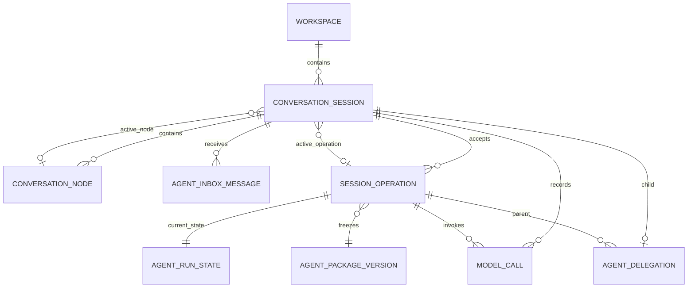

# 数据库实体设计

**初稿日期**：2026-07-12
**更新日期**：2026-08-31
**状态**：当前合同；SQLite v12 已实施，HistoryCompaction 内容升级目标为 v13
**范围**：SQLite 领域表、列级约束、索引、原子事务、归档删除和 schema 迁移
**不在范围**：Runtime 组件拆分、Provider 协议、BlobStore 物理布局和 UI 查询模型

实体名称遵循 [`Agent Runtime 重构命名约束`](./2026-08-10-agent-runtime-naming.md)，状态转换与恢复遵循 [`Operation 持久化与恢复模型`](./2026-08-11-operation-recovery-model.md)。本文替换 schema v9 的 `ImmutableObject + NamedReference + StorageCommit` 目标模型；旧表只作为迁移来源，不再决定 Runtime 领域接口。

## 1. 目标关系



目标表：

```text
workspaces
conversation_sessions
conversation_nodes
agent_inbox_messages
agent_package_versions
session_operations
agent_run_states
artifacts
agent_delegations
model_calls
```

不建立：

- `storage_commits`
- `immutable_objects`
- `named_references`
- `conversation_entries`
- `model_step_states`
- `tool_call_states`
- `artifact_references`
- `tool_approvals`
- `runtime_events / observations / trace_spans`

ModelStepState、ToolCallState 和 ToolApproval 嵌入 `agent_run_states.current_step_json`；ArtifactReference 嵌入 ConversationNode 消息内容；Trace 不进入业务数据库。`model_calls` 是 Provider 外部调用前的可靠门禁和内容索引，不是通用 Observation/Event 表。

跨表不变量：

```text
ConversationNode.parent_node_id 与 active_node_id 必须属于同一 Session
SessionOperation.input_node_id 必须属于同一 Session
ConversationSession.active_operation_id 必须属于同一 Session
AgentRunState 引用的 Node 必须属于其 Operation 所属 Session
WorkspaceBinding.workspace_id = ConversationSession.workspace_id
AgentDelegation.initial_message_id 属于 child_session_id
```

能用复合外键表达的关系必须使用 `UNIQUE(session_id, id) + FOREIGN KEY(session_id, id)`，并在跨表接受事务需要时声明 deferred；JSON 内引用和无法直接用 SQLite FK 表达的关系由事务服务与 dataclass 同时校验。

## 2. `workspaces`

| 列 | 类型 | 约束 |
| --- | --- | --- |
| `workspace_id` | TEXT | PK |
| `root_path` | TEXT | UNIQUE NOT NULL |
| `created_at` | TEXT | NOT NULL，UTC ISO8601 |

`root_path` 创建前执行 `expanduser → absolute → realpath` 并确认目录存在。路径创建后不可修改；目录后来缺失不删除记录，也不保存派生 status。

## 3. `conversation_sessions`

| 列 | 类型 | 约束 |
| --- | --- | --- |
| `session_id` | TEXT | PK |
| `agent_id` | TEXT | NOT NULL，不可修改 |
| `workspace_id` | TEXT | FK → workspaces，NOT NULL，不可修改 |
| `cwd` | TEXT | NOT NULL，规范化绝对路径，不可修改 |
| `active_node_id` | TEXT | NULL，指向同 Session ConversationNode |
| `active_operation_id` | TEXT | NULL，指向同 Session 非终态 SessionOperation |
| `title` | TEXT | NULL |
| `title_source` | TEXT | NULL / `generated` / `user` |
| `created_at` | TEXT | NOT NULL |
| `updated_at` | TEXT | NOT NULL |
| `archived_at` | TEXT | NULL |

约束：

```sql
CHECK (
    (title IS NULL AND title_source IS NULL)
    OR
    (title IS NOT NULL AND title_source IN ('generated', 'user'))
),
CHECK (archived_at IS NULL OR active_operation_id IS NULL)
```

不保存 `status`、`version`、`current_commit_sequence`、`next_sequence` 或 parent Session 字段。Archive 由 `archived_at` 表达；运行状态由 `active_operation_id → agent_run_states` 推导。

索引：

```sql
CREATE INDEX idx_conversation_sessions_cwd_updated
ON conversation_sessions(cwd, updated_at DESC);
```

## 4. `conversation_nodes`

| 列 | 类型 | 约束 |
| --- | --- | --- |
| `node_id` | TEXT | PK |
| `session_id` | TEXT | FK → conversation_sessions，NOT NULL |
| `parent_node_id` | TEXT | NULL，同 Session parent |
| `content_type` | TEXT | `agent_message` / `history_compaction` |
| `content_json` | TEXT | NOT NULL，合法 JSON object |
| `created_at` | TEXT | NOT NULL |

Node 创建后不可更新。内容直接保存在 Node，不再经过 ImmutableObject；格式随 SQLite schema migration 统一升级，不保存逐行 `content_version`。

使用 `UNIQUE(session_id, node_id)` 和复合外键保证 parent 属于同一 Session，并保留：

```sql
CREATE INDEX idx_conversation_nodes_session_parent
ON conversation_nodes(session_id, parent_node_id);
```

`active_node_id` 是当前选中分支终点。沿 parent 回溯使用 `node_id` PK；查询 child 分支使用上述索引。不增加 Closure Table、materialized path、Branch 或 Lane 表。

`history_compaction` 的目标内容为自包含 checkpoint：

```text
summary
retained_messages[]
read_files[]
modified_files[]
```

`retained_messages` 直接保存 Provider-neutral AgentMessage 值，不保存 Node 引用；
`first_kept_node_id` 在 v13 删除。审计读取仍沿 parent 读取完整分支；正常 Context 读取使用
`list_context_nodes(session_id, leaf_node_id)`，递归遇到最近 `history_compaction` Node 后停止并
包含该 Node。完整语义遵循 [`HistoryCompaction 压缩设计方案`](./2026-08-30-history-compaction-design.md)。

## 5. `agent_inbox_messages`

| 列 | 类型 | 约束 |
| --- | --- | --- |
| `message_id` | TEXT | PK |
| `session_id` | TEXT | FK → conversation_sessions，NOT NULL |
| `sequence` | INTEGER | NOT NULL，Session 内单调递增 |
| `delivery` | TEXT | `followup` / `steer` / `inject` |
| `message_json` | TEXT | NOT NULL，Provider-neutral UserMessage |
| `status` | TEXT | `pending` / `claimed` / `discarded` |
| `claimed_operation_id` | TEXT | NULL FK → session_operations |
| `claimed_step_id` | TEXT | NULL |
| `outcome_reason` | TEXT | NULL |
| `created_at` | TEXT | NOT NULL |
| `handled_at` | TEXT | NULL |

```sql
UNIQUE(session_id, sequence)
```

字段组合：

```text
pending   → claim 字段、handled_at、outcome_reason 为空
claimed   → claimed_operation_id、handled_at 必填，outcome_reason 为空
discarded → claim 字段为空，handled_at、outcome_reason 必填
```

`message_json.source` 是判别联合：`user`、`agent(sender_session_id, sender_operation_id, form)`、`agent_settled(sender_session_id, sender_operation_id)`、`hook(hook_id)`、`host(call_id)`、`runtime(reason)`。`agent_settled` 表示 Runtime 对 delegated child Operation 终态的陈述，不冒充 child 主动发送的 `report`。source 用于因果归因、Context 投影和级联取消，不授予权限。

Message 被 claim 后创建 `ConversationNode.node_id = message_id`；discarded Message 不进入 Conversation Tree。状态本身是自然 CAS，写入带 `WHERE status = 'pending'`，不增加 revision。

Session 内 sequence 在插入事务中使用 `MAX(sequence)+1` 或等价原子 SQL 分配；唯一约束解决竞争，不给 Session 增加计数器字段。

## 6. `agent_package_versions`

| 列 | 类型 | 约束 |
| --- | --- | --- |
| `package_version_id` | TEXT | PK，`agentpkg_<sha256(canonical content)>` |
| `agent_id` | TEXT | NOT NULL |
| `format_version` | INTEGER | NOT NULL |
| `content_json` | TEXT | NOT NULL，完整非敏感 Package |
| `created_at` | TEXT | NOT NULL，不参与内容身份 |

不保存独立 `digest`。相同规范内容得到相同 ID，重复插入必须幂等；相同 ID 内容不同视为损坏。

`content_json` 冻结 behavior、ModelPolicy、AgentRuntimePolicy、AgentDelegationPolicy、WorkspacePolicy、Skill 全文、ToolVersion 和 ExtensionVersion。只保存 SecretRef，不保存 Secret；Package 子对象不单独建表。

## 7. `session_operations`

| 列 | 类型 | 约束 |
| --- | --- | --- |
| `operation_id` | TEXT | PK |
| `session_id` | TEXT | FK → conversation_sessions，NOT NULL |
| `agent_package_version_id` | TEXT | FK → agent_package_versions，NOT NULL |
| `workspace_binding_json` | TEXT | NOT NULL，创建后不可修改 |
| `input_node_id` | TEXT | FK → conversation_nodes，同 Session，NOT NULL |
| `accepted_at` | TEXT | NOT NULL |

SessionOperation 创建后不可更新。不保存 `operation_type`、`status`、`accepted_commit_sequence` 或通用 `created_at`。当前只有 AgentRun；状态只存在 `agent_run_states`。

使用 `UNIQUE(session_id, operation_id)` 支持 ConversationSession.active_operation_id 的同 Session 复合外键。

## 8. `agent_run_states`

| 列 | 类型 | 约束 |
| --- | --- | --- |
| `operation_id` | TEXT | PK/FK → session_operations |
| `revision` | INTEGER | NOT NULL，初始 1 |
| `status` | TEXT | 见下方枚举 |
| `waiting_reason` | TEXT | NULL / `tool_approval` / `tool_reconciliation` |
| `completed_step_count` | INTEGER | NOT NULL，DEFAULT 0 |
| `current_step_json` | TEXT | NULL，合法 JSON object |
| `final_assistant_node_id` | TEXT | NULL FK → conversation_nodes |
| `error_json` | TEXT | NULL |
| `cancellation_json` | TEXT | NULL |
| `updated_at` | TEXT | NOT NULL |

```text
status = queued / running / waiting / cancelling / succeeded / failed / cancelled
```

数据库 CHECK：

- `waiting` 必须有 waiting_reason，其他状态必须为空；
- `cancelling/cancelled` 必须有 cancellation_json；
- `failed` 必须有 error_json；
- `succeeded` 必须有 final_assistant_node_id；
- `revision >= 1`、`completed_step_count >= 0`。

复杂 Step/Tool 跨字段约束由 frozen dataclass 和 AgentRunStateMachine 校验。状态更新必须是：

```sql
UPDATE agent_run_states
SET revision = revision + 1, ...
WHERE operation_id = :operation_id
  AND revision = :expected_revision;
```

更新零行表示并发冲突，调用方重新读取；不得静默覆盖或盲目重放外部决定。

## 9. `artifacts`

| 列 | 类型 | 约束 |
| --- | --- | --- |
| `artifact_id` | TEXT | PK，`artifact_<sha256(bytes)>` |
| `size_bytes` | INTEGER | NOT NULL，`>= 0` |
| `created_at` | TEXT | NOT NULL |

不保存独立 digest、media_type 或 blob_key。BlobStore 直接以 artifact_id 寻址；media_type 和 display_name 属于消息中的 ArtifactReference。

Blob 先写，Artifact 元数据后写，ConversationNode 引用最后提交。允许 GC 清理孤立 Blob/Artifact，但已提交 Node 不得引用不存在的 Artifact。

## 10. `agent_delegations`

| 列 | 类型 | 约束 |
| --- | --- | --- |
| `child_session_id` | TEXT | PK/FK → conversation_sessions |
| `parent_operation_id` | TEXT | FK → session_operations，NOT NULL |
| `parent_step_id` | TEXT | NOT NULL |
| `parent_tool_call_id` | TEXT | UNIQUE NOT NULL |
| `initial_message_id` | TEXT | UNIQUE FK → agent_inbox_messages，NOT NULL |
| `child_package_version_id` | TEXT | FK → agent_package_versions，NOT NULL |
| `created_at` | TEXT | NOT NULL |

不保存 `delegation_id`、`child_operation_id`、parent_session_id、status、created_commit_sequence 或 delegation_depth。Depth 从不可变关系图推导，并与父 Operation 冻结 Package 中的 max_delegation_depth 比较。

父 ToolCall Intent 根据 Parent Package 的 AgentDelegationPolicy 解析并冻结
`child_package_version_id`；随后一个事务创建 child Session、Delegation 和初始 pending
followup InboxMessage。Child Operation 由自己的 AgentDriver 后续 claim 产生，并且必须
使用 AgentDelegation 绑定的 Package。该列不能从 parent current Step 或 child 首个
Operation 反推：前者在 Parent 终态后清空，后者在 child 接受初始消息前尚不存在。

## 11. `model_calls`

`ModelCall` 表示一次真实 Provider 生成调用。AgentRun 的每次重试各有独立行；Title、历史
压缩等 Session 级生成调用也必须记录，但不伪造 Operation 或 Step。

| 列 | 类型 | 约束 |
| --- | --- | --- |
| `model_call_id` | TEXT | PK |
| `session_id` | TEXT | FK → conversation_sessions，NOT NULL |
| `operation_id` | TEXT | NULL，同 Session FK → session_operations |
| `step_id` | TEXT | NULL |
| `step_sequence` | INTEGER | NULL，`>= 1` |
| `request_attempt` | INTEGER | NOT NULL，`>= 1` |
| `model_role` | TEXT | `primary` / `worker` / `utility` |
| `purpose` | TEXT | `agent_step` / `title` / `history_compaction` |
| `provider` | TEXT | NOT NULL |
| `api_kind` | TEXT | NOT NULL |
| `endpoint` | TEXT | NOT NULL |
| `requested_model` | TEXT | NOT NULL |
| `returned_model` | TEXT | NULL |
| `status` | TEXT | 见下方枚举 |
| `request_content_ref` | TEXT | NOT NULL |
| `response_content_ref` | TEXT | NULL |
| `context_fingerprint` | TEXT | NULL |
| `provider_request_id` | TEXT | NULL |
| `http_status` | INTEGER | NULL |
| `error_json` | TEXT | NULL，合法 JSON object |
| `created_at` | TEXT | NOT NULL |
| `started_at` | TEXT | NULL |
| `first_chunk_at` | TEXT | NULL |
| `finished_at` | TEXT | NULL |

```text
status = prepared / in_flight / completed / failed / cancelled / incomplete
```

身份组合：

```text
purpose = agent_step
→ operation_id、step_id、step_sequence、context_fingerprint 必填
→ model_role = primary

purpose = title/history_compaction
→ operation_id、step_id、step_sequence 为空
→ model_role 分别为 utility/worker
```

唯一约束：

```sql
CREATE UNIQUE INDEX uq_model_calls_operation_step_attempt
ON model_calls(operation_id, step_id, request_attempt)
WHERE operation_id IS NOT NULL;
```

状态字段组合：

```text
prepared
→ started_at、finished_at、response_content_ref、error_json 为空

in_flight
→ started_at 必填；finished_at、response_content_ref 为空

completed
→ started_at、finished_at、response_content_ref 必填；error_json 为空

failed
→ started_at、finished_at、error_json 必填；response_content_ref 可保存 HTTP/Provider 错误正文

cancelled/incomplete
→ finished_at 必填；response_content_ref 可保存 partial response
```

状态转换通过 `WHERE model_call_id=? AND status=?` 做自然 CAS，不增加 revision。SQLite 负责
枚举、NOT NULL、FK、时间和终态字段组合；Provider-specific Response schema 与
RequestContent/ResponseContent 内容由 codec 校验。

`request_content_ref/response_content_ref` 指向 ModelCallContentStore 中按 canonical bytes
内容寻址的不可变文档。数据库提交引用前必须确认内容存在。ModelCallContentStore 不参加
SQLite 事务，因此允许无引用孤儿内容，不允许已提交行引用缺失内容。

## 12. 原子事务合同

### 12.1 创建 Session

```text
resolve/create Workspace
+ insert ConversationSession
```

初始 active_node_id、active_operation_id、title、title_source、archived_at 全为空。不创建空 Root Node。

### 12.2 发送 InboxMessage

```text
确认 Session.archived_at IS NULL
+ 分配 Session 内 sequence
+ insert pending InboxMessage
```

followup/steer 提交后 wake；inject 只持久化不单独 wake。

### 12.3 接受 Operation

```text
CAS 选中 InboxMessage 仍 pending
+ 按 sequence 插入 User ConversationNode
+ insert SessionOperation
+ insert AgentRunState revision=1
+ CAS move active_node_id
+ set active_operation_id
+ mark InboxMessage claimed
```

前置条件：Session 未归档、`active_operation_id IS NULL`、active_node_id 仍等于调用方读取值。任一步失败全部回滚。

### 12.4 Step 消息 claim

```text
CAS AgentRunState.revision
+ claim pending steer/inject
+ 按 sequence 插入 User ConversationNode
+ move active_node_id
+ 写 claimed_operation_id / claimed_step_id
+ revision + 1
```

### 12.5 Model/Tool Intent 与结果

ModelRequestIntent 必须在 Provider 调用前 CAS 写入 current_step_json。ToolExecutionIntent 必须在真实 Tool 副作用前 CAS 写入。完整 AssistantMessage、ToolResult ConversationNode、active_node_id 和对应 State 转换在各自同一事务提交。

每次 AgentRun Provider 调用按以下顺序执行：

```text
先向 ModelCallContentStore 保存完整 RequestContent
→ 同一数据库事务 CAS AgentRunState.request_attempt += 1
  + insert ModelCall(status=prepared, request_content_ref)
→ CAS ModelCall prepared → in_flight
→ 调用 Provider
```

RequestContent 写入、State CAS、ModelCall insert 或 `prepared → in_flight` 任一步失败都不得
调用 Provider。Provider 完整返回后先保存 ResponseContent，再由一个数据库事务完成：

```text
CAS ModelCall in_flight → completed + response_content_ref
+ insert Assistant ConversationNode
+ move active_node_id
+ commit AgentRunState response transition
```

ResponseContent 保存或 ModelCall 完成 CAS 失败时不得提交 AssistantMessage。明确失败、取消
或流中断必须先收敛当前 ModelCall，再按冻结重试策略创建下一 attempt。

Host 对 `intent_recorded` 的核对结果直接通过 AgentRunState revision CAS 提交，
不新增 reconciliation 表、队列或状态。`completed` 同事务写 ToolResult；
`not_started` 只在策略允许时恢复执行；`unknown` 保持 waiting。若 Operation 已在
`cancelling`，已完成结果先以 `cancelling → cancelling` 保存并被 current_step
引用，再由 Driver 清空 Step 转入 `cancelled`。

### 12.6 Operation 终态

```text
CAS AgentRunState → succeeded / failed / cancelled
+ ConversationSession.active_operation_id = NULL
+ ConversationSession.updated_at = now
+ 若 Session 是 delegated child：
  - 从 AgentDelegation 定位 direct parent Session
  - 插入确定性 message_id 的 pending steer InboxMessage
  - source = agent_settled(child session/operation)
```

上述事实属于同一个 SQLite/InMemory 事务。settled message ID 由
`child_session_id + child_operation_id` 规范派生；重复终态提交只能命中同一消息。
成功通知只投影最终 AssistantMessage 的 Text/Artifact Block，并按 Parent 冻结策略有界
截断；Thinking、ToolCall、Provider metadata、usage、Node ID 和内部 State 字段不得进入
消息正文。失败和取消分别投影稳定 AgentRunError 或 Cancellation。

取消 reconciliation 先原子 discard 来源属于取消祖先、目标属于真实后代且仍
pending 的 AgentMessage；`cancelling → cancelled` 再在同一终态事务重新检查
AgentDelegation 递归后代均已终态且没有这类 pending 消息。不新增取消表、深度
缓存或通用级联实体。

Stopping check 与 pending next-step InboxMessage claim 同属该事务判断，避免消息落在终态边界丢失。

## 13. Archive 与 Delete

Archive 要求 active_operation_id 为空、不存在 pending InboxMessage，且全部 delegated
descendant 都不存在非终态 Operation 或 pending InboxMessage；提交 `archived_at=now`。
归档后拒绝自身 send、accept 和 active node move；delegated descendant 接受新消息时也
必须确认祖先 Session 均未归档。Unarchive 清空 archived_at。该门槛保证 child 最终一定能
向未归档 parent 持久化 settled 通知，不留下已归档 Parent 下的新后台执行。

公共 delete 要求 Session 已归档、空闲、无 pending Inbox 且无 AgentDelegation。显式 `delete_session_tree` 可删除完整 child 子树，但要求所有目标均归档、空闲且根没有外部 parent Delegation。

删除 Session 级联删除其 Node、InboxMessage、Operation、AgentRunState、ModelCall 和子树内 Delegation；Artifact 与无引用 ModelCall Content 交给各自 GC，Workspace 与 AgentPackageVersion 保留。

## 14. 恢复查询

进程启动只查询：

```text
未归档 Session
AND (
    active Operation status IN (queued, running, cancelling)
    OR pending followup/steer 存在
)
```

waiting Operation、仅 pending inject 和纯历史 Session 不预加载。外部状态变化提交后显式 `AgentRegistry.wake(session_id)`。

恢复当前执行只走：

```text
ConversationSession.active_operation_id
→ SessionOperation
→ AgentPackageVersion + WorkspaceBinding
→ AgentRunState
```

不扫描历史 Operation、Event 或 State revision。

恢复到 `request_ready` Step 时额外读取该 Step 最新 ModelCall：

```text
prepared  → 请求明确未发送，读取同一 RequestContent 并继续同一 attempt
in_flight → CAS 标记 incomplete，再创建新 attempt
终态      → 按 frozen retry policy 判断下一动作
不存在    → 还没有越过调用门禁，准备第一个 attempt
```

## 15. Schema 与迁移

目标 Runtime 在压缩升级完成后只读写 SQLite v13，不保留 v12/v13 双读写。v12 → v13
只升级 `history_compaction` 的 `content_json`，不新增表或列：

1. 对每个旧 checkpoint 沿同 Session parent 链验证并定位 `first_kept_node_id`；
2. 将旧投影会原样保留的 AgentMessage 值复制为 `retained_messages`；
3. 保留 summary 与文件账本，删除 `first_kept_node_id`；
4. 严格解码并 round-trip 校验全部新内容后设置 schema version 13；
5. 空、跨 Session、不可达引用或不可解码内容使整次迁移回滚并保留 v12 备份。

既有 v11 → v12 事务迁移保持为历史来源：

1. 创建 `model_calls` 表、CHECK、复合外键和 partial UNIQUE index；
2. 既有历史没有可靠完整 Request/Response，不伪造 ModelCall，也不从 Trace 回填；
3. v11 非终态 `request_ready` Operation 保持原恢复合同，第一个 v12 真实调用创建新的 ModelCall；
4. 校验 v11 业务表不变后设置 schema version 12；
5. 任一步失败回滚并保留 v11 备份。

既有 v10 → v11 事务迁移保持为历史来源：

1. 给 `agent_delegations` 增加 `child_package_version_id`；
2. 旧 Delegation 使用其 parent Operation 的 `agent_package_version_id` 回填，因为 v10
   合同只允许同 Package child；
3. 校验 Package 存在且 agent_id 与 child Session 一致；
4. 升级 InboxMessage source codec，使其接受 `agent_settled`；
5. 不为已经终态的历史 child Operation 补发 settled 消息，避免升级时制造历史对话；
6. 任一步失败回滚并保留 v10 备份。

既有 v9 → v10 一次性转换规则保持为历史迁移来源：

1. 将 active NamedReference 投影为 ConversationSession.active_node_id；
2. 将 Node + ImmutableObject 压平为 ConversationNode；
3. 将最新 Operation State Reference 投影为 agent_run_states 当前行；
4. 转换 Package、Artifact 和 Delegation 字段；
5. 校验全部引用和状态后删除旧通用表；
6. 任一步失败回滚，保留 v9 原库备份。

不在 Runtime 请求路径保留旧 schema 兼容分支。

## 16. 验收

1. 接受 Operation 的七项事实原子成功或全部回滚。
2. Session.active_operation_id 与 AgentRunState 终态始终一致。
3. AgentRunState revision CAS、Inbox status CAS 和 active_node_id 自然 CAS 均有冲突测试。
4. 跨 Session parent、Node/Result 引用和 WorkspaceBinding 被拒绝。
5. Tool Intent 后崩溃不会被当成未执行静默重放。
6. 多审批、Approval/Cancel 和 stopping check 并发不丢更新。
7. Conversation 分叉与 1,000/10,000 Node 长分支查询计划通过基准。
8. v10 中不存在 ImmutableObject、NamedReference、StorageCommit 和 ConversationEntry 生产路径。
9. delegated child 的终态与 direct parent settled InboxMessage 原子成功或全部回滚；并行 child 按 Parent Inbox sequence 消费。
10. v11 AgentDelegation 始终绑定精确 child Package，reload 和重启不能换成当前同名 Agent。
11. 未可靠保存 RequestContent、ModelCall 和 request_attempt 时 Provider 调用次数为零。
12. ResponseContent 与 AssistantMessage 原子可见，不出现已提交回答缺少 ModelCall 响应。
13. prepared 恢复复用同一 attempt；in_flight 恢复先收敛 incomplete 再创建新 attempt。
14. v11 → v12 不从可丢失 Trace 伪造历史 ModelCall。
15. v12 → v13 将有效旧 checkpoint 转换为等价自包含投影；坏引用使迁移整体回滚。
16. checkpoint 之后的正常 Context 查询在 SQLite 递归层停止，不先读取完整旧祖先。
