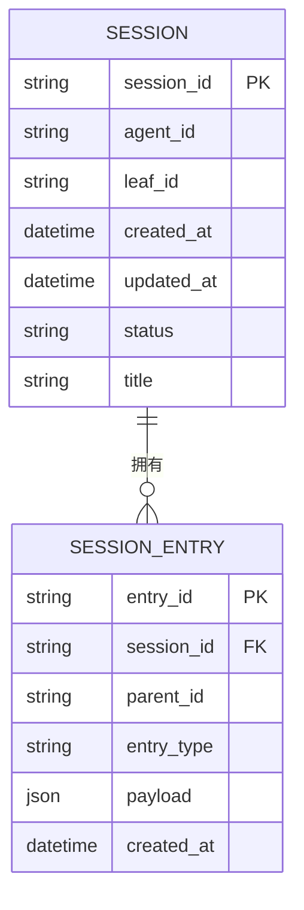
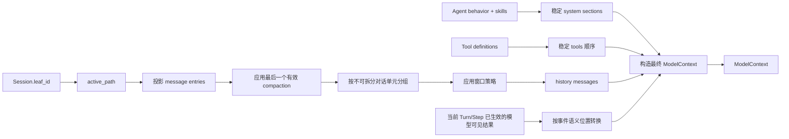
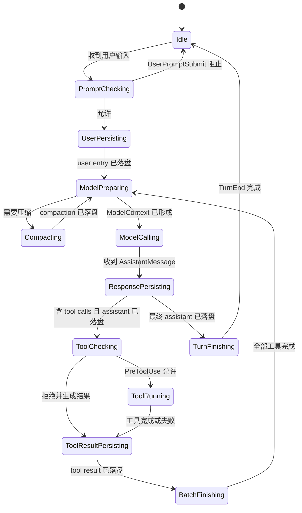
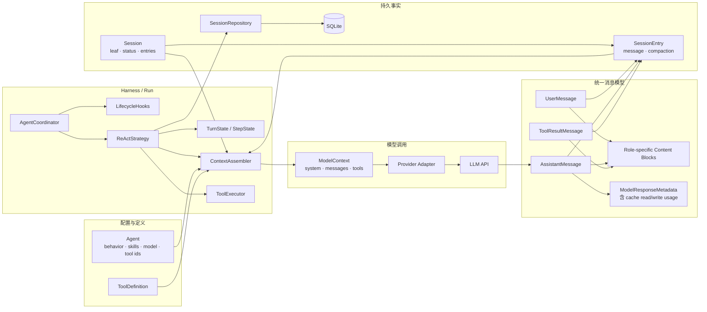
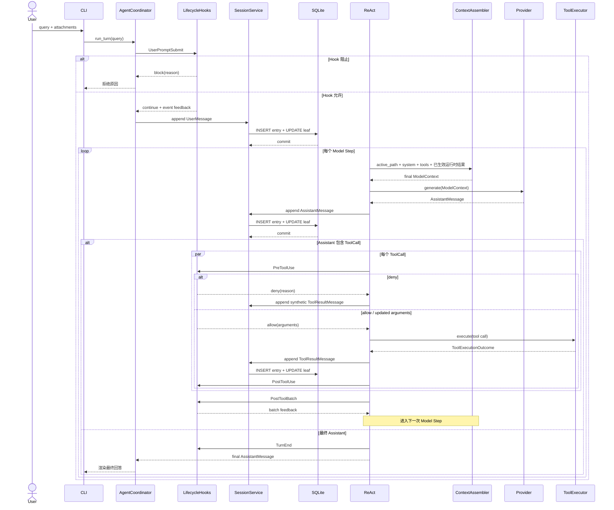
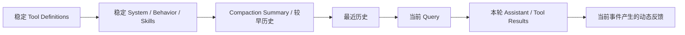

# Query → Context → Chat Completion 升级设计

**初稿日期**：2026-07-12  
**更新日期**：2026-07-13  
**状态**：设计稿，供复盘与审阅；未进入实现  
**关联文档**：[`2026-07-12-db-entities.md`](./2026-07-12-db-entities.md)

本文整理当前项目从用户 query 到模型调用、工具执行和结果落盘的整体升级方案。重点是统一实体、消除重复消息形状、明确持久化边界、建立唯一的 `ModelContext` 形成路径，并用细粒度生命周期 Hook 扩展 Harness。

数据库实体文档仍是持久层设计的基础，但其中 `openviking` entry、`message.content: string` 等内容需要在本方案确认后同步修订。本文不直接定义任何具体插件或 OpenViking 的最终行为。

---

## 1. 本文决策标识

| 标识 | 含义 |
|------|------|
| **已确定** | 可以作为后续实现合同 |
| **待拍板** | 已识别问题，但尚不能进入稳定合同 |
| **后置** | 当前升级不设计，等出现具体需求再讨论 |

### 1.1 已确定

- 持久事实由 `Session` 与 `SessionEntry` 承载。
- Session 以 `leaf_id + parent_id` 表达当前活动路径和分支。
- message entry 使用统一的 `AgentMessage`，不再保存 `ToolCallBatch`。
- message content 使用 role-specific content blocks，不限定为 `string`。
- `ModelContext` 是最终、唯一、Provider-neutral 的模型输入值对象。
- `ContextAssembler` 是无状态组装服务，不是实体，不查数据库、不调用 Hook、不调用 Provider。
- user、assistant tool call、tool result、最终 assistant 分 checkpoint 落盘。
- Hook 位于状态机的固定迁移点，使用事件专用输入和专用决策，不接收整个 `ModelContext` 任意改写。
- `/context` 用于观测最终 ModelContext 和用量，不重新触发有副作用的 Hook。
- `input/output/cache read/cache write` 是调用结果用量，进入 assistant metadata。

### 1.2 待拍板

- `model_change` 是否作为第一版正式 entry type。
- `SystemContent` 第一版的 content block 形状。
- User message 第一版是否立即支持 document，还是先支持 text/image。
- Thinking block 的统一字段与 Provider opaque data 边界。
- Hook 产生的模型可见反馈如何映射成 AgentMessage/content block。
- `PostToolUse` 是否允许替换工具结果。
- compaction summary 最终投影成哪种模型消息。
- `/context` 在首次模型调用前展示预测值，还是提示尚无实际 ModelContext。
- 并行 tool results 按调用顺序还是完成顺序落盘；第一版倾向由单一提交器按调用顺序串行推进 leaf。

### 1.3 后置

- 插件是否能持久化数据。
- 通用 `extension/custom` entry。
- OpenViking recall、同步、绑定和游标的最终形态。
- 进程外 command/http/MCP Hook。
- settings 热加载和插件市场。
- 旧 SQLite schema 自动迁移。

---

## 2. 设计目标

### 2.1 产品目标

| 目标 | 验收含义 |
|------|----------|
| 无扩展可运行 | 关闭全部扩展后仍可完成 query → model → tool → persistence |
| 会话可还原 | SQLite 可还原当前活动路径及完整消息内容 |
| Context 唯一 | 真正模型调用只有一条 ModelContext 形成路径 |
| 历史形状清晰 | assistant tool call 与每个 tool result 分别为独立 message |
| 崩溃边界清楚 | 工具产生外部副作用前，assistant 执行意图已落盘 |
| Provider 可替换 | Session 和 Context 不依赖 Anthropic/Gemini wire schema |
| KV cache 友好 | tools、system、历史保持稳定顺序，动态内容尽量追加在尾部 |
| 可观测 | `/context` 能说明 system/messages/tools 和实际 cache usage |

### 2.2 架构目标

```text
持久事实      Session + SessionEntry
模型消息      AgentMessage + role-specific content blocks
最终上下文    ModelContext
运行控制      AgentCoordinator + ReAct + Turn/Step state
扩展协议      Lifecycle Hook events + event-specific decisions
外部适配      SessionRepository / Provider / Tool implementation
```

### 2.3 非目标

- 不完整复制 Claude Code 全部 Hook。
- 不把 Pi、Claude Code 的所有对象原样搬进项目。
- 不在本阶段设计具体插件的持久化实体。
- 不让 `ContextAssembler` 成为新的依赖容器或上帝对象。
- 不在核心消息模型中暴露完整 Provider 原始响应。

---

## 3. 术语与边界

| 术语 | 本文定义 |
|------|----------|
| Harness | 将模型变成 Agent 的控制系统：循环、Context、工具、策略、Hook、持久化协调 |
| Run | 一次具体执行；包含 turn、step、取消、重试和 checkpoint |
| Execution Environment | 工具实际执行的 workspace、shell、filesystem、sandbox、network 环境 |
| Session | 一场可恢复对话的持久聚合 |
| Turn | 一个用户 query 驱动的一次完整 Agent 执行 |
| Step | Turn 内的一次模型调用及其后续处理 |
| Active Path | 从 Session leaf 回溯 parent 得到的当前分支路径 |
| ModelContext | 本次模型调用最终看到的 system、messages、tools |
| Hook | Harness 状态机固定迁移点上的扩展协议 |
| RuntimeEvent | 给 CLI/trace 的运行时通知，不参与 Hook 决策 |

`Runtime` 在行业中没有唯一边界。本文避免用它同时表示 Harness、sandbox 和依赖容器，代码命名优先使用 `RunDependencies`、`TurnState`、`StepState`、`ExecutionEnvironment`。

---

## 4. 对象分类总表

| 类别 | 对象 | 身份/职责 | 落库 |
|------|------|-----------|------|
| 持久实体 | `Session` | 会话身份、封面、leaf 和 entry tree | 是 |
| 持久实体 | `SessionEntry` | 对话树上的一行事实 | 是 |
| 持久值对象 | `AgentMessage` | 统一消息联合类型 | 随 message entry |
| 持久值对象 | Content Blocks | 文本、图片、thinking、tool call 等内容 | 随 message entry |
| 持久值对象 | `ModelResponseMetadata` | Provider、模型、finish、usage | 随 assistant message |
| 模型调用值对象 | `ModelContext` | 最终模型输入 | 否 |
| 模型调用值对象 | `ToolDefinition` | Provider-neutral 工具定义 | 否 |
| 配置对象 | `Agent` | behavior、skills、model、tools、workspace | 配置来源 |
| 运行时状态 | `TurnState` | 一次 query 的执行状态 | 否 |
| 运行时状态 | `StepState` | 一次模型调用的执行状态 | 否 |
| 运行时值对象 | `ToolExecutionOutcome` | 工具本次执行结果 | 否 |
| Hook DTO | Hook Event / Decision | 生命周期输入与控制结果 | 否 |
| 服务 | `ContextAssembler` | 从确定输入形成 ModelContext | 否 |
| 服务 | `LifecycleHooks` | Hook 匹配、执行、合并、错误处理 | 否 |
| 服务 | `SessionService` | Session 用例与 checkpoint 持久化 | 否 |
| 协议 | `SessionRepository` | Session/Entry 持久化端口 | 否 |
| 协议 | Provider | ModelContext → AssistantMessage | 否 |
| 运行控制 | `AgentCoordinator` / ReAct | 推进 Turn/Step 状态机 | 否 |

---

## 5. 持久实体

### 5.1 Session

```text
Session
  session_id
  agent_id
  leaf_id
  created_at
  updated_at
  status
  title
  entries
```

核心行为：

```text
active_path()
append_user()
append_assistant()
append_tool_result()
move_leaf()
```

需要从当前 Session 移除：

```text
messages 作为唯一事实
remote_session_id
last_synced_message_index
last_committed_message_index
openviking_account_id / user_id / agent_id
bind_openviking()
mark_messages_synced()
mark_messages_committed()
```

### 5.2 SessionEntry

```text
SessionEntry
  entry_id
  session_id
  parent_id
  entry_type
  payload
  created_at
```

已确定类型：

```text
message
compaction
```

待拍板类型：

```text
model_change
```

当前不定义 `openviking`、`extension`、`custom`。数据库列继续使用 TEXT，不加封闭枚举 CHECK；应用当前版本只解释已知类型，未知类型保留并在投影中跳过。

### 5.3 关系



### 5.4 持久化不变量

1. `SessionEntry` 只追加，不修改 payload、parent 或类型。
2. 默认 append 的 `parent_id` 等于当前 `leaf_id`。
3. append entry 与更新 Session leaf/updated_at 在一个 SQLite 事务内完成。
4. `session_entries.session_id` 使用 SQLite FK，删除 Session 时级联删除 entries。
5. parent 和 leaf 必须存在且属于同一 Session，由 Repository 校验。
6. assistant tool call 必须在执行工具前落盘。
7. tool 可以并行执行，但 entry append 与 leaf 更新必须串行，禁止多个任务并发更新 leaf。
8. 每个 tool result 独立形成 entry；具体提交顺序仍待拍板。
9. entry payload 带独立版本号。

---

## 6. 统一消息模型

### 6.1 AgentMessage

```text
AgentMessage
  ├── UserMessage
  ├── AssistantMessage
  └── ToolResultMessage
```

message entry 的 payload 就是版本化 AgentMessage，不再额外维护 `SessionMessage` 与 `PromptMessage` 两套长期形状。

### 6.2 UserMessage

```text
UserMessage
  role = user
  content: list[UserContent]
```

第一版至少需要：

```text
TextContent
ImageContent
```

`DocumentContent` 是否第一版提供，待拍板。

### 6.3 AssistantMessage

```text
AssistantMessage
  role = assistant
  content: list[AssistantContent]
  metadata: ModelResponseMetadata
```

AssistantContent：

```text
TextContent
ThinkingContent
ToolCallContent
```

```text
ToolCallContent
  id
  name
  arguments
  thought_signature
```

content block 保持模型响应顺序。例如：

```text
thinking → text → tool_call(c1) → tool_call(c2)
```

### 6.4 ToolResultMessage

```text
ToolResultMessage
  role = tool
  tool_call_id
  tool_name
  content: list[ToolResultContent]
  is_error
```

ToolResultContent 第一版至少支持：

```text
TextContent
ImageContent
```

一条 assistant 包含多个 ToolCall 时，持久路径为：

```text
assistant(tool calls c1, c2)
  → tool result c1
  → tool result c2
```

`ToolCallBatch` 可以作为短暂的运行时执行视图，但不再进入持久消息合同。

### 6.5 Metadata 与 Usage

当前 `TokenUsage` 与 `MessageMetadata` 收敛为：

```text
ModelResponseMetadata
  provider
  model
  provider_model_version
  provider_response_id
  finish_reason
  finish_message
  elapsed_ms
  usage
```

```text
ModelUsage
  input_tokens
  output_tokens
  cache_read_tokens
  cache_write_tokens
  reasoning_tokens
  total_tokens
```

KV/prompt cache 是 Provider 对请求前缀的优化，不是数据库缓存实体。核心只保存实际 usage，不提前定义 `cache_policy`、`cache_ref` 或 session affinity 等共享实体。

---

## 7. ModelContext 与 Provider

### 7.1 ModelContext

```text
ModelContext
  system: SystemContent
  messages: list[AgentMessage]
  tools: list[ToolDefinition]
```

它是：

- 每次模型调用的最终值；
- Provider-neutral；
- 不落库；
- Context 生命周期处理完成后的稳定结果；
- `/context` 的主要观测对象。

### 7.2 ToolDefinition

```text
ToolDefinition
  name
  description
  input_schema
```

`ToolDefinition` 是模型可见定义；`BaseTool`/具体工具类是可执行实现，两者不得混为一个实体。

### 7.3 删除重复的 GenerateRequest

当前：

```text
SessionMessage
→ ConversationContextService
→ GenerateRequest
→ Provider
```

目标：

```text
SessionEntry active path
→ ContextAssembler
→ ModelContext
→ Provider adapter
```

目标 Provider 协议：

```python
async def generate(context: ModelContext) -> AssistantMessage: ...
```

`GenerateRequest` 与 ModelContext 语义重复，目标态删除或退化为 Provider 内部 wire request，不作为共享领域对象。

### 7.4 收敛 GenerateResult

Provider 返回的文本、thinking、tool calls、finish reason、usage 最终都会形成 AssistantMessage。目标态可以直接返回完整 `AssistantMessage`，避免：

```text
GenerateResult
→ 再复制为 SessionMessage
```

Streaming 后置为：

```text
AssistantMessageEventStream
→ 最终聚合 AssistantMessage
```

---

## 8. ContextAssembler

### 8.1 定位

`ContextAssembler` 不是实体，而是无身份、无持久状态的组装服务。第一版可以是薄类，也可以是模块函数；重要的是它构成唯一组装边界。

```text
active path
→ message 投影
→ compaction
→ window
→ system/tools
→ 当前运行时已经生效的模型可见结果
→ ModelContext
```

### 8.2 允许依赖

```text
SessionEntry
AgentMessage
ModelContext
ToolDefinition
固定 projection / compaction / window 规则
```

### 8.3 禁止依赖

```text
SQLiteSessionRepository
SessionService
Provider
LifecycleHooks
OpenViking
CLI renderer
AppAssembly
AgentCoordinator
```

Assembler 不主动获取数据，只组装调用方准备好的数据。

### 8.4 内部路径



Hook 不由 Assembler 执行。Hook 状态机先产生结果，核心解释其语义；Assembler 只消费已经确定为本次模型可见的输入。

---

## 9. 运行时对象与服务

### 9.1 RunDependencies

当前 `AgentRuntimeContext` 实际是依赖容器，目标改为：

```text
RunDependencies
  agent
  provider
  tools
  context_assembler
  lifecycle_hooks
  session_service
  tool_execution_environment
```

移除：

```text
last_session_recall_message
session_recall_provider
conversation_context_service
```

### 9.2 TurnState

```text
TurnState
  turn_id
  status
  current_user_entry_id
  current_step
  effective_hook_results
  final_assistant_entry_id
```

只在一次 query 执行期间存在，不落库。

### 9.3 StepState

```text
StepState
  step_index
  status
  assistant_entry_id
  pending_tool_calls
  completed_tool_results
```

### 9.4 ToolExecutionOutcome

```text
ToolExecutionOutcome
  tool_call
  result
  started_at
  completed_at
```

它是运行时结果，完成后转换为 `ToolResultMessage` 落库。

### 9.5 RuntimeEvent

继续用于：

- CLI 实时渲染；
- trace；
- 可观测性。

RuntimeEvent 不作为持久事实，也不承担 Hook 决策。

---

## 10. Lifecycle Hooks

### 10.1 原则

Hook 是 Agent 状态机固定迁移点上的扩展协议，不是对 `ModelContext`、Session 或 messages 的任意拦截器。

每种 Hook：

1. 有明确触发时机；
2. 输入是小而只读的事件快照；
3. 输出是事件专用决策；
4. 由核心应用决策并推进状态；
5. 不能直接修改 Session 内部字段；
6. 不能自由选择消息插入位置；
7. 控制动作的 Hook 必须同步；
8. Observer Hook 可以异步。

### 10.2 第一版事件

| Hook | 时机 | 输入 | 允许结果 |
|------|------|------|----------|
| `SessionStart` | 创建或恢复后 | SessionView、reason | 观察、副作用 |
| `UserPromptSubmit` | 收到输入、user 落盘前 | prompt、附件、SessionView | continue / block、当前 prompt 反馈 |
| `PreToolUse` | assistant tool call 已落盘、执行前 | ToolCall、Turn/Step 标识 | allow / deny / ask、updated arguments |
| `PostToolUse` | 单工具完成且结果确定 | ToolCall、ToolResult | 观察、下一步反馈 |
| `PostToolBatch` | 本批工具全部完成 | 完整 batch outcomes | 观察、下一步反馈 |
| `TurnEnd` | 最终 assistant 已落盘 | 本轮 entries、reason | 观察、副作用 |
| `SessionEnd` | Session 关闭 | SessionView、reason | 清理、副作用 |
| `BeforeCompact` | compaction 前 | preparation、reason | continue / cancel / replace |
| `AfterCompact` | compaction 落盘后 | CompactionEntry | 观察、副作用 |

`BeforeCompact/AfterCompact` 随 compaction 阶段实现；其余事件也应按真实需求逐步启用，不要求一次性全部完成。

### 10.3 不保留的旧概念

```text
万能 HookResult
ContextInjection
AdditionalContext 领域实体
placement=prefix
on_before_model 任意追加
Hook(ModelContext) -> ModelContext
```

Hook 产生的模型可见反馈，由核心根据事件发生位置纳入下一次 Context：

| 事件 | 语义位置 |
|------|----------|
| SessionStart | 会话级上下文区域 |
| UserPromptSubmit | 当前 query 附近 |
| Pre/PostToolUse | 对应 tool call/result 附近 |
| PostToolBatch | 当前工具批次之后、下一模型 step 之前 |
| Stop（后置） | 当前 turn 末端，用于要求继续 |

具体映射成哪种 AgentMessage/content block 仍待拍板。

### 10.4 通用 Event Envelope

```text
HookEvent
  event_id
  event_name
  session_id
  turn_id
  step_index
  occurred_at
```

每个事件再定义专用 payload 和结果，例如：

```text
UserPromptSubmitEvent / UserPromptSubmitDecision
PreToolUseEvent / PreToolUseDecision
BeforeCompactEvent / BeforeCompactDecision
```

### 10.5 合并规则

第一版建议：

```text
UserPromptSubmit：任一 block → 整体 block
PreToolUse：deny > ask > allow
updated_arguments：按稳定顺序逐次转换，每次重新校验 tool schema
Observer：无决策合并，仅记录成功/失败
```

### 10.6 失败策略

不同 Hook 不能共享一个“失败全部跳过”的规则：

| 类型 | 默认策略示例 |
|------|--------------|
| 普通召回/遥测 | best effort |
| 权限与安全检查 | fail closed |
| 核心业务约束 | fail turn |
| 自定义 compaction | 失败回退核心 compaction |

---

## 11. Turn / Step 状态机



关键 checkpoint：

1. UserPromptSubmit 允许后写 user。
2. Provider 返回后立即写 assistant，包括 tool calls。
3. assistant 执行意图持久化成功后才执行工具。
4. tool 可以并行执行，结果由单一持久化提交器串行写入，不能并发推进 leaf。
5. 所有 tool results 完成后进入下一 model step。
6. 最终 assistant 落盘后本轮结束。

---

## 12. 目标实体交互



---

## 13. Query → Context → Chat Completion 数据流



---

## 14. 面向 KV cache 的 Context 组织

目标不是在数据库保存 KV cache，而是让连续模型请求具有尽可能长的公共 token 前缀。



规则：

1. tools 注册和序列化顺序稳定。
2. system sections 顺序稳定，静态内容在前、动态内容在后。
3. history 保持时间顺序，不由 Hook 任意重排。
4. 本轮 query、tool result、Hook 动态反馈尽量追加在尾部。
5. Hook 不自由选择 `prefix` 或插入任意历史点。
6. Provider adapter 负责具体 cache wire 行为。
7. Assistant metadata 记录实际 cache read/write tokens，用数据验证优化是否有效。

---

## 15. `/context` 语义

`/context` 是 Context 占用与诊断命令，不是一次模拟模型调用。

目标展示：

```text
最近一次最终 ModelContext
  system usage
  messages usage
  tools usage
  total input usage
  free context

最近一次实际 Assistant metadata
  input tokens
  output tokens
  cache read tokens
  cache write tokens
```

规则：

- 不重新触发 `UserPromptSubmit`、`PreToolUse` 等生命周期 Hook。
- 不重新调用远程 recall。
- 优先读取最近一次真实的 final ModelContext 和 usage。
- 首次模型调用前的行为待拍板。
- token 统计复用 Provider 的 request counter，但不能另写一套消息拼装逻辑。

---

## 16. 当前对象迁移表

| 当前对象 | 目标处理 |
|----------|----------|
| `Session` | 重构为 entry tree aggregate |
| `Session.messages` | 删除为唯一事实 |
| `SessionMessage` | 替换为 `AgentMessage` union |
| `ToolCall` | 保留，进入 assistant content blocks |
| `ToolCallBatch` | 删除持久化角色；必要时只做运行时视图 |
| `ToolCallResult` | 替换为 `ToolResultMessage` |
| `MessageMetadata` | 与 `TokenUsage` 收敛为 metadata + usage |
| `ConversationContextService` | 被纯投影函数 + ContextAssembler 替代 |
| `UserTurn` | 降为窗口算法内部派生分组，不作为核心实体 |
| `SessionRecallProvider` | 从核心移除；未来扩展行为另行设计 |
| `AgentRuntimeContext` | 改为 `RunDependencies` |
| `GenerateRequest` | 与 `ModelContext` 合并 |
| `GenerateResult` | 收敛为 Provider 返回的 `AssistantMessage` |
| `ToolCallOutcome` | 保留为运行时 `ToolExecutionOutcome` |
| `RuntimeEvent` | 保留为 UI/trace 事件 |
| `ContextUsageSnapshot` | 保留为 CLI View DTO |
| `ContextAssembler` | 新增，无状态组装服务 |
| `LifecycleHooks` | 新增，状态机生命周期分发器 |

---

## 17. 模块依赖目标

```text
conversations/
  Session
  SessionEntry
  AgentMessage
  content blocks
  SessionRepository protocol

context/
  ModelContext
  ContextAssembler
  projection
  compaction projection
  window policy

runs/
  AgentCoordinator
  ReActStrategy
  RunDependencies
  TurnState / StepState
  RuntimeEvent

hooks/（名称待定）
  LifecycleHooks
  event DTOs
  decision DTOs
  matcher / merge / failure policy

tools/
  ToolDefinition
  ToolRegistry
  ToolExecutor
  ExecutionEnvironment

providers/
  ModelContext → Provider wire
  Provider response → AssistantMessage

persistence/
  SQLiteSessionRepository

cli/
  输入、渲染、/context

app/
  AppAssembly composition root
```

依赖原则：

```text
runs → context / conversations / hooks / tools / provider protocols
context → conversations message types
persistence → conversations repository protocol and entities
providers → ModelContext and AgentMessage
integrations → hooks/protocols（后置）

conversations 不依赖 runs/context/providers/integrations
context 不依赖 runs/providers/integrations
runs 不 import 具体 OpenViking
```

---

## 18. 分阶段升级路线

```mermaid
flowchart LR
    P0["P0<br/>统一术语与类型合同"] --> P1["P1<br/>Session / Entry 两表"]
    P1 --> P2["P2<br/>AgentMessage + Content Blocks"]
    P2 --> P3["P3<br/>ModelContext + ContextAssembler"]
    P3 --> P4["P4<br/>Provider 消费 ModelContext"]
    P4 --> P5["P5<br/>ReAct 分 step checkpoint"]
    P5 --> P6["P6<br/>Lifecycle Hooks 状态机"]
    P6 --> P7["P7<br/>/context 与 cache usage"]
    P7 --> P8["P8<br/>Compaction 完整行为"]
    P8 --> P9["P9<br/>具体扩展与 OpenViking"]
```



### P0：统一合同

确定 AgentMessage、content blocks、metadata/usage、ModelContext、entry payload version 及待定项处理。

### P1：持久事实

实现 Session/Entry 两表、active path、atomic append、FK 和删除 OpenViking Session 字段。

### P2：统一消息

实现 role-specific content、独立 tool result、thinking/signature 和删除 batch 持久化。

### P3：唯一 Context 路径

实现路径投影、compaction projection、window 和 ContextAssembler；ReAct 与 `/context` 不再各自拼装。

### P4：Provider 对齐

Provider 直接消费 ModelContext，返回 AssistantMessage；Anthropic/Gemini adapter 删除 batch 依赖。

### P5：Checkpoint ReAct

user、assistant tool intent、每个 tool result、最终 assistant 分别落盘。

### P6：Lifecycle Hooks

先实现 `UserPromptSubmit`、`PreToolUse`、`PostToolUse`、`PostToolBatch`、`TurnEnd`；其余按需求增加。

### P7：Context 观测

`/context` 展示 final ModelContext、token usage 和 cache read/write，不触发有副作用 Hook。

### P8：Compaction

单独确定合法切点、tool 原子组、previous summary、overflow retry 和 branch summary。

### P9：扩展

到此阶段才设计插件协议、插件持久化和 OpenViking 的具体行为。

---

## 19. 分阶段验收

| 阶段 | 最低验收 |
|------|----------|
| P1 | 新 Session 可 append、恢复 active path、切 leaf、事务失败不留半状态 |
| P2 | text/image user、thinking/tool-call assistant、独立 tool result 可序列化还原 |
| P3 | 同一输入只产生一种 ModelContext；窗口不拆 tool call/result |
| P4 | Anthropic/Gemini 均消费同一 ModelContext；无 ToolCallBatch |
| P5 | 工具执行前 assistant intent 已落盘；每个结果独立恢复 |
| P6 | 无 Hook 行为不变；deny/ask/allow 合并稳定；失败策略可测 |
| P7 | `/context` 不触发 Hook；展示结果与最近实际请求一致 |
| P8 | 多次 compaction、split turn、overflow retry 可测 |

---

## 20. 参考设计

- [Pi session entries and context building](https://github.com/badlogic/pi-mono/blob/main/packages/coding-agent/docs/session.md)
- [Pi message and Model Context types](https://github.com/badlogic/pi-mono/blob/main/packages/ai/src/types.ts)
- [Pi compaction](https://github.com/badlogic/pi-mono/blob/main/packages/coding-agent/docs/compaction.md)
- [Claude Code Hooks reference](https://code.claude.com/docs/en/hooks)
- [Claude Code `/context`](https://code.claude.com/docs/en/debug-your-config)
- [Anthropic prompt caching](https://platform.claude.com/docs/en/build-with-claude/prompt-caching)

---

## 21. 一句话总结

> SQLite 只保存 Session 和版本化 Entry 事实；message entry 使用统一 AgentMessage；ContextAssembler 通过确定性投影形成唯一 ModelContext；ReAct 状态机负责 checkpoint、Provider 和工具循环；Hook 只在固定生命周期点通过专用事件和决策影响状态，具体插件行为最后设计。
