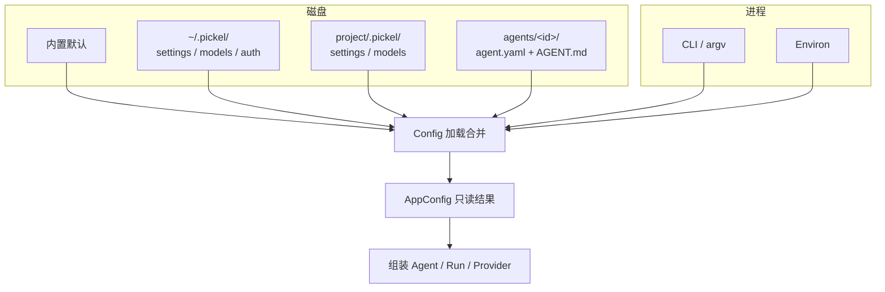
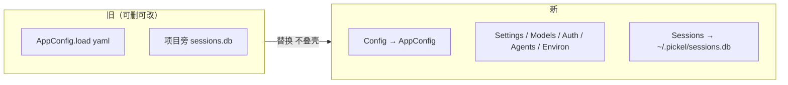
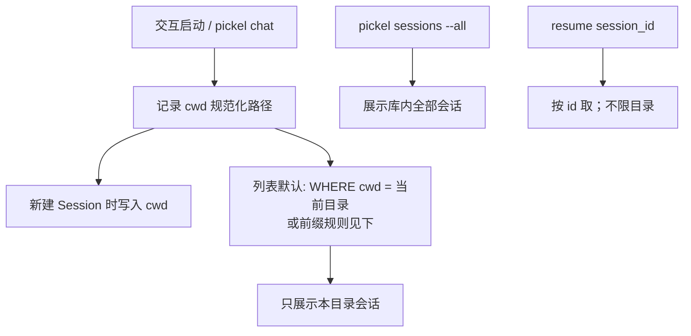
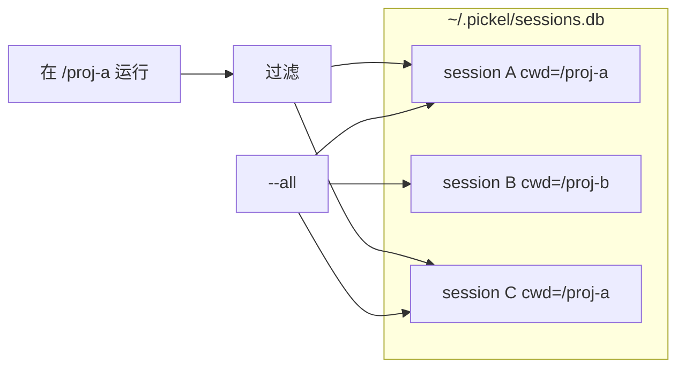
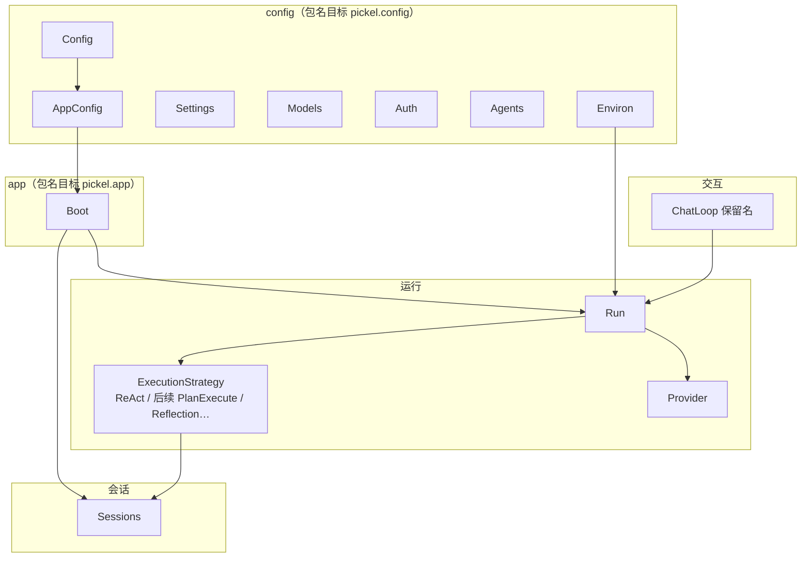
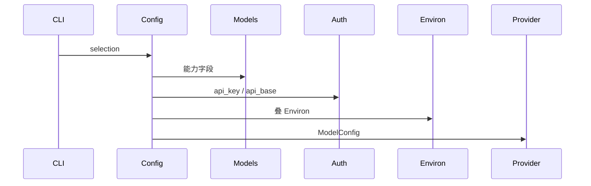
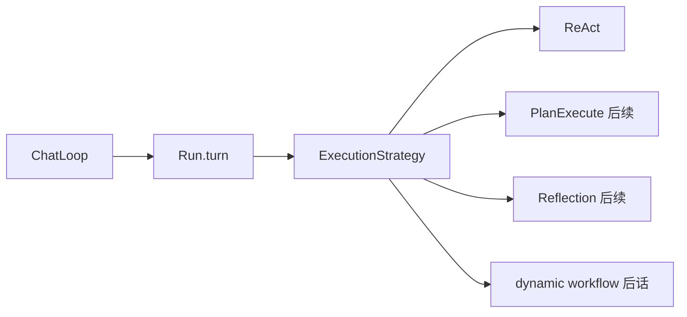
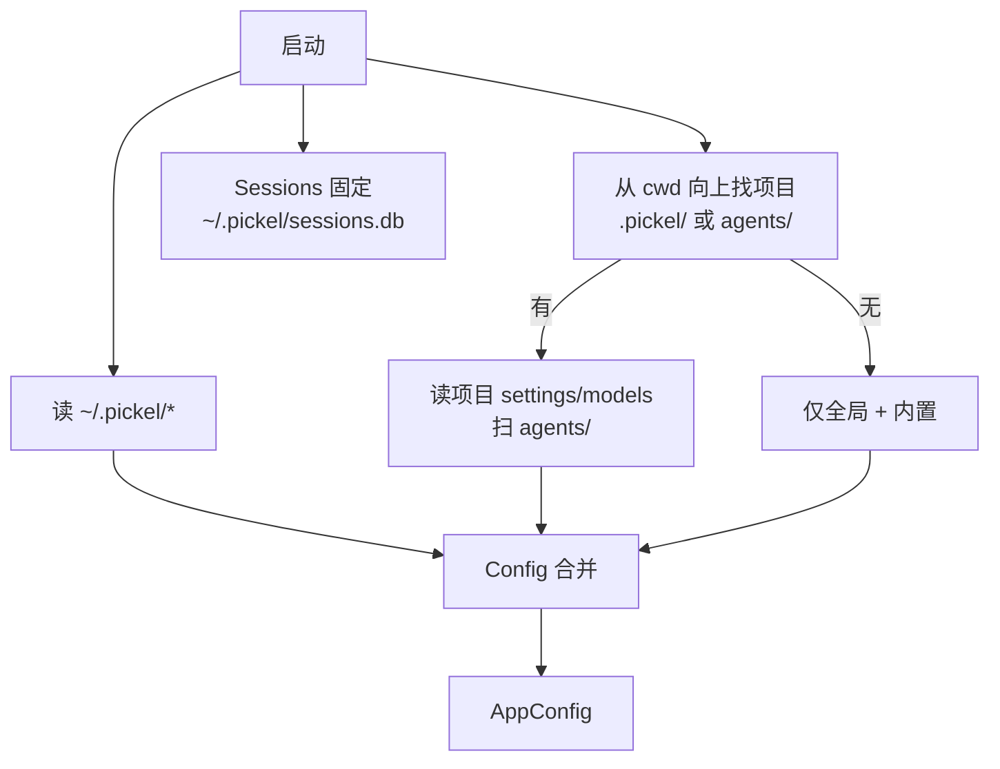

# 配置系统升级设计

> **后续命名说明（2026-08-10）**：本文的配置分层结论保持不变；运行层的 `Agent`、`Run`、`SessionEntry` 等目标态名称，已由 [`2026-08-10-agent-runtime-naming.md`](./2026-08-10-agent-runtime-naming.md) 替代。

**状态**：设计稿（修订）；**产品名确认 pickel**  
**范围**：配置分层、全局会话库与目录过滤、实体命名、与现有模块衔接  
**标杆**：pi（settings / models / auth 拆分）、Claude Code / Codex（全局会话 + 按目录过滤）

---

## 1. 目标

| 目标 | 说明 |
|------|------|
| 拆职责 | 偏好 / 模型 / 密钥 / Agent 定义分文件 |
| 可写 | 运行时可改配置，可选落盘 |
| 可合并 | `默认 < 全局 < 项目 < Agent < CLI(argv) < Environ` |
| 会话全局存、目录筛 | 库在用户家目录；交互列表默认只看当前目录相关会话 |
| 命名直白 | 实体名 = 是什么；不为旧名妥协 |

**非目标**

- 项目 trust 交互
- 远程配置中心
- 为旧类型名保留永久别名层

**产品命名（已确认）**

| 项 | 名称 |
|----|------|
| 产品 / CLI | **pickel** |
| 用户家目录 | **`~/.pickel/`** |
| 项目覆盖目录 | **`.pickel/`** |
| PyPI（现） | `pickel-agent`（可维持或后收） |
| 默认 Agent 人设 | `Pickle`（角色名，可与产品拼写不同） |
| 代码包（现） | `pickel` → **目标迁为 `pickel`**（实现阶段分步，不叠永久双包） |

家目录与项目点目录以 **pickel** 为准，**不再使用** `.pickel` / `~/.pickel` 作为目标路径。

**命名原则（强制）**

- 直接、短、与文件同词：`Settings` ↔ `settings.json`
- **能对齐操作系统概念的，优先对齐**（见 §4.0）
- 禁止为迁就旧代码引入 Manager / Registry / Runtime / Effective / Store 等空壳层名
- 旧实体名与行为冲突时：**改行为、改名或删除**，不叠兼容壳
- 对话 **Session** 只表示会话落库，不借用为「运行时配置」前缀

---

## 2. 现状问题

```text
仓库/
├── config.yaml                 # 唯一配置，只读
├── agents/Pickle/AGENT.md
├── pickle_workspace/           # agent 文件工作区
└── .pickel/sessions.db # 现状：会话库绑在 config 旁（目标改为 ~/.pickel/sessions.db）
```

| 痛点 | 影响 |
|------|------|
| 单文件全能 | 偏好、模型、密钥、agent 混装 |
| 只读加载 | 无法运行时改 model / 默认并落盘 |
| 会话库项目级 | 换目录丢列表；与 Claude/Codex 习惯相反 |
| 命名偏重 | 若引入 Catalog/Manager 会继续欠债 |

---

## 3. 目标布局

### 3.1 目录

```text
~/.pickel/                         # 用户全局
├── settings.json                      # 偏好（可写）
├── models.json                        # 模型目录（无密钥）
├── auth.json                          # 密钥
└── sessions.db                        # 全局唯一会话库

<project>/                             # 项目（cwd 向上发现）
├── .pickel/
│   ├── settings.json                  # 项目覆盖（可选）
│   └── models.json                    # 项目模型覆盖（可选）
└── agents/
    └── Pickle/
        ├── AGENT.md                   # 行为
        └── agent.yaml                 # agent 专属配置
```

**不在此放的**

| 项 | 位置 | 说明 |
|----|------|------|
| `sessions.db` | **仅** `~/.pickel/sessions.db` | 不跟项目、不跟 agent workspace |
| `auth.json` | 默认仅全局 | 不进 git |
| `workspace_path` | `agent.yaml` | 只约束文件工具工作区，与会话库无关 |

### 3.2 分层合并



| 优先级（低→高） | 来源 | 写盘 |
|-----------------|------|------|
| 1 | 内置默认 | 否 |
| 2 | 全局 settings / models / auth | 是（settings/auth） |
| 3 | 项目 settings / models | 是 |
| 4 | Agent 定义 | 文件编辑 |
| 5 | CLI | 否 |
| 6 | Environ（进程环境） | 默认否；显式「写入默认」才写 Settings |

---

## 4. 实体命名（目标态）

### 4.0 与操作系统概念对齐

配置与运行态按 Unix 习惯拆开，而不是按「对话 Session」拆：

| 操作系统概念 | 本系统 | 说明 |
|--------------|--------|------|
| 配置文件 `~/.config`、`/etc` | **Settings** | 持久偏好，可写回文件 |
| 主机/用户资源清单 | **Models** | 模型目录（类似可用命令/驱动清单） |
| 密钥 `.netrc` / keyring | **Auth** | 凭证，权限收紧 |
| 可执行程序 / 角色定义 | **Agents** | `agents/<id>/` 目录 |
| 进程环境 `environ(7)` | **Environ** | 当前**进程**上的可变覆盖，默认不落盘 |
| 启动参数 `argv` | **CLI** | 一次调用传入 |
| 解析后的生效视图 | **AppConfig** | 合并结果，只读 |
| 加载与合并 | **Config** | 入口（类似读配置并 export 到进程） |
| 工作目录 `cwd` | Session.`cwd` / 进程 cwd | 会话归属目录过滤用 |
| 作业日志 / 历史 | **Session** / **Sessions** | 对话落库；**不是**运行配置 |

```text
磁盘配置文件          进程
Settings/Models/...  →  Config 合并  →  AppConfig
                              ↑
                         CLI (argv)
                              ↑
                         Environ（运行中可改，像改环境变量）
```

**Environ 不是 Session 的一部分。**  
Session 回答「这本对话存了什么」；Environ 回答「这个进程此刻用哪个 model / thinking」。

### 4.1 配置侧

| 名称 | 职责 | 对应物 |
|------|------|--------|
| **Config** | 加载、合并、发现路径；入口 | 代码模块 `config` |
| **AppConfig** | 合并后的只读生效视图 | 内存 |
| **Settings** | 读写 `settings.json`（global / project） | `settings.json` |
| **Models** | 读 `models.json`（切换 model 时热读） | `models.json` |
| **Auth** | 读 `auth.json` | `auth.json` |
| **Agents** | 扫 `agents/<id>/`，加载 agent 定义 | 目录 |
| **Environ** | 当前进程运行覆盖（model / thinking 等，默认不落盘） | 进程内存 |

### 4.2 会话侧（与配置正交）

| 名称 | 职责 |
|------|------|
| **ConversationSession** | 一本对话的身份和当前提交视图 |
| **ConversationNode** | 对话树中的不可变位置 |
| **ConversationEntry** | Node 与内容解析后的只读投影 |
| **ConversationStore** | `sessions.db` 的持久化窄接口 |

### 4.3 Agent Package Snapshot

Pickel 设置始终是唯一可编辑源，不增加 `package.yaml` 或第二套 Agent 配置。

```text
AppConfig + AgentConfig + ModelConfig + AGENT.md + Skills + ToolBus
                              ↓ resolve
                       AgentDefinition
                              ↓ freeze
                    AgentPackageVersion
                              ↓ load implementations
                     LoadedAgentPackage
```

- `AgentDefinition` 保存现有设置解析后的来源和选择。
- `AgentPackageVersion` 冻结 behavior、无密钥模型参数、Skill 全文和工具 schema；ID 为内容 digest。
- `LoadedAgentPackage` 持有进程内 ToolSnapshot、SkillManifest 和现阶段运行对象，不能直接持久化。
- `api_key`、token、password、authorization 等秘密不得进入 Snapshot；只记录所需秘密名称。
- 相同 Pickel 设置和文件内容必须得到相同 `package_version_id`，创建时间不参与 digest。
- 当前新 Runtime 的验收 Provider 为 Anthropic；已有其他 Provider 设置不扩展新能力。

### 4.4 废弃 / 禁止的命名

| 不要用 | 原因 | 用 |
|--------|------|-----|
| ConfigRuntime / EffectiveConfig | 空壳层名 | Config / AppConfig |
| SettingsManager | 重 | Settings |
| ModelCatalog | 术语 | Models |
| AuthStore | 重 | Auth |
| AgentRegistry | 企业味 | Agents |
| SessionSettings / SessionPatch / SessionOverride | 误绑对话 Session；属进程运行态 | Environ |

旧代码里的 `AppConfig.load(path)`、`from_config_path` 等：**实现阶段直接改行为与调用点**，不保留双轨类型。



---

## 5. 各文件字段

### 5.1 `settings.json`

```json
{
  "default_agent": "Pickle",
  "default_llm": { "provider": "anthropic", "model": "claude-jupiter-v1-p" },
  "default_file_access_mode": "full",
  "default_skills_path": ".agent/skills",
  "react_max_steps": 100,
  "context_cli_turn_window": 5,
  "openviking": {
    "enabled": false,
    "timeout_seconds": 30,
    "commit_after_minutes": 30,
    "commit_after_turns": 8,
    "tool_output_max_chars": 4000,
    "session_recall": { "enabled": false, "max_chars": 6000, "limit": 5 }
  }
}
```

| 字段 | 原 config.yaml |
|------|----------------|
| `default_*` / `react_*` / `context_*` | 同名 |
| `openviking.*` 策略 | 同名（密钥除外） |

**Settings 第一批可写字段**：`default_llm`、`default_agent`、`react_max_steps`

### 5.2 `models.json`

无密钥；结构沿用现有 `providers` → models 能力字段。  
项目文件按 provider/model **覆盖合并**全局。打开模型列表时重读。

### 5.3 `auth.json`

```json
{
  "providers": {
    "anthropic": {
      "api_key": "${ANTHROPIC_API_KEY_PICKLE}",
      "api_base": "https://api.anthropic.com"
    }
  },
  "openviking": {
    "base_url": "${OPENVIKING_BASE_URL}",
    "account_id": "${OPENVIKING_ACCOUNT_ID}",
    "user_id": "${OPENVIKING_USER_ID}",
    "user_key": "${OPENVIKING_USER_KEY}"
  }
}
```

权限 `0600`；`${ENV}` 展开；不进 git。

### 5.4 `agents/<id>/agent.yaml`

```yaml
workspace_path: pickle_workspace   # 文件工具工作区，≠ 会话库
tools: [list_directory, read_file, ...]
file_access_mode: full
llm:
  provider: anthropic
  model: claude-jupiter-v1-p
remote_agent_id: ${OPENVIKING_AGENT_ID}
skills_path: null
```

行为文案固定读同目录 `AGENT.md`。  
发现：项目下 `agents/*/` 含 `AGENT.md` 或 `agent.yaml` 即注册。

### 5.5 Environ（进程运行态，内存）

```text
Environ                 # 对齐 Unix process environment：属进程，不属于 Session 表
├── llm: { provider, model } | null
└── provider_options: { thinking: ... } 等
```

默认不写盘。用户「写入默认」→ 拷进 `Settings`（global/project 文件）。  
与 **Session**（对话落库）正交：换 model 不改 sessions.db 行结构。

---

## 6. 全局会话库与目录过滤

### 6.1 存哪里

```text
~/.pickel/sessions.db     # 唯一库
```

- **全局存储**：所有目录、所有 agent 的会话进同一库  
- **不是** 项目旁点目录里的 sessions.db（现状 `.pickel/`，勿再放进 `.pickel/`）  
- **不是** agent `workspace_path` 下的库  

### 6.2 按目录过滤（对齐 Claude Code / Codex）



| 场景 | 行为 |
|------|------|
| 某目录下 `pickel` / `pickel chat` 列会话、选续聊 | **只列出与该目录相关的 session** |
| `pickel sessions`（管理命令） | 默认本目录；**`--all` 列出全部** |
| `pickel sessions delete <id>` | 按 id，不限目录 |
| resume 指定 id | 按 id，不限目录（id 全局唯一） |

### 6.3 Session 封面需增加的字段

相对现有 `sessions` 表（见 `docs/upgrade/2026-07-12-db-entities.md`），增加：

| 列 | 类型 | 说明 |
|----|------|------|
| `cwd` | TEXT NOT NULL | 创建会话时的工作目录（绝对、规范化） |

- **索引**：`(cwd, updated_at)`，便于按目录列会话  
- **过滤规则（默认）**：`session.cwd == 当前 cwd`（规范化后全等）  
- 若后续需要「子目录可见父目录会话」，再扩展前缀匹配；**第一期全等即可**  
- `workspace_path`（agent 文件沙箱）**不参与**会话归属



### 6.4 与 agent 工作区的边界

| 概念 | 路径 | 用途 |
|------|------|------|
| 会话库 | `~/.pickel/sessions.db` | 对话历史 |
| 会话归属目录 | Session.`cwd` | 列表过滤 |
| Agent 文件工作区 | `agent.yaml` → `workspace_path` | 读写文件范围 |

三者分离，禁止混用。

---

## 7. 模块衔接

### 7.1 边界



| 现有 | 目标 |
|------|------|
| `AppConfig.load(yaml)` | `Config.load()` → `AppConfig` |
| `providers` 嵌在 AppConfig | `Models` + `Auth` 合成 `ModelConfig` |
| `agents` 大表 | `Agents` 扫目录 |
| `root/.pickel/sessions.db` | `Sessions` → `~/.pickel/sessions.db` |
| `AppAssembly` | **Boot** |
| `AgentRuntimeContext` + `RunDependencies` | 合并为 **Run**（唯一运行资源袋） |
| `AgentCoordinator` | **`Run.turn(...)`**（turn 边界：hook + 写 user + 调 strategy） |
| `BaseLLMProvider` | **Provider** |
| `DefaultProviderResolver` / `DefaultToolResolver` | **删除**，Boot/Run 内直接调函数 |
| `ExecutionStrategy` / `ReActStrategy` | **保留**（见 §7.4） |
| `ChatLoop` | **保留名与职责**（CLI 交互壳） |

### 7.2 合成 ModelConfig



### 7.3 CLI

| 能力 | 行为 |
|------|------|
| 默认启动 | 发现项目 + 全局配置；会话库固定家目录 |
| `--agent` | 保留 |
| 交互列会话 | 默认当前 `cwd` |
| `pickel sessions` | 默认当前 `cwd`；`--all` 全部 |
| `/model` 或等价 | 改 Environ；可选写入 Settings |
| 旧 `--config yaml` | 仅迁移期：一次性导入后提示改用分层文件；**不长期保留双配置模型** |

### 7.4 运行层（已拍板）

目标调用链：

```text
Boot(config)
  └─ Run.open(agent, …)          # provider / tools / workspace / shell / assembler / …
        ├─ Environ               # 进程内 model/thinking 等
        └─ turn(session, text)   # 原 AgentCoordinator.run_turn
              └─ strategy.execute(run, session)   # ExecutionStrategy
                    └─ 当前：ReActStrategy
                    └─ 后续：PlanExecute / Reflection / dynamic workflow（后话）

ChatLoop                         # 仅 UI：输入、渲染、斜杠命令 → Run.turn
```

| 类型 | 决议 |
|------|------|
| **ExecutionStrategy** | **保留**。后续接 plan-and-execute、reflection；再往后可扩展为 dynamic workflow。抽象有存在价值 |
| **ReActStrategy** | **保留**，作为第一种 strategy 实现 |
| **ChatLoop** | **保留**名与职责，不改成 Repl |
| **Run** | 替代 RuntimeContext + RunDependencies；`open` 构造，`turn` 跑一轮用户输入 |
| **Boot** | 替代 AppAssembly；读 Config，产 Run / Sessions |
| **Provider** | 替代 BaseLLMProvider |
| **Resolver 类** | 删除 |



实现顺序建议：配置 P0 时 Boot 直接 `Run.open`，顺手删掉 `AgentRuntimeContext`；Strategy 层次不动。

---

## 8. 运行时改配置

| 操作 | 对象 | 持久化 |
|------|------|--------|
| 进程内换 model | Environ | 否 |
| 设为默认 model | Settings | 是 |
| 改 thinking | Environ（或 models 默认） | 可选 |
| 改 tools | `agent.yaml` | 文件 |
| 改密钥 | Auth 文件 | 是 |

**Settings 写回**

1. deep merge；数组整表替换  
2. 按 scope（global / project）只写变更字段  
3. 文件锁  
4. API 分离：`patch_session` vs `set_settings(..., save=True)`

Agent 经工具改配置：第一期可不做；先做 CLI / 斜杠命令。密钥字段禁止 agent 随意写。

---

## 9. 迁移

### 9.1 字段

| 原 config.yaml | 新位置 |
|----------------|--------|
| 默认项 / openviking 策略 | `settings.json` |
| providers 能力 | `models.json` |
| api_key / api_base / openviking 密钥 | `auth.json` |
| `agents.<id>.*` | `agents/<id>/agent.yaml` |
| behavior 路径 | `agents/<id>/AGENT.md` |

### 9.2 会话库

| 原 | 新 |
|----|-----|
| `<project>/.pickel/sessions.db` | `~/.pickel/sessions.db` |

迁移时：

1. 若全局库不存在，可将项目旁旧库 **移动或导入** 到全局路径  
2. 为每条 session **补 `cwd`**：无则填迁移时的 project_root（或 unknown 标记，仅 `--all` 可见）  
3. 项目旁旧 `sessions.db` 备份后删除，避免双库  

### 9.3 命令示意

```text
pickel config migrate --from config.yaml
  → 写 ~/.pickel/{settings,models,auth}.json
  → 写 agents/*/agent.yaml
  → 迁 sessions.db 到全局并补 cwd
  → 备份 config.yaml
```

---

## 10. 路径发现



| 路径 | 基准 |
|------|------|
| settings 相对路径 | project_root，否则 cwd |
| agent.workspace_path | project_root |
| sessions.db | **始终** `~/.pickel/sessions.db` |
| Session.cwd | 创建时的进程 cwd（绝对规范化） |

---

## 11. 分阶段

| 阶段 | 内容 | 验收 |
|------|------|------|
| **P0** | Config / Settings / Models / Auth；路径用 `~/.pickel`；会话库全局 + `cwd`；Boot + Run.open（删 RuntimeContext） | chat 可用；列表默认可按目录滤 |
| **P1** | Agents 目录发现；迁移命令；删对 yaml 大表依赖 | 无 `config.yaml` agents 段可运行 |
| **P2** | Settings 写回；Environ；`/model` 等；Coordinator → `Run.turn`；Provider 改名 | 运行时改配置；运行层命名到位 |
| **P3** | 去掉旧 `--config`；扫掉 `.pickel` 路径；代码包名迁 `pickel`（可分 PR） | 与本文一致 |
| **后话** | PlanExecute / Reflection strategy；再 dynamic workflow | Strategy 接口稳定后扩展 |

---

## 12. 设计约束

1. 一份职责一份文件：settings / models / auth / agent  
2. 密钥不进 models、不进 git  
3. AppConfig 只读；写只经 Settings / Auth 文件 API  
4. Environ 属进程、默认不持久；与 Session 落库分离  
5. **sessions.db 全局唯一**；列表默认按 `cwd` 过滤；`--all` 看全部  
6. **命名不欠债**：旧名直接改删，不叠兼容类型  
7. agent workspace ≠ session cwd ≠ 会话库路径  
8. 产品与路径统一 **pickel**（`pickel` CLI、`~/.pickel`、`.pickel`）；代码包目标 `pickel`  

---

## 13. 标杆对照

| 能力 | Claude / Codex | pi | 本设计 |
|------|----------------|-----|--------|
| 会话存储 | 用户级 | `~/.pi/.../sessions` | `~/.pickel/sessions.db` |
| 列表过滤 | 当前目录相关 | 会话目录可配 | 默认 `cwd` 全等；`--all` 全库 |
| settings 分层 | user / project | global / project | 同左 |
| 多 Agent 目录 | 弱 | 弱 | `agents/<id>/` 强化 |
| 实体命名 | 直白 | 略框架 | **短名：Config / Settings / …** |

---

## 14. 小结

- 配置：分层文件 + **Config** 合并 → **AppConfig**；写用 **Settings**，模型用 **Models**，密钥用 **Auth**，角色用 **Agents**，进程覆盖用 **Environ**。  
- 产品：**pickel**（CLI / `~/.pickel` / `.pickel`）；代码包目标从 `pickel` 迁到 `pickel`。  
- 会话：**全局一个 db**（`~/.pickel/sessions.db`）；交互只看当前目录；管理命令可看全部。  
- 运行：**Boot** → **Run**（`open` / `turn`）→ **ExecutionStrategy**（**保留**，ReAct 为首，后续 plan-execute / reflection / workflow）；**ChatLoop** 保留；**Provider** 去 Base 前缀。  
- 命名与路径以本文为准；实现时改旧代码，不为旧账保留第二套实体。
