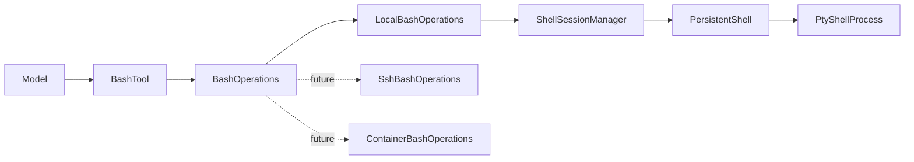

# 单一 Bash 工具设计

## 1. 决策

模型只看到一个 builtin tool：`bash`。

```text
bash(command, timeout?)
```

Shell 的本地 PTY、远程 SSH、容器和沙箱属于 Runtime 执行环境，不进入模型工具合同。这样既利用模型对 Bash 的既有认识，也避免模型学习一组 Runtime 专用的会话管理工具。

## 2. 模型合同

### 输入

| 字段 | 类型 | 必填 | 含义 |
| --- | --- | --- | --- |
| `command` | string | 是 | 标准 Bash 命令 |
| `timeout` | number | 否 | 前台命令最长执行秒数，必须大于 0 |

### 输出

| 字段 | 含义 |
| --- | --- |
| `stdout` / `stderr` | 命令输出 |
| `exit_code` | Bash 退出码 |
| `cwd` | 执行后的工作目录 |
| `shell_status` | Shell 是否仍可继续使用 |
| `timed_out` | 是否因超时停止前台进程 |
| `truncated` / `full_output_path` | 输出截断及完整输出位置 |
| `environment` | 执行环境名称，例如 `local`、`staging` |
| `sandboxed` | 本次执行是否位于 OS 沙箱边界内 |

非零 `exit_code` 是命令结果，不是工具调用失败；只有执行环境不可用或 Shell 已终止等 Runtime 故障才设置 `is_error=true`。

## 3. Runtime 结构



`BashOperations` 是 Runtime 与执行环境之间的最小接口：

```python
async def exec(*, session_id, workspace_path, command, timeout=None): ...
def close(session_id): ...
```

`LocalBashOperations` 当前复用已经稳定运行的 `ShellSessionManager -> PersistentShell -> PtyShellProcess`。这些类只是本地实现细节，不是新的公共架构层；后续可以在不改变 `bash` 合同的前提下逐步简化。

## 4. 行为语义

- 每个 Run 持有一个 `BashOperations`，默认使用本地实现，也可由装配层注入其他实现。
- 同一 session 复用持久 Shell，保留 `cwd`、环境变量和标准 Bash 后台作业。
- 长任务使用 Bash 原生的 `&`、重定向、`jobs`、`ps`、`tail` 和 `kill`，不再暴露 Runtime 专用任务工具。
- 前台命令超时后，Runtime 停止该进程并恢复 Shell 可用状态，返回退出码 `124`。
- Run 归档或切换时调用 `close(session_id)`，由执行环境负责清理资源。
- 工具参数不包含 sandbox 开关；模型不能自行扩大权限。

## 5. 安全边界

`BashOperations` 决定命令在哪里执行，权限与沙箱由装配层选择，而不是由 `bash` 工具描述决定。

当前本地实现沿用已有的最低限度危险命令拦截，并在结果中如实返回 `sandboxed`。该规则不是安全边界，也不继续扩充；真正的 macOS 隔离应由后续的 OS sandbox 执行环境实现，并保持相同的 `BashOperations` 接口。

## 6. 迁移结果

- builtin catalog 和默认 agent 配置只注册 `bash`。
- `shell_exec`、`shell_wait`、`shell_stdin`、`shell_interrupt`、`shell_tasks`、`shell_output`、`shell_kill`、`shell_restart`、`shell_close` 不再暴露给模型。
- 旧工具类暂时保留在本地实现文件中，为已有底层测试和渐进迁移服务；它们不是受支持的模型合同。
- Shell 合同和 PTY 底层不同时重写，降低迁移风险。

## 7. 验收标准

- catalog 中只有一个 Shell 类 builtin tool：`bash`。
- 替换 `BashOperations` 后，工具合同和模型调用方式不变。
- 同一 session 的 `cwd` 能跨调用保持。
- 非零退出码不会被误判为工具故障。
- 超时后 Shell 仍可执行下一条命令。
- 本地和替换执行环境都返回正确的 `environment` 与 `sandboxed`。
