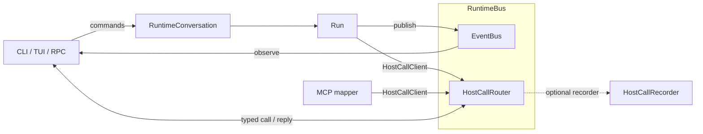

# Runtime I/O 总线与宿主调用设计

日期：2026-08-01
状态：已实施并校对

## 1. 结论

Agent Runtime 提供机制，不实现具体界面特性：

```text
RuntimeConversation              Host → Runtime 控制面：turn / abort / resume / steer
RuntimeBus                       一个活动 Conversation 的 I/O 组合边界
├── EventBus                     Runtime → observers，被动一对多（兼容现名）
└── HostCallRouter               Runtime → capability provider → Runtime，定向调用
```

MCP elicitation、确认、结构化输入和外部操作只是不同的 `HostCallSpec`，不建立各自的 coordinator、control、watch、service 或 repository。

## 2. Unix 设计约束

| 组件 | 只负责 |
| --- | --- |
| `EventBus` | 事件排序、广播、订阅者异常隔离 |
| `HostCallRouter` | handler 注册、单目标路由、关联、deadline、取消、关闭 |
| `RuntimeBus` | 组合两种 I/O 机制并统一生命周期 |
| `HostCallRecorder` | 决定调用是否记录、记录到哪里、如何脱敏 |
| Host adapter | CLI/TUI/RPC 的展示、排队和交互策略 |
| MCP mapper | MCP 类型与 Host call 类型互转 |

红线：

- Event listener 的返回值不能控制执行；
- Router 不 import CLI、MCP SDK、Session 或持久层；
- RuntimeBus 不决定 UI 排队、重试、敏感字段和 SessionEntry 类型；
- 工具只能取得 `HostCallClient`，不能取得完整 RuntimeBus；
- 基础设施失败与业务回答使用不同类型。

## 3. 架构



`RuntimeBus` 是组合边界，不是上帝对象。Host 主动控制 Runtime 仍调用 `RuntimeConversation`；“双向”只表示 Runtime I/O 既有输出事件，也有向宿主能力提供者发起的往返调用。

## 4. Host call 合同

### 4.1 稳定标识

Python 类型不是远端 ABI。每类调用使用稳定标识：

```python
@dataclass(frozen=True)
class HostCallSpec[RequestT, ResponseT]:
    name: str       # 例如 host.structured_input
    version: int    # wire/schema version
    request_type: type[RequestT]
    response_type: type[ResponseT]
```

### 4.2 调用上下文

```python
@dataclass(frozen=True)
class HostCallContext:
    call_id: str
    session_id: str
    operation_id: str
    step_id: str | None = None
    step_sequence: int | None = None
    tool_call_id: str | None = None
    timeout_seconds: float | None = None
```

### 4.3 基础设施结果

```text
HostCallCompleted[T](value)
HostCallUnavailable(reason)
HostCallCancelled(reason)
HostCallDeadlineExceeded()
HostCallFailed(error)
```

`decline` 等业务含义属于具体响应。例如 `ConfirmationAnswer(accepted=False)`，不是 Router 的传输错误。

### 4.4 窄接口

```python
class HostCallClient(Protocol):
    def supports(self, spec: HostCallSpec) -> bool: ...
    async def call(self, spec, request, context) -> HostCallOutcome: ...
```

Host 使用 Router 注册 handler：

```python
lease = runtime_bus.host_calls.register(spec, handler)
lease.close()  # 停止接收新调用，并取消该 provider 的活动调用
```

同一 `name + version` 只能有一个 handler。需要 policy + UI fallback 时由 Host 组合 handler，Router 不猜优先级。

## 5. 生命周期和并发

- request 先交给可选 recorder，再交给 handler；
- completed outcome 先记录，再返回调用者；
- 调用外部 handler 时不持有 Router 内部锁；
- handler lease 关闭后拒绝新调用，并取消其活动调用；
- Router close 取消所有活动调用并拒绝新调用；
- caller task 取消时取消对应 handler task，并继续向上传播取消；
- timeout 返回 `HostCallDeadlineExceeded`；
- handler 异常返回 `HostCallFailed`；
- storage/recorder 异常不被吞掉，由 RuntimeConversation 将当前执行视为失败。

Router 允许并行调用。CLI 是否串行弹窗由 CLI handler 自己决定；TUI/RPC 可以采用不同策略。

## 6. 第一批具体调用

```text
host.confirmation@1        ConfirmationRequest       -> ConfirmationAnswer
host.structured_input@1   StructuredInputRequest    -> StructuredInputAnswer
host.external_action@1    ExternalActionRequest     -> ExternalActionAnswer
```

具体响应保持强类型，不使用充满可选字段的万能 `HostResponse`。

## 7. 记录与 SessionEntry

HostCallRouter 只依赖可选 `HostCallRecorder`，不直接写 Session。

Pickel 第一版提供 Session recorder，把确认、结构化输入和外部操作投影成：

```text
host_call_request
host_call_response
```

Recorder 决定 payload 投影。凭证、token 等敏感调用不得保存正文；未来可改写到 operation log，而无需修改 Router。

这些 entry 是会话事实但不是 `AgentMessage`。现有 context projection、usage、preview 和 OpenViking sync 只消费 `ENTRY_TYPE_MESSAGE`，因此不会进入模型上下文。模型最终只看到工具产生的 `ToolResultMessage`。

进程重启后，未完成的 host call 只能认定为中断历史，不能自动恢复原协程或重放 MCP continuation。

## 8. Runtime 接线

```text
RuntimeConversation
  -> RuntimeBus
     -> existing EventBus
     -> HostCallRouter(recorder)

RuntimeConversation.turn
  -> Run.turn(host_calls=HostCallClient)
  -> ReActStrategy
  -> ToolExecutionContext
  -> ToolServices.host_calls
```

`ToolExecutionContext` 与 `HostCallContext` 使用同一身份：`operation_id`、`step_id`、`step_sequence`、`tool_call_id`。其中 ID 用于关联，sequence 只用于展示排序；生产路径必须填写真实身份。

## 9. MCP MRTR

MCP connection 的 capability 在连接建立时协商，而 Host handler 在 Conversation 生命周期内注册。第一版策略：

- MCP Client 固定具备 elicitation broker 能力；
- 每次 tool call 从自己的 `ToolExecutionContext.services.host_calls` 取得 client；
- `McpConnection` 使用 SDK 的 `allow_input_required=True` 单轮接口；
- MCP runtime 显式驱动有界 continuation，并把每轮 embedded elicitation 映射为 Host call；
- 没有 Host handler 时返回 decline/cancel，不动态改写已协商 capability；
- sampling/roots 返回不支持，不作为新架构核心；
- 连接断开或结果未知时绝不自动重放当前工具。

`requestState` 只属于 MCP continuation，不进入通用 Host call。

## 10. CLI/TUI/RPC

- CLI 注册 confirmation/structured-input handler，并在 handler 内串行读取输入；
- TUI handler 可显示 modal；
- RPC handler 把 `name/version/callId/context/payload` 映射为远端 request；
- handler 注册本身就是运行期 provider availability；
- Runtime lifecycle events 仍走 EventBus，不通过 Host call 提交回答。

## 11. 兼容迁移

第一阶段：

1. `RuntimeBus` 内部组合现有 `EventBus`；
2. `RuntimeConversation.event_bus`、`subscribe()` 保持；
3. 新增 `RuntimeConversation.runtime_bus`；
4. Run 继续接收 EventBus，同时显式接收 `HostCallClient`；
5. 所有内部路径迁移后再决定是否弃用公开 `event_bus`。

不会一次性破坏现有 renderer、trace sink、CLI 和嵌入方。

## 12. 代码落点

```text
src/pickel/runs/host_calls.py
src/pickel/runs/runtime_bus.py
src/pickel/runs/host_call_types.py
src/pickel/cli/host_call_handlers.py
src/pickel/extensions/mcp/elicitation_mapper.py
```

不建立 User Interaction 专属 manager/control/watch，也不建立 Host call repository/service/factory。

## 13. 验收标准

- EventBus 现有测试与 API 保持兼容；
- Router 无 handler、重复注册、非法响应、异常、timeout、cancel、close 均有确定结果；
- 外部 handler 执行期间 Router 不持锁；
- 工具只能取得 HostCallClient；
- call 使用稳定 name/version；
- Session recorder 可替换且 Router 不 import conversations；
- host call entry 不进入模型上下文、usage 或 preview；
- CLI 可完成 confirmation 和 JSON Schema 基础表单；
- MCP MRTR 支持多轮、多 input request、decline、timeout；
- MCP 结果未知时不自动重放。

## 14. 实施验收

已完成：

- `RuntimeBus = EventBus + HostCallRouter` 组合边界；
- typed spec、context、outcome、handler lease、deadline/cancel/close；
- 可替换 `HostCallRecorder` 与非 message SessionEntry 投影；
- RuntimeConversation → Run → ReAct → ToolServices 身份和窄能力传递；
- CLI confirmation、基础 JSON Schema 表单、external action handler；
- MCP 2.0 `InputRequiredResult`、多 embedded request、多轮 `requestState` continuation；
- form response JSON Schema 复验与未知副作用不重放。

验证结果：本能力核心定向回归全部通过；全量测试 763 项通过、5 项跳过。剩余 7 项失败来自仓库中既有的已删除 skill 文件和 macOS `/var` 路径规范化断言，与本设计实现无关。
