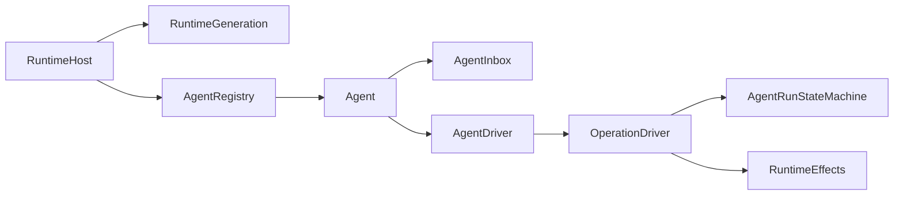

# Agent Runtime 重构命名约束

**日期**：2026-08-10
**更新日期**：2026-08-27
**状态**：当前合同；Runtime 与 ModelCall 命名已实施
**范围**：Agent Runtime、持久化实体、执行状态、Context、多模态、多 Agent 与生命周期组件的唯一名称
**不在范围**：数据库列级定义、Provider wire 协议和实施排期

本文只回答“一个概念叫什么、负责什么”。数据库字段遵循 [`数据库实体设计`](./2026-07-12-db-entities.md)，执行恢复遵循 [`Operation 持久化与恢复模型`](./2026-08-11-operation-recovery-model.md)，详细理由遵循 [`Runtime 实体决策`](./2026-08-24-runtime-entity-decisions.md)。旧实现出现同义名称时，以本文为目标态。

## 1. 命名原则

1. 一个概念只有一个名称，一个名称只表达一种生命周期。
2. Entity 表示稳定身份；Value Object 表示无独立生命周期的数据；Service/Driver 只承担窄行为。
3. `State` 只表示可持久化、可恢复的当前执行状态。
4. `Definition` 是可编辑来源，`Version` 是不可修改且可稳定引用的冻结内容。
5. `Intent` 表示外部副作用发生前已经提交的精确决定。
6. `Event` 是可丢失通知，不是恢复事实；`Trace` 是可丢失诊断副本。
7. 禁止用 `Manager`、`Coordinator`、`Processor`、`Handler`、`Context` 或任意资源袋掩盖多种职责。
8. 迁移完成后删除旧名，不保留永久 Alias、Adapter 或双轨生产路径。

固定后缀：

| 后缀 | 唯一语义 |
| --- | --- |
| `State` | 可更新、可恢复的当前状态 |
| `Intent` | 跨越外部执行边界前冻结的决定 |
| `Event` | 已发生事实或生命周期的进程内通知 |
| `Snapshot` | 明确边界捕获的完整只读诊断视图 |
| `Definition` | 用户可编辑的源定义 |
| `Version` | 内容冻结、创建后不修改的版本 |
| `Reference` | 对另一稳定 Entity 的值引用；不表示可移动数据库指针 |
| `Operation` | 已被 Session 接受、可恢复且具有明确终态的工作 |
| `Step` | AgentRun 中一次模型请求、响应和工具批次 |
| `Driver` | 重复推进一个明确状态机直到等待或终态 |

## 2. 执行层级

```text
ConversationSession
└── SessionOperation                 不可变执行身份
    └── AgentRunState                当前唯一执行状态
        └── ModelStepState?          当前模型步骤
            ├── ModelRequestIntent?  已决定的 Provider-neutral 输入
            ├── ModelCall[]          每次真实 Provider 调用
            └── ToolCallState[]      当前工具调用状态
```

| 名称 | 唯一含义 | 是否独立落库 |
| --- | --- | ---: |
| `ConversationSession` | 一棵 Conversation Tree、一个活动位置和 Inbox 归属 | 是 |
| `SessionOperation` | Session 接受的一次不可变 AgentRun 身份与执行环境绑定 | 是 |
| `AgentRunState` | 一个 Operation 的当前可恢复状态 | 是，一行 CAS 更新 |
| `ModelStepState` | 当前模型请求、响应及工具批次 | 否，嵌入 AgentRunState |
| `ModelCall` | 一次真实 Provider 生成调用及其完整请求、聚合响应引用 | 是，独立行 |
| `ToolCallState` | 当前 ToolCall 的审批、Intent、执行与结果状态 | 否，嵌入 ModelStepState |

当前只有一种 SessionOperation：AgentRun。因此不保存 `operation_type`，也不创建独立 `AgentRun` 表。只有第二种工作同时需要 Session 接受、持久化、恢复、resume/cancel 和明确终态时，才给 SessionOperation 增加类型判别。

`Turn`、`Job`、`Task` 不作为 Runtime 核心实体。统一身份：

```text
session_id
operation_id
step_id
tool_call_id
message_id
```

不再为同一执行维护 `turn_id`、`run_id`、`batch_id` 或 `lane_id`。

## 3. Runtime 组件



| 名称 | 唯一职责 |
| --- | --- |
| `RuntimeHost` | 进程启动、shutdown、配置 reload 和 RuntimeGeneration 切换 |
| `RuntimeGeneration` | 一代完整可执行贡献、组合根及其生命周期所有权 |
| `ContributionScope` | 注册贡献和外部资源的 LIFO 撤销边界 |
| `AgentRegistry` | 单进程 `session_id → live Agent` 唯一映射、引用与唤醒 |
| `AgentHandle` | 一个调用方对 live Agent 的精确、幂等引用 |
| `Agent` | Root/Child 平等的消息、取消和等待接口；串行化同一 live Agent 的驱动入口 |
| `AgentInbox` | 持久化 InboxMessage 的内存窄投影，不保存第二份队列 |
| `AgentDriver` | 判断 Session 是否 runnable，接受或恢复 Operation；不拥有前台 task 或互斥锁 |
| `OperationDriver` | 推进一个已有 Operation，直到 waiting 或终态 |
| `AgentRunStateMachine` | 校验 AgentRunState、ModelStepState 和 ToolCallState 转换 |
| `RuntimeEffects` | Provider、Tool、Hook、Recall、Timer 等外部作用的窄执行边界 |

删除目标态中的 `AgentRuntime` 和 `RuntimeBindings`。前者的接受/调度职责分别进入 AgentDriver 与 OperationDriver；后者的 Package 实现进入 LoadedAgentPackage，Host 级服务显式传给 RuntimeEffects。

`ConversationRuntime` 只允许作为 Host/UI Adapter 临时存在；它不拥有业务状态机、Context、Provider 或 Tool Loop。迁移完成后若无独立产品职责则删除。

## 4. Agent Package

| 名称 | 唯一职责 |
| --- | --- |
| `AgentDefinition` | 从 Pickel 配置、AGENT.md 等来源解析出的可编辑蓝图 |
| `AgentPackageVersion` | 内容寻址、不可修改的一次执行配置快照 |
| `LoadedAgentPackage` | 当前 RuntimeGeneration 中解析了 Secret 与可执行实现的 Package |
| `LoadedPackageHandle` | Operation 对 LoadedAgentPackage 和 Generation 的引用 |
| `ModelPolicy` | `primary / worker / utility` 三层模型选择 |
| `AgentRuntimePolicy` | 最大 Step、Context Window、Delegation 深度等执行限制 |
| `AgentDelegationPolicy` | Parent Package 允许委派的 Agent ID 与默认 Agent |
| `WorkspacePolicy` | Package 声明的文件访问范围 |
| `WorkspaceBinding` | Operation 接受时冻结的实际执行目录和安全边界 |

每个 SessionOperation 接受时绑定确定的 `AgentPackageVersion` 和 `WorkspaceBinding`。Definition、Settings 或 Environ 的后续变化只影响未来 Operation。

## 5. 持久化实体

| 名称 | 身份 | 职责 |
| --- | --- | --- |
| `Workspace` | `workspace_id` | 实际目录的长期身份 |
| `ConversationSession` | `session_id` | 会话树、活动位置、active Operation 和归档状态 |
| `ConversationNode` | `node_id` | 树位置与 Provider-neutral 类型化内容 |
| `InboxMessage` | `message_id` | 持久化输入、FIFO、delivery 和 claim 结果 |
| `SessionOperation` | `operation_id` | 不可变执行身份、Package 与 Workspace 绑定 |
| `AgentRunState` | `operation_id` | 当前可恢复执行状态 |
| `ModelCall` | `model_call_id` | 一次真实 Provider 调用、重试身份和可靠内容引用 |
| `AgentPackageVersion` | `package_version_id` | 内容寻址配置快照 |
| `Artifact` | `artifact_id` | 内容寻址二进制元数据 |
| `AgentDelegation` | `child_session_id` | Parent Operation 与长期 child Session 的因果关系 |

ConversationNode 直接保存 `agent_message` 或 `history_compaction` 内容。目标态删除：

- `ImmutableObject`
- `NamedReference`
- `StorageCommit`
- `ConversationEntry`
- `ConversationNode → Object` 间接层
- Operation State 历史 Snapshot 链

`ConversationSession.active_node_id` 是活动位置的唯一权威；`active_operation_id` 是恢复当前 Operation 的唯一入口；`AgentRunState.revision` 是执行状态 CAS 权威。

## 6. Context

```text
ConversationProjector
    Conversation Tree → Conversation Messages

ContextWindow
    Conversation Messages → Visible Messages

RuntimeEffects
    Visible Messages → Recall/Hook ContextContributions

ModelContextBuilder
    Package + Visible Messages + Contributions → ModelContext

Provider Request Mapper
    ModelContext → Provider wire request
```

| 名称 | 唯一职责 |
| --- | --- |
| `ConversationProjector` | 沿固定 leaf 投影 AgentMessage 和 HistoryCompaction |
| `ContextWindow` | 只裁剪 Conversation Messages |
| `ContextContributions` | Recall/Hook 返回的深度不可变追加数据 |
| `ModelContextBuilder` | 创建唯一 Provider-neutral ModelContext |
| `ModelContext` | 深度不可变的 system/messages/tools |
| `ModelRequestIntent` | 当前 Step 已决定发送的完整 ModelContext 和 fingerprint |
| `AnthropicRequestMapper` | ModelContext 到 Anthropic wire 的纯映射 |

删除 `ContextAssembler`、`ContextPipeline`、`ContextManager`、`PreparedContext` 和 Provider 周围的二次组装。`prepare()` 作为旧 Context 动词删除；唯一 Context 入口仍是 `build_model_context()`。

Provider Mapper 将已提交 `ModelContext` 映射为内存值对象 `PreparedModelCall`；该对象
包含即将发送的完整 wire body，保存和发送必须复用同一个不可变值。Provider 不再通过
`request_snapshot()` 重新生成一份旁路请求。Hook 不得返回另一份完整 ModelContext 覆盖
Builder 结果，只能在 Intent 提交前提供受限 ContextContributions。

`/context` 是只读视图：当前 Step 有 ModelRequestIntent 时直接展示其中已提交的
精确 ModelContext，source 为 `model_request_intent`；没有 Intent 时才执行不含
Recall/Hook/draft input 的纯 preview，source 为 `preview`。preview 不能伪装成
实际请求，也不能为了检查而触发外部副作用。

## 7. Tool、Approval 与 HostCall

| 名称 | 语义 |
| --- | --- |
| `ToolCallState` | 当前 ToolCall 的持久化状态 |
| `ToolExecutionIntent` | Tool 外部副作用前冻结的工具特定决定 |
| `ToolReplayPolicy` | `safe / never` 自动重放策略 |
| `ToolApproval` | 嵌入 ToolCallState 的持久化审批请求和决定 |
| `ApprovalService` | 通过 revision CAS 接受批准或拒绝 |
| `ToolReconciliationService` | 通过 revision CAS 接受 Host 对已提交 Tool Intent 的核对结果 |
| `HostCallSpec` | 瞬时、类型化 Host 能力定义 |
| `HostCallRouter` | 进程内 Host 请求—响应路由，不负责恢复 |

`HostCall` 不等于可恢复外部等待。需要重启后继续等待的交互必须由所属业务状态机持久化；当前 ToolApproval 和 Tool reconciliation 都直接修改 AgentRunState，不新增独立队列或 Manager。

### 7.1 ToolDefinition 与结果边界

`ToolDefinition` 是冻结 Package 中的完整 Runtime 执行定义，必须同时提供输入和输出
schema。`output_schema` 只属于 Runtime/Package 执行合同；映射给模型的 Provider wire
工具定义只发送 `name`、`description` 和 `input_schema`，Provider 不把
`output_schema` 当作协议字段：

```python
@dataclass(frozen=True)
class ToolDefinition:
    name: str
    description: str
    input_schema: FrozenJSON
    output_schema: FrozenJSON
```

Tool 的执行合同固定为：

```text
ToolDefinition.output_schema
→ execute(arguments) -> JSONValue
→ 按 output_schema 验证 JSONValue
→ render(validated_value) -> ToolResultMessage.content
```

验证失败是 Tool 错误，必须按原始 ToolCall 顺序形成模型可见错误结果。验证通过的
JSON value 只通过 `render()` 转换为唯一的模型可见 `content`，持久化结果只引用该
ToolResultMessage；不再并列保存或消费 `structured_content`。Provider、Trace 和 UI
可以从同一 `content` 做各自展示映射，但不能形成第二份结果权威。

升级前已持久化的 ModelRequestIntent 可能没有 `output_schema`；反序列化只为恢复
补入 permissive schema，因为该字段不进入 Provider wire，也不决定 Tool 执行。
新 Tool、Package 和 ModelContext 的构建入口仍必须显式提供 `output_schema`，真实
执行始终以 Operation 冻结 Package 中的定义为准。

## 8. 多模态与多 Agent

消息内容使用明确 Block：

```text
ContentBlock
├── TextBlock
├── ArtifactBlock
├── ThinkingBlock
└── ToolCallBlock
```

`ArtifactReference` 是消息内的值对象；`Artifact` 是全局持久化元数据；`BlobStore` 保存实际字节。

Root 与 Child 都是同一个 `Agent` 类型。Child 使用独立 ConversationSession，通过 AgentDelegation 连接 Parent Operation；不引入 `RootAgent`、`ChildAgent`、`DelegatedAgentRun`、`SessionLane` 或 Agent Team 层级。

推荐方法名：

```python
Agent.followup()
Agent.steer()
Agent.inject()
Agent.cancel()
Agent.resume_operation(operation_id)
Agent.when_idle()

start_delegation() -> child_session_id
interrupt_agent()
```

child Operation 进入任一终态时，终态事务从 `final_assistant_node_id`、`error` 或
`cancellation` 投影一条 `agent_settled` InboxMessage，原子投递给 direct parent。
`final_assistant_node_id` 仍是成功结果的唯一权威；settled 消息只是持久化通知，不是
新的 Result/Settlement Entity。通知按 Parent Inbox 接受顺序进入当前 Step 或下一
Operation，因此并行 child 按实际完成提交顺序被消费，不由 Parent 固定顺序 join。

child 的 `report` 只发送主动选择的中间通信，不是终态结果，也不能填充
`final_assistant_node_id`。`send_message` 只向 direct child 追加 followup；
`list_agents` 只读 direct child 快照；`interrupt_agent` 只选择目标 direct child 当前的
active Operation，并按普通 cancellation 合同处理其非终态后代。`wait_delegation` 不再
是默认模型工具，只作为 Host/SDK 同步查询能力和冻结旧 Package 的兼容实现保留。

`delegate_agent` 只允许选择 Parent 冻结 `AgentDelegationPolicy` 中列出的
`agent_id`，不能接收原始 provider/model/tool 列表。选中的 child
`AgentPackageVersion` 在 Tool Intent 前解析并冻结，由 AgentDelegation 持久化绑定；
Root 与 Child 仍使用同一个 `Agent` 类型，只是可以执行不同的冻结 Package。

## 9. Observation 与生命周期

| 名称 | 职责 |
| --- | --- |
| `ExecutionIdentity` | session/operation/step/tool/message 的统一引用 |
| `RuntimeEvent` | fact/lifecycle/delta 的进程内 tagged union |
| `EventEnvelope` | event_id、identity、时间和单 stream 顺序 |
| `PreparedModelCall` | Provider Mapper 生成、保存与发送共用的不可变 wire 请求值 |
| `ModelCall` | 每次真实 Provider 调用的可靠持久化日志；不是 Trace |
| `ModelCallContentStore` | 内容寻址保存完整 ModelContext、wire request 和聚合 response |
| `SpanRecord` | 一次调用或阶段的测量层级 |
| `DiagnosticRecord` | 结构化诊断 |
| `TraceSink` | 可丢失诊断副本输出，不是恢复或审计权威 |

## 10. 动词合同

| 动词 | 固定语义 |
| --- | --- |
| `create` | 创建有稳定身份的 Entity |
| `build` | 从确定输入纯组装 Value Object |
| `resolve` | 按规则选择并校验配置或实现 |
| `load` | 按身份读取一个持久化 Entity |
| `find` | 按条件读取零或一个结果 |
| `list` | 返回有确定顺序的集合 |
| `insert` | 写入不可变 Entity |
| `append` | 向有序结构增加内容 |
| `accept` | Session 从 Inbox 原子创建 Operation |
| `claim` | 原子消费 pending InboxMessage |
| `commit` | 原子提交状态转换和关联事实 |
| `project` | 从持久化事实派生只读值 |
| `execute` | 发生真实计算或外部调用 |
| `drive` | 推进状态机直到等待或终态 |
| `wake` | 通知 AgentDriver 重新检查数据库 runnable work |
| `close` | 释放内存资源或引用，不改变业务 Session |
| `archive` | 将 Session 变为持久化只读状态 |

避免单独使用 `save/update/write/set/process/handle`；方法名必须表达目标和语义，例如 `commit_agent_run_state()`、`claim_step_messages()`。

## 11. 历史名称迁移

| 历史名称 | 目标处理 |
| --- | --- |
| `Run` | 删除；拆入 RuntimeHost、Agent、Driver 和 Effects |
| `AgentRuntime` | 删除；接受/调度进入 AgentDriver，推进进入 OperationDriver |
| `RuntimeBindings` | 删除；Package 实现进入 LoadedAgentPackage，Host 服务显式注入 |
| `ExecutionStrategy` / `ReActStrategy` | 删除；默认 Tool Loop 属于 OperationDriver |
| `ContextAssembler` / `prepare()` | 删除；使用 ModelContextBuilder.build_model_context() |
| `TurnState` / `StepState` | `AgentRunState` / `ModelStepState` |
| `SessionEntry` / `ConversationEntry` | 删除；ConversationNode 直接保存类型化内容 |
| `leaf_id` / NamedReference active | `ConversationSession.active_node_id` |
| `current_commit_sequence` | 删除；按领域使用自然 CAS 或 AgentRunState.revision |
| `execution_policy` | 删除；ToolCallStatus + ToolApproval 表达 |
| `pending_context_feedback` | 删除；使用 InboxMessage.inject |

## 12. 验收约束

1. 代码和当前合同中不存在同义的 Run/AgentRuntime/Strategy 执行入口。
2. 同一 Session 在单进程只有一个 live Agent 和一个 AgentDriver task。
3. OperationDriver 不组装 Context，不持有 Host/UI 状态，不成为依赖资源袋。
4. ModelContext 只有一个 Builder，Provider 只映射 wire。
5. ConversationNode 不保存运行状态，AgentRunState 不保存历史消息内容。
6. 当前 Operation 通过 Session.active_operation_id 恢复，不扫描历史 Operation。
7. Tool 外部副作用前必须提交 ToolExecutionIntent；未知结果不得静默重放。
8. RuntimeGeneration reload 后旧 Operation 继续引用原 LoadedAgentPackage，所有贡献可逆序撤销。
9. Root/Child 共用 Agent、Inbox、Operation 和 Driver，不引入 Lane；child 成功结果只由最终 AssistantMessage 表达，Runtime 以 agent_settled InboxMessage 自动通知 direct parent，report 仅为中间通信。
10. Provider 调用前必须可靠保存 ModelCall 与完整 RequestContent；聚合 ResponseContent 保存失败时不得提交 AssistantMessage。
11. 完成迁移的旧公共类型、表和兼容路径必须删除。
