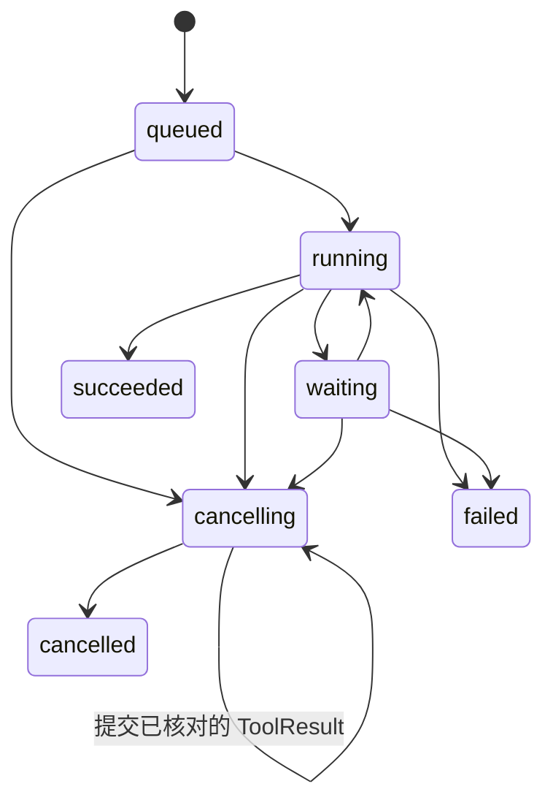
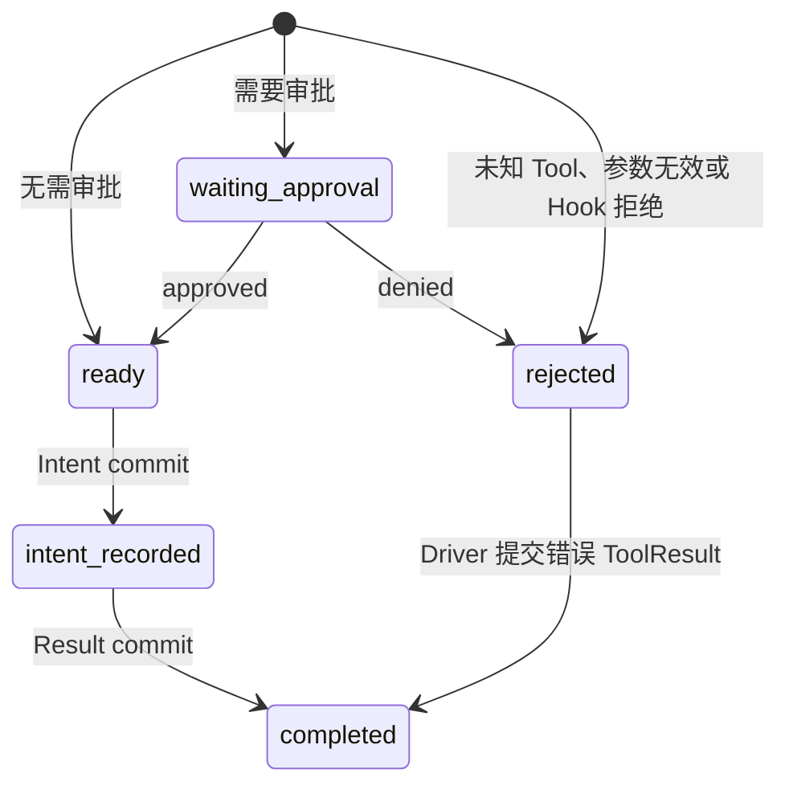
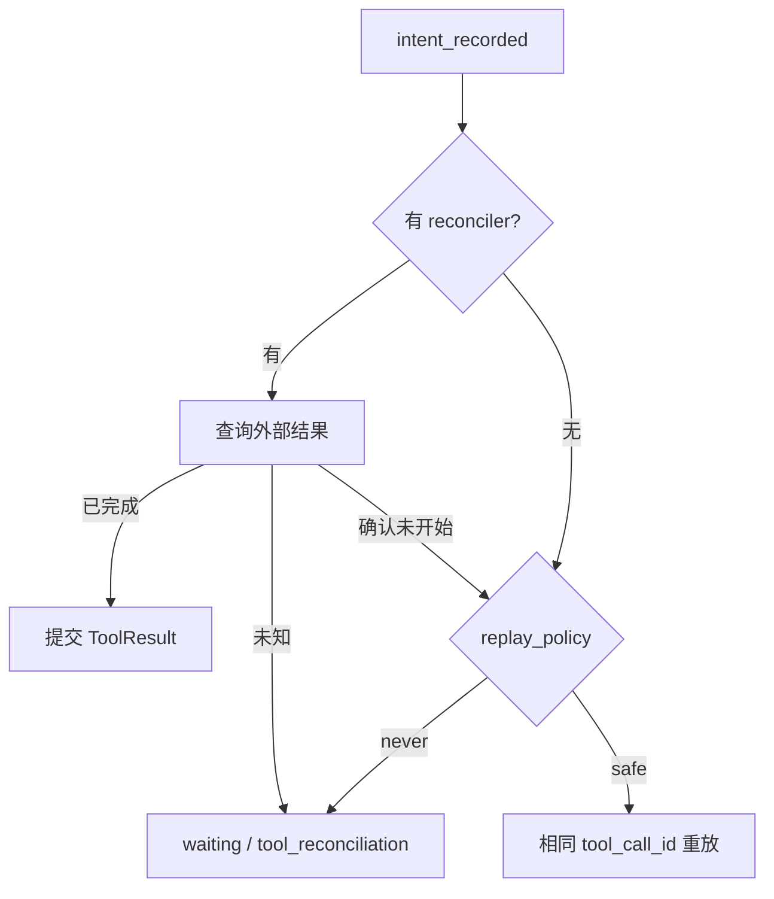

# Operation 持久化与恢复模型

**日期**：2026-08-11  
**更新日期**：2026-08-27
**状态**：当前合同；v11 恢复主链、PreToolUse、Approval CAS、Delegation settlement 与 Host reconcile 已实施
**范围**：SessionOperation 接受、AgentRunState、ModelStepState、ToolCallState、Intent、审批、取消与崩溃恢复
**不在范围**：Runtime 组件所有权、观测实现和 Provider wire 字段

命名遵循 [`Agent Runtime 重构命名约束`](./2026-08-10-agent-runtime-naming.md)，表结构和原子事务遵循 [`数据库实体设计`](./2026-07-12-db-entities.md)。

## 1. 恢复模型

```text
ConversationSession.active_operation_id
└── SessionOperation                         不可变
    ├── agent_package_version_id
    ├── workspace_binding_json
    ├── input_node_id
    └── AgentRunState                        当前一行，revision CAS
        └── ModelStepState?                  current_step_json
            ├── ModelRequestIntent?
            └── ToolCallState[]
                ├── ToolApproval?
                └── ToolExecutionIntent?
```

恢复只读取这条链，不扫描历史 State、Event、Trace 或 reducer。数据库保存“下一步判断所需事实”，不保存 Python 协程和 Provider stream buffer。

## 2. Operation 接受

InboxMessage 进入数据库不等于 Operation 已开始。AgentDriver 只在 Session 空闲时触发 OperationService 接受：

```text
CAS claim waking InboxMessage
+ 按 sequence 插入输入 ConversationNode
+ insert SessionOperation
+ insert AgentRunState(revision=1, status=queued)
+ move ConversationSession.active_node_id
+ set ConversationSession.active_operation_id
+ mark InboxMessage claimed
+ commit
```

SessionOperation 字段：

```python
@dataclass(frozen=True)
class SessionOperation:
    operation_id: OperationId
    session_id: SessionId
    agent_package_version_id: AgentPackageVersionId
    workspace_binding: WorkspaceBinding
    input_node_id: ConversationNodeId
    accepted_at: datetime
```

接受前必须确认：

- Session 未归档且 active_operation_id 为空；
- Package Version 存在、agent_id 匹配且当前所需 Secret/实现可装载；
- WorkspaceBinding 与 Session.workspace_id 一致；
- 被 claim 的 InboxMessage 仍为 pending。

任一步失败全部回滚。Definition、Settings 或 Environ 的后续变化不改变已接受 Operation。

## 3. AgentRunState

```python
@dataclass(frozen=True)
class AgentRunState:
    operation_id: OperationId
    revision: int
    status: AgentRunStatus
    waiting_reason: WaitingReason | None
    completed_step_count: int
    current_step: ModelStepState | None
    final_assistant_node_id: ConversationNodeId | None
    error: AgentRunError | None
    cancellation: Cancellation | None
```

状态：



终态为 `succeeded / failed / cancelled`，不能返回运行态。第一版 waiting_reason 只有：

```text
tool_approval
tool_reconciliation
```

Package、Secret 或冻结实现装载失败不增加 `blocked/suspended/runtime_unavailable` 状态；写入 `failed` 和稳定的 retryable AgentRunError。用户修复环境后创建新 Operation，不让旧 Operation 在无状态承载的情况下假装可恢复。

每次转换必须满足：

```text
new.revision = current.revision + 1
UPDATE ... WHERE revision = expected_revision
```

CAS 零行表示状态已经变化。调用方重新读取；Approval 等外部决定不得丢弃调用方 expected_revision 后盲目重放。

## 4. ModelStepState 与 ModelRequestIntent

```python
@dataclass(frozen=True)
class ModelStepState:
    step_id: StepId
    step_sequence: int
    phase: Literal[
        "preparing_request",
        "request_ready",
        "awaiting_tools",
    ]
    request_attempt: int
    request_intent: ModelRequestIntent | None
    assistant_message_node_id: ConversationNodeId | None
    tool_calls: tuple[ToolCallState, ...]
```

约束：

| phase | request_intent | assistant node | tool_calls |
| --- | --- | --- | --- |
| `preparing_request` | NULL | NULL | 空 |
| `request_ready` | 必填 | NULL | 空 |
| `awaiting_tools` | NULL | 必填 | 非空 |

Step 完成时清空 current_step 并递增 completed_step_count；不保存 completed Step ID 列表，也不增加 completed phase。

ModelRequestIntent：

```python
@dataclass(frozen=True)
class ModelRequestIntent:
    model_context: ModelContext
    context_fingerprint: str
```

完整 ModelContext 包含 Provider-neutral `system + messages + tool definitions`。它在 Recall/Hook/Window 完成后、Provider 调用前持久化，原因是动态贡献和裁剪结果无法保证重算一致。

```text
preparing_request
→ ConversationProjector
→ ContextWindow
→ Recall / Hook ContextContributions
→ ModelContextBuilder
→ CAS commit request_ready + ModelRequestIntent
→ CAS request_attempt += 1
→ Provider Mapper / stream
```

恢复：

| 持久化状态 | 动作 |
| --- | --- |
| `preparing_request` | Provider 尚未调用，可重新投影并执行 Recall/Hook |
| `request_ready` | 直接读取 Intent，不重跑 Context 管道；用相同输入重新发起 Provider 请求 |
| stream 中断 | 丢弃内存 buffer，从持久化 Intent 重发完整请求 |
| AssistantMessage 已提交 | 不重发 Provider；按 awaiting_tools 或 Step 完成继续 |

模型请求重试由 `AgentRuntimePolicy` 冻结。默认最多 3 次真实调用（包含首次），
以 1 秒为初始延迟做指数退避，单次延迟最多 4 秒。每次真实调用前都先以 revision
CAS 递增 `request_attempt`；退避只存在于内存，不增加 `retry_at`、等待状态或定时
任务实体。

只有连接失败、超时、HTTP `408/409/425/429/5xx` 可自动重试。鉴权、参数、权限、
模型不存在和 Provider 响应协议错误不得盲目重试。用尽次数后提交稳定
`AgentRunError(code, message, retryable=true)` 并进入 `failed`；不可重试错误立即以
`retryable=false` 失败。任何 Provider、解析或消费异常都必须收敛业务 State，不能
只让前台或 AgentRegistry task 抛错并留下 `running` Operation。

逐 Chunk 不进入业务数据库；full Trace 的副本不可用于恢复。

## 5. ToolCallState

```python
@dataclass(frozen=True)
class ToolCallState:
    tool_call_id: ToolCallId
    tool_name: str
    arguments: FrozenJSON
    status: ToolCallStatus
    approval: ToolApproval | None
    replay_policy: Literal["safe", "never"]
    execution_intent: ToolExecutionIntent | None
    decision_reason: str | None
    result_node_id: ConversationNodeId | None
    is_error: bool | None
```

ToolCallState 只保存执行位置和最终结果 Node 引用；Tool 的输出合同来自冻结
`ToolDefinition`。该定义必须同时包含 `input_schema` 与 `output_schema`。
`output_schema` 是 Runtime/Package 执行合同；Provider wire 的模型工具投影只发送
`name`、`description` 和 `input_schema`，不把 `output_schema` 当作协议字段。执行严格遵循：

```text
execute(arguments) -> JSONValue
→ 按 ToolDefinition.output_schema 验证
→ render(validated_value) -> ToolResultMessage.content
```

只有验证后的 `render()` 结果进入模型可见的 ToolResultMessage `content`，再由
`result_node_id` 引用。验证失败生成按 Provider ToolCall 顺序排列的错误 ToolResult。
不持久化或消费独立的 `structured_content`，避免它与 `content` 形成双重结果权威。

状态机：



`rejected` 表示 Tool Intent 前已确定不执行：用户拒绝由
`approval.decision.outcome = denied` 承载，Hook、未知 Tool 和参数非法由非空
`decision_reason` 承载。Provider ToolCall 顺序就是列表顺序。tool_call_id、
tool_name、冻结 arguments 和 replay_policy 创建后不可修改。`completed` 必须有
result_node_id 和 is_error；其他状态两者为空。

## 6. Tool Intent 与恢复

安全顺序：

```text
ready
→ resolve ToolExecutionIntent
→ CAS commit intent_recorded
→ execute real Tool with tool_call_id as default idempotency key
→ validate JSONValue against output_schema
→ render validated value as ToolResultMessage.content
→ atomically append ToolResult + commit completed
```

`intent_recorded` 表示工具可能未开始、正在执行或已完成但结果未提交。重启不能从该状态推断“尚未执行”。

`DelegateAgentIntent` 必须在执行外部效果前把 Parent Package 允许的 `agent_id` 解析为
确定的 `child_package_version_id`。随后创建 child Session 时，同时把该值写入
AgentDelegation；恢复不得再次用当前 Agent 配置解析，也不得默认替换为 Parent Package。
`delegate_agent` 不接受原始 provider、model、Tool、endpoint 或 Secret 参数。

恢复决策：



Host 通过唯一入口
`ToolReconciliationService.reconcile_tool_call(operation_id, step_id,
tool_call_id, *, outcome, expected_revision, result=None)` 提交核对结果：

| outcome | waiting / tool_reconciliation | cancelling |
| --- | --- | --- |
| `completed` | 原子提交 ToolResult + completed，转 `running` 并 wake | 原子提交 ToolResult + completed，保持 `cancelling` 并 wake；Driver 下一次 CAS 转 `cancelled` |
| `not_started` | `safe` 转 `running` 并 wake；`never` 保持 waiting | 不伪造 ToolResult，直接转 `cancelled` |
| `unknown` | 保持原状态 | 保持原状态 |

入口必须匹配 expected revision、当前 step、Provider 顺序的第一个未完成
`intent_recorded` ToolCall；CAS 只尝试一次。`completed` 的 ToolResult 和 State
在同一事务提交。取消中的已完成结果不能丢弃，也不能为了单次转入终态而放宽
Store 的“新节点必须被新状态引用”约束，因此使用可恢复的两次 CAS。
`unknown` 不增加 ToolCallStatus。

## 7. Tool Approval

Approval 是 ToolCallState 内的持久化值，不是同步 HostCall：

```text
Driver CAS → waiting_approval
→ 返回，不持有 Future
→ Host 查询 pending approval
→ ApprovalService CAS approved / denied
→ 所有审批已有决定后 AgentRun running
→ AgentRegistry.wake(session_id)
```

多个审批可以逐个决定，但存在任意 waiting_approval 时 Driver 不执行 Tool。全部决定后，Driver 按 Provider ToolCall 原始顺序执行 ready 调用并为 rejected 调用生成错误 ToolResult。

相同决定可幂等成功；过期 revision、冲突决定、已取消 Operation 必须拒绝。不使用 per-session Lock 替代 CAS，不做忽略调用方前置条件的指数退避盲重试。

当前 `ApprovalService.submit_tool_approval(operation_id, step_id, tool_call_id, ...)`
以完整执行位置和 `expected_revision` 定位未决审批。相同
`outcome + actor_id + reason` 的重复提交只返回已提交 State，不再次写入或唤醒；
不同决定、旧 Step、未决状态上的旧 revision、取消中和终态 Operation 均返回冲突。
一次 Step 的多个审批通过合法的 `waiting → waiting` 转换逐个提交，最后一个决定
才原子恢复 `running` 并唤醒所属 Session。

## 8. Cancel 与级联取消

取消顺序：

```text
CAS AgentRunState → cancelling + Cancellation
+ 可选 discard 目标 InboxMessage
→ commit
→ abort current in-memory effect
→ AgentRegistry.wake(session_id)
→ OperationDriver 协调 Provider/Tool Intent
→ CAS cancelled + clear Session.active_operation_id
```

Provider stream 可以中止；intent_recorded ToolCall 必须先 reconcile，不能直接假设未执行。waiting approval 在 cancelling 后失效，迟到决定因 status/revision 不匹配被拒绝。

取消中 reconcile 到 `completed` 时，第一次 CAS 保留 current_step 对 ToolResult
的引用并保持 `cancelling`；显式 wake 后，OperationDriver 看到已无未知 `never`
intent，再用第二次 CAS 清空 Step 并进入 `cancelled`。任一时刻崩溃都可从持久化
状态继续。

Parent Operation 取消必须沿 AgentDelegation 图递归处理全部非终态后代：

1. 逐个幂等 CAS 写入 child cancelling；
2. wake child Session，不依赖 child 是否 live；
3. Parent 在 cancelling 恢复时重复检查，补齐崩溃窗口；
4. 只 discard source.sender_operation_id 属于取消祖先集合的 pending Agent 消息；
5. 每个 child 用自己的 OperationDriver 协调 Tool Intent；
6. Parent 在自身副作用和后代都安全后进入 cancelled。

Store 的 `cancelling → cancelled` CAS 必须在同一事务重新确认：所有递归后代
Operation 已进入 `succeeded/failed/cancelled`，且不存在仍为 pending、来源属于被取消
祖先 Operation 并且目标属于其真实 Delegation 后代的 AgentMessage。门槛未满足返回
竞争/未就绪的 false，不得直接写入 `cancelled`；child 收敛为 `cancelled` 后唤醒
直接 parent，崩溃或未激活 Session 由下一次恢复 reconciliation 继续处理。

模型工具 `interrupt_agent` 只允许调用方选择 direct child 当前的 active Operation，
不能任意选择非后代 Operation。选中的 Operation 按本节普通 cancellation 与 Tool
Intent reconciliation 收敛；其创建的非终态后代继续遵守既有 Parent Operation 后代
级联取消不变量。该工具保留 child Session 和 AgentDelegation，不归档、删除或重建
关系；中断完成后同一 child Session 仍可接受后续 Inbox 消息并创建新的 Operation。

## 9. Operation 终态

终态事务：

```text
CAS AgentRunState → succeeded / failed / cancelled
+ ConversationSession.active_operation_id = NULL
+ 若该 Session 是 delegated child：向 direct Parent 插入 pending settled steer
+ updated_at = now
```

`succeeded` 必须引用 final_assistant_node_id；`failed` 必须保存稳定 AgentRunError；`cancelled` 必须保存 Cancellation。失败和取消不回滚已提交 ConversationNode。

delegated child 的 settled 消息必须与终态在同一事务提交，消息 ID 由
`("agent_settled", child_session_id, child_operation_id)` 规范派生，source 记录 child
Session/Operation。成功结果只从 `final_assistant_node_id` 投影 TextBlock 与 ArtifactBlock；
正文首个 TextBlock 是稳定 envelope，标明 `type=agent_settled`、`child_session_id` 与终态
`status`，供 Parent Context 识别来源；该 envelope 不得包含 Operation、Node、State、Provider
或 usage 身份。
失败和取消投影稳定 Error/Cancellation 摘要。不得复制 ThinkingBlock、ToolCallBlock、
Provider metadata、usage 或内部状态 ID；文本使用创建 Delegation 的 Parent Package 所冻结
`delegation_result_max_chars` 截断。该消息不是第二份结果权威，也不新增 Settlement/Result
实体。

同一 child Session 后续接受的每个 Operation 终态都产生各自的幂等通知。并行 child 按
Parent Inbox 分配到的 sequence 消费，不等待固定回收顺序。事务提交后 RuntimeHost wake
Parent；wake 失败不回滚，启动恢复从 durable pending Inbox 继续。

Driver 在提交 succeeded 前执行 stopping check：若存在 pending steer/inject，则 claim 并继续当前 Operation；否则终态并释放 active_operation_id。与终态并发到达的消息由事务顺序明确归入当前或下一 Operation，不丢失。

## 10. 启动恢复

Host 的显式恢复入口为 `Agent.resume_operation(operation_id)`，薄代理到
`AgentDriver.resume_operation(session_id=..., operation_id=...)`。入口只读取并
校验 Session 未归档且 `active_operation_id == operation_id`，随后直接调用现有
OperationDriver；它不写 revision、不新增锁，也不接受其他 pending InboxMessage。
waiting 原样返回，不能借 resume 绕过 Approval 或 reconciliation；实际状态变化
仍由 OperationDriver 内的 revision CAS 负责。

Host 启动时扫描：

```text
未归档 Session
AND (
  active Operation status IN (queued, running, cancelling)
  OR pending followup/steer 存在
)
```

waiting Operation 不轮询；批准、reconcile 或 cancel 必须先提交状态变化，再显式 wake。只有 pending inject 的 Session 保持 idle。

恢复已有 Operation 必须按其 AgentPackageVersion 和 WorkspaceBinding 加载。精确 Secret 或实现不可用时写入 retryable `failed`，禁止换用当前同名 Provider、Tool、Hook 或 Extension。

## 11. 验收

1. Operation 接受事实原子成功或全部回滚。
2. 恢复只从 active_operation_id 读取当前状态，不扫描历史。
3. Request Intent 后崩溃不重跑 Context；Tool Intent 后崩溃不静默重放。
4. 多审批、Approval/Cancel 和 Tool Result 并发由 revision CAS 防止丢更新。
5. rejected ToolResult 保持 Provider 原始 ToolCall 顺序；Tool 输出必须经 output_schema 验证并 render 为唯一模型可见 content。
6. cancelling 可跨崩溃继续，未知 Tool 副作用不会被直接标记 cancelled。
7. Parent 取消不会留下 running/waiting 的孤儿后代。
8. 终态 State、Session.active_operation_id 清空与 delegated child settled Inbox 插入原子一致。
9. settled 消息已持久化但 Parent 未被实时 wake 时，启动恢复会发现并驱动 Parent；不扫描历史终态补发通知。
