# Runtime 实体决策

**日期**：2026-08-24  
**更新日期**：2026-08-25  
**状态**：实体设计已收口，当前合同已对齐  
**范围**：Agent Runtime 中持久化实体、值对象、状态、快照、运行时对象和服务的抽象边界  
**不在范围**：实施排期、数据库迁移步骤、Provider 协议字段

本文记录已经逐项确认的实体结论；实施顺序见 [`Agent Runtime 重构实施计划`](./2026-08-24-agent-runtime-refactoring-plan.md)。命名、数据库、配置和 Operation 恢复合同已于 2026-08-25 对齐，不再继续增加预期实体。

## 1. 实体关系总览

当前只展开已经确认的关系，其他关系随讨论补充。

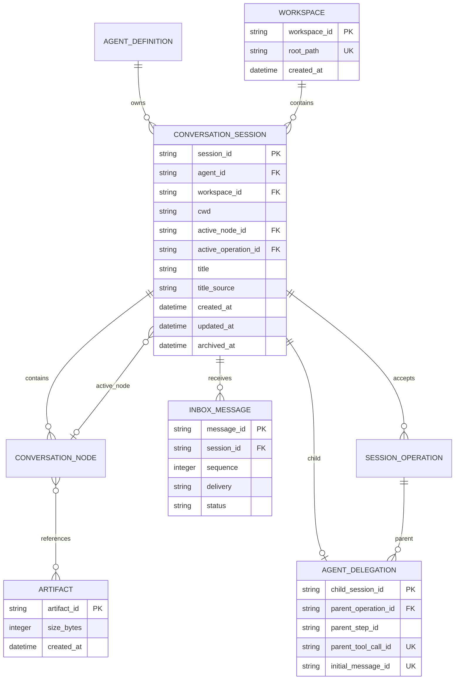

## 2. ConversationSession

### 2.1 抽象层级

| 项目 | 决策 |
| --- | --- |
| 类型 | 持久化 Entity |
| 稳定身份 | `session_id` |
| 生命周期 | 创建至显式删除 |
| 聚合内容 | 一棵 Conversation Tree、一个活动位置、接受的 SessionOperation |
| 执行约束 | 同时最多一个非终态 AgentRun Operation |
| 多 Agent | 独立 child Session，通过 AgentDelegation 建立关系 |
| Lane | 当前不存在 |

`ConversationSession` 表示可持续追加、分叉、导航和恢复的对话空间。运行状态属于 SessionOperation；Provider、Tool、Extension 和 AgentPackage 不进入 Session 实体。

### 2.2 字段

| 字段 | 约束 | 含义 |
| --- | --- | --- |
| `session_id` | PK、创建后不可修改 | 全局稳定身份 |
| `agent_id` | NOT NULL、创建后不可修改 | Session 所属逻辑 Agent |
| `workspace_id` | FK、创建后不可修改 | Session 使用的实际 Workspace 身份 |
| `cwd` | NOT NULL、规范化绝对路径、创建后不可修改 | 会话归属目录；沿用现有配置合同命名 |
| `active_node_id` | NULL 或同 Session ConversationNode | 当前对话树位置 |
| `active_operation_id` | NULL 或本 Session 非终态 SessionOperation | 当前需要执行或恢复的 AgentRun |
| `title` | NULL | 展示标题 |
| `title_source` | NULL / `generated` / `user` | 标题来源；用户标题不被自动覆盖 |
| `created_at` | NOT NULL | 创建时间 |
| `updated_at` | NOT NULL | 最近封面变化时间 |
| `archived_at` | NULL | 非空表示 Session 已归档，只读且不再接受新工作 |

不保存 `status = active / archived`；两态生命周期直接由 `archived_at` 表达，同时保留归档时间。不增加 `closed`、通用 `version` 或 `current_commit_sequence` 领域字段。移动活动位置时以 `active_node_id` 作为自然 Compare-And-Swap 条件：

```sql
UPDATE conversation_sessions
SET active_node_id = :new_node_id,
    updated_at = :updated_at
WHERE session_id = :session_id
  AND active_node_id IS :expected_node_id
  AND active_operation_id IS NULL
  AND archived_at IS NULL;
```

更新行数为零表示活动位置已经变化，调用方重新读取。AgentRunState 的 `revision` 仍用于保护状态机转换，与 Session 活动位置并发控制分开。

### 2.3 关系约束

```text
ConversationNode.session_id = ConversationSession.session_id
ConversationNode.parent_node_id 只能指向同一 Session
ConversationSession.active_node_id 只能指向同一 Session
SessionOperation.session_id = ConversationSession.session_id
ConversationSession.workspace_id 必须指向存在的 Workspace
ConversationSession.archived_at 非空时 active_operation_id 必须为空
```

父子 Session 关系不进入 ConversationSession 字段。Agent 创建 child Session 的因果关系由 AgentDelegation 保存；未来若支持用户克隆 Session，再单独讨论窄用途的来源关系。

### 2.4 Title 生成

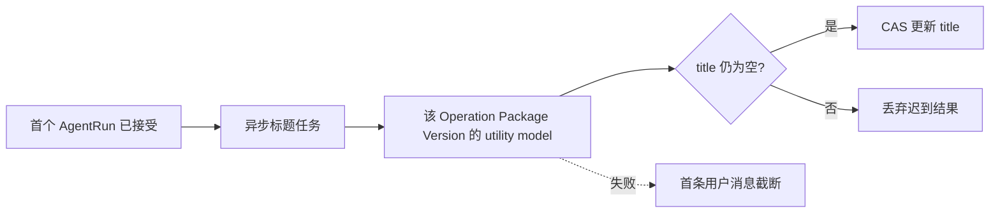

| 项目 | 决策 |
| --- | --- |
| 执行位置 | 应用层异步服务 |
| 模型角色 | `utility` |
| 是否阻塞主回答 | 否 |
| 是否属于 AgentRun | 否 |
| 是否要求崩溃恢复 | 否，可重新生成 |
| 失败回退 | 截断首条用户消息 |
| 用户修改后 | `title_source=user`，停止自动覆盖 |

Title Task 只读取首条 UserMessage，使用首个 Operation 已冻结 Package Version 中的 `utility` Model；它不调用主模型、不经过 Agent 的 ModelContextBuilder，也不影响 Operation。进程在任务完成前崩溃时，Session 下次加载可重新调度。

生成结果只允许条件写入：

```sql
UPDATE conversation_sessions
SET title = :title,
    title_source = 'generated',
    updated_at = :now
WHERE session_id = :session_id
  AND title IS NULL
  AND title_source IS NULL
  AND archived_at IS NULL;
```

`title` 和 `title_source` 必须同时为空或同时非空；用户更新写入 `title_source = user`，使已经在途的 utility 请求无法覆盖用户标题。

模型采用 Provider-neutral 的三层角色，具体配置结构在讨论 AgentPackage 与模型策略时确认：

| 角色 | 用途 | 类比 |
| --- | --- | --- |
| `primary` | 主 Agent、复杂决策 | Opus 层级 |
| `worker` | 普通子任务、历史压缩 | Sonnet 层级 |
| `utility` | Title、分类、短摘要 | Haiku 层级 |

### 2.5 内存表示

内存中直接使用只读 `ConversationSession` 领域对象，不再增加可变 SessionManager：

```python
@dataclass(frozen=True)
class ConversationSession:
    session_id: SessionId
    agent_id: AgentId
    workspace_id: WorkspaceId
    cwd: Path
    active_node_id: ConversationNodeId | None
    active_operation_id: OperationId | None
    title: str | None
    title_source: TitleSource | None
    created_at: datetime
    updated_at: datetime
    archived_at: datetime | None
```

持久化事务通过窄用途方法完成：

- `create_session`
- `load_session`
- `accept_operation`
- `move_active_node`
- `update_title`
- `archive_session`
- `unarchive_session`
- `delete_session`

### 2.6 创建与 active node

新 Session 固定初始化为：

```text
active_node_id = NULL
active_operation_id = NULL
title = NULL
title_source = NULL
archived_at = NULL
```

不创建空 Root Node；第一条输入消息直接成为根 ConversationNode。`agent_id`、`workspace_id` 和 `cwd` 创建后不可修改，需要切换 Agent 或 Workspace 时创建新 Session。

`active_node_id` 表示当前选中分支的活动终点，不改名为 `active_leaf_node_id`：用户可以选中一个已有历史 child 的节点并从那里创建新分支，该节点不是完整树中的物理 leaf。移动只允许发生在 Session 空闲且未归档时；Operation 运行期间禁止手动切换分支。失败或取消不回滚 Conversation Tree，活动位置保持最后一个成功提交的 Node。

### 2.7 Archive、Close 与 Delete

```text
ConversationSession.archived_at    持久化的只读归档状态
AgentHandle.close()                释放当前调用方的内存引用
Operation.cancel()                 取消当前执行
delete_session()                   物理删除持久化数据
```

Archive 只允许在以下条件同时满足时提交：

```text
active_operation_id IS NULL
AND 不存在 pending InboxMessage
AND archived_at IS NULL
```

归档后允许浏览、导出和 Trace 查询；拒绝新增 InboxMessage、接受 Operation 和 `AgentRegistry.acquire()`，启动恢复扫描也忽略该 Session。`unarchive_session` 将 `archived_at` 恢复为空。Archive 不隐式 cancel、清空 Inbox 或强制关闭仍被 Host 持有的 AgentHandle。

`AgentHandle.close()` 和 Host Adapter 的 `close()` 只释放进程内资源，不修改 Session、不归档、不取消 Operation。live Agent 是否退休仍由 AgentRegistry 的引用和 runnable work 条件决定。

公共 `delete_session` 是显式物理删除，要求 Session 已归档、无 active Operation、无 pending Inbox 且不存在 AgentDelegation。存在父子关系时默认拒绝；单独的危险入口 `delete_session_tree` 可以递归删除完整 child Session 子树，但要求所有目标 Session 均已归档且空闲，并且根 Session 没有来自子树外部的 parent Delegation。

删除 Session 时级联删除其 ConversationNode、InboxMessage、SessionOperation、AgentRunState 和子树内 AgentDelegation；Artifact 交由 GC，AgentPackageVersion 和 Workspace 保留。Agent 创建 child Session 的尚未提交事务失败时，允许内部回滚清理空 Session，不经过公共删除前置条件。

### 2.8 数据库与应用约束

```sql
CHECK (
    (title IS NULL AND title_source IS NULL)
    OR
    (title IS NOT NULL AND title_source IN ('generated', 'user'))
)

CHECK (
    archived_at IS NULL
    OR active_operation_id IS NULL
)
```

Archive 与 pending Inbox、跨 Session Node、Operation 所属关系需要事务查询或复合外键保证。Inbox send、Operation accept 和 active node move 都必须带 `archived_at IS NULL` 前置条件，避免 Archive 与新工作并发穿透。

## 3. ConversationNode

### 3.1 目标结构

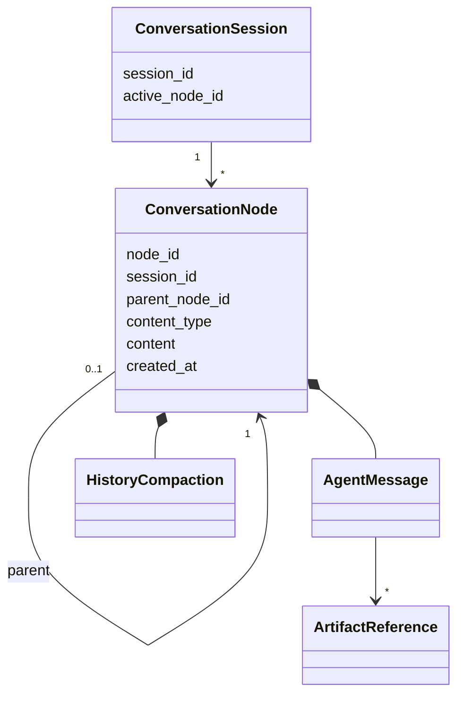

`ConversationNode` 直接保存类型化内容。当前 `ConversationNode → ImmutableObject → ConversationEntry` 三层结构压平为 `ConversationNode(content)`。

### 3.2 抽象层级

| 项目 | 决策 |
| --- | --- |
| 类型 | 持久化、不可变 Entity |
| 稳定身份 | `node_id` |
| 所属聚合 | ConversationSession |
| 树关系 | `parent_node_id` |
| 内容承载 | Node 直接保存类型化内容 |
| 活动位置 | `ConversationSession.active_node_id` |
| ConversationEntry | 删除 |
| Conversation 中的 ImmutableObject | 删除 |

### 3.3 字段

```text
conversation_nodes
- node_id
- session_id
- parent_node_id
- content_type
- content_json
- created_at
```

| 字段 | 约束 | 含义 |
| --- | --- | --- |
| `node_id` | PK、创建后不可修改 | Node 稳定身份 |
| `session_id` | FK、创建后不可修改 | 所属 Session |
| `parent_node_id` | NULL 或同 Session Node | 对话树父节点 |
| `content_type` | NOT NULL | `agent_message` / `history_compaction` |
| `content_json` | NOT NULL | 对应类型的 JSON 内容 |
| `created_at` | NOT NULL | 创建时间 |

不设置逐行 `content_version`。内容格式与 SQLite schema 一起升级：旧数据库通过一次性 migration 统一转换，Runtime 只解析当前格式，不长期维护同一 `content_type` 的多版本分支。

### 3.4 内容类型

```text
ConversationContent
├── agent_message
└── history_compaction
```

`agent_message` 保存 Provider-neutral AgentMessage，文本和 ArtifactReference 按模型可见顺序排列。`history_compaction` 保存摘要和 `first_kept_node_id`。

HostCall request/response 默认属于执行或观测记录；只有产生模型可见内容时，才转换成普通 `agent_message` 写入 Conversation Tree。

### 3.5 关系约束

```text
ConversationNode.session_id = ConversationSession.session_id
ConversationNode.parent_node_id 只能指向同一 Session
ConversationSession.active_node_id 只能指向同一 Session
```

Conversation Tree 不跨 Session 连接。分支通过多个 Node 指向同一父 Node 表达，活动分支通过 `active_node_id` 沿父链读取。

### 3.6 写入事务

```text
insert ConversationNode
+ compare active_node_id with expected parent
+ move ConversationSession.active_node_id
+ commit
```

接受 AgentRun 时，User ConversationNode、SessionOperation、初始 AgentRunState 和活动位置在同一个数据库事务中提交。

### 3.7 读取与 Context 投影


读取接口收敛为：

```python
list_branch_nodes(
    session_id,
    leaf_node_id,
) -> tuple[ConversationNode, ...]
```

OperationDriver 先读取一次确定的 leaf，再读取该分支。`ConversationProjector` 是处理 HistoryCompaction 并投影 AgentMessage 的唯一入口。Runtime、Provider、Trace 和 `/context` 不分别实现树遍历，也不在构建期间反复读取可能变化的 active leaf。

### 3.8 ConversationEntry 与界面展示

删除核心 `ConversationEntry`。Node 已包含解析后的领域内容，不再需要 `Node + ImmutableObject` 读取投影。

终端、Web 或 API 需要的发送者名称、格式化时间、颜色和展开状态等展示数据，由各自应用边界临时转换，不进入 Runtime 核心实体和数据库。

### 3.9 ArtifactReference

ArtifactReference 是嵌入 `AgentMessage.content` 的不可变值对象，保证文本和多模态内容的模型可见顺序：

```text
ArtifactReference
├── artifact_id
├── media_type
└── display_name?
```

`digest` 和 `size_bytes` 不在引用中重复保存；通过 `artifact_id` 查询 Artifact 获得。`alt_text` 属于消息中的 ArtifactBlock，因为它描述本次消息如何向模型解释内容。

当前不增加 `conversation_node_artifacts` 反向索引表。权威引用只有 `ConversationNode.content_json`；Artifact GC 直接扫描 JSON。以后只有在查询或 GC 性能形成实际问题时，才增加作为派生索引的关系表，该表不能成为第二份消息内容权威。

## 4. SessionOperation

### 4.1 目标结构

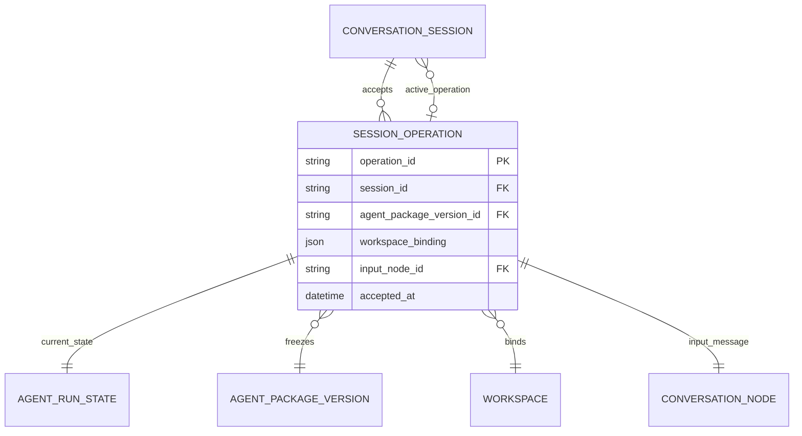

`SessionOperation` 是 AgentDriver 触发 OperationService 从 Inbox claim 一批 waking 消息时，由 Session 接受的不可变 AgentRun 身份；消息进入 Inbox 不等于 Operation 已开始。`AgentRunState` 是执行状态的唯一权威。

```text
SessionOperation = 这次执行是什么
AgentRunState = 这次执行现在怎么样
```

### 4.2 抽象层级

| 项目 | 决策 |
| --- | --- |
| 类型 | 持久化、不可变 Entity |
| 稳定身份 | `operation_id` |
| 所属聚合 | ConversationSession |
| 当前具体工作 | AgentRun |
| 配置绑定 | AgentPackageVersion |
| 工作区绑定 | WorkspaceBinding |
| 当前状态 | AgentRunState，Operation 行不重复保存 |
| 并发约束 | 一个 Session 同时最多一个非终态 AgentRun |

### 4.3 字段

```text
session_operations
- operation_id
- session_id
- agent_package_version_id
- workspace_binding_json
- input_node_id
- accepted_at
```

| 字段 | 约束 | 含义 |
| --- | --- | --- |
| `operation_id` | PK、创建后不可修改 | 稳定执行身份 |
| `session_id` | FK、创建后不可修改 | 接受它的 Session |
| `agent_package_version_id` | FK、创建后不可修改 | 本次执行冻结的模型、工具和 Runtime 设置 |
| `workspace_binding_json` | NOT NULL、创建后不可修改 | 本次执行最终工作目录和文件访问边界 |
| `input_node_id` | FK、同 Session、创建后不可修改 | 接受事务追加全部输入后形成的最终输入 leaf |
| `accepted_at` | NOT NULL | Session 接受执行的时间 |

不保存：

| 字段 | 决策 |
| --- | --- |
| `operation_type` | 当前只有 AgentRun；第二种可恢复工作出现后再增加判别字段 |
| `accepted_commit_sequence` | 接受原子性由数据库事务保证 |
| `status` | 只由 AgentRunState 保存 |
| `created_at` | 使用语义明确的 `accepted_at` |

一个 Operation 可以同时 claim 多条 `steer/inject` 和一条 `followup`。每条消息按 Inbox sequence 形成独立 ConversationNode；`input_node_id` 指向最后一条输入 Node，其他输入可沿 parent 链恢复，因此不增加 `input_node_ids` 或 OperationInput 表。

### 4.4 active_operation_id

```text
ConversationSession.active_operation_id = NULL
→ 可以接受新的 AgentRun

ConversationSession.active_operation_id = operation_id
→ 必须继续、恢复、协调或取消当前 AgentRun
```

接受事务使用两个自然前置条件：

```sql
UPDATE conversation_sessions
SET active_node_id = :input_node_id,
    active_operation_id = :operation_id,
    updated_at = :updated_at
WHERE session_id = :session_id
  AND active_node_id IS :expected_node_id
  AND active_operation_id IS NULL
  AND archived_at IS NULL;
```

AgentRun 进入 `succeeded`、`failed` 或 `cancelled` 时，AgentRunState 终态、`active_operation_id = NULL` 和 Session `updated_at` 必须在同一事务提交。恢复从 `active_operation_id` 直接定位 SessionOperation 和 AgentRunState，不扫描历史 Operation。

### 4.5 接受事务

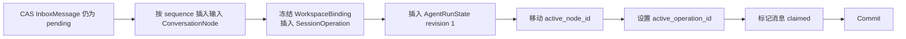

InboxMessage claimed、输入 ConversationNode、SessionOperation、AgentRunState、`active_node_id` 和 `active_operation_id` 必须在同一事务提交，任一步失败全部回滚。

### 4.6 恢复能力

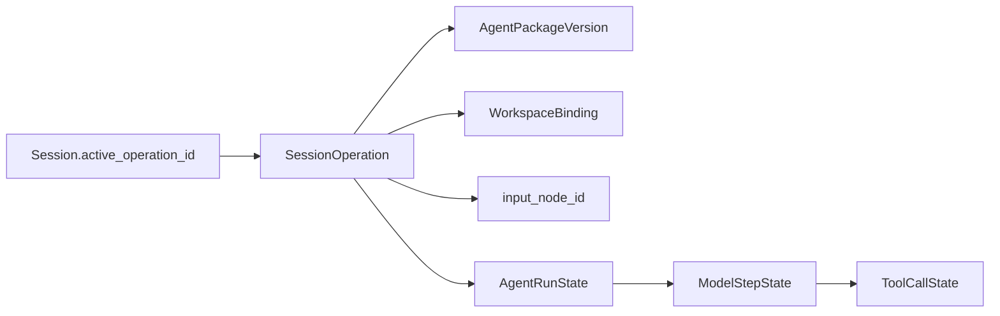

恢复能力来自稳定身份、冻结 Package、WorkspaceBinding、AgentRunState、Model Request Intent 和 ToolCall Intent。常量 `operation_type=agent_run` 不提供恢复能力，因此当前不持久化。

只有出现第二种同时需要 Session 接受、持久化状态、崩溃恢复、resume/cancel 和明确终态的工作时，才为 SessionOperation 增加类型判别。Title 生成不满足这些条件，不属于 SessionOperation。

### 4.7 流式输出边界

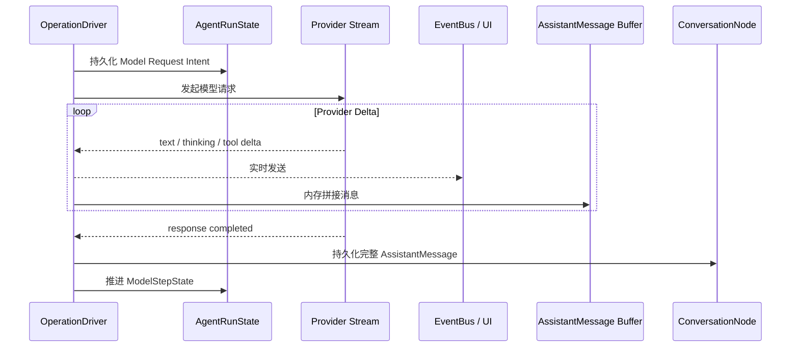

| 数据 | 生命周期 | 是否持久化 |
| --- | --- | --- |
| text/thinking/tool delta | EventBus 到 UI；full Trace 可选异步副本 | 不进入业务数据库 |
| AssistantMessage Buffer | 当前 Provider 请求 | 否 |
| 完整 AssistantMessage | ConversationNode | 是 |
| Model Request Intent | ModelStepState | 是 |
| ToolCall Intent | ToolCallState | 是 |

流式过程中崩溃时，丢弃未完成内存 Buffer，根据已持久化的 Model Request Intent 重新发起完整请求。Tool 只能在模型响应完整且 ToolCall Intent 已提交后执行，半个流式 ToolCall 不得触发工具。

逐 Chunk 业务持久化和客户端断线后的 Token 重放不在当前需求内。`TraceMode.full` 可以把 Delta 异步写入可丢失诊断文件，但它不是恢复或合规审计事实；未来需要 durable stream 时应单独讨论，不写入 Conversation Tree。

### 4.8 内存表示

```python
@dataclass(frozen=True)
class SessionOperation:
    operation_id: OperationId
    session_id: SessionId
    agent_package_version_id: AgentPackageVersionId
    workspace_binding: WorkspaceBinding
    input_node_id: ConversationNodeId
    accepted_at: datetime
```

SessionOperation 不持有 Provider、ToolExecutor、Runtime 或数据库连接。AgentDriver 负责从 Inbox 接受或恢复工作，OperationDriver 负责推进已有 Operation。

## 5. AgentRunState

### 5.1 目标结构

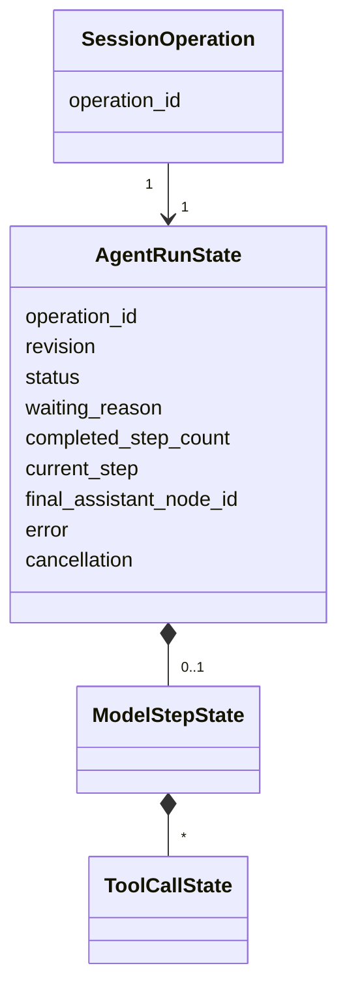

一个 AgentRun 只持久化一行完整当前状态。当前 ModelStepState 和 ToolCallState 嵌套其中；不保存历史 State revision，不为当前 Step 和 ToolCall 单独建状态表。

### 5.2 持久化结构

```text
agent_run_states
- operation_id
- revision
- status
- waiting_reason
- completed_step_count
- current_step_json
- final_assistant_node_id
- error_json
- cancellation_json
- updated_at
```

| 字段 | 数据来源 | 消费者 | 作用 |
| --- | --- | --- | --- |
| `operation_id` | 接受 SessionOperation | Store、StateMachine | 关联不可变 Operation 身份 |
| `revision` | 每次成功状态转换递增 | Store CAS、StateMachine | 防止旧状态覆盖新状态 |
| `status` | StateMachine | Driver、Host、UI | AgentRun 粗粒度生命周期 |
| `waiting_reason` | StateMachine 暂停执行时写入 | Host、恢复逻辑、UI | 区分等待批准和副作用协调 |
| `completed_step_count` | ModelStep 完成时递增 | Driver、最大步数检查 | 生成下一 Step 顺序 |
| `current_step_json` | Driver 通过 StateMachine 创建和推进 | Driver、恢复逻辑 | 保存当前唯一 ModelStep 和 ToolCalls |
| `final_assistant_node_id` | 最终 Assistant Node 提交成功后写入 | API、UI、Operation 查询 | 稳定引用本次 AgentRun 最终回答 |
| `error_json` | RuntimeEffects 将异常转换为稳定错误后写入 | API、UI、恢复检查 | 保存终态失败摘要 |
| `cancellation_json` | Agent 接受取消请求时写入 | Driver、API、UI、恢复检查 | 保存可恢复的取消意图及原因 |
| `updated_at` | Store 成功提交状态转换 | Host、UI、诊断 | 最近状态变化时间 |

数据库中的状态行可 CAS 更新；Python 中 `AgentRunState` 是 frozen dataclass，StateMachine 每次返回新值。

### 5.3 status 与 waiting_reason

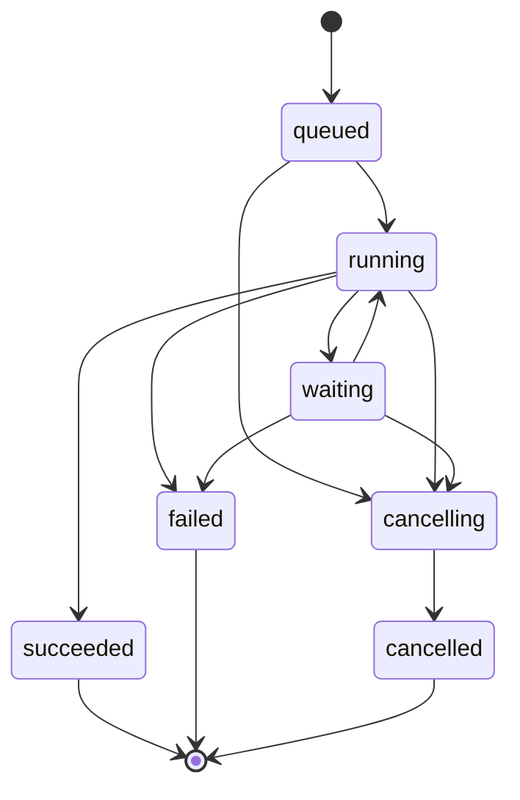

`status` 固定为：

```text
queued
running
waiting
cancelling
succeeded
failed
cancelled
```

模型请求、流式响应、工具执行等细阶段由 ModelStepState 表达，不扩充 AgentRunStatus。

第一版 `waiting_reason` 只包含：

```text
tool_approval
tool_reconciliation
```

约束：

```text
status = waiting  → waiting_reason 必填
status != waiting → waiting_reason 必须为空
```

### 5.4 数据库约束与代码约束

数据库负责当前行的结构合法性：

```sql
status TEXT NOT NULL CHECK (
    status IN (
        'queued',
        'running',
        'waiting',
        'cancelling',
        'succeeded',
        'failed',
        'cancelled'
    )
),
CHECK (
    (status = 'waiting' AND waiting_reason IS NOT NULL)
    OR
    (status <> 'waiting' AND waiting_reason IS NULL)
),
CHECK (
    (status IN ('cancelling', 'cancelled') AND cancellation_json IS NOT NULL)
    OR
    (status NOT IN ('cancelling', 'cancelled') AND cancellation_json IS NULL)
),
CHECK (
    (status = 'failed' AND error_json IS NOT NULL)
    OR
    (status <> 'failed' AND error_json IS NULL)
)
```

StateMachine 负责状态转换路径、revision 连续递增、current Step 和 ToolCall 的跨字段一致性。数据库不使用复杂 Trigger 实现状态机。

| 约束 | 位置 |
| --- | --- |
| 枚举、NOT NULL、FK | 数据库 |
| `status` 与 `waiting_reason` 组合 | 数据库 + dataclass |
| `status` 与 `cancellation` 组合 | 数据库 + dataclass |
| 状态转换路径 | StateMachine |
| Step/ToolCall 跨字段一致性 | StateMachine |
| revision 并发检查 | Store CAS |

### 5.5 revision 与 CAS

CAS 表示 Compare-And-Swap：只有数据库 revision 仍等于调用方读取的值时才允许更新。

```sql
UPDATE agent_run_states
SET revision = revision + 1,
    status = :status,
    waiting_reason = :waiting_reason,
    current_step_json = :current_step,
    final_assistant_node_id = :final_node,
    error_json = :error,
    cancellation_json = :cancellation,
    updated_at = :updated_at
WHERE operation_id = :operation_id
  AND revision = :expected_revision;
```

更新行数为零表示 Provider 回调、取消、恢复或其他写入已经先推进状态，调用方必须重新读取。CAS 只能防止旧状态覆盖新状态，不能撤销外部 Tool 副作用；Tool 仍必须先提交 Intent，再执行副作用。

### 5.6 completed_step_count

删除当前 `completed_step_ids`，改为：

```text
初始 completed_step_count = 0
新 Step.step_sequence = completed_step_count + 1
Step 完成后 completed_step_count += 1
```

它同时用于 `react_max_steps` 检查。历史 Step 身份进入 Observation；当前恢复状态不保存只增不减的 Step ID 列表。

### 5.7 current_step

```text
current_step = NULL
→ 尚未开始 Step，或上一 Step 已归档并准备开始下一步

current_step = ModelStepState
→ 保存当前 Step phase、Model Request Intent、Assistant Node 和 ToolCallStates
```

Driver 恢复后只根据持久化 `current_step` 交给 StateMachine 决定下一 Action。

### 5.8 final_assistant_node_id

AgentRun 成功时引用最终 Assistant ConversationNode。它不能由 `Session.active_node_id` 代替，因为用户后续导航会移动 Session 活动位置，而历史 Operation 的最终结果必须保持稳定。

约束：

```text
status = succeeded  → final_assistant_node_id 必填
status != succeeded → final_assistant_node_id 为空
```

### 5.9 error 与 cancellation

```python
@dataclass(frozen=True)
class AgentRunError:
    code: str
    message: str
    retryable: bool
```

`error` 只表达执行失败；Python Exception、traceback 和 Provider 原始响应进入 Observation。

```text
status = failed → error 必填
其他 status    → error 为空
```

取消不是错误，而是需要持久化并收敛的请求：

```python
@dataclass(frozen=True)
class Cancellation:
    cause: str
    requested_at: datetime
```

```text
status = cancelling/cancelled → cancellation 必填
其他 status                  → cancellation 为空
```

取消必须先在同一事务中提交 `status=cancelling`、`cancellation` 以及可选的 Inbox discard，再中止当前内存任务并唤醒 AgentDriver。OperationDriver 根据当前 ModelStep/ToolCall intent 收敛副作用；只有确认安全后才写入 `cancelled`。进程在任意阶段崩溃，都能从 `cancelling` 恢复判断，而不是把内存中的 Abort 当成事实。

### 5.10 Inbox 取代 pending Context 字段

删除 `initial_model_context_feedback` 和 `pending_context_feedback`。Hook 产生的下一步模型可见内容作为 `delivery=inject` 的 InboxMessage 持久化；OperationDriver 在最近 Step 边界触发 OperationService claim，并写成普通 User ConversationNode。AgentRunState 不再保存第二份待处理 Context。

### 5.11 内存表示

```python
@dataclass(frozen=True)
class AgentRunState:
    operation_id: OperationId
    revision: int
    status: AgentRunStatus
    waiting_reason: WaitingReason | None
    completed_step_count: int
    current_step: ModelStepState | None
    final_assistant_node_id: ConversationNodeId | None
    error: AgentRunError | None
    cancellation: Cancellation | None
```

## 6. ModelStepState

### 6.1 目标结构

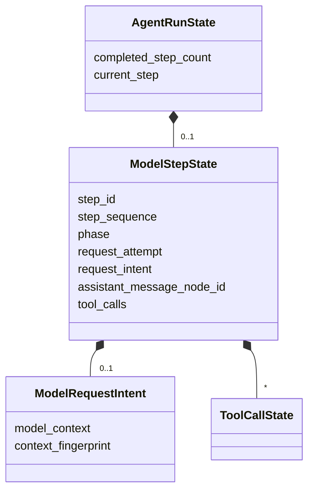

`ModelStepState` 有稳定 `step_id`，但不单独建表，只作为当前 Step 嵌入 `AgentRunState.current_step_json`。

### 6.2 字段

```python
@dataclass(frozen=True)
class ModelStepState:
    step_id: StepId
    step_sequence: int
    phase: ModelStepPhase
    request_attempt: int
    request_intent: ModelRequestIntent | None
    assistant_message_node_id: ConversationNodeId | None
    tool_calls: tuple[ToolCallState, ...]
```

| 字段 | 数据来源 | 作用 |
| --- | --- | --- |
| `step_id` | Driver 创建 Step 时生成 | 稳定身份、事件关联 |
| `step_sequence` | `completed_step_count + 1` | 显示顺序、最大步数判断 |
| `phase` | StateMachine | 恢复后决定下一动作 |
| `request_attempt` | 每次真正调用 Provider 前递增 | 重试计数和诊断 |
| `request_intent` | Context 准备管道 | 恢复同一个模型输入，不重跑 Recall/Hook |
| `assistant_message_node_id` | 完整模型响应提交后产生 | ToolCall 历史与恢复 |
| `tool_calls` | 完整 AssistantMessage 解析 | Tool intent 和结果恢复 |

### 6.3 phase

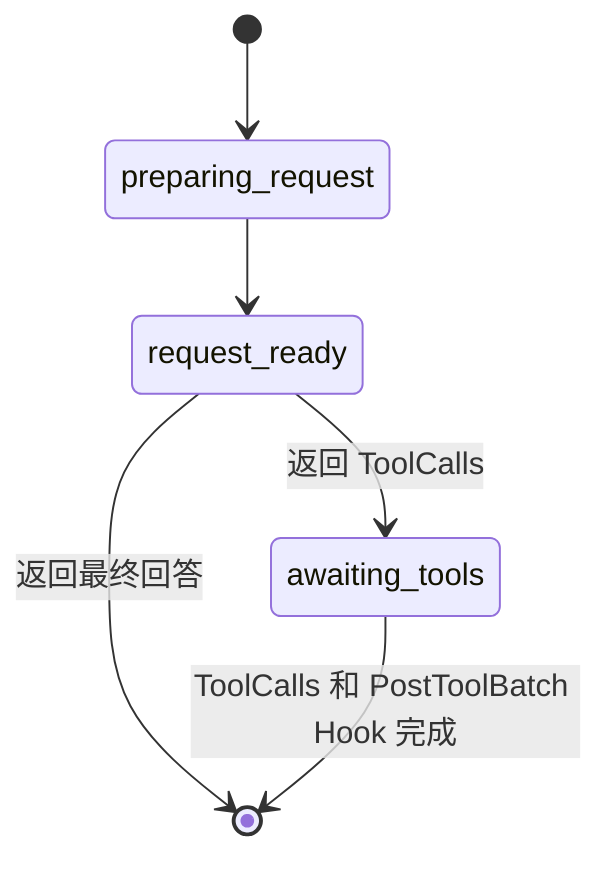

只保存三个持久化阶段：

```text
preparing_request
request_ready
awaiting_tools
```

Tool 的具体进度由 ToolCallState 表达；Step 完成时直接清空 `current_step` 并递增 `completed_step_count`，不增加 `completed` Phase。

阶段约束：

| phase | request_intent | assistant_message_node_id | tool_calls |
| --- | --- | --- | --- |
| `preparing_request` | NULL | NULL | 空 |
| `request_ready` | 必填 | NULL | 空 |
| `awaiting_tools` | NULL | 必填 | 非空 |

这些 JSON 内部约束由 dataclass 和 StateMachine 校验；SQLite 只检查 `current_step_json` 为合法 JSON。

### 6.4 ModelRequestIntent

```python
@dataclass(frozen=True)
class ModelRequestIntent:
    model_context: ModelContext
    context_fingerprint: str
```

它是属于当前 Step 的值对象，没有独立身份。`model_context` 保存 Provider-neutral 的最终模型输入：

```text
system
messages
tool definitions
```

来源与可重构性：

| 内容 | 来源 | 可重新读取 | 是否保证相同 |
| --- | --- | ---: | ---: |
| 静态 System、Skills | AgentPackageVersion | 是 | 是 |
| Tool Definitions | AgentPackageVersion | 是 | 是，前提是冻结 schema |
| Conversation Messages、Compaction | Conversation Tree | 是 | 是 |
| Context Window 裁剪 | Builder、Tokenizer | 可重算 | 不一定 |
| Recall 结果 | Recall Source | 可重调 | 不保证 |
| 动态 ContextContributions | Recall / 请求前 Hook | 可重调 | 不保证 |
| 动态时间与环境内容 | Runtime | 可重取 | 通常不同 |

Request Intent 记录 Runtime 已决定向模型发送的最终输入。只保存来源引用会在恢复时重新做一次请求决策，不能保证与崩溃前一致。

### 6.5 Intent 持久化边界

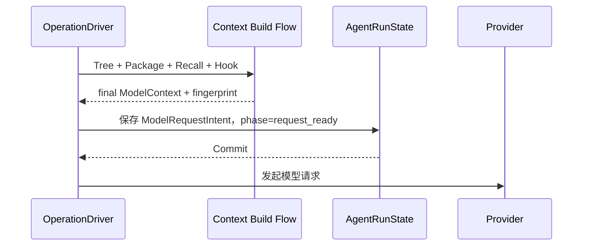

OperationDriver 在 Step 边界触发 OperationService 原子 claim `steer/inject` 消息并写入 ConversationNode，再执行第 18 节规定的唯一构建流程。最终 ModelContext 和 fingerprint 必须在同一次状态转换中写入 Request Intent；保存成功后才能调用 Provider。动态 Context 不再从 AgentRunState 的旁路字段读取。

恢复时直接使用持久化 `model_context`，不重新执行 Conversation 投影、Recall、Context Window 或 BeforeRequest Hook。Provider Mapper 必须是纯转换。

### 6.6 临时存储与清理

完整 ModelContext 只在模型响应未提交期间存在：

```text
preparing_request
→ request_intent 为空

request_ready
→ 临时保存完整 ModelContext

awaiting_tools / AgentRun succeeded
→ 模型响应已提交，清除 request_intent
```

一个 Session 同时最多一个 active Operation，一个 Operation 同时最多一个 current Step，因此不会累计历史 Context Snapshot。

不进入 Intent：

- API Key、Authorization Header；
- Provider SDK、HTTP Client、Streaming Connection；
- Provider 原始 wire payload。

Provider、Model 和请求设置来自 Operation 绑定的 AgentPackageVersion。Provider wire snapshot 可以进入 Trace，但不是恢复状态的权威来源。

### 6.7 request_attempt 与重试

```text
初始 request_attempt = 0
每次真正调用 Provider 前 request_attempt += 1 并 CAS 提交
```

恢复和重试复用同一个 ModelRequestIntent，不重跑 Recall、Hook 和 Context 准备。短退避由 Runtime 内存处理；只有未来需要跨进程定时重试时才增加 `retry_at`。

### 6.8 模型响应事务

返回最终回答时，一个事务完成：

```text
insert Assistant ConversationNode
move Session.active_node_id
AgentRunState.status = succeeded
AgentRunState.final_assistant_node_id = assistant node
AgentRunState.completed_step_count += 1
AgentRunState.current_step = NULL
Session.active_operation_id = NULL
commit
```

返回 ToolCalls 时，一个事务完成：

```text
insert Assistant ConversationNode
move Session.active_node_id
current_step.phase = awaiting_tools
current_step.request_intent = NULL
current_step.assistant_message_node_id = assistant node
current_step.tool_calls = parsed ToolCallStates
commit
```

Stream Delta 和 AssistantMessage Buffer 仍只存在内存；完整响应形成后才写入 ConversationNode。

### 6.9 当前实现收敛

| 当前字段或 Phase | 目标处理 |
| --- | --- |
| `retry_count` | 改为实际调用次数 `request_attempt` |
| `post_tool_batch_hook_completed` | 删除；Hook 结果提交与清空 Step 同一事务完成 |
| `model_request_ready` | `preparing_request` |
| `model_request_intent_recorded` | `request_ready`，且包含完整 Intent |
| `model_request_retry_scheduled` | 删除 |
| `model_request_completed` | 由响应提交事务表达 |
| `tool_calls_ready` / `tool_calls_running` | 合并为 `awaiting_tools` |
| `completed` | 删除，完成时直接清空 current Step |

## 7. ToolCallState

### 7.1 目标结构

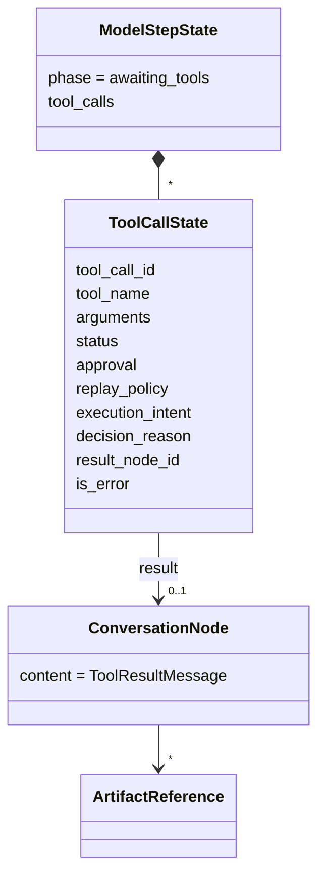

ToolCallState 有稳定 `tool_call_id`，但不单独建表，只作为有序列表嵌入当前 ModelStepState。

### 7.2 状态机

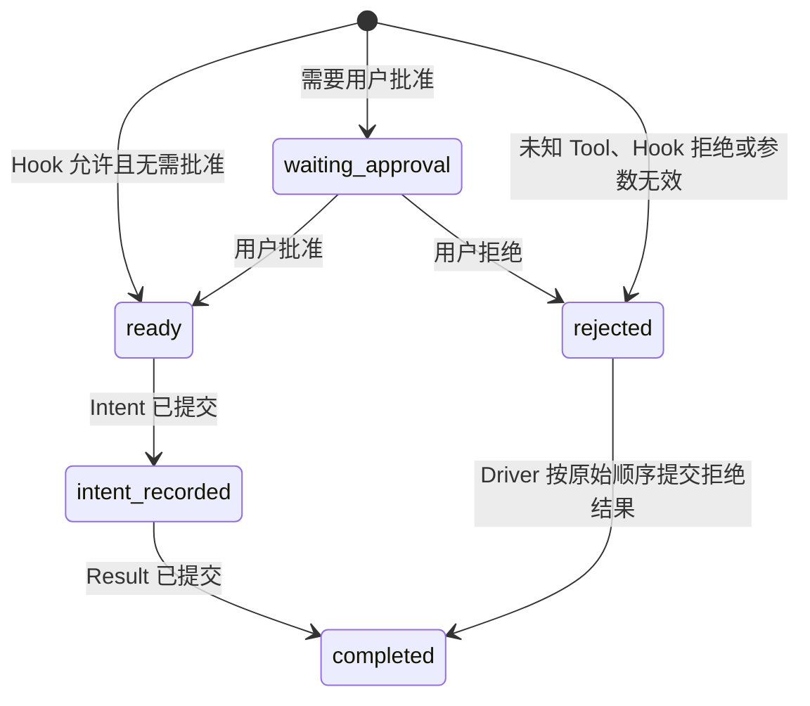

状态固定为：

```text
waiting_approval
ready
rejected
intent_recorded
completed
```

删除当前正交的 `execution_policy = execute / deny / confirm`。批准必须发生在 Tool Intent 之前，避免 `intent_recorded + confirm` 无法判断工具是否真正跨越执行边界。

### 7.3 字段

```python
@dataclass(frozen=True)
class ToolCallState:
    tool_call_id: ToolCallId
    tool_name: str
    arguments: dict[str, JSONValue]
    status: ToolCallStatus
    approval: ToolApproval | None
    replay_policy: ToolReplayPolicy
    execution_intent: ToolExecutionIntent | None
    decision_reason: str | None
    result_node_id: ConversationNodeId | None
    is_error: bool | None
```

| 字段 | 数据来源 | 作用 |
| --- | --- | --- |
| `tool_call_id` | Provider ToolCall Block | 稳定身份、结果配对、默认幂等键 |
| `tool_name` | Provider ToolCall Block | 从冻结 AgentPackageVersion 解析 Tool 实现 |
| `arguments` | Provider 参数经过 PreToolUse 和 schema 校验后的结果 | 冻结实际执行参数 |
| `status` | PreToolUse、批准流程、StateMachine | 决定下一动作和恢复行为 |
| `approval` | Tool Policy、Hook 和 Host 决策 | 保存可恢复的审批请求与决定 |
| `replay_policy` | 冻结 Tool Definition | 崩溃后是否允许自动重放 |
| `execution_intent` | Tool 在跨越执行边界前解析 | 保存精确恢复或协调所需的工具特定数据 |
| `decision_reason` | Hook 或权限判断 | 展示等待或拒绝原因 |
| `result_node_id` | ToolResult ConversationNode 提交后产生 | 关联模型可见结果 |
| `is_error` | ToolExecutionResult | 判断模型可见结果是否错误 |

列表顺序就是 Provider ToolCall 顺序，不增加 `call_sequence`。`tool_call_id`、`tool_name`、`arguments`、`replay_policy` 创建后不可修改；`execution_intent` 只允许在 `ready → intent_recorded` 时从空值写入一次。

### 7.4 参数冻结

```text
Provider arguments
→ PreToolUse updated_arguments
→ schema validation
→ ToolCallState.arguments
```

PreToolUse 在 AssistantMessage 与 ToolCallState 首次提交前运行；其最终参数和决定随
ToolCallState 一起冻结。恢复时不重新运行 PreToolUse，也不从 AssistantMessage
重新推算参数。模型返回未知 Tool、参数无效或 Hook 拒绝时创建 `rejected`，Driver
随后按 Provider 原始顺序写入模型可见错误 ToolResult 并转换为 `completed`。

### 7.5 用户批准

需要批准时：

```text
ToolCallState.status = waiting_approval
AgentRunState.status = waiting
AgentRunState.waiting_reason = tool_approval
```

用户批准后更新为：

```text
ToolCallState.status = ready
ToolCallState.approval.decision = approved
```

用户拒绝后更新为 `rejected`，不在审批请求的提交顺序中直接写 ToolResult：

```text
ToolCallState.status = rejected
ToolCallState.approval.decision = denied
```

同一 Step 可能有多个 Tool Call，审批决定可能乱序到达。当且仅当不存在 `waiting_approval` 时，原子设置 `AgentRunState.status = running`、清空 `waiting_reason` 并调用 `AgentRegistry.wake(session_id)`。Driver 恢复后按 Provider Tool Call 原始顺序，将 `rejected` 转换成模型可见错误 ToolResult，避免 Conversation Tree 的结果顺序变成用户点击顺序。拒绝路径不经过 `intent_recorded`，明确表示工具没有执行。

### 7.6 Tool Intent

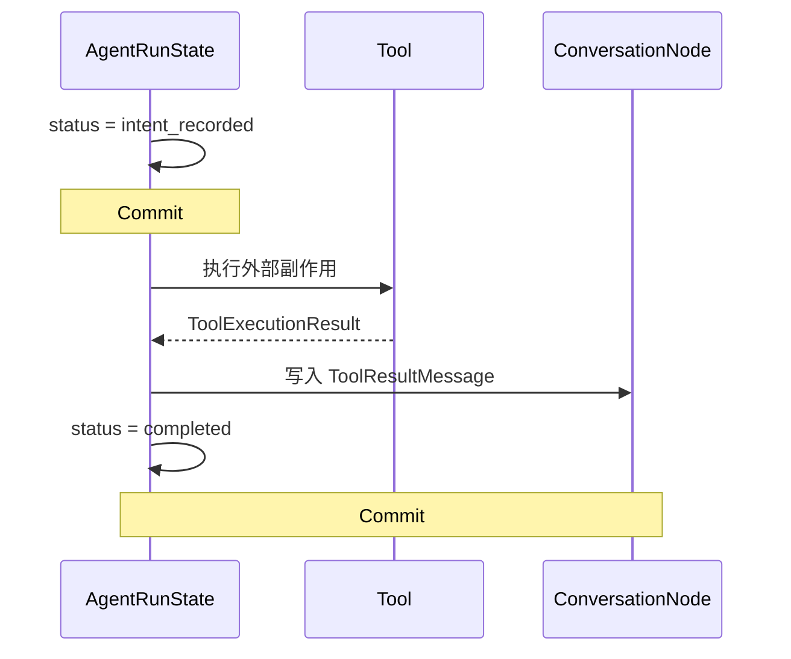

`intent_recorded` 表示工具可能尚未开始、正在执行，或已经完成但结果尚未提交。Runtime 只能从当前进程内刚刚成功提交的 Intent 执行真实 Tool；进程重启后不能假设 Tool 尚未执行。

`ToolExecutionIntent` 是冻结 Tool 实现拥有的窄判别联合，不是任意资源袋。普通 Tool 可为空；`delegate_agent` 必须保存 `child_package_version_id`，使 intent 提交后即使 Agent 配置 reload，恢复仍创建原定 child。Intent 不保存 Provider、Store 或可执行对象。

### 7.7 replay_policy

```text
safe
never
```

| 策略 | 含义 |
| --- | --- |
| `safe` | 只读，或使用稳定 `tool_call_id` 可以保证幂等 |
| `never` | 自动重放可能重复外部副作用 |

默认 `never`；只有冻结 Tool Definition 明确声明时才允许 `safe`。`tool_call_id` 同时传入 ToolExecutionContext 作为默认幂等键，不增加独立 `idempotency_key` 字段。

重启发现 `intent_recorded` 时：

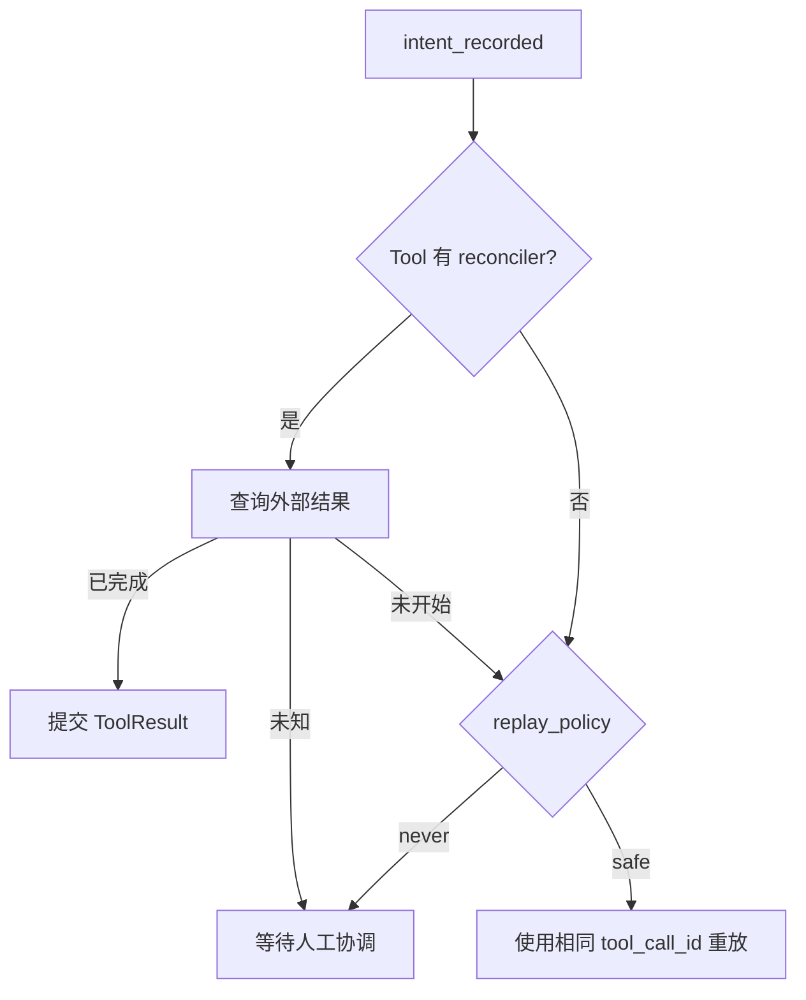

等待人工协调时：

```text
AgentRunState.status = waiting
AgentRunState.waiting_reason = tool_reconciliation
```

`outcome_unknown` 不增加为 ToolCallStatus；它由“重启后的 intent_recorded 且没有可确认结果”表达。Reconciler 是 Tool 实现能力，通过冻结 AgentPackageVersion 解析，不持久化在 ToolCallState。

### 7.8 Tool Result

完成状态约束：

```text
status = completed
→ result_node_id 必填
→ is_error 必填

status != completed
→ result_node_id 为空
→ is_error 为空
```

结果内容只保存在 ConversationNode：

```text
ToolCallState.result_node_id
└── ConversationNode
    └── ToolResultMessage
        ├── content
        ├── structured_content
        └── ArtifactReference[]
```

ToolCallState 不重复保存 ToolExecutionResult 内容。

### 7.9 Tool Result 与 Hook 提交顺序

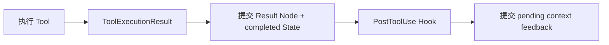

Tool Result 必须在 PostToolUse Hook 之前可靠提交，缩短“Tool 已完成但 Result 未持久化”的未知副作用窗口。PostToolUse 只观察已提交结果并产生后续反馈；需要修改 Tool Result 的能力不在当前 Hook 合同中。

### 7.10 Artifact

Tool 通过 ArtifactService 先写入不可变 Blob 和 Artifact 元数据，再由 ToolResultMessage 保存 ArtifactReference。Result 提交失败可能留下孤立 Blob，由 Artifact GC 清理；ConversationNode 不得引用尚不存在的 Artifact。

### 7.11 约束位置

ToolCallState 位于 `current_step_json`，SQLite 只检查 JSON 合法；dataclass 和 StateMachine 校验：

```text
waiting_approval → ready / rejected
rejected → completed
ready → intent_recorded
intent_recorded → completed
completed → 无后续状态
```

AgentRun `cancel` 遇到 `intent_recorded` ToolCall 时，必须先进入 `tool_reconciliation` 或确认结果，不能直接清空 active Operation 并假设外部副作用不存在。

## 8. AgentDefinition / AgentPackageVersion / LoadedAgentPackage

### 8.1 三层边界

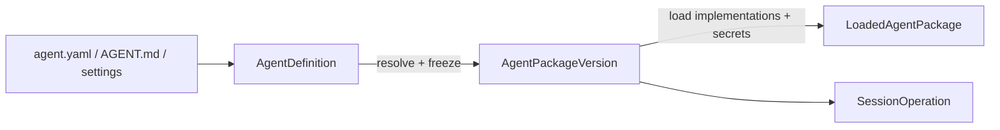

| 对象 | 类型 | 生命周期 | 持久化 |
| --- | --- | --- | ---: |
| `AgentDefinition` | 当前配置的只读解析结果 | 配置加载至下次 reload | 否 |
| `AgentPackageVersion` | 内容寻址、不可变 Entity | 被 Operation 引用期间永久存在 | 是 |
| `LoadedAgentPackage` | 可执行资源对象 | RuntimeGeneration 内 | 否 |

### 8.2 AgentDefinition

```python
@dataclass(frozen=True)
class AgentDefinition:
    agent_id: AgentId
    default_workspace_path: Path
    workspace_policy: WorkspacePolicy
    behavior_path: Path
    skills_path: Path | None
    allowed_tools: tuple[str, ...]
    extension_ids: tuple[str, ...]
    model_policy: ModelPolicy
    runtime_policy: AgentRuntimePolicy
```

AgentDefinition 由配置合并、路径规范化和默认值解析产生。配置文件变化后整体重建，不写入 Session 数据库。

当前字段收敛：

| 当前字段 | 目标 |
| --- | --- |
| `provider` / `model` | `model_policy.primary` |
| `workspace_path` | `default_workspace_path`，只为新 root Session 选择 Workspace |
| `file_access_mode` | `WorkspacePolicy.file_scope` |
| `tool_ids` | `allowed_tools` |
| `behavior_path` / `skills_path` | 只保留在 Definition，Package 保存实际内容 |

### 8.3 ModelPolicy

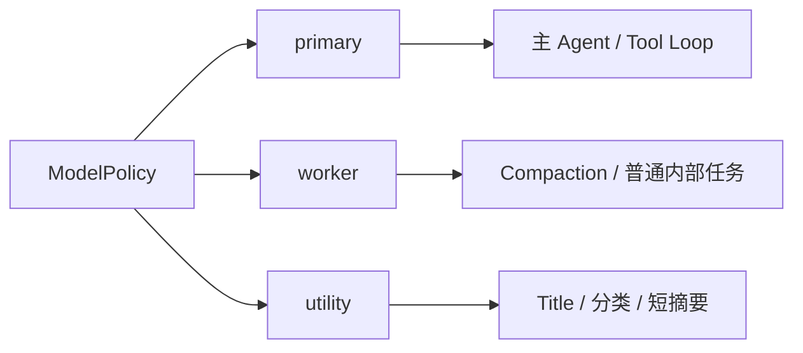

```python
@dataclass(frozen=True)
class ModelPolicy:
    primary: ModelSelection
    worker: ModelSelection | None
    utility: ModelSelection | None
```

| 角色 | 用途 | 缺失行为 |
| --- | --- | --- |
| `primary` | 主 AgentRun | 不允许缺失 |
| `worker` | Compaction、普通内部任务 | 使用前明确报未配置，或配置显式继承 primary |
| `utility` | Title、分类、短摘要 | 使用本地确定性回退，不得偷偷使用 primary |

配置允许显式继承或禁用；不同角色可以由用户明确映射到同一个实际模型。

### 8.4 AgentPackageVersion

```mermaid
classDiagram
    class AgentPackageVersion {
        package_version_id
        agent_id
        format_version
        behavior_instruction
        model_policy
        runtime_policy
        workspace_policy
        skills
        tools
        extensions
        created_at
    }

    class ModelVersion
    class SkillVersion
    class ToolVersion
    class ExtensionVersion

    AgentPackageVersion *-- ModelVersion
    AgentPackageVersion *-- SkillVersion
    AgentPackageVersion *-- ToolVersion
    AgentPackageVersion *-- ExtensionVersion
```

物理表保持一行 JSON：

```text
agent_package_versions
- package_version_id
- agent_id
- format_version
- content_json
- created_at
```

Package 子对象没有独立生命周期、修改和查询需求，不单独建表。Package 不再嵌入 AgentDefinition，直接保存解析后的执行内容，避免 provider、model 和 workspace 重复。

Package 内容：

```text
AgentPackageVersion
├── agent_id
├── behavior_instruction
├── model_policy
├── runtime_policy
├── workspace_policy
├── skills[]
├── tools[]
└── extensions[]
```

### 8.5 Package ID 与 digest

Digest 是规范化内容经过 SHA-256 得到的不可逆指纹，用于内容寻址、相等判断和完整性检查；它不是加密，也不是语义版本号。

```text
package_version_id
= "agentpkg_" + sha256(canonical content_json)
```

删除独立 `digest` 字段，避免 ID 与 digest 两个权威。`created_at` 不参与摘要，相同内容得到相同 Package ID。

Digest 使用范围：

| 数据 | 是否需要独立 digest | 原因 |
| --- | ---: | --- |
| AgentPackageVersion | 是，直接作为 `package_version_id` | 内容寻址身份 |
| Artifact | 是，直接作为内容身份 | Blob 去重和完整性 |
| SkillVersion | 否 | 全文已包含在 Package 内容中 |
| Extension config | 否 | 完整非敏感配置已包含在 Package 内容中 |
| Tool schema | 否 | schema 已包含在 Package 内容中 |
| ConversationNode | 否 | SQLite schema 和事务管理 |
| AgentRunState | 否 | revision/CAS 管理 |

禁止对 Secret 计算 digest 写入 Package；低熵 Secret 的 hash 不能提供安全保护。

### 8.6 format_version

AgentPackageVersion 保留 `format_version`。Package ID 由内容决定，旧 Package 不能原地迁移内容而保持原 ID，因此 Loader 必须能够按格式版本解析仍被 Operation 引用的 Package。

```text
ConversationNode 格式升级 → SQLite schema migration
AgentPackageVersion 格式升级 → 新 format_version，旧 Package 保持不可变
```

`format_version` 参与 Package 内容摘要。

### 8.7 ModelVersion 与 SecretRef

```python
@dataclass(frozen=True)
class ModelVersion:
    provider: str
    model: str
    api_base: str | None
    temperature: float | None
    max_input_tokens: int | None
    max_output_tokens: int
    provider_options: dict[str, JSONValue]
    provider_implementation: ImplementationRef
    required_secret_refs: tuple[SecretRef, ...]
```

Package 保存非敏感生成参数、Provider 实现引用和 Secret 的逻辑引用：

```text
providers.anthropic.api_key
extensions.github.token
```

API Key、Access Token、Authorization Header 和 Provider Client 不进入 Package。SecretRef 在 load 时通过 SecretStore、auth.json 或环境变量解析；Secret 轮换不改变 Package ID。接受前应校验当前 Secret；恢复时 Secret 缺失则 Operation 进入 `failed`，写入 `code=secret_unavailable, retryable=true` 的稳定 AgentRunError，不增加无法被状态机承载的隐式 blocked 状态。

### 8.8 WorkspacePolicy

```python
@dataclass(frozen=True)
class WorkspacePolicy:
    file_scope: Literal["workspace", "full"]
```

| 数据 | 用途 |
| --- | --- |
| `AgentDefinition.default_workspace_path` | 创建 root Session 时选择默认 Workspace；不进入 Package |
| `ConversationSession.workspace_id` | Session 的长期 Workspace 归属 |
| `ConversationSession.cwd` | Session 启动和列表归属上下文，不授予文件权限 |
| `AgentPackageVersion.workspace_policy` | 可重复执行的文件范围声明，不保存绝对目录身份 |
| `SessionOperation.workspace_binding` | 本次执行冻结的实际路径和最终文件边界 |

同一个 Package Version 可以在不同 Workspace 中执行。恢复时使用 Operation 已冻结的 WorkspaceBinding，不重新读取当前 Definition 的默认路径，也不静默替换成进程 cwd。

### 8.9 ToolVersion

```python
@dataclass(frozen=True)
class ToolVersion:
    name: str
    source: ToolSource
    implementation_ref: ImplementationRef
    version: str | None
    description: str
    input_schema: dict[str, JSONValue]
    output_schema: dict[str, JSONValue] | None
    replay_policy: Literal["safe", "never"]
```

与当前结构相比增加 `implementation_ref` 和 `replay_policy`，删除含义不稳定的独立 `origin`。恢复时实现引用、schema 和 replay policy 必须与 Package 完全一致，不能用当前同名 Tool 静默替换。

### 8.10 SkillVersion

```python
@dataclass(frozen=True)
class SkillVersion:
    name: str
    version: str
    description: str
    content: str
    required_secret_refs: tuple[SecretRef, ...]
    allowed_tools: tuple[str, ...]
```

Package 保存 Skill 全文，因此恢复不依赖原 SKILL.md 是否仍存在。`source_path` 只用于构建诊断，不进入恢复快照；`content_digest` 删除，因为顶层 Package ID 已覆盖 Skill 内容变化。

### 8.11 ExtensionVersion

```python
@dataclass(frozen=True)
class ExtensionVersion:
    extension_id: str
    implementation_ref: ImplementationRef
    version: str | None
    config: dict[str, JSONValue]
    required_secret_refs: tuple[SecretRef, ...]
```

Package 保存完整非敏感 Extension 配置，而不是只保存不能恢复原内容的 `config_digest`。Secret 仍只保存引用。

若 Extension 或 Tool 没有可靠语义版本，ImplementationRef 可以包含代码 digest，用于验证当前实现是否与 Package 匹配；该 digest 只能验证现有代码，不能恢复已删除的旧代码。精确实现不可用时 Operation 进入 `failed`，写入 `code=package_implementation_unavailable, retryable=true`；第一版不建设历史代码归档仓库。

### 8.12 AgentRuntimePolicy

```python
@dataclass(frozen=True)
class AgentRuntimePolicy:
    max_model_steps: int
    context_turn_window: int
    max_delegation_depth: int
```

`max_delegation_depth` 限制 AgentDelegation 链深度，建议默认 3；深度从不可变 Delegation 图推导，不重复保存到 Session。只保存影响执行、Context 和委派安全边界的设置。UI 样式、日志级别和 CLI 展示设置不进入 Package。

### 8.13 LoadedAgentPackage

```mermaid
classDiagram
    class LoadedAgentPackage {
        version
        model_clients
        tool_snapshot
        lifecycle_hooks
        recall_sources
        generation_id
    }

    LoadedAgentPackage --> AgentPackageVersion
    LoadedAgentPackage *-- Provider
    LoadedAgentPackage *-- ToolSnapshot
    LoadedAgentPackage *-- LifecycleHooks
    LoadedAgentPackage *-- Recall
```

```python
@dataclass
class LoadedAgentPackage:
    version: AgentPackageVersion
    model_clients: Mapping[ModelRole, Provider]
    tool_snapshot: ToolSnapshot
    lifecycle_hooks: LifecycleHooks
    recall_sources: tuple[Recall, ...]
    generation_id: RuntimeGenerationId
```

LoadedAgentPackage 持有当前进程可执行实现和已解析 Secret，不参与 Package digest，不写入数据库。它是 Generation 内的共享缓存值，不向 Operation 暴露独立 close；调用方通过 LoadedPackageHandle 释放引用，由 RuntimeGeneration 决定何时关闭底层资源。

### 8.14 RuntimeBindings 收敛

当前 LoadedAgentPackage 与 RuntimeBindings 重复持有 AgentPackageVersion、Model/Provider 和 ToolSnapshot。目标保留 LoadedAgentPackage，删除 RuntimeBindings。

Host 级服务显式传给 RuntimeEffects：

```text
ArtifactService
Workspace Tool Service（每次调用接收 WorkspaceBinding）
HostCallClient
OperationStore
ConversationStore
```

这些服务不属于 Agent Package，不能放入 LoadedAgentPackage 资源袋。

`ArtifactService` 由 RuntimeHost 按 `CompositionStore` 对象身份创建并复用；同一
Store 的 Provider、RuntimeEffects 和 ToolServices 借用同一实例。Boot 只显式
转发该依赖，不能自行创建 BlobStore，也不能从 Provider 反向发现服务。不同
InMemory Store 各自拥有独立 InMemoryBlobStore；ephemeral reload 复用原 Store，
因此 Artifact 元数据与 Blob 字节保持同一生命周期。

### 8.15 RuntimeGeneration 生命周期

RuntimeGeneration 缓存相同 Package ID 的 LoadedAgentPackage。Operation 通过 LoadedPackageHandle 持有 Package 和 Generation 引用；reload 构建新 Generation，旧 Generation 在仍有非终态 AgentRun 使用时保持存活，引用归零后统一关闭 Provider、Tool、Hook、Recall 和 Extension 资源。完整所有权与 reload 合同见第 16 节。

恢复旧 Operation 时必须按 AgentPackageVersion 精确解析实现；实现版本不可用则明确失败，不使用新 Generation 中的同名贡献替代。

## 9. Artifact / ArtifactReference / BlobStore

### 9.1 抽象边界

```mermaid
flowchart LR
    N[ConversationNode<br/>content_json] --> R[ArtifactReference<br/>值对象]
    R -->|artifact_id| A[(Artifact<br/>持久化元数据)]
    A -->|artifact_id| B[BlobStore<br/>二进制存储]
```

| 对象 | 抽象层级 | 职责 |
| --- | --- | --- |
| `Artifact` | 持久化、不可变 Entity | 表示一份具有稳定内容身份的二进制数据 |
| `ArtifactReference` | 随 ConversationNode 落库的值对象 | 描述本次引用的媒体类型和展示名称 |
| `BlobStore` | 运行时 Port | 保存、读取和删除实际字节 |
| `ArtifactService` | 应用服务 | 计算身份，协调 BlobStore 与元数据存储，校验完整性 |

当前不增加独立 `Blob` 实体或表。Artifact 已经足以承载二进制内容身份；BlobStore 只负责物理存储。

### 9.2 Artifact 身份与字段

```text
Artifact
├── artifact_id = "artifact_" + sha256(bytes)
├── size_bytes
└── created_at
```

```text
artifacts
- artifact_id   PK
- size_bytes    NOT NULL
- created_at    NOT NULL
```

| 当前字段 | 决策 | 原因 |
| --- | --- | --- |
| `artifact_id` | 保留，直接包含 SHA-256 | 相同字节共享同一身份，支持去重和完整性校验 |
| `digest` | 删除 | 与 `artifact_id` 重复，避免两个身份权威 |
| `size_bytes` | 保留 | 无需读取 Blob 即可做限额和完整性判断 |
| `media_type` | 移入 ArtifactReference | 媒体类型是本次引用对字节的解释 |
| `blob_key` | 删除 | BlobStore 直接以 `artifact_id` 寻址，避免泄漏存储实现 |
| `created_at` | 保留 | 支持审计和孤儿内容回收宽限期 |

同一份字节可以在不同引用中使用不同 `media_type`，不会再因 Artifact 上存在单一媒体类型而冲突。图片、音频、PDF、文本文件和 Tool 生成的大型内容统一使用 Artifact；适合直接放入消息 JSON 的小型结构化数据不强制转为 Artifact。

### 9.3 BlobStore 合同

```python
class BlobStore(Protocol):
    def put_if_absent(self, artifact_id: ArtifactId, content: bytes) -> None: ...
    def get(self, artifact_id: ArtifactId) -> bytes: ...
    def exists(self, artifact_id: ArtifactId) -> bool: ...
    def delete(self, artifact_id: ArtifactId) -> None: ...
```

`put_if_absent` 必须原子且幂等。当前 Runtime 配置只选择一个 BlobStore；只有实际需要同时使用多个存储后端时，才讨论窄用途的存储定位字段。

ArtifactService 将“保存字节”和“创建消息引用”分开：

```text
put(bytes) -> Artifact
ArtifactReference(artifact_id, media_type, display_name)
load_bytes(artifact_id) -> bytes
```

Provider 通过 ArtifactService 读取字节，再映射为 Provider wire 格式；Provider 不直接访问 BlobStore，也不拥有 Artifact 的持久化和完整性规则。

### 9.4 创建与并发

BlobStore 与 SQLite 不能参加同一个事务，采用字节优先的幂等流程：

```mermaid
sequenceDiagram
    participant S as ArtifactService
    participant B as BlobStore
    participant D as Database

    S->>S: sha256(bytes) → artifact_id
    S->>B: put_if_absent(artifact_id, bytes)
    S->>D: INSERT Artifact ON CONFLICT DO NOTHING
    S->>D: 读取 Artifact 并校验 size_bytes
```

并发创建相同内容时，数据库冲突后读取已有行并校验大小；`created_at` 不参与内容身份或冲突比较。修正当前因相同内容的并发请求产生不同 `created_at` 而被判断为元数据冲突的问题。

创建 Artifact 只保证内容存在。ConversationNode 在自己的数据库事务中保存 ArtifactReference，提交前必须确认 Artifact 元数据存在。

### 9.5 崩溃窗口

| 崩溃位置 | 持久化结果 | 恢复方式 |
| --- | --- | --- |
| Blob 写入前 | 无内容 | 重试 |
| Blob 写入后、Artifact 元数据写入前 | 孤儿 Blob | GC 清理 |
| Artifact 元数据写入后、Node 引用前 | 未引用 Artifact | GC 清理 |
| Node 引用提交后 | 完整引用 | 正常读取 |

关键不变量：已提交 ConversationNode 不得引用不存在的 Artifact。系统接受可回收的孤儿内容，不接受可见引用缺少底层字节。

### 9.6 读取与完整性

```text
ArtifactReference.artifact_id
→ 查询 Artifact.size_bytes
→ BlobStore.get(artifact_id)
→ 校验实际长度
→ 校验 sha256(bytes) 等于 artifact_id 中的摘要
```

ArtifactService 的读取接口接受 `artifact_id`，不再依赖包含重复 `digest`、`size_bytes` 的 ArtifactReference。

### 9.7 跨 Session 引用与 GC

Artifact 是全局内容身份，可以被多个 Session 和 ConversationNode 引用。删除 Session 不同步删除 Blob，由 GC 判断是否仍有引用。

当前 GC 引用集合来自：

```text
ConversationNode.content_json 中的 ArtifactReference
+ 非终态 AgentRunState 中 ModelRequestIntent 的 ArtifactReference
= 仍存活 Artifact
```

GC 仅回收未被引用且超过宽限期的 Artifact，避免与正在创建 Artifact 或尚未提交 Tool Result 的 Operation 竞争。第一版直接扫描 JSON，不建立第二份引用权威。

## 10. Agent

### 10.1 统一运行时对象

吸收 DSH 的统一 Agent 抽象：Root、Child 和恢复后的 Agent 使用同一个运行时类型；是否为 child 是 AgentDelegation 关系事实，不产生 `RootAgent`、`ChildAgent` 或 `SubagentAgent` 子类。

```mermaid
classDiagram
    class Agent {
        session_id
        status
        inbox
        send()
        followup()
        steer()
        inject()
        cancel()
        when_idle()
    }

    class ConversationSession
    class AgentInbox
    class AgentDriver

    Agent --> ConversationSession
    Agent *-- AgentInbox
    Agent --> AgentDriver
```

| 对象 | 是否持久化 | 身份 | 职责 |
| --- | ---: | --- | --- |
| `AgentDefinition` | 源文件 | `agent_id` | 可编辑 Agent 蓝图 |
| `AgentPackageVersion` | 是 | `package_version_id` | 冻结一次执行配置 |
| `ConversationSession` | 是 | `session_id` | 长期对话身份、历史和 Inbox 归属 |
| `Agent` | 否 | `session_id` | 活动 Session 的统一消息和生命周期接口 |
| `AgentRunState` | 是 | `operation_id` | 一次执行的恢复状态 |

同一进程内一个 `session_id` 最多有一个 live Agent。释放或崩溃后可以从同一 Session 构造新的内存对象，不生成 `live_agent_id` 或 `activation_id`。

### 10.2 Agent API

```python
class Agent:
    session_id: SessionId
    status: AgentStatus
    inbox: AgentInbox

    async def send(
        self,
        message: UserMessage,
        delivery: MessageDelivery,
    ) -> MessageId: ...

    async def followup(self, message: UserMessage) -> MessageId: ...
    async def steer(self, message: UserMessage) -> MessageId: ...
    async def inject(self, message: UserMessage) -> MessageId: ...
    async def cancel(self, cause: CancelCause, *, keep_inbox: bool = False) -> None: ...
    async def when_idle(self) -> None: ...
```

`send()` 是唯一底层消息入口；其余方法固定 delivery 语义。Agent 不持有 Provider、ToolSnapshot、Hook Registry、Context Builder、ArtifactService、OperationStore、Trace Sink 或 UI EventBus，避免重新形成 God Class。

### 10.3 状态与 Package

第一版不增加 `AgentStatus`。live Agent 是否正在驱动只由进程内 drive lock 和 Registry task 表达，不对外形成第二套状态机。Operation 的完整生命周期状态属于 AgentRunState；当前 Operation 持久化等待批准时，可以没有任何 live 驱动 task。

Agent 不永久绑定 LoadedAgentPackage。新 Operation 在 claim 时解析并冻结当前 Package Version；恢复已有 Operation 时按其 `agent_package_version_id` 加载旧版本。RuntimeGeneration 继续管理 LoadedAgentPackage 生命周期。

### 10.4 当前组件收敛

```mermaid
flowchart LR
    H[ConversationRuntime<br/>Host/UI Adapter] --> A[Agent]
    A --> D[AgentDriver<br/>消费 Inbox]
    D --> O[OperationDriver<br/>推进 Operation]
```

`ConversationRuntime` 不再持有 `_active_task` 或执行互斥锁，只保留 Host/UI 控制与观察。每个 live `Agent` 用一个进程内锁串行化 `followup_and_wait()`、`when_idle()` 和 `resume_operation()`；其中 `followup_and_wait()` 必须在写入 Inbox 前判断忙碌，使“接受前台消息并开始驱动”成为不可交错的入口。`AgentDriver` 不保存调用方 task 或锁，只负责判断 runnable、接受或恢复 Operation；已有 Operation 的可靠推进仍由 `OperationDriver` 负责。

这项决策有意修正当前命名合同中“运行时 Agent 已删除”的结论；全部实体对齐后统一更新命名合同，不保留两套并行术语。

## 11. AgentInbox / InboxMessage

### 11.1 抽象边界

```mermaid
flowchart LR
    X[User / Agent / Hook / Host] -->|send| M[(InboxMessage)]
    M --> I[AgentInbox<br/>内存投影]
    I -->|wake| D[AgentDriver]
    D -->|触发事务| S[OperationService]
    S -->|claim| M
    S --> O[SessionOperation]
    S --> N[ConversationNode]
```

| 对象 | 是否持久化 | 职责 |
| --- | ---: | --- |
| `InboxMessage` | 是 | 记录输入接受、排序、投递语义与消费结果 |
| `AgentInbox` | 否 | 当前 Session Inbox 的有序投影和窄操作接口 |
| `InboxStore` | 否 | InboxMessage 的事务读写 |
| `OperationService` | 否 | 跨 Inbox、Conversation Tree、Operation 和 AgentRunState 原子 claim |
| `AgentDriver` | 否 | 决定 Agent 是否需要运行，触发接受或恢复 Operation |

数据库是唯一队列权威；AgentInbox 不维护无法从数据库重建的第二份队列。

### 11.2 InboxMessage 字段

```text
agent_inbox_messages
- message_id              PK
- session_id              FK
- sequence                NOT NULL
- delivery                NOT NULL
- message_json            NOT NULL
- status                  NOT NULL
- claimed_operation_id    NULL FK
- claimed_step_id         NULL
- outcome_reason          NULL
- created_at              NOT NULL
- handled_at              NULL

UNIQUE(session_id, sequence)
```

`message_json` 保存带类型来源的 Provider-neutral UserMessage。来源第一版包含 `user`、`agent(sender_session_id, sender_operation_id, form)`、`hook(hook_id)`、`host(call_id)` 和 `runtime(reason)`。Agent-to-Agent 消息必须记录产生它的 sender Operation，使级联取消能够只 discard 被取消祖先产生的 pending 消息；来源用于因果归因、Context 投影、UI 和 Trace，本身不授予权限。

InboxMessage 被 claim 后创建 `ConversationNode.node_id = InboxMessage.message_id`，复用同一消息身份，不增加 `claimed_node_id`。被 discard 的消息不会进入 Conversation Tree。

### 11.3 Delivery

```text
MessageDelivery
├── followup  → next-turn，wakeup=true
├── steer     → next-step，wakeup=true
└── inject    → next-step，wakeup=false
```

| Delivery | 空闲 Agent | 运行中 Agent |
| --- | --- | --- |
| `followup` | 唤醒并创建新 Operation | 等待下一个 Operation |
| `steer` | 唤醒并创建新 Operation | 最近 Step 边界消费 |
| `inject` | 保持 pending，不唤醒 | 最近 Step 边界消费 |

持久化 delivery 而不是只保存 `next-turn/next-step`，使崩溃恢复能够区分 pending steer 必须唤醒、pending inject 保持静默。

### 11.4 状态机与约束

```mermaid
stateDiagram-v2
    [*] --> pending
    pending --> claimed
    pending --> discarded
    claimed --> [*]
    discarded --> [*]
```

```text
pending   → claim 字段、handled_at、outcome_reason 均为空
claimed   → claimed_operation_id、handled_at 必填，outcome_reason 为空
discarded → claim 字段为空，handled_at、outcome_reason 必填
```

状态枚举和字段组合由数据库 CHECK 与 dataclass 校验；转换路径由 InboxStore/OperationService 控制。状态本身是自然 CAS，更新必须带 `WHERE status='pending'`，不增加 revision。

### 11.5 排序与两条逻辑队列

每个 Session 在写事务中分配单调 `sequence`，`UNIQUE(session_id, sequence)` 保证严格 FIFO；不使用可能相同的 `created_at` 或随机 message_id 排序，也不给 ConversationSession 增加 next-sequence 字段。

一个表投影出两条队列：

```text
next_turn = pending followup，按 sequence
next_step = pending steer/inject，按 sequence
```

Agent 运行时只 claim 全部 next-step 消息；followup 保持 pending。Agent 空闲并被 waking 消息唤醒时，claim 全部 next-step 消息以及最早一条 followup；next-step 在输入 Node 链中排在 followup 之前。只有 inject 时 Agent 保持 idle。

### 11.6 claim 原子边界

claim 同时修改多个领域事实，不属于 AgentInbox。它由 OperationService 提供两个显式事务方法：

```python
class OperationService:
    async def accept_next_inbox_operation(
        self,
        session_id: SessionId,
    ) -> AcceptedOperation | None: ...

    async def claim_step_messages(
        self,
        operation_id: OperationId,
        expected_revision: int,
    ) -> ClaimedMessages: ...
```

启动新 Operation 时，同一事务提交：

```text
CAS 选中 InboxMessage 仍为 pending
+ 按 sequence 追加 User ConversationNode
+ 创建 SessionOperation
+ 创建 AgentRunState
+ 更新 Session.active_node_id
+ 设置 Session.active_operation_id
+ 标记 InboxMessage claimed
```

一个 Operation 可以 claim 多条消息；SessionOperation.input_node_id 指向事务完成后的最终输入 leaf。向活动 Operation 的 Step 注入消息时，claim 事务同时 CAS AgentRunState.revision、追加输入 Node、记录 `claimed_operation_id/claimed_step_id` 并移动 active leaf。

### 11.7 cancel、恢复与最小接口

```python
class AgentInbox:
    async def send(...) -> MessageId: ...
    async def list_pending(...) -> tuple[InboxMessage, ...]: ...
    async def discard(message_id, reason) -> bool: ...
    async def clear(reason) -> int: ...
```

第一版不开放通用 `splice/prepend/replace/move`。`cancel(keep_inbox=False)` discard 全部 pending 消息；`keep_inbox=True` 保留队列。

恢复规则：有 active Operation 就恢复它；否则存在 pending followup 或 steer 就唤醒 AgentDriver；只有 inject 或无 pending 消息时保持 idle。

### 11.8 特殊路径收敛

| 当前机制 | 统一后 |
| --- | --- |
| `accept_agent_run(user_message)` | `Agent.followup(message)`，claim 时接受 Operation |
| `initial_model_context_feedback` | Hook `Agent.inject(message)` |
| `pending_context_feedback` | 删除 |
| child 初始 UserMessage | child Agent followup |
| child report 特殊结果通道 | parent steer/inject |
| 运行中拒绝新输入 | 接受到 Inbox FIFO |

## 12. AgentDelegation

### 12.1 关系身份

AgentDelegation 建立 parent 执行与长期 child Session 的不可变关系。child 的初始消息先进入 Inbox，Operation 由 child AgentDriver 触发 OperationService claim 后产生，因此 Delegation 不再以 child_operation_id 为身份。

```mermaid
erDiagram
    SESSION_OPERATION ||--o{ AGENT_DELEGATION : creates
    CONVERSATION_SESSION ||--o| AGENT_DELEGATION : child
    INBOX_MESSAGE ||--o| AGENT_DELEGATION : initial_message

    AGENT_DELEGATION {
        string child_session_id PK
        string parent_operation_id FK
        string parent_step_id
        string parent_tool_call_id UK
        string initial_message_id UK
        datetime created_at
    }
```

```text
agent_delegations
- child_session_id       PK, FK
- parent_operation_id    FK
- parent_step_id
- parent_tool_call_id    UNIQUE
- initial_message_id     UNIQUE FK
- created_at
```

不保存 `delegation_id`、`child_operation_id`、重复的 parent_session_id、created_commit_sequence 或独立 status。初始 child Operation 可通过 `initial_message_id → InboxMessage.claimed_operation_id` 定位；child Session 后续接受的 Operation 不重复建立 Delegation。

### 12.2 创建与运行

父 ToolCall 的执行 intent 先冻结目标 `child_package_version_id`。随后一个数据库事务创建 child Session、AgentDelegation 和初始 pending followup InboxMessage；child Session 继承 parent 的 `workspace_id` 和 Session `cwd`。提交成功即表示 child 已可靠接受委派，AgentDriver 再异步触发 OperationService claim；接受 child Operation 时根据 parent WorkspaceBinding 与 child WorkspacePolicy 的交集冻结 child WorkspaceBinding。

Root 与 Child 使用相同 Agent、Inbox、Operation 和 Conversation Tree。多个 child 各自拥有隔离 Session，可以并行运行，不需要 Lane。

### 12.3 Agent-to-Agent 消息与权限

parent 后续任务使用 child `followup/steer`；child 报告使用 parent `steer` 或安静的 `inject`；中断调用统一的 `Agent.cancel(keep_inbox=True)`。Agent 消息 source 记录 `sender_session_id + sender_operation_id` 形成因果来源；发送和控制权限仍通过 AgentDelegation 图校验，不能因 source 字段存在而跳过授权。

父 Operation 的 `send_message` Tool 只向 sender Session 的 direct child 追加 `followup`，不等待 child 回答。消息身份由 `(sender_operation_id, sender_step_id, sender_tool_call_id)` 的 canonical hash 稳定派生；ToolCall 的冻结 arguments 与 `intent_recorded` 状态已经是完整决定，不新增 `SendAgentMessageIntent`。Store 在同一事务中校验 sender Operation/Session、当前 ToolCall、AgentDelegation 直接父关系、目标 Session 和 `AgentMessageSource`，再分配目标 Session FIFO sequence。相同 message ID 且 target、delivery、message、source 完全一致时，即使消息已 claim 或 child 已归档，也返回已有 InboxMessage；新消息禁止写入归档 child。

父 Operation 的 `list_agents` Tool 只读当前 sender Session 的 direct child 快照，列举该 Session 历史所有 Operation 创建的 `AgentDelegation`，不暴露 descendants 或全局 Registry。它必须是当前 running/awaiting_tools 的 `intent_recorded` ToolCall，立即返回结构化快照，不轮询、不等待；状态优先取 archived，其次取 child 当前 active Operation 的 AgentRunState，再取 pending followup/steer 的 `ready`，最后取历史终态或无历史的 `idle`。快照不新增持久化字段；`wait_delegation` 保留为未来真正等待接口，不在本批伪装实现。

child 的 `report` Tool 只接收必填 `output` 字符串，报告以 `Background subagent <child_session_id> reported:` 前缀包装为 parent 的 `steer` InboxMessage；不接收 parent、delivery 或终态参数，不结束 child 当前 Turn，也不代表 child 已完成。Store 从 sender Operation 得到 child Session，再沿该 Session 唯一 AgentDelegation 找到 direct parent；后续 child Operation 仍沿同一关系发送，不能越过一层。消息身份由 `(sender_operation_id, sender_step_id, sender_tool_call_id)` 的 canonical hash 稳定派生，重复请求在 target、delivery、message、source 一致时返回 existing，即使消息已处理或 parent 已归档；新消息写入归档 parent 被拒绝。首个接受事务校验当前 `report` ToolCall 的冻结 `output`，但 report 不绑定 child 终态，不新增 result/settlement 实体。durable append 后由 RuntimeHost activate 并显式 wake parent，激活失败保留已接受 Inbox，交由启动恢复兜底。

child 的有效权限只能收窄：Parent 执行边界、child AgentPackage WorkspacePolicy 和 ToolPolicy 取交集；delegated child 第一阶段不允许通过交互式 approval 扩大权限。

Delegation 深度从不可变父子图递归推导，并受 AgentRuntimePolicy.max_delegation_depth 约束，不在 Session 或 Delegation 重复保存 depth。

深度只在创建 Delegation 和校验控制权限时查询；第一版链深上限很小，不增加派生 `delegation_depth` 列。数据库常量 CHECK 既不能证明 `child = parent + 1`，也不能表达冻结 Package 中每个 Operation 的不同 `max_delegation_depth`。若真实性能数据要求缓存，缓存只能是可校验的派生索引，不能成为权限权威。

### 12.4 当前不引入的 DSH 层级

当前采用统一 Agent、持久化 Inbox、Delivery 和 claim 机制；不实现通用 Inbox splice、Activation 所有权森林、SubagentProvider 注册表、one-shot/continuable 双模式或 Agent Teams。第二种执行后端或长期后台驻留成为真实需求时，再从现有 Agent/Session 边界提取。

## 13. AgentDriver

### 13.1 边界

```text
AgentDriver     决定这个 Agent 是否需要运行
OperationDriver 决定一个 Operation 内下一步执行什么
```

AgentDriver 是每个 live Agent/Session 一个的内存调度器，不持久化。它不组装 Context、不调用 Provider 或 Tool、不执行 Hook，也不持有 LoadedAgentPackage；这些都属于 OperationDriver 及其窄依赖。

```mermaid
flowchart LR
    A[Agent API] --> I[AgentInbox]
    I --> W[AgentDriver wake]
    W --> S[(ConversationSession)]
    W --> OS[OperationService]
    OS --> O[(SessionOperation + AgentRunState)]
    W --> OD[OperationDriver]
    OD --> OS
    OD --> E[Runtime Effects]
```

### 13.2 内存执行控制

第一版不增加 `Idle / Running` 状态对象。进程内执行控制只有两处：

| 所有者 | 内存字段 | 作用 |
| --- | --- | --- |
| `Agent` | 一个 drive lock | 串行化同一 live Agent 的前台、后台和恢复驱动入口 |
| `AgentRegistry` | `session_id → task` 与 `wake_pending` | 保存后台 wake task，并在运行期间合并一次待重试唤醒 |

这些字段进程重启后全部丢弃，不是业务事实。`wake_pending` 解决 live 进程中的 lost wakeup：后台驱动正准备退出时到达的新消息会留下标记，使 Registry 在 task 退休前再驱动一次。持久化 Inbox 负责崩溃恢复，标记只负责实时响应。取消事实仍写入 AgentRunState；不在内存中增加第二套 abort 状态机。

### 13.3 驱动循环

```python
while True:
    session = await session_store.get(session_id)

    if session.active_operation_id is not None:
        outcome = await operation_driver.drive(session.active_operation_id)
        if outcome.is_waiting:
            return
        continue

    accepted = await operation_service.accept_next_inbox_operation(session_id)
    if accepted is None:
        return
```

每个 Operation 边界都重新读取数据库，不在 Driver 中缓存长期运行状态。一个 Driver task 连续 drain FIFO，可以跨越多个 Operation，期间 Agent 对外保持 `running`；Session 仍最多只有一个非终态 Operation。不同 child Session 拥有各自 Driver，因此可以并行，不需要 Lane。

### 13.4 什么会唤醒 Agent

| 持久化事实 | 是否 runnable | 行为 |
| --- | ---: | --- |
| active Operation 为 `queued/running/cancelling` | 是 | 恢复 OperationDriver |
| pending `followup` | 是 | 接受下一个 Operation |
| pending `steer` | 是 | 注入当前 Operation，或空闲时接受新 Operation |
| 仅 pending `inject` | 否 | 等待其他 runnable 工作，在下一 Step 一并 claim |
| active Operation 为 `waiting` | 否 | 等待外部事件提交新状态后显式 wake |

Driver 不轮询 waiting Operation。批准、Tool reconciliation 或取消请求必须先提交状态变化，再调用 `wake()`。普通 HostCall 是当前调用栈内的瞬时请求—响应，不是持久化唤醒来源。

### 13.5 Step 边界与停止竞态

OperationDriver 在每个 ModelStep 边界调用 `OperationService.claim_step_messages(operation_id, expected_revision)`，claim 当前 pending `steer/inject`；`followup` 永远留给下一个 Operation。

在准备把 Operation 写为 `succeeded` 前，OperationDriver 必须执行一次事务性 stopping check：

```text
有 pending next-step → claim，继续当前 Operation
无 pending next-step → 提交 succeeded，释放 Session.active_operation_id
```

与终态提交并发到达的 steer 由事务顺序决定：终态提交前被看见就属于当前 Operation；终态提交后写入则保持 pending，并唤醒 Driver 创建新 Operation。两种结果都不丢消息。

### 13.6 取消收敛

```mermaid
sequenceDiagram
    participant C as Caller
    participant A as Agent
    participant DB as Store
    participant D as AgentDriver
    participant O as OperationDriver

    C->>A: cancel(keep_inbox)
    A->>DB: CAS status=cancelling + Cancellation
    opt keep_inbox=false
        A->>DB: discard pending InboxMessage
    end
    DB-->>A: commit
    A->>D: abort current effect + wake
    D->>O: drive(cancelling)
    O->>DB: reconcile current ToolCall intent
    O->>DB: status=cancelled
```

取消顺序固定为“先持久化，后 abort”。Provider 请求可直接中止；ToolCall 必须根据持久化 intent 和结果判断是否安全终止，未知副作用不得直接标记 `cancelled`。取消过程中到达的新消息先持久化，不加入 cancelling Operation；该 Operation 终态后，Driver 继续 drain。

没有 active Operation 时，`cancel(keep_inbox=False)` 只 discard pending Inbox；`keep_inbox=True` 是 no-op。

### 13.7 Delegation 级联取消

取消 Parent Operation 必须级联到由该 Operation 委派且仍非终态的全部后代 Operation。级联以数据库中的 AgentDelegation 和 AgentRunState 为权威，不能只取消 AgentRegistry 中当前 live 的 child：waiting 或进程重启后尚未激活的 child 同样必须被处理。

```mermaid
flowchart LR
    P[Parent CAS → cancelling] --> Q[查询活动后代 Operation]
    Q --> C[逐个幂等 CAS → child cancelling]
    C --> W[AgentRegistry.wake child Session]
    W --> R[各 child Driver 协调 Tool Intent]
```

级联动作可重复执行；Parent 在 `cancelling` 恢复时继续补齐尚未接受取消的后代，避免“父取消已提交、级联未完成”之间崩溃产生孤儿任务。每个 child 仍由自己的 OperationDriver 根据持久化 Tool Intent 安全收敛，不能因级联直接写 `cancelled`。

取消只 discard 来源于被取消祖先 Operation 的 pending child 消息；不得用统一 `keep_inbox=True/False` 同时保留无效委派消息或删除无关用户输入。Parent 的 `delegate_agent` Tool 通过 child 状态协调结果，Parent 只有在自身 Tool Intent 和级联后代都达到安全边界后才能进入 `cancelled`。不增加 CascadingCancellationManager 或新的取消实体。

实现边界固定为两个窄 Store 操作：按 AgentDelegation 图递归投影后代并在取消
CAS 中检查终态门槛；在同一 Store 锁/SQLite 事务中，仅将已验证的祖先
`AgentMessageSource` 发往真实后代且仍 pending 的消息标记 discarded。child
Operation 只由自身 Driver 收敛，进入 `cancelled` 后唤醒 direct parent；live child
通过 Registry 合并 wake，未激活 child 由启动恢复发现。User、Hook、Host、Runtime
消息以及 child 向 parent 的 report 不属于清理范围。

`cancel_delegation` 只允许当前 sender Session 的 active
`cancel_delegation` ToolCall 取消其 direct child。Store 在同一事务中验证冻结
arguments，丢弃该 sender Session 发往目标 child 的 pending AgentMessage，并返回
child 当时的 `active_operation_id`；有 active Operation 时再由
RuntimeHost 的 DelegationControl 调用普通 OperationService cancellation；若取消
CAS 发生竞争则按同一持久化 Operation 重读并重试或报告冲突。无 active Operation
时只返回成功，不激活空 child。该入口不归档/删除 Session，也不保存 Delegation
状态。

### 13.8 wake、退休与 when_idle

```text
AgentRegistry.wake()：
  无后台 task → 安装一个 task，调用 Agent.when_idle()
  task 运行中 → wake_pending 加入 session_id

task 退休：
  wake_pending 包含 session_id → 清标记并再驱动一次
  否则确认 task 身份并移除
```

当前 `Agent.when_idle()` 是一次串行驱动入口：推进当前或刚接受的一个 Operation，直到 `OperationDriver` 返回 waiting 或终态；它不创建 task，也不声明 Session 此后永久无 runnable work。后台 drain 由 `AgentRegistry` 根据 `wake_pending` 重试，前台调用方从本次 `AgentDriveResult` 取得确定结果。需要跨调用等待特定结果时仍使用 `message_id` 或 `operation_id` 查询，不把 Registry task 当作请求 Future。

### 13.9 生命周期事件

事件只在对应事务提交后发布，Observer 异常不能回滚业务状态：

| 事实提交 | 事件 |
| --- | --- |
| InboxMessage inserted | message accepted |
| Inbox claimed + Operation created | operation accepted |
| AgentRunState terminal | operation terminal |
| Driver task 成功安装 | agent running |
| Driver 确认无 runnable work 并退休 | agent idle |

第一版 AgentDriver 直接依赖 SessionStore、OperationService、OperationDriver 和生命周期事件出口；不为每个依赖预先增加 Port/Coordinator/Policy 抽象。

## 14. AgentRegistry / AgentHandle

### 14.1 实体关系

```mermaid
flowchart LR
    H[Host / Parent Agent] -->|acquire| R[AgentRegistry]
    R -->|返回| AH[AgentHandle]
    AH --> A[Agent]
    A --> D[AgentDriver]

    E[Inbox / 外部状态变化] -->|wake session_id| R
    R --> A

    A --> S[(ConversationSession)]
    A -.释放后仍保留.-> S
```

| 对象 | 是否持久化 | 身份 | 职责 |
| --- | ---: | --- | --- |
| `ConversationSession` | 是 | `session_id` | 长期业务身份 |
| `Agent` | 否 | `session_id` | 一个 Session 的 live 运行时对象 |
| `AgentRegistry` | 否 | 进程单例 | 保证同一进程一个 Session 只有一个 live Agent |
| `AgentHandle` | 否 | 内存对象身份 | 表示一个调用方正在使用该 Agent |
| `AgentDriver` | 否 | 隶属 Agent | 判断并推进 runnable work |

AgentRegistry 的唯一映射为 `session_id → live Agent`。它不创建或删除 ConversationSession，不选择 Package Version，不接受 Operation，不组装 Context，也不调用 Provider、Tool 或 Hook。

### 14.2 最小接口

```python
class AgentRegistry:
    async def acquire(self, session_id: SessionId) -> AgentHandle: ...
    async def wake(self, session_id: SessionId) -> None: ...
    def get_live(self, session_id: SessionId) -> Agent | None: ...
    def list_live(self) -> tuple[Agent, ...]: ...
    async def shutdown(self) -> None: ...


class AgentHandle:
    agent: Agent

    async def close(self) -> None: ...
```

`AgentHandle.close()` 只表示当前调用方不再使用 live Agent，且必须幂等。它不能删除 Session、取消 Operation、清空 Inbox 或强制销毁其他调用方共享的 Agent。取消只能显式调用 `Agent.cancel()`。

AgentHandle 捕获精确 AgentEntry 身份；旧 Handle 延迟 close 时不能按 session_id 释放后来重新激活的新 Agent。

### 14.3 Registry 私有状态

AgentEntry 是并发控制结构，不是领域实体，不持久化，也不对外暴露：

```text
AgentEntry
- session_id
- phase
- agent
- activation_task
- handle_count
- pending_wake
```

```mermaid
stateDiagram-v2
    [*] --> activating
    activating --> live
    activating --> removed: 构造失败
    live --> retiring: 无 Handle、无活动 Driver
    retiring --> live: 收到 wake/acquire
    retiring --> removed: 确认无 runnable work
    removed --> [*]
```

| 竞态 | 处理 |
| --- | --- |
| 两个调用方同时 acquire 相同 Session | 共同等待同一个 `activation_task` |
| Agent 正在 retiring 时收到 wake | 写 `pending_wake`，阻止释放或重新进入 live |
| 旧 Handle 在同 id 新 Agent 激活后 close | 通过精确 AgentEntry 身份忽略旧释放 |

当前实现不再维护第二个 Driver 级 `wake_requested`。`AgentRegistry.wake_pending` 同时保护后台 task 的运行/退休边界；`Agent` 的 drive lock 只负责串行化驱动入口，两者职责不重复。

### 14.4 激活与 Package 边界

```mermaid
sequenceDiagram
    participant C as Caller
    participant R as AgentRegistry
    participant S as SessionStore
    participant A as Agent
    participant D as AgentDriver

    C->>R: acquire(session_id)
    R->>R: 保留 activating AgentEntry
    R->>S: 确认 Session 存在
    R->>A: 构造 Agent + Inbox + Driver
    R->>R: 发布 live AgentEntry
    R-->>C: AgentHandle
    opt 数据库存在 runnable work
        R->>D: wake()
    end
```

Agent 必须完整构造后才能 publish，其他调用方不能观察半初始化对象。应用组装根向 Registry 提供构造 Agent 所需依赖；第一版不增加可注册的 AgentFactory Provider 体系。

激活 Agent 不加载或绑定 LoadedAgentPackage。新 Operation 在接受事务中解析并冻结当前 Package Version；恢复已有 Operation 时按其 `agent_package_version_id` 加载旧版本。

### 14.5 退休条件

只有同时满足以下条件才能移除 live Agent：

```text
handle_count == 0
AND Agent.status == idle
AND pending_wake == false
AND 数据库不存在 runnable work
```

| 持久化事实 | 能否退休 |
| --- | ---: |
| active Operation 为 `queued/running/cancelling` | 否 |
| pending `followup/steer` | 否 |
| active Operation 为 `waiting` | 是 |
| 只有 pending `inject` | 是 |
| 无 active Operation、无 waking Inbox | 是 |

退休 live Agent 不改变 ConversationSession、AgentRunState 或 InboxMessage。waiting Agent 可以离开内存；批准、Tool reconciliation 或取消请求提交后，通过 `AgentRegistry.wake(session_id)` 重新激活并恢复。

退休前必须在同一临界区重新检查 `pending_wake` 和数据库 runnable work，再按精确 AgentEntry 身份移除，避免检查后到达的消息丢失唤醒。

### 14.6 启动恢复

进程启动时只查询：

```text
active Operation.status IN (queued, running, cancelling)
OR
存在 pending InboxMessage.delivery IN (followup, steer)
```

对命中的 session_id 调用 `AgentRegistry.wake(session_id)`。纯历史 Session、waiting Session 和只有 pending inject 的 Session 不预加载；外部状态变化提交后负责显式 wake。

启动恢复是 Host 的一次扫描任务，不属于 AgentRegistry 的常驻轮询职责。并发上限属于 Runtime 资源策略，不在 Registry 中引入 Lane 或 Scheduler 抽象。

### 14.7 shutdown

Registry shutdown 顺序：停止接受新的 acquire/wake，等待或中止 live Driver 到可靠边界，释放所有 AgentEntry。shutdown 不把业务 Operation 自动写成 cancelled，也不删除 Session；未完成 Operation 保留持久化 intent，供下次启动恢复或 reconciliation。

### 14.8 对 DSH 的取舍

| DSH 机制 | 决策 |
| --- | --- |
| SessionId 对应唯一 live Agent | 采用 |
| Registry 是唯一 id 碰撞边界 | 采用 |
| 精确 Entry 身份避免旧 disposer 删除新 Agent | 采用 |
| Agent 完整构造后再 publish | 采用 |
| AgentHandle 作为生命周期能力 | 收窄采用：只 release 当前引用 |
| Registry 同时 create/resume Session | 不采用 |
| Runtime owner Agent forest | 不采用；使用持久化 AgentDelegation |
| AsyncLocal initiator | 暂不采用；使用显式 identity |
| Cordis Scope/Fiber 生命周期 | 不采用 |
| Factory Provider 注册体系 | 不采用 |
| dispose 时删除 Session | 不采用 |

第一版不增加 Activation、AgentOwner、AgentFactoryRegistry、AgentScope 或 AgentLifecycleCoordinator。出现多进程并发驱动同一 Session 的真实部署需求时，再增加数据库 lease/owner token；AgentRegistry 只承诺单进程唯一性。

## 15. Workspace / WorkspaceBinding

### 15.1 四层边界

```mermaid
flowchart LR
    C[AgentDefinition<br/>default_workspace_path] --> W[Workspace<br/>实际目录身份]
    W --> S[ConversationSession<br/>长期归属]
    P[AgentPackageVersion<br/>WorkspacePolicy] --> B[WorkspaceBinding<br/>本次执行边界]
    S --> B
    B --> T[File / Shell Tools]
```

| 对象 | 回答的问题 | 是否持久化 |
| --- | --- | ---: |
| `Workspace` | 这是哪个实际工作目录 | 独立数据库 Entity |
| `ConversationSession.workspace_id` | 这个会话长期属于哪个 Workspace | Session 字段 |
| `WorkspacePolicy` | 这个 Package 声明多大的文件范围 | Package 内容 |
| `WorkspaceBinding` | 这个 Operation 最终在哪里执行、能访问哪里 | Operation 字段 |

Agent、AgentDriver 和 AgentRegistry 不拥有 Workspace 资源，也不保存第二份当前工作目录。

### 15.2 Workspace 实体

```text
workspaces
- workspace_id    PK
- root_path       UNIQUE NOT NULL
- created_at      NOT NULL
```

```python
@dataclass(frozen=True)
class Workspace:
    workspace_id: WorkspaceId
    root_path: Path
    created_at: datetime
```

创建时路径必须经过：

```text
expanduser → absolute → realpath → 确认是已存在目录
```

同一真实目录只创建一个 Workspace；符号链接、`..` 和路径拼写差异不产生第二个身份。`root_path` 创建后不可修改；目录后来消失时保留记录，实时检查返回 `available | missing`，不持久化 status。

第一版不保存 title、updated_at、session_ids 数组、parent_workspace_id、展示顺序、归档或最近访问时间。UI 标题直接使用 `basename(root_path)`，Session 关系通过外键查询。

### 15.3 Session 关系

```mermaid
erDiagram
    WORKSPACE ||--o{ CONVERSATION_SESSION : contains

    WORKSPACE {
        string workspace_id PK
        string root_path UK
        datetime created_at
    }

    CONVERSATION_SESSION {
        string session_id PK
        string workspace_id FK
        string cwd
    }
```

Workspace resolve/create 与 Session insert 使用同一事务。`workspace_id` 创建后不可修改；切换实际 Workspace 应创建新 Session，避免同一历史中的文件语义漂移。

`cwd` 与 Workspace 不重复：

| 字段 | 含义 | 是否授予文件权限 |
| --- | --- | ---: |
| `ConversationSession.cwd` | 用户启动命令、会话列表归属上下文 | 否 |
| `Workspace.root_path` | Agent 实际共享的工作目录身份 | 由 Operation Binding 决定 |

例如 Session 可从 `/repo/apps/api` 启动而属于 `/repo` Workspace，也可以从 `/repo` 启动但使用显式配置的 `/data/pickel-workspace`。

### 15.4 Definition 与 Package

当前 `workspace_path + file_access_mode` 拆为：

```python
@dataclass(frozen=True)
class AgentDefinition:
    agent_id: AgentId
    default_workspace_path: Path
    workspace_policy: WorkspacePolicy
    ...


@dataclass(frozen=True)
class WorkspacePolicy:
    file_scope: Literal["workspace", "full"]
```

`default_workspace_path` 只在创建 root Session 时 resolve/create Workspace，不进入 AgentPackageVersion。Package 只冻结 `WorkspacePolicy`，因此同一 Package 可以在多个 Workspace 中执行。

### 15.5 WorkspaceBinding

```python
@dataclass(frozen=True)
class WorkspaceBinding:
    workspace_id: WorkspaceId
    working_directory: Path
    allowed_root: Path | None
```

```text
allowed_root = Workspace.root_path  → 只能访问 Workspace 内部
allowed_root = 更深的子目录         → delegated child 被进一步限制
allowed_root = NULL                 → full file scope
```

| 字段 | 作用 |
| --- | --- |
| `workspace_id` | 关联 Session 的实际 Workspace |
| `working_directory` | 相对路径解析和 Shell cwd |
| `allowed_root` | File/Shell 的最终安全边界；NULL 表示不按 Workspace 限制 |

约束：

```text
binding.workspace_id = session.workspace_id
working_directory 必须是规范化绝对路径
allowed_root != NULL → working_directory 必须位于 allowed_root 内
```

WorkspaceBinding 在接受 Operation 时计算，作为 `session_operations.workspace_binding_json` 不可变保存。恢复时使用该值，不重新读取当前 AgentDefinition、当前进程 cwd 或新 Package 设置。

### 15.6 Root 与 Child

```mermaid
flowchart TD
    PO[Parent Operation<br/>WorkspaceBinding] --> CS[Child Session<br/>相同 workspace_id]
    PO --> I[权限求交]
    CP[Child Package<br/>WorkspacePolicy] --> I
    CS --> I
    I --> CB[Child Operation<br/>WorkspaceBinding]
```

Child Session 默认继承：

```text
workspace_id      = parent.workspace_id
working_directory = parent.working_directory
```

Child 的最终文件边界是 Parent WorkspaceBinding 与 Child Package Policy 的交集：

| Parent 边界 | Child Policy | Child 最终边界 |
| --- | --- | --- |
| Workspace 内 | `full` | 保持 Parent 边界 |
| Workspace 内 | `workspace` | 保持或进一步收窄 |
| full | `workspace` | Workspace.root_path |
| full | `full` | full |
| Parent 已收窄到子目录 | Child 请求更大范围 | 保持 Parent 子目录 |
| 两个有限根目录不相交 | 任意 | 拒绝委派 |

Child 可以显式把 working_directory 和 allowed_root 收窄到 Parent 边界内的子目录，但不能扩大 Parent 权限。delegated child 不使用自己 Definition 的 default_workspace_path 替换 Parent Workspace。

### 15.7 Tool Runtime 边界

当前 WorkspaceFileService 在加载 AgentPackage 时按固定 workspace_path 构造，需要收敛为按 Operation Binding 执行：

```text
当前：LoadedAgentPackage → 固定 WorkspaceFileService(package.workspace_path)

目标：SessionOperation.workspace_binding
      ├── File Tool path boundary
      └── Shell cwd / sandbox boundary
```

WorkspaceFileService 可以按 Operation 构造，或改为无状态服务并让方法接收 WorkspaceBinding；不把它放入 Agent、AgentDriver、AgentRegistry、Provider 或全局 Tool Registry。具体实现形式在 Tool Runtime 实施阶段决定，唯一合同是所有文件与 Shell 副作用使用同一冻结 Binding。

### 15.8 暂不引入独立 worktree 抽象

多个 child 共享一个 Workspace 已满足当前多 Agent 协作，不因为并行执行就提前增加 WorkspaceBranch、WorkspaceClone、WorkspaceMount、WorkspaceOverlay 或 WorkspaceDerivation。

真正实现“为并行 Agent 创建 Git worktree”后，再增加窄关系：

```text
WorkspaceDerivation
- child_workspace_id
- parent_workspace_id
- created_by_operation_id
- derivation_type = git_worktree
```

### 15.9 对 DSH 的取舍

| DSH Workspace 机制 | 决策 |
| --- | --- |
| 稳定 WorkspaceId，不用路径作外部身份 | 采用 |
| realpath 规范化和目录校验 | 采用 |
| 多 Session 关联一个 Workspace | 采用 |
| child 默认使用 Parent workspace/cwd | 采用 |
| 路径缺失时保留 Workspace 记录 | 采用 |
| Workspace 保存 `sessionIds[]` | 不采用；使用 Session FK |
| WorkspaceRegistry 持久化展示顺序 | 不采用 |
| Workspace 同时管理 Session archive | 不采用 |
| 手工 attach/detach/reorder Session | 不采用 |
| 独立 global state 和 pending mutation | 不采用 |

## 16. ExtensionContribution / RuntimeGeneration

### 16.1 当前问题与目标边界

当前 setup 会分别修改 ToolBus、Hook/Recall Factory 列表、Event Processor 列表、状态源和后台资源；setup 失败只回滚部分 Tool，teardown 又依赖模块作者手工对称清理。按 extension origin 批量删除还可能让旧 reload 清掉新 Generation 的同名贡献。

```mermaid
flowchart TD
    H[RuntimeHost] --> G1[active RuntimeGeneration]
    H --> G0[retired RuntimeGeneration]
    G1 --> EI[ExtensionInstance]
    EI --> CS[ContributionScope]
    CS --> L1[Tool Lease]
    CS --> L2[Hook / Context Lease]
    CS --> L3[Event Processor Lease]
    CS --> L4[Task Lease]
    CS --> L5[External Client Lease]
    G1 --> LP[LoadedAgentPackage Cache]
    O[非终态 Operation] -->|Generation Lease| G1
```

| 对象 | 是否持久化 | 职责 |
| --- | ---: | --- |
| `ExtensionVersion` | Package 内容 | 冻结实现引用和非敏感配置 |
| `RuntimeGeneration` | 否 | 一代完整可执行环境及共享资源所有者 |
| `ExtensionInstance` | 否 | 某 Extension 在某 Generation 中的一次装载 |
| `ContributionScope` | 否 | 保存该实例拥有的精确清理栈 |
| `ContributionLease` | 否 | 撤销一个精确注册或资源 |

不创建 extension_contributions 数据库表；Tool、Hook、Event Processor 仍是不同业务类型，只统一所有权与释放协议。

### 16.2 ContributionLease

```python
class ContributionLease(Protocol):
    async def close(self) -> None: ...
```

合同：

```text
close 幂等
同步与异步清理统一为 async close()
只撤销注册时捕获的精确 Entry
不能按 extension_id、origin 或 name 猜测并批量删除
```

Registry 删除必须检查对象身份：

```python
if entries.get(key) is captured_entry:
    del entries[key]
```

旧 Lease 延迟关闭时不能删除新 Generation 后来注册的同名 Entry。这与 AgentHandle 按精确 AgentEntry 释放使用同一原则。

### 16.3 ContributionScope

```python
class ContributionScope:
    def own(self, lease: ContributionLease) -> None: ...
    def child(self, name: str) -> ContributionScope: ...
    async def close(self) -> None: ...
```

Scope 只保存按创建顺序排列的 Lease，关闭时逆序执行；一个 close 失败不能阻止剩余 close，结束后统一报告错误。它不保存或查询 Provider、Tool、Context 等业务对象，因此不是资源袋。

```text
注册：external client → listener → background task
关闭：background task → listener → external client
```

child scope 用于 MCP server 等局部动态生命周期：每个 server 的连接、代理 Tool 和任务属于自己的 child scope；重连只关闭该 scope，不调用 `unregister_mcp_origin()` 影响其他代或其他 server。

### 16.4 ExtensionInstance 与 ExtensionHost

```python
@dataclass
class ExtensionInstance:
    extension_id: ExtensionId
    generation_id: RuntimeGenerationId
    scope: ContributionScope
    state: ExtensionInstanceState
```

```mermaid
stateDiagram-v2
    [*] --> loading
    loading --> active
    loading --> closing: setup 失败
    active --> closing
    closing --> closed
    closed --> [*]
```

Extension 保留简单入口：

```python
async def setup(host: ExtensionHost) -> None: ...
```

删除模块级 teardown 合同。ExtensionHost 绑定 extension_id、generation_id、配置和 ContributionScope；每个注册方法从目标 Registry 获得精确 Lease 并自动加入 Scope。Extension 自建资源也必须显式交给 host：

```python
async def setup(host: ExtensionHost) -> None:
    client = await Client.connect(...)
    host.own(client.aclose)
    host.register_tool(...)
    host.add_hook_handler(...)
    host.add_event_processor(...)
    host.start_background_task(...)
```

禁止用模块级可变状态保存某次装载的 Client、Task 或 Runtime；同一模块必须允许旧、新两个 ExtensionInstance 在 reload 交接期并存。

### 16.5 各类贡献的精确清理

| Host API | Lease.close 行为 |
| --- | --- |
| `register_tool()` | 删除精确 Tool Entry |
| `add_hook_handler()` | 删除精确 Hook Factory |
| `add_recall_source()` | 删除精确 Recall Factory |
| `add_event_processor()` | 删除精确 Processor Factory |
| `add_context_contribution()` | 删除精确 Context Factory |
| `register_status_source()` | 仅清除同一 Status Source Entry |
| `subscribe()` | 调用精确 unsubscribe |
| `start_background_task()` | cancel 并 await Task |
| `own(close)` | await Extension 自有外部资源关闭 |

Event Processor Factory 的注册 Lease 属于 ExtensionInstance；Factory 为某个 Conversation/Agent 构造出的 Processor 实例属于该 Conversation/Agent 的局部 Scope，并通过 Generation Handle 保持原 Generation 存活。

### 16.6 RuntimeGeneration

```python
@dataclass
class RuntimeGeneration:
    generation_id: RuntimeGenerationId
    state: RuntimeGenerationState
    scope: ContributionScope
    extension_instances: Mapping[ExtensionId, ExtensionInstance]
    extension_catalog: ExtensionCatalog
    loaded_packages: dict[AgentPackageVersionId, LoadedAgentPackage]
    operation_ref_count: int
```

```mermaid
stateDiagram-v2
    [*] --> building
    building --> active: 完整构建并 publish
    building --> closed: 构建失败并反向回滚
    active --> retired: 新 Generation 原子替换
    retired --> closed: Operation 引用归零
    closed --> [*]
```

generation_id 仅用于当前进程诊断，不写入 SessionOperation，也不参与崩溃恢复。ExtensionCatalog 在 Generation publish 后只允许通过 Generation 所属的动态 Scope 做精确变更；新 Operation 从 active Generation 构建 Package，旧 Operation 不跨代查找同名贡献。

### 16.7 LoadedPackageHandle 与 Operation 引用

```python
class LoadedPackageHandle:
    package: LoadedAgentPackage

    async def close(self) -> None: ...
```

```text
Operation accepted
→ acquire LoadedPackageHandle / Generation Lease
→ drive、waiting、resume
→ Operation terminal
→ close Handle
```

waiting Operation 仍是非终态，必须保持旧 Generation 引用；否则 reload 后批准恢复时可能换成新 Provider、Tool、Hook 或 Extension 配置。LoadedAgentPackage 不公开独立 close，避免多个 Operation 共享缓存时被其中一个提前关闭。

进程崩溃后 Generation 消失；启动时根据 AgentPackageVersion、ExtensionVersion、ImplementationRef 和配置重建。精确实现不可用时 Operation 写入稳定、可重试的失败，不用当前同名实现替代。

### 16.8 原子 reload

```mermaid
sequenceDiagram
    participant H as RuntimeHost
    participant N as New Generation
    participant O as Old Generation

    H->>N: building
    N->>N: setup extensions + validate catalog
    alt 构建失败
        N->>N: reverse close
        H->>H: 保持 Old active
    else 构建成功
        H->>H: atomic swap active_generation
        H->>O: mark retired
        O->>O: 等待 Operation leases 归零
        O->>O: reverse close
    end
```

新 Generation 完整准备前不修改旧 Generation。单个 Extension setup 失败可以隔离，但该 Extension 的 Scope 必须完整回滚、不能进入 Catalog；引用它的 AgentPackage 构建失败并明确报告。setup rollback 与正常 teardown 必须走同一个 Scope.close 路径。

### 16.9 shutdown 与错误处理

RuntimeHost shutdown 先停止创建新 Generation 和接受新 Operation，再让 AgentRegistry 停止 Driver，最后依次 retire/close Generation。关闭时：

```text
拒绝新注册
→ 关闭 child scopes
→ 逆序关闭 extension scopes
→ 关闭 generation scope
→ 标记 closed
```

Observer 或 cleanup 错误进入日志/Observation；不得让后续 Lease 泄漏。close 重复调用无副作用。

### 16.10 对 DSH 的取舍

吸收：注册立即得到精确 disposer、disposer 归属创建 Scope、未 publish setup 可整体回滚、逆序释放、旧生命周期能力不能删除新对象。

不引入：通用依赖注入 Context、Fiber、AsyncLocal scope、Plugin effect DSL、任意 Service graph，以及 Extension 对全局 Registry 的直接访问。

## 17. Observation / EventEnvelope

### 17.1 统一 ExecutionIdentity

删除重复的 EventIdentity 和 ObservationIdentity，Event、Hook、HostCall、ToolExecutionContext、Span 和 Diagnostic 统一引用一个值对象：

```python
@dataclass(frozen=True)
class ExecutionIdentity:
    session_id: SessionId
    operation_id: OperationId | None = None
    step_id: StepId | None = None
    step_sequence: int | None = None
    tool_call_id: ToolCallId | None = None
    message_id: MessageId | None = None
```

```mermaid
flowchart LR
    S[session_id] --> O[operation_id]
    O --> ST[step_id]
    ST --> T[tool_call_id]
    S --> M[message_id]
    M -.claim 后.-> O
    M -.next-step claim 后.-> ST
```

约束：

```text
operation_id  → session_id 必须存在
step_id       → operation_id 必须存在
step_sequence → step_id 必须存在
tool_call_id  → step_id 必须存在
message_id    → 只要求 session_id；claim 后可同时携带 Operation/Step 身份
```

不重复携带 agent_id、workspace_id 或 package_version_id；它们分别可由 Session 和 Operation 查询。ExecutionIdentity 是对业务实体的引用，不是新的执行状态。

### 17.2 身份组合

| 通知或记录 | ExecutionIdentity |
| --- | --- |
| Agent activated/running/idle | `session_id` |
| InboxMessage inserted | `session_id + message_id` |
| Operation accepted | `session_id + operation_id` |
| InboxMessage claimed | `session_id + operation_id + message_id`，Step claim 再加 step |
| ModelStep started | `session_id + operation_id + step_id + step_sequence` |
| ToolCall started/completed | 再加 `tool_call_id` |
| AssistantMessage committed | 再加 `message_id` |
| Text/Thinking Delta | 到 step |
| Tool arguments Delta | 到 tool call |

tool_call_id 和 message_id 必须进入统一 identity，不能只藏在 payload 中迫使查询方解析事件正文。

### 17.3 EventEnvelope 与顺序

```python
@dataclass(frozen=True)
class EventEnvelope:
    event_id: EventId
    identity: ExecutionIdentity
    occurred_at: datetime
    stream_id: EventStreamId
    stream_sequence: int
```

| 字段 | 语义 | 是否恢复身份 |
| --- | --- | ---: |
| `event_id` | 一条通知记录的唯一 ID | 否 |
| `identity` | 关联业务事实 | 是 |
| `occurred_at` | 事实或生命周期变化发生时间 | 否 |
| `stream_id` | 一次 EventPublisher 生命周期 | 否 |
| `stream_sequence` | 同一 stream 内的全序 | 否 |

当前无作用域的 event_sequence 改为 `(stream_id, stream_sequence)`。Agent 释放、重新激活、reload 或进程重启会产生新 stream，sequence 可以从零开始；它不能用于 CAS、恢复或跨进程排序。Trace Sink 的 trace_sequence 只是文件入队顺序，与 stream_sequence 也不是同一权威。

### 17.4 三类 Runtime Event

```mermaid
flowchart TD
    E[RuntimeEvent tagged union]
    E --> F[fact]
    E --> L[lifecycle]
    E --> D[delta]
```

| category | 示例 | 发布时机 | 可否丢失 |
| --- | --- | --- | ---: |
| `fact` | operation accepted、tool completed | 数据库事实提交后 | 可以，Store 可查询 |
| `lifecycle` | agent running、generation retired | 内存变化完成后 | 可以 |
| `delta` | text、thinking、tool args | Provider stream | 可以，优先丢弃 |

每个 tagged event 类型声明静态 CATEGORY；Trace Sink 按 category 处理，不维护 event_type 字符串白名单。RuntimeEvent payload 必须不可变或在发布前复制，订阅者不能通过共享 dict/list 修改执行数据。

### 17.5 数据库、Event 与 Trace

```text
数据库 = 业务事实与恢复权威
Event  = 提交后的进程内通知
Trace  = Event、Span 和 Diagnostic 的可丢失副本
```

```mermaid
sequenceDiagram
    participant D as Driver
    participant DB as Store
    participant E as EventPublisher
    participant O as Observer

    D->>DB: commit state transition
    DB-->>D: committed
    D->>E: publish fact notification
    E-->>O: best effort
```

禁止在数据库提交前发布成功或终态通知。数据库提交后、Event 发布前崩溃允许漏通知，消费者通过 identity 查询 Store。当前不增加 EventOutbox；只有外部消费者明确要求可靠投递、崩溃补发和消费游标时，才增加事务性 outbox。

### 17.6 payload 去重

身份字段只由 envelope.identity 提供：

```text
删除 batch_id = step_id
ToolCall payload 不重复 tool_call_id
AssistantMessage payload 不重复 message_id
HostCall payload 不重复 Session/Operation/Step/ToolCall 字段
```

Tool 事件 payload 只保存 tool_name、冻结 arguments、call_index、total_calls、结果和展示元数据。序列化层可以把 identity 展平为顶层 JSON 字段以方便查询，但内存对象只有一份权威。

### 17.7 控制通道与观测通道

```mermaid
flowchart LR
    R[Runtime] --> H[Hook<br/>控制通道]
    H -->|Decision| R
    R --> HC[HostCall<br/>控制通道]
    HC -->|Outcome| R
    R --> E[EventPublisher<br/>观测通道]
    E --> O[UI / Trace / Processor]
```

| 通道 | 是否 await | 能否改变执行 |
| --- | ---: | ---: |
| Hook | 是 | 可以，只通过明确 Decision |
| HostCall | 是 | 可以，只通过明确 Outcome |
| RuntimeEvent | 否 | 不可以 |
| Observation | 否 | 不可以 |

共享 ExecutionIdentity 不代表合并协议。HookContext 直接持有 identity，不使用 EventEnvelope；HostCallContext 保存独立 call_id、identity 和 timeout；Event 才拥有 event_id 和 stream 顺序。

### 17.8 非阻塞 EventPublisher

Runtime publish 只向订阅者有界队列投递，不 await 任意订阅者业务逻辑。慢 UI、Trace Writer 或 Extension Processor 不能增加 Provider/Tool Loop 延迟。

| 队列积压 | 行为 |
| --- | --- |
| delta | 优先丢弃，累计 dropped_delta_count |
| fact/lifecycle | 优先保留；持续积压则断开慢订阅者并记录 Diagnostic |
| Hook/HostCall | 不经过 EventPublisher，不可按观测规则丢弃 |

Event Processor 若需要可靠状态，必须根据 identity 查询 Store，不能假设自己收到过此前全部通知。

### 17.9 ObservationRecord

```python
@dataclass(frozen=True)
class SpanRecord:
    identity: ExecutionIdentity
    span_id: SpanId
    parent_span_id: SpanId | None
    ...


@dataclass(frozen=True)
class DiagnosticRecord:
    identity: ExecutionIdentity | None
    ...


@dataclass(frozen=True)
class RequestSnapshotRecord:
    identity: ExecutionIdentity
    ...
```

operation/step/tool_call 描述“执行的是谁”；span_id/parent_span_id 只描述一次测量的调用层级。一个 ToolCall 可以拥有排队、批准、执行和重试多个 Span，不能用 span_id 代替 tool_call_id。

没有 Session 的 Generation/Extension cleanup Diagnostic 使用 `identity=None`，把 generation_id、extension_id 放进结构化 attributes；不再用空字符串伪造 session_id/operation_id。

### 17.10 Trace 模式与非权威性

| 模式 | 内容 |
| --- | --- |
| `off` | 不记录 |
| `standard` | fact、lifecycle、Span、Diagnostic |
| `full` | standard + delta + Provider Request Snapshot |

Trace 不进入业务数据库，不作为恢复来源，可以因容量限制丢失。Observer 错误不能进入执行路径。Request Snapshot 必须脱敏 Secret、Authorization 和敏感 Tool 参数。

`full` 模式中的 delta 可以由 TraceSink 异步追加到 JSONL 等诊断文件，并保留 `occurred_at` 与 ExecutionIdentity 以分析 TTFT 和流式中断；“记录”不提升其可靠性，丢帧或进程崩溃时不补发。企业合规审计若要求完整、可靠和可验证投递，必须另建事务性 Audit/Outbox，不能复用 Trace。

当前不增加 observations、runtime_events、trace_spans 表，不引入 EventStore 或 Event-sourced AgentRunState；AgentRunState、ConversationNode、InboxMessage 和 ToolCall Intent 已经是恢复权威。

## 18. ContextProjection / ModelContext

### 18.1 唯一构建流程

不增加 ContextPipeline 类；OperationDriver 只编排一条固定流程，ModelContext 只由 ModelContextBuilder 创建一次：

```mermaid
flowchart LR
    CL[Inbox claim 已提交] --> N[读取固定 leaf 的 ConversationNode]
    N --> CP[ConversationProjector]
    CP --> W[ContextWindow]
    W --> R[Recall]
    R --> H[Context Hook]
    H --> B[ModelContextBuilder]
    B --> V[校验 + fingerprint]
    V --> I[持久化 ModelRequestIntent]
    I --> P[Provider Mapper]
```

| 组件 | 输入 | 输出 |
| --- | --- | --- |
| `ConversationProjector` | ConversationNode | Conversation Messages |
| `ContextWindow` | Messages + RuntimePolicy | Visible Messages |
| `RuntimeEffects` | Visible Messages | Recall/Hook Contributions |
| `ModelContextBuilder` | Package + Visible Messages + Contributions | 最终 ModelContext |
| `OperationService` | ModelContext + expected revision | 持久化 Request Intent |
| Provider Mapper | 已持久化 ModelContext | Provider wire request |

OperationDriver 不读取或重组 ModelContext 内部字段；Hook 和 Provider 也不能成为第二个 Builder。

### 18.2 ConversationProjector

```python
class ConversationProjector:
    def project(
        self,
        nodes: Sequence[ConversationNode],
    ) -> tuple[AgentMessage, ...]: ...
```

Projector 是纯函数式投影，负责 ConversationNode → AgentMessage、HistoryCompaction 替换、忽略非消息事实、保持 Content Block/ArtifactReference 顺序。它不查询 Store，不读取 Package，不执行 Window、Recall、Hook、Tool 定义或 Provider 映射。

OperationDriver 先捕获 `leaf_node_id`，调用 `list_branch_nodes(session_id, leaf_node_id)`，再投影同一分支；不在构建阶段反复读取 active leaf。

### 18.3 ContextWindow

```python
def apply_context_window(
    messages: tuple[AgentMessage, ...],
    policy: ContextWindowPolicy,
) -> tuple[AgentMessage, ...]: ...
```

Window 只裁剪 Conversation Messages，不裁剪 Recall、当前请求 Hook Contribution、System 或 Tool Definitions。顺序固定为：

```text
Conversation projection → Window → Recall / Hook additions
```

Policy 来自冻结 AgentPackageVersion；Provider 不允许自行二次 Window。以后若引入 Token 估算，其决策结果仍必须在最终 ModelContext 中冻结。

### 18.4 Inbox inject 进入 Conversation Tree

```mermaid
flowchart LR
    I[InboxMessage<br/>delivery=inject] --> C[OperationService claim]
    C --> N[User ConversationNode]
    N --> P[ConversationProjector]
```

ModelContextBuilder 不接受 hook_feedback、pending_context_feedback 或 initial_model_context_feedback。需要崩溃恢复的 Hook 内容先作为 InboxMessage 持久化并 claim；Builder 只从 Conversation Tree 看见它。

### 18.5 动态 ContextContributions

Recall 和请求前 Hook 返回受限的追加结果，不返回或替换完整 ModelContext：

```python
@dataclass(frozen=True)
class ContextContributions:
    system_sections: tuple[SystemSection, ...] = ()
    messages: tuple[AgentMessage, ...] = ()
```

允许追加 Recall Message、命名 SystemSection 和一次请求可见 Message，也允许 Hook 返回明确 deny Decision。不允许删除/重排 Conversation Messages、替换 Package behavior、修改 Tool Definitions 或插入 Provider wire 字段。Tool 可用性通过 ToolPolicy/Tool Hook 处理，不通过 Context 修改。

动态 Contribution 不单独持久化；最终内容进入 ModelRequestIntent.model_context。构建完成前崩溃可以重新调用 Recall/Hook，因为 Provider 尚未执行；Intent 提交后禁止再次调用。

ContextContributions 只能保存深度不可变的数据，不能持有 `message_redactor`、`tool_filter` 等 Callable。若未来出现模型出站 PII 脱敏需求，应设计受 Package 约束、输出数据化决定且发生在 Intent 提交前的专用 Request Guard；动态 Tool 收窄仍通过 ToolPolicy/Tool Hook 形成明确决定，不能成为第二个 Context 组装入口。

### 18.6 ModelContextBuilder

```python
class ModelContextBuilder:
    def build_model_context(
        self,
        *,
        package: AgentPackageVersion,
        visible_messages: tuple[AgentMessage, ...],
        contributions: ContextContributions,
    ) -> ModelContext: ...
```

合成顺序固定：

```text
System
1. behavior
2. skills guidance
3. skills catalog
4. extension system sections
5. request hook system sections

Messages
1. windowed conversation messages（包含已 claim 的 steer/inject）
2. recall messages
3. request hook messages

Tools
1. AgentPackageVersion.tools 的冻结顺序
```

Builder 不执行 I/O，不查询 Store，不调用 Provider/Hook/Recall，也不提交状态。RuntimeEffects 负责动态外部调用，OperationService 负责 CAS 持久化。

### 18.7 ModelContext 深度不可变

```python
@dataclass(frozen=True)
class ModelContext:
    system: tuple[SystemSection, ...]
    messages: tuple[AgentMessage, ...]
    tools: tuple[ToolDefinition, ...]


@dataclass(frozen=True)
class ToolDefinition:
    name: str
    description: str
    input_schema: FrozenJSON
```

frozen dataclass 内不得继续保存可变 list/dict；AgentMessage、ContentBlock、SystemSection 和 Tool Schema 都必须深度不可变。Hook、Provider、Observer 和 Trace 不能通过共享引用修改已提交 Intent。

SystemContent 若保留为命名包装，也只能持有 tuple；它不是额外组装入口。

### 18.8 Artifact 边界

ModelContext 只保存 Provider-neutral ArtifactReference。Builder 在提交 Intent 前验证所有引用指向存在的 Artifact 元数据，不读取或编码 Blob。

```text
ModelContext.ArtifactReference
→ Provider Adapter 使用 ArtifactService 读取不可变内容
→ 映射为 base64 / URL / Provider File
```

Artifact 是内容寻址且不可变，恢复与重试读取相同 artifact_id 得到相同内容。Provider Adapter 的读取 I/O 不能改变消息语义或顺序。

### 18.9 context_fingerprint

```text
context_fingerprint
= sha256(canonical provider-neutral ModelContext)
```

摘要覆盖模型可见的 System 顺序/文本、Message 顺序/角色/Content Blocks、ArtifactReference 和 Tool Definition 顺序/schema；不覆盖 Python 类型名、Span、source 调试元数据、Secret 或 Provider wire cache 字段。

```text
package_version_id + context_fingerprint + request_attempt
= 一次 Provider 请求尝试的可诊断身份
```

Fingerprint 用于 Intent 完整性、retry 输入一致性和 Trace 对比，不是 ModelContext 的独立实体 ID，也不用于数据库去重。

### 18.10 Intent 提交顺序

```mermaid
sequenceDiagram
    participant D as OperationDriver
    participant B as ModelContextBuilder
    participant S as OperationService
    participant P as Provider

    D->>B: 构建最终 ModelContext
    B-->>D: immutable ModelContext + fingerprint
    D->>S: CAS 保存 ModelRequestIntent
    S-->>D: committed phase=request_ready
    D->>P: map + stream persisted context
```

禁止先持久化空 Request Intent，再执行 Recall/Hook 并把临时 Context 直接交给 Provider。

```text
构建期间崩溃：phase=preparing_request；未调用 Provider，可重新构建
Intent 提交后崩溃：phase=request_ready；直接读取 intent，禁止重跑投影/Window/Recall/Hook
```

Provider 调用前的 request_attempt CAS 仍按第 6.7 节执行。

### 18.11 Provider Mapper

Provider Mapper 只做协议转换：

```python
class AnthropicRequestMapper:
    def map(
        self,
        context: ModelContext,
        model: ModelVersion,
    ) -> AnthropicRequest: ...
```

它不能追加 System、遍历 Conversation Tree、执行 Recall/Hook、修改 Tool Definitions 或再次 Window。generate、stream、count_tokens 和 RequestSnapshot 必须复用同一个 Mapper，避免同一 Context 出现不同 wire 语义。

### 18.12 `/context` 与 Trace

| 当前状态 | `/context` 展示 |
| --- | --- |
| 已存在 ModelRequestIntent | 精确展示持久化 ModelContext |
| 尚未构建 Intent | 只展示 deterministic base projection，并标注不含 Recall/Hook |
| Operation 已终态 | 展示最后可用 Intent 摘要或 Conversation projection |

`/context` 不调用 Recall、Hook 或 Provider，不产生新请求决策。Trace RequestSnapshot 只能从已提交 Intent 经 Provider Mapper 生成，不能重新组装 ModelContext。

### 18.13 最终抽象

```text
ConversationProjector  Conversation Tree → Messages
ContextWindow          Messages → Visible Messages
ContextContributions   Recall/Hook 的受限追加结果
ModelContextBuilder    唯一 ModelContext 创建入口
ModelContext           深度不可变 Provider-neutral 输入
ModelRequestIntent     ModelContext 的临时持久化恢复快照
Provider Mapper        ModelContext → Provider wire
```

不增加 ContextAssembler、ContextPipeline 类、ContextManager、ContextCoordinator、PreparedContext 或 ProviderContext。

## 19. HostCall / Approval

### 19.1 边界

```mermaid
flowchart LR
    subgraph Live[瞬时 HostCall]
        Caller --> Router[HostCallRouter]
        Router --> Host
        Host --> Router
    end

    subgraph Durable[持久化 Tool Approval]
        Driver[OperationDriver] -->|CAS: waiting_approval| State[AgentRunState]
        UI[Host / UI] -->|submit decision| Service[ApprovalService]
        Service -->|CAS: approved / denied| State
        Service -->|全部已决定| Registry[AgentRegistry.wake]
    end
```

`HostCall` 是当前进程内的类型化请求—响应；`ToolApproval` 是可恢复的业务状态。二者可以共享 `ExecutionIdentity`，但不能合并成通用的“外部等待对象”。当前不增加 `HostCallState`、`ExternalInteractionState`、任意 `payload_json` 等万能持久化实体。

| 抽象 | 类型 | 是否落库 | 崩溃后恢复 | 典型用途 |
| --- | --- | ---: | ---: | --- |
| `HostCallSpec` | Value Object | 否 | 否 | 定义类型化 Host 能力 |
| `HostCallContext` | Runtime Value | 否 | 否 | 本次调用身份和超时 |
| `HostCallRouter` | Runtime Service | 否 | 否 | 进程内请求—响应路由 |
| `ToolApproval` | Persistent Value | 是，嵌入 `ToolCallState` | 是 | Tool Intent 前的审批 |
| `PendingToolApproval` | Query DTO | 否，从 State 投影 | 是 | 展示待审批列表 |
| `ApprovalService` | Application Service | 否 | 操作持久化 State | 接受批准或拒绝 |

当前恢复目标只要求 Tool Approval；不建立独立 `tool_approvals` 表。若将来要求长期安全审计，应增加专门的 Audit/Outbox 事实，而不是把当前执行状态扩展成历史日志。

### 19.2 ToolApproval

```python
@dataclass(frozen=True)
class ToolApproval:
    requested_at: datetime
    requested_by: Literal["tool_policy", "hook"]
    reason: str | None
    decision: ToolApprovalDecision | None


@dataclass(frozen=True)
class ToolApprovalDecision:
    outcome: Literal["approved", "denied"]
    decided_at: datetime
    actor_id: str | None
    reason: str | None
```

`ToolApproval` 嵌入 `ToolCallState.approval`。它不重复保存 `session_id`、`operation_id`、`step_id`、`tool_call_id`、`tool_name` 和 `arguments`；这些字段由所属 `AgentRunState → ModelStepState → ToolCallState` 获得。UI 使用的 `PendingToolApproval` 只是查询投影，不是新的持久化实体。

约束：

| ToolCallStatus | approval 约束 |
| --- | --- |
| `ready` | 无需审批，或 decision 为 `approved` |
| `waiting_approval` | 有请求，decision 为空 |
| `rejected` | approval decision 为 `denied`，或无 approval 且 decision_reason 非空；尚未生成 ToolResult |
| `intent_recorded` | 不存在未决审批 |
| `completed` | 已经形成最终 ToolResult |

Tool 副作用未知仍由 `intent_recorded` 配合 `AgentRunState.waiting_reason = tool_reconciliation` 表达，不增加 `reconciliation_required` ToolCallStatus。

### 19.3 持久化审批流程

```mermaid
sequenceDiagram
    participant D as OperationDriver
    participant DB as Store
    participant H as Host / UI
    participant A as ApprovalService
    participant R as AgentRegistry

    D->>DB: CAS 写入 waiting_approval
    D-->>D: 返回，不持有 Future
    H->>A: submit_decision(identity, expected_revision, outcome)
    A->>DB: CAS 写入 approved / denied
    alt 仍有 waiting_approval
        A-->>H: 已保存，继续等待
    else 全部审批已有决定
        A->>DB: AgentRun running, waiting_reason = NULL
        A->>R: wake(session_id)
    end
```

批准不能实现为 `await HostCallClient.call(CONFIRMATION_CALL)`：Host 离线或进程崩溃会丢失 Future，重启后也无法判断等待原因。正确流程是先提交 `waiting_approval`，再发送事实通知；Host 重新连接后从 Store 查询待审批项并提交决定。

一个 Step 有多个审批时，决定可以逐个保存，但只在全部完成后唤醒 Driver。Driver 对 `ready` 的调用记录 Tool Intent 后执行，对 `rejected` 的调用生成错误 ToolResult；所有结果仍按 Provider Tool Call 原始顺序提交。

### 19.4 CAS、幂等和取消

```python
async def submit_tool_approval(
    identity: ExecutionIdentity,
    expected_revision: int,
    outcome: Literal["approved", "denied"],
) -> ApprovalResult: ...
```

`expected_revision` 防止两个 Host 冲突决定、重复点击覆盖状态、Operation 取消后迟到的批准重新启动执行。相同决定可幂等返回成功；冲突决定或过期 revision 必须拒绝。

同一 Session 的 OperationDriver 本身只有一个推进 task；不增加 per-session `asyncio.Lock` 作为第二套正确性机制。ApprovalService 不得忽略调用方的 `expected_revision`，也不得在读取最新 State 后盲目重放过期决定；CAS 冲突应返回给调用方重新读取。以后只有在能够证明目标 ToolCall 仍为同一个未决审批、决定可安全合并时，才允许实现有界的语义重放，而不是通用指数退避。

Operation 在 `waiting_approval` 时取消：

- `Cancellation` 仍是取消权限的唯一来源；
- Tool Intent 尚未记录，因此确定工具没有执行；
- 未决审批随 Operation 进入 `cancelling/cancelled` 而失效；
- 迟到决定因 revision 或 status 不匹配被拒绝；
- 不把 Operation cancel 混入 `ToolApprovalDecision.outcome`。

### 19.5 HostCall 保留职责

```python
@dataclass(frozen=True)
class HostCallContext:
    call_id: HostCallId
    identity: ExecutionIdentity
    timeout: timedelta | None
```

HostCall 只适用于调用者能够明确处理 `Unavailable / Cancelled / DeadlineExceeded / Failed`，且不要求进程重启后继续等待的交互，例如当前 Tool 调用栈中的 MCP structured input 或即时 external action。

MCP Tool 若在已提交 Intent 后等待 Host 输入，主进程崩溃会同时失去原 Tool/MCP 调用栈；仅保存 Host 回答不能恢复执行，因此仍按 `tool_reconciliation` 处理。将来若某类 Host 交互真正支持跨进程恢复，应为该业务增加具体的持久化状态机，例如 `ResumableToolInteraction`，不能持久化任意 HostCall。

### 19.6 Conversation 与其他 Approval

| 内容 | 是否进入 Conversation Tree |
| --- | ---: |
| Approval Request / Decision | 否 |
| HostCall Request / Response | 否 |
| 被拒绝后生成的 ToolResult | 是 |
| Tool 最终输出 | 是 |

审批和 Host 协议只有在转换成模型可见的普通 ToolResult 或 AgentMessage 后才进入 Conversation Tree。Skill Store 的 staged change approval 属于文件/Skill 内容变更流程，不与 Agent Runtime 的单次 ToolCall Approval 合并。

### 19.7 最终关系

```mermaid
classDiagram
    AgentRunState *-- "0..1" ModelStepState
    ModelStepState *-- "*" ToolCallState
    ToolCallState *-- "0..1" ToolApproval
    ToolApproval *-- "0..1" ToolApprovalDecision

    HostCallRouter --> HostCallSpec
    HostCallRouter --> HostCallContext
    HostCallContext --> ExecutionIdentity
```

结论：持久化 `ToolApproval`，不持久化普通 `HostCall`；审批决定通过 State CAS 改变执行，HostCall Outcome 只作用于当前调用栈。

## 20. 实体设计收口

本轮实体讨论到此收口。Session 生命周期的权威定义已经合并到第 2 节，不在末尾复制第二份合同。

```mermaid
flowchart LR
    S[ConversationSession<br/>长期身份与一棵树] --> O[SessionOperation<br/>不可变执行身份]
    O --> R[AgentRunState<br/>唯一执行状态]
    S --> I[InboxMessage<br/>持久化输入队列]
    S --> A[Agent<br/>统一内存接口]
    A --> D[AgentDriver<br/>串行消费与唤醒]
    R --> T[ModelStepState / ToolCallState]
    T --> P[ToolApproval<br/>可恢复外部决定]
```

后续实施只做三类校对和拆分：

1. 对照当前代码列出保留、重命名、删除和迁移项；
2. 按实施计划小步替换旧 Runtime；
3. 每个批次验收后反向校对命中的领域合同，不再为了预期能力增加新实体。

只有出现第二种必须被 Session 接受并独立恢复的工作、真正的跨进程可恢复 Host 交互、多进程 Session 驱动竞争或持久化并行分支需求时，才重新开启对应实体设计。
