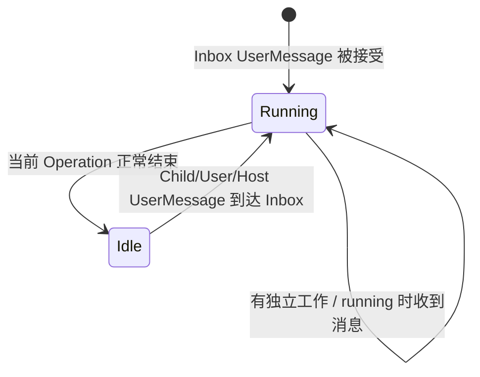
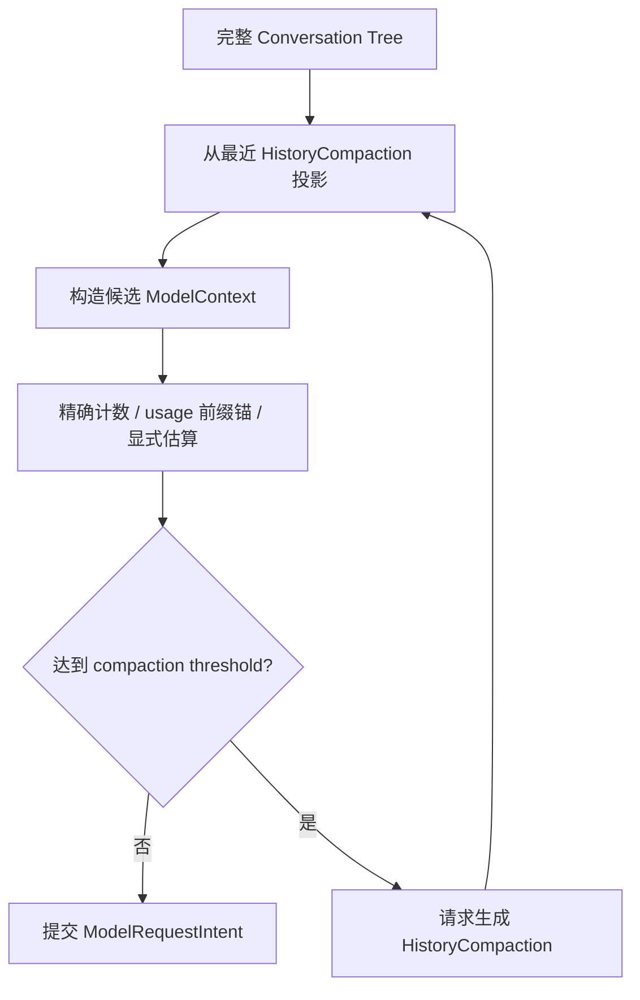
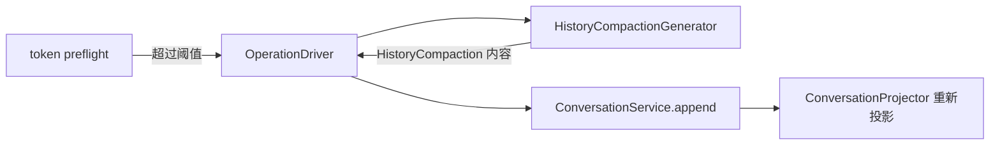

# Pickel Agent Runtime 观测驱动评审结论

**日期**：2026-08-27
**更新日期**：2026-08-28
**状态**：当前问题清单；Context/Cache/Tool 输出方案已收敛，供后续实施设计使用
**样本 Session**：`7d22cffb-cfa4-4689-b4b3-f2580cb88abb`

## 1. 文档边界

本文只记录本轮真实 Session 暴露出的两类问题：

1. 观测数据的口径、缺口和展示错误；
2. 由观测事实确认的 Agent Harness 行为问题。

本文不新增 Eval、Diagnosis、自进化实体，不重新定义 Session、Operation、Agent、Inbox、
UserMessage 或 ModelCall。实体与命名继续遵循当前 Runtime 合同。

## 2. 样本事实

### 2.1 Operation 总览

主要分析 Operation：`9b9f746e...`

| 指标 | 原始事实 | 当前含义 |
| --- | ---: | --- |
| Parent ModelCall | 21 次：19 成功、2 失败 | 只统计 Parent |
| Parent token | input `168433` / output `6961` / cache read `149504` / total `175394` | Provider usage 汇总 |
| Child token | total `101296` | 5 个 Child、17 次 ModelCall |
| Workflow token | total `276690` | Parent + 全部后代 |
| Parent ModelCall wall | `601.360s` | 成功生成与失败 attempt 合计 |
| Parent Tool wall | `291.323s` | 其中显式 `sleep` 约 `290s` |
| user node → final assistant node | `895.818s` | 用户可见答案准备完成 |
| accepted → AgentRun trace end | `896.907s` | Runtime 完整收尾 |

两个失败 ModelCall 均在无 first chunk 时耗尽约 `120s` Provider timeout，重试后成功。

### 2.2 Cache 事实

Session 加权 cache hit rate：

```text
149504 / 173111 = 86.36%
```

主要 Operation 加权 cache hit rate：

```text
149504 / 168433 = 88.76%
```

公式正确：OpenAI-compatible `input_tokens` 已包含 `cache_read_tokens`。

两次断崖：

| Step | input | cache read | hit rate |
| ---: | ---: | ---: | ---: |
| 13 | 10684 | 4672 | 43.73% |
| 17 | 10221 | 4672 | 45.71% |

两次断崖期间 system 和 tools 均保持稳定；变化来自固定 5-turn Window 重写早期消息前缀。
断崖调用的 TTFT 仍约 `6s`，因此 cache miss 不是本次超长耗时的主要原因。

## 3. 总体判断

| 现象 | 所有者 | 结论 |
| --- | --- | --- |
| Parent 用 `bash sleep` 轮询 Child | Agent Context / Tool Contract | Runtime 已有 Inbox + wake；模型不知道正确生命周期 |
| Parent 无工作时如何等待 | 现有 Agent 生命周期 | 当前 Operation 正常结束，Session idle；不增加等待状态 |
| Child 结果使用 `UserMessage` | 现有统一消息抽象 | 保留；问题不在消息类型 |
| Cache 周期性断崖 | Context 策略 | 固定 turn window 应退出正式请求路径 |
| Provider 120s timeout | Provider Runtime | 内部治理；不把 HTTP deadline 暴露给模型 |
| 模型长 reasoning/output | 模型配置与任务分布 | 保持当前上限采集数据，不立即一刀切 |
| Parent-only token | Observation projection | 增加 workflow-inclusive 投影，不修改 ModelCall |
| Storage latency 不可见 | Span 采集 | 当前没有可靠数值，不能展示为 0 |

## 4. Harness 设计收敛

### 4.1 Parent/Child 等待不增加状态

唯一生命周期：



约束：

- Parent 有独立工作时继续执行，不轮询 Child；
- Parent 无工作时结束当前 Operation，Agent 自然进入 idle；
- Child 终态以普通 `UserMessage` 进入 Parent Inbox，并由现有 wake 机制重新驱动；
- Operation 结束不取消 durable Child；
- 不增加 `waiting_child`、Lane 或固定顺序的 `wait_delegation`；
- `list_agents` 只用于显式状态查询和诊断，不承担等待。

Agent 稳定 Context 和 `delegate_agent` 描述必须让模型知道：

```text
Child 继续独立运行；终态结果会自动投递并唤醒 Parent。
没有独立工作时结束当前 Operation；不要使用 bash sleep、文件或 list_agents 轮询。
```

### 4.2 UserMessage 保持统一

CLI 用户、Parent、Child 和 Host 最终都通过 Inbox 投递 Provider-neutral `UserMessage`。是否开启
新的工作轮次只看 Agent 状态：

```text
idle + UserMessage    → 接受新 Operation
running + UserMessage → 当前 Operation 的下一 Step 反馈
```

不按发送方增加消息子类型，不让 Provider role 承担 Runtime 分类职责。

### 4.3 Cache 稳定前缀

所有 Provider 的模型语义前缀统一为：

```text
tools → system → messages
```

- 冻结 Package 中的 ToolDefinition 和稳定 system 内容位于前部；
- 压缩 epoch 内 messages 只追加，不重写已经发送的前缀；
- Provider wire 可以有不同 JSON 字段形状，但 Mapper 必须保持相同语义顺序；
- 当前没有动态 Context 注入，不为未来来源提前增加排序框架。

这样，未压缩的下一次请求可以复用上一请求的全部前缀。cache miss 的主要合法来源只应是
Package/Tool/System 变化或一次明确的 HistoryCompaction，而不是固定消息窗口滚动。

### 4.4 固定 turn window 改为 Provider token preflight



Provider 在内部承担原生 count API 或匹配 tokenizer 的精确能力。该能力不可用时，Runtime 从
当前 ModelContext 中寻找最近一次成功 AssistantMessage：重建其请求前缀并核对
`context_fingerprint`，匹配后使用 Provider usage 作为锚，只估算其后的新增消息；无可用锚时才
对完整 Provider 可见语义做本地估算。来源必须标记为 `counted`、`anchor`、
`anchor_plus_tail` 或 `estimated`，不得把估算伪装成精确值。仍不建立独立 TokenCounter、
UsageAnchor 实体或持久化表。

```text
effective_context_window = floor(context_window_tokens * effect_rate)

compaction_threshold = min(
    max_input_tokens（已知时）,
    effective_context_window - reserved_output_tokens,
)
```

| 输入 | 含义 | 当前决定 |
| --- | --- | --- |
| `context_window_tokens` | Provider/模型的总 input+output 窗口 | 必须来自已核实模型能力 |
| `max_input_tokens` | Provider 独立声明的输入硬上限 | 未知时不伪造，只使用第二项 |
| `reserved_output_tokens` | 本次请求预留输出预算 | 使用冻结请求配置，不等于厂商最大输出 |
| `effect_rate` | 模型的有效 Context 使用比例 | 初始 `0.5`；配置化，不硬编码进 Driver |

不再额外减 `1024` 或其他无来源的安全常数。未来 Eval 可以按 Provider/模型调整
`effect_rate`，无需修改 token preflight 或压缩实现。

当前项目已核实 `opencode-go/glm-5.3-flash.context_window_tokens=1000000`；该 alias 的独立
`max_input_tokens` 仍为 unknown。现有 `max_output_tokens=65536` 是 Pickel 请求预算，不是
Z.AI 声明的厂商最大输出。依据：[OpenCode Go endpoint/model 列表](https://dev.opencode.ai/docs/go/)、
[Z.AI GLM-5.3-Flash 模型页](https://docs.z.ai/guides/vlm/glm-5.3-flash)、
[Z.AI GLM-5.3 模型页](https://docs.z.ai/guides/llm/glm-5.3) 和
[Z.AI Core Parameters](https://docs.z.ai/guides/overview/concept-param)。

### 4.5 HistoryCompaction 只保留组合接口

HistoryCompaction 在数据层仍是一条 ConversationNode 内容。原始 Conversation Tree 不删除，
ConversationProjector 从最新压缩节点重新投影即可复用现有消息、持久化和恢复链路。



| 组件 | 负责 | 不负责 |
| --- | --- | --- |
| Provider | 候选请求 token count | 阈值、摘要、持久化 |
| token preflight | 比较 count 与 threshold | 选择历史、调用模型、提交节点 |
| `HistoryCompactionGenerator` | 从明确输入生成一个 HistoryCompaction 内容值 | 何时触发、节点提交、重试循环 |
| OperationDriver | 编排一次触发、提交、重新投影和再次 preflight | 摘要策略本身 |
| ConversationService/Projector | 追加节点、按最新压缩点投影 | token 与摘要策略 |

当前只拍板这个组合接缝。摘要模型、压缩 prompt、历史选择、保留信息、压缩目标长度和失败恢复
需要后续单独讨论；现有实验实现不能反向成为合同。每个 Step 最多触发一次且无进展必须停止，
防止压缩循环。

### 4.6 Tool Result 控制上下文增长

```text
Tool 执行结果
├── 可接受大小 → 完整 ToolResultMessage，一次交给模型
└── 不可接受大小 → 工具特定的高信号预览 + 明确省略事实 + 可用恢复路径

达到阈值
└── HistoryCompaction 提炼旧 ToolCall/ToolResult 的结论、错误、文件和未完成事项
```

不引入通用 `Page`、`Cursor`、`PaginationManager` 或 `next_page` Tool。分页会增加一次完整
ModelCall，只适用于天然可寻址且确实超过单次可接受预算的数据；小结果必须完整返回，不能为了
统一合同被迫分页。

| Tool 形态 | 一次调用的默认结果 | 超限恢复 | 是否分页 |
| --- | --- | --- | --- |
| `read` 文本 | 足够大的连续行窗口 | 源路径 + 首个省略完整行的 `next_offset`；单个超长行保留原行并提示定向读取 | 是，工具原生可选 `offset/limit` |
| `read` 图片 | 一次返回既有 `ArtifactBlock`，字节保存在 Artifact/Blob | 重新读取原 Workspace 路径 | 否 |
| `grep/glob/ls` | 有界、高信号结果 | 缩小 pattern/path；必要时稳定 spill 引用 | 否，不引入通用 cursor |
| `bash` | 小结果完整；大结果 head/tail 或 tail | 真实完整输出文件 | 否 |
| MCP/Web | 工具自身的结果数、正文预算 | 缩小查询或提取选中资源 | 由具体协议决定 |
| Delegation | 紧凑、结构化的 Child 结论 | Host 按既有授权读取权威 AssistantMessage | 否 |

模型 Context 不等于权威数据仓库。模型需要的是完成下一步决策所需的充分信息，不要求每次携带
所有原始字节；完整事实继续存在于 Conversation、Workspace、Artifact、spill 文件或 Child
Session。当前工具合同仍保持唯一 `JSONValue → render() → ToolResultMessage.content`，不得为
截断再创建第二份 ToolResult DTO 或通用结果管理服务。

实时结果控制与历史压缩是两个阶段：当前 ToolCall 先让模型消费足够结果；达到 Context 阈值后，
HistoryCompaction 才替换活动投影中的旧 ToolResult。不得在每轮请求前动态重写旧结果，否则会
持续破坏 cache prefix。

### 4.7 Provider timeout 对模型透明

模型只提交一次 `ModelRequestIntent`。以下机制属于 Provider Runtime：

```text
connect timeout
first-byte timeout
stream idle timeout
attempt retry/backoff
total deadline
provider/model fallback policy
```

低层 attempt 进入 ModelCall、Trace 和开发者观测；模型只看到最终成功响应，或策略耗尽后的稳定
错误。模型不能控制 HTTP deadline。

当前重试合同保持简单：同一 ModelRequestIntent 最多三个 attempt；attempt 间使用
`20s / 60s / 120s` 递增退避等待（由冻结 Package 的 `model_request_retry_delays_ms`
承载，format 4 起冻结），全部失败即稳定失败。单次 attempt 的 connect/首字节/流空闲
超时继续由三种 wire 的底层 HTTP/SDK timeout 负责，模型不接触这些参数。首个模型输出后
仍禁止自动重试，避免重复流式内容。本批不增加复杂 backoff、模型可控 deadline 或自动
fallback。format 2/3 冻结 Package 在解码时按历史 1s/2s/4s 指数公式合成退避表，恢复
语义不变。

### 4.8 模型输出预算暂不收紧

当前 `65536` 是安全上限，不等于目标输出长度。本轮不根据单个 Session 降低上限。先按模型、
任务类型和 Agent 角色采集质量、reasoning、output、工具调用次数和时延，再决定推荐配置；仅保留
防失控硬上限。

## 5. Observation 问题清单

### 5.1 已正确的数据

- ModelCall 请求、聚合响应和 ContentRef 完整，样本 hash/size 校验通过；
- completed ModelCall 的 input/output/cache read/reasoning/total 来源可靠；
- `cache_read / input` 公式正确；
- ModelCall `started_at → first_chunk_at → finished_at` 差值正确；
- Trace 中 19 对 ToolCall start/completed 配对正确；
- 两个失败 attempt 保留失败状态且没有伪造 usage。

### 5.2 必须修正的口径

| 当前问题 | 目标口径 |
| --- | --- |
| `duration` 混用 accepted、final node、trace end | 分成 `answer_ready_ms` 与 `operation_completed_ms` |
| Operation token 只含 Parent | 同时展示 `agent` 与 `workflow-inclusive` |
| 失败 attempt 无 usage 时静默消失 | 展示 `usage unknown attempt count` |
| reasoning 与 output 可能被重复堆叠 | reasoning 是 output 子集 |
| cache read 与 input 可能被重复堆叠 | cache read 是 input 子集 |
| `cache_write_tokens=null` 被归一成 0 | 保留 unknown |
| Trace metric count=0 被理解成耗时为 0 | 明确标记 unavailable |

可靠 E2E 定义：

```text
answer_ready_ms
  = final Assistant ConversationNode.created_at
  - accepted User ConversationNode.created_at

operation_completed_ms
  = Runtime terminal completion
  - accepted User ConversationNode.created_at
```

### 5.3 必须补齐的时序

现有标准 Trace 只有 `pickel.agent_run`，不能分解真实延迟。下一批至少采集：

```text
context build
model semaphore wait
provider connect / first output / generation
request content write
ModelCall prepare transaction
response content write
ModelCall + ConversationNode complete transaction
tool execute
event delivery
```

11.2 已为上述可测边界发射窄 Span。Provider connect 内部仍无独立可复用的可靠时间，
首包/生成继续读取 ModelCall 的时间字段；缺失 Span 时 Storage lane 的 ContentRef
“已记录”仍只证明存在，不声称写入耗时。

### 5.4 已确认的投影缺陷

- Session HTTP 投影没有传入真实 Trace status，存在 Trace 时仍可能显示 unavailable；
- `TraceReader` 在按 Operation 过滤前更新 `last_sequence`，产生跨 Operation 污染；
- Tool timeline 原始 `duration_ms` 正确，但一位小数秒和百分比宽度会让短调用显示为零；
- Operation summary 缺少 model/tool latency aggregate；
- Child lane 和 token 没有形成 workflow-inclusive 聚合。

## 6. 实施顺序

| 批次 | 范围 | 验收门槛 |
| --- | --- | --- |
| 11.1 | 修 Observation 口径与已知 projector/TraceReader 缺陷 | 样本 Session 的 E2E、unknown、Parent/Workflow 数值可复算 |
| 11.2 | 补 model/tool/storage/context 时序 Span | 页面能分解总耗时，缺失值不显示为 0 |
| 11.3 | 补 Multi-Agent 稳定 Context 与 Tool 描述 | Parent 无工作时进入 idle；Child 自动消息唤醒；无 `bash sleep` 轮询 |
| 11.4 | 修正 token preflight：精确计数优先、usage 锚兜底 + `effect_rate` 阈值 | 来源可见；无计数接口不阻断执行；阈值可复算；无固定安全常数 |
| 11.5 | 只收敛 HistoryCompaction 组合接口；具体压缩策略后续单独设计 | 触发/生成/提交解耦；实验策略不成为合同 |
| 11.6 | 按工具类型收敛大型结果，不建立通用分页 | 小结果完整；大结果高信号且可恢复；额外 ModelCall 只在确实缺证据时发生 |
| 11.7 | Provider timeout/retry 内部治理 | attempt 可诊断；模型不接触 HTTP 参数；重试不重复 Agent Step |

11.1 状态（2026-08-28）：已完成 Observation 口径修正。Operation 同时投影
`answer_ready_ms` 与 `operation_completed_ms`，token/cache 明确分为 agent 与
workflow-inclusive，失败 attempt 的 usage 保持 unknown，reasoning/cache read 只作
output/input 子集展示。Trace 先按 Operation 过滤再计算状态，Session HTTP
投影使用真实 Trace status。

11.2 状态（2026-08-28）：已完成窄 Span 发射与 Trace 指标分组。新增 context build、model
semaphore wait、request/response content write、ModelCall prepare/complete transaction、tool
execute 和 event delivery；Provider generation/first output 继续复用 ModelCall 的
`started_at`、`first_chunk_at`、`finished_at`，不重复创建观测事实。不可测的连接内部耗时仍不
伪装为可用值。

11.3 状态（2026-08-28）：已完成 Multi-Agent 稳定 System Context 与 Tool 合同。
Parent 明确知道 delegate 立即返回、Child 终态会自动投递并唤醒；无独立工作时
正常结束 Operation 并 idle，不使用 `bash sleep`、文件或 `list_agents` 轮询，
不新增 Child 等待状态。

11.7 已完成：重试退避定为 attempt 间 `20s / 60s / 120s` 递增等待，由冻结 Package
`model_request_retry_delays_ms`（format 4）承载；format 2/3 冻结 Package 在解码时按
历史 1s/2s/4s 指数公式合成退避表，恢复语义不变。单次 attempt 超时维持底层
HTTP/SDK timeout；首个输出后禁止自动重试；attempt 复用同一 ModelRequestIntent 并各自
独立持久化 ModelCall。

11.4 已完成：`effect_rate` 已从配置冻结进 ModelVersion，阈值只按本节公式计算。
Anthropic、Gemini 与 [OpenAI Responses](https://developers.openai.com/api/reference/resources/responses/subresources/input_tokens/methods/count)
优先使用 Provider 原生计数接口；没有公开可靠计数端点的 OpenAI-compatible Chat Completions
复用最近一次匹配前缀的 Provider usage 并只估算新增尾部，冷启动或前缀变化时明确标记为
`estimated`。`/context` 与请求前检查复用同一规则，且只读命令不调用远程 count。

11.5 已完成组合接缝收敛：删除按 JSON 字节选段、半阈值尾部预算、固定 worker/prompt 的实验
生产实现；保留 `HistoryCompaction` 值、Projector 和可注入的 `HistoryCompactionGenerator`。
Generator 只返回内容，OperationDriver 负责追加、重新 preflight 和无进展停止；未配置 Generator
时明确失败，不静默裁剪，也不预设后续压缩策略。

11.6 已完成逐工具验收：小结果保持完整；`read` 文本按原生 `offset/limit` 继续，字符预算只在
完整行边界切分，单个超长行不再错误跳到下一行；`read` 图片复用既有
`ArtifactService → ArtifactReference → ArtifactBlock → Provider` 链路，不在 ToolResult 中复制
base64；`ls/glob/grep` 给出缩小查询的恢复提示且不切断完整记录；`bash` 保留 head/tail 并落
完整 spill 文件；Delegation 明确 `omitted_chars`，权威终态仍在 Child Session。没有增加通用
Page/Cursor/Result Manager、图片专用 Tool 或第二份 ToolResult DTO。

每批只修改一个边界；不在观测修复中顺带实现 Eval、诊断器或自动调参。

## 7. 关键验收场景

1. Parent 委派 Child 后没有独立工作：不轮询，Operation 结束并 idle，Child 消息到达后恢复工作；
2. Parent 委派 Child 后仍有工作：继续执行，Child 消息作为 running Operation 反馈被消费；
3. 多个 Child 乱序完成：按 Inbox 到达顺序处理，不按创建顺序等待；
4. 压缩前连续请求保持 append-only prefix，cache read 平滑增长；
5. 触发压缩后只出现一次可解释的 cache epoch 变化；
6. 小 ToolResult 一次完整返回；超大结果明确省略且具有工具特定恢复路径，不依赖通用分页；
7. 压缩失败或压缩后没有减少 token 时停止重试并产生明确 Diagnostic；
8. Provider 首包 timeout 后的 retry 属于同一个 ModelRequestIntent，不产生额外 Agent 决策；
9. 页面同时展示 Parent 与 Workflow token，未知 usage、storage 和 Trace 不伪装为零。

## 8. 调研依据

- [OpenCode V2 Compaction](https://v2.opencode.ai/docs/compaction/)：每次请求前估算完整 Context，默认以 `context limit - max(output allowance, buffer)` 触发，并保留摘要与近期尾部；
- [Anthropic Context Editing](https://platform.claude.com/docs/en/build-with-claude/context-editing)：按 token threshold 回收旧 Tool Result，并支持摘要式 compaction；
- [Anthropic Effective Context Engineering](https://www.anthropic.com/engineering/effective-context-engineering-for-ai-agents)：长 Context 存在渐进式注意力退化，工具输出应保持高信号和 token-efficient；
- [Lost in the Middle](https://arxiv.org/abs/2307.03172)：模型对长 Context 中间位置的信息利用并不稳定，标称窗口不等于最佳工作长度；
- [OpenAI Prompt Caching](https://developers.openai.com/api/docs/guides/prompt-caching)：缓存依赖稳定前缀，静态内容应位于前部，动态内容后置并保持 append-only。
- [Pi Tool truncation](/Users/ssunxie/code/pi/packages/coding-agent/src/core/tools/truncate.ts)：文件读取使用可选 offset，搜索/列表使用结果上限，Bash 保存完整输出；
- [DSH output-retention](/Users/ssunxie/code/deepseek-harness/packages/util/output-retention/README.md)：按 Tool 资源形态选择 head/tail/headTail，恢复语义由具体 Tool 持有，不提供通用分页服务；
- [Claude Code SDK tool contracts](/Users/ssunxie/.nvm/versions/node/v22.21.0/lib/node_modules/@anthropic-ai/claude-code/sdk-tools.d.ts)：Read 仅在文件过大时使用 offset/limit，Grep 默认 head limit，大输出暴露持久化完整文件路径；
- [OpenAI model guidance](https://developers.openai.com/api/docs/guides/latest-model?model=gpt-5.5)：以最少有效 Tool Loop 获取证据，只有核心证据缺失时再追加检索。
