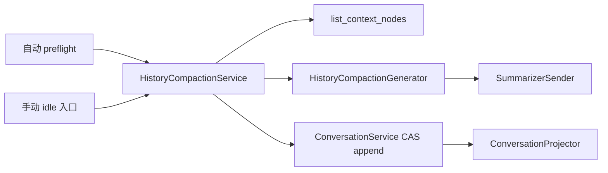

# HistoryCompaction 压缩设计方案

**日期**：2026-08-30
**更新日期**：2026-08-31
**状态**：目标合同已对齐，待实施；当前代码仍是 `first_kept_node_id` 基线
**范围**：HistoryCompaction 的数据形态、读取投影、选材、摘要内容、触发、失败、手动入口、迁移与验收
**不在范围**：Goal/Plan 重构、Provider overflow 恢复、projection 级 ToolResult 改写、map-reduce 摘要
**术语**：遵循 [`Agent Runtime 重构命名约束`](./2026-08-10-agent-runtime-naming.md)；数据库升级遵循 [`数据库实体设计`](./2026-07-12-db-entities.md)

本文替换本文件 2026-08-30 版本中的三项旧结论：

1. 删除以 `first_kept_node_id` 回看旧祖先的 checkpoint；
2. 删除压缩失败后使用全量 Context 继续的降级；
3. 删除 Provider `context_window_exceeded` 后触发恢复压缩的路径。

## 1. 已拍板结论

| 主题 | 目标合同 |
| --- | --- |
| checkpoint | `summary + retained_messages + file ledger`，内容自包含 |
| 原始历史 | Conversation Tree 继续 append-only；不删除、不改写旧 Node |
| 正常读取 | 从 leaf 回溯到最近 `HistoryCompaction` 即停止，不再读取更旧祖先 |
| 投影 | checkpoint 展开为一条摘要消息和原样保留消息；其后追加普通消息 |
| 摘要范围 | worker 只看本次被 checkpoint 替代的逻辑前缀；不看新 retained tail |
| 重复压缩 | 上一次 summary 必须进入本次待摘要前缀；上一次 retained messages 按新切点决定继续保留或折叠 |
| 自动触发 | 每次候选 ModelContext 的 token preflight 达到阈值时触发 |
| 手动触发 | 仅 Session 严格 idle 时允许；不排队、不等待、不抢占 |
| 失败 | 任一压缩失败直接失败；不回退全量 Context |
| Provider overflow | 按普通 Provider 失败收敛，不触发压缩 |
| Recall/Hook | 压缩前后允许各执行一次；第二次构建结果才进入 Intent |
| Goal/Plan | 不进入摘要合同；以后独立重构，不成为压缩前置依赖 |
| warm prefix | 只是一种摘要请求 envelope 优化，不改变 checkpoint 和摘要范围 |

核心取舍是：

> 每个 checkpoint 复制一份有界的精确 tail，换取正常 Context 读取不再访问旧祖先，以及只依赖 checkpoint 内容的简单投影。

## 2. 当前实现与目标差异

| 边界 | 当前代码 | 目标 |
| --- | --- | --- |
| `HistoryCompaction` | `summary + first_kept_node_id + ledgers` | `summary + retained_messages + ledgers` |
| Context 读取 | `list_active_branch_nodes()` 读取完整根路径 | `list_context_nodes()` 在最近 checkpoint 停止 |
| Projector | 找最后 checkpoint，再解析旧 Node ID | 只展开输入首个 checkpoint，无引用查找 |
| worker 输入 | 序列化旧 Node；64k 输入时丢弃中段 | 逻辑待替代前缀完整可见；超出 worker 能力则失败 |
| 重复压缩 | 依赖旧祖先和 `first_kept_node_id` | 只依赖最近 checkpoint 与其后 Node |
| 失败 | 部分错误降级到全量 Context | 全部终止当前入口 |
| overflow | Provider 拒收后强制压缩一次 | 删除恢复路径 |
| 手动压缩 | 未实现 | 严格 idle 的显式入口 |

当前代码是迁移来源，不是目标语义。开发不得为了兼容旧投影而长期保留双轨生产路径。

当前修改入口：

| 文件 | 当前职责 | 本次目标 |
| --- | --- | --- |
| `src/pickel/conversations/conversation_node.py` | HistoryCompaction codec | 新值对象与严格 retained message codec |
| `src/pickel/context/projection.py` | 解析 `first_kept_node_id` | 纯展开自包含 checkpoint |
| `src/pickel/context/history_compaction.py` | Generator/Sender 协议 | 保持纯协议，改为逻辑历史输入 |
| `src/pickel/runtime/history_compaction_worker.py` | tail、摘要、ledger | 改为逻辑历史；删除中段省略 |
| `src/pickel/runtime/history_compaction_service.py`（新增） | — | 自动/手动入口共享的无状态应用服务 |
| `src/pickel/runtime/operation_driver.py` | 自动触发、降级、overflow 恢复 | 统一失败并调用共享 Service |
| `src/pickel/runtime/agent.py` 与 App/CLI | 串行 drive 与命令入口 | 增加严格 idle 手动入口 |
| `src/pickel/persistence/*` | SQLite v12 与完整分支查询 | v13 内容迁移和 stop-at-checkpoint 查询 |

## 3. 数据模型

### 3.1 目标值对象

```python
@dataclass(frozen=True)
class HistoryCompaction:
    summary: str
    retained_messages: tuple[AgentMessage, ...]
    read_files: tuple[str, ...] = ()
    modified_files: tuple[str, ...] = ()
```

字段合同：

| 字段 | 含义 | 约束 |
| --- | --- | --- |
| `summary` | 被替代逻辑前缀的结构化语义检查点 | 非空；不得包含固定 System/Tool 定义 |
| `retained_messages` | checkpoint 创建时仍需原样进入模型的近期消息 | AgentMessage 的深度不可变精确副本；保持原顺序 |
| `read_files` | 已折叠历史中确定读取过的文件账本 | 去重、排序、跨 checkpoint 累积 |
| `modified_files` | 已折叠历史中确定修改过的文件账本 | 去重、排序、跨 checkpoint 累积 |

目标 JSON：

```json
{
  "summary": "...",
  "retained_messages": [
    {"payload_version": 4, "role": "user", "content": []}
  ],
  "read_files": ["src/example.py"],
  "modified_files": ["src/example.py"]
}
```

`first_kept_node_id` 被删除。`retained_messages` 保存消息值，不保存 Node 引用，也不要求 Projector 回到旧祖先解析时序。

### 3.2 为什么允许复制 tail

原始 AgentMessage Node 仍保留在旧祖先中，checkpoint 内会出现一份内容副本。这是有意的数据冗余：

- 副本上限由 `compaction_tail_tokens` 控制；
- Artifact 仍只复制 `ArtifactReference`，不复制 Blob；
- checkpoint 之后的正常请求不再读取旧祖先；
- 分支审计、导出和历史回放仍可读取完整原始分支；
- 不增加通用 Object/Reference、节点拼接器或可移动指针。

如果未来真实数据证明 checkpoint JSON 体积成为问题，再对 `retained_messages` 做内容寻址去重；本批不提前引入第二套消息存储权威。

## 4. Context 读取与投影

### 4.1 两种读取必须分开

```text
list_branch_nodes
  审计、导出、迁移、完整历史观察
  leaf → root，全分支读取

list_context_nodes
  正常模型 Context 与重复压缩
  leaf → 最近 HistoryCompaction（含）即停止
```

`list_branch_nodes()` 保持现有完整历史语义。新增 Store/ConversationService 窄查询：

```python
list_context_nodes(
    session_id: str,
    leaf_node_id: str | None,
) -> tuple[ConversationNode, ...]
```

返回顺序仍为祖先到 leaf：

```text
无 checkpoint：root message ... leaf message
有 checkpoint：latest checkpoint, message ... leaf message
```

SQLite 的递归 CTE 在当前回溯节点为 `history_compaction` 时停止递归；InMemory Store 实现相同合同。不得先读取完整分支再在 Python 中切掉旧祖先，否则没有兑现读取边界。

### 4.2 Projector 保持纯且简单

```python
def project_conversation_messages(nodes):
    if not nodes:
        return ()
    if nodes[0].content_type == "history_compaction":
        checkpoint = nodes[0].content
        return (
            summary_message(checkpoint.summary),
            *checkpoint.retained_messages,
            *agent_messages(nodes[1:]),
        )
    return agent_messages(nodes)
```

Projector 不再：

- 反向搜索最后一个 checkpoint；
- 查找 `first_kept_node_id`；
- 读取 Store；
- 判断压缩是否有效；
- 修复历史格式。

输入合同保证至多一个 checkpoint，且它若存在只能是第一个 Node。违反合同属于 Store/codec 错误，不在 Projector 中静默回退全量历史。

### 4.3 checkpoint 追加在 leaf 后不会改变逻辑顺序

物理树：

```text
A → B → C → D → E → F → C1
```

其中：

```text
C1.summary = summarize(A, B, C)
C1.retained_messages = [D, E, F]
```

当 active leaf 是 `C1`，`list_context_nodes()` 只返回 `[C1]`，Projector 输出：

```text
[summary(A,B,C), D, E, F]
```

随后追加 `G → H`：

```text
A → B → C → D → E → F → C1 → G → H
```

读取返回 `[C1, G, H]`，投影为：

```text
[summary(A,B,C), D, E, F, G, H]
```

checkpoint 虽然物理上追加在旧 leaf 后，语义上却是对其全部祖先的替代表达；投影没有把历史消息移动到未来，也没有重新插入旧 Node。

### 4.4 分支语义

- 从 checkpoint 之后的 Node 分叉：新分支共享该 checkpoint；
- 从 checkpoint 之前的旧 Node 分叉：该分支不包含 checkpoint，Context 重新读取其自身根路径；
- checkpoint 只影响包含它的后代分支，不成为 Session 全局可移动指针。

## 5. 选材与重复压缩

### 5.1 先构造逻辑历史

压缩只消费 `list_context_nodes()` 的结果：

```text
latest checkpoint? + checkpoint 后的 AgentMessage Nodes
```

将其解释为：

```text
previous_summary? + exact_messages
```

其中：

- `previous_summary` 来自最近 checkpoint；
- `exact_messages` 是最近 checkpoint 的 `retained_messages` 与其后普通消息的拼接；
- 更旧祖先不再读取。

### 5.2 tail 选择

从 `exact_messages` 尾部向前累计，选择不超过 `compaction_tail_tokens` 的近期消息，并按以下顺序修复边界：

1. 不允许 retained tail 以孤立 ToolResult 开始；若 ToolCall 位于切点之前，切点向前移动到对应 AssistantMessage；
2. 同一 AssistantMessage 中的 ToolCall 和随后的 ToolResult 保持配对；
3. tail 以孤立 AssistantMessage 开始时，可向前包含紧邻 UserMessage；这是可读性规则，不是 Turn 实体；
4. `previous_summary` 永远不进入 retained tail，它始终属于下一份 summary 的输入。

选材继续使用确定性成本估算；它只影响切点。优先复用 Context token 估算入口，尚未具备时可暂用现有 `chars ÷ 4`，但必须把来源标记为 estimated，并保留 CJK 低估测试。

### 5.3 worker 输入公式

```text
summary_input =
    previous_summary（若存在）
    + exact_messages 中未进入 new_retained_messages 的前缀

new_checkpoint =
    summarize(summary_input)
    + new_retained_messages
```

新 retained tail 不发送给 worker。它不是待替代内容，交给 worker只会扩大输入、耦合 tail 策略，并要求摘要器推理自己不负责改写的区域。

### 5.4 重复压缩示例

第一次压缩后：

```text
C1(summary=S1, retained=[D,E,F]) → G → H → I
```

第二次决定保留 `[H,I]`：

```text
worker input = [S1, D, E, F, G]
worker 不看   = [H, I]

C2.summary = S2
C2.retained_messages = [H, I]
```

第二次压缩完成后，正常读取只需：

```text
C2 → 后续消息
```

不再读取 `C1`、`D`、`E`、`F` 或更旧祖先。

### 5.5 文件账本

新账本由以下集合并集构成：

```text
previous checkpoint ledger
+ 本次进入 summary_input 的 exact messages 中：
  - read(path)
  - edit(path)
  - write(path)
```

仍在 retained tail 中的工具调用暂不写入新账本，因为它们仍精确可见；将来离开 tail 时再确定性并入。自由 Shell 命令不猜测文件副作用。

## 6. 摘要必须保存什么

摘要是接任模型的工作检查点，不是聊天纪要。每条信息按以下优先级处理：

```text
用户最新明确指令与纠正
> 已提交的代码/文件/命令结果
> 已确认设计决策
> Assistant 推断
```

发生冲突时保留较新、较权威结论，并明确旧结论已被否决；不得把互相冲突的两项都写成当前事实。checkpoint 之后的精确消息具有更高时序优先级。

### 6.1 必须保存

| 类别 | 保存内容 |
| --- | --- |
| 当前目标 | 用户现在要完成什么，交付物和完成条件是什么 |
| 明确约束 | 用户的必须/禁止、架构偏好、兼容和安全边界 |
| 用户纠正 | 被否决的旧理解及当前正确结论，避免后续模型复犯 |
| 已确认决策 | 决策、理由、状态；区分已拍板、建议、未决 |
| 当前进展 | 已完成、正在进行、尚未开始；不得把计划伪装为完成 |
| 文件与代码 | 精确路径、关键类型/函数、已发生改动和当前代码状态 |
| 命令与验证 | 执行过的命令、关键输出、测试结果和未验证项 |
| 错误与修复 | 稳定错误原文、根因、失败尝试、最终修复或仍阻塞原因 |
| 外部事实 | 已核实来源、版本、链接、Session/Operation 等必要稳定标识 |
| 下一步 | 与最新用户请求直接对应的一个可执行动作 |

### 6.2 应压缩表达

- 长 ToolResult 只保存结论、关键错误、路径和可恢复位置；
- 长推理只保存最终判断及决定该判断的证据；
- 重复讨论合并为一条当前结论；
- 代码只保留关键签名、约束和差异，不复制大段可从 Workspace 读取的正文；
- 未核实信息必须标记为推断或开放问题。

### 6.3 必须丢弃

- 寒暄、确认语、重复复述和已解决的临时沟通；
- 已被用户否决且对理解当前结论无帮助的方案细节；
- 原始 Thinking、冗长推演和无结论探索；
- 已提取结论后的大段 Tool 原文；
- Provider metadata、usage、Trace 展示数据，除非当前任务正以其为证据；
- 固定 System、Skills、Tool Definitions；它们由 Package 每次确定性重注入；
- Recall 和 `before_request` Hook 的临时贡献；
- Goal/Plan 当前实现的临时状态；压缩方案不依赖其稳定性。

### 6.4 固定九节输出

```text
## 当前目标与用户意图
## 已确认约束与偏好
## 关键决策与理由
## 已完成工作与当前状态
## 文件与代码
## 已验证命令与结果
## 错误、失败尝试与修复
## 未完成事项与开放问题
## 下一步
```

每节必须存在；无内容写“（无）”。路径、命令、错误、标识符、数值和函数签名保持精确。摘要不得提及“正在压缩上下文”这一实现事实。

## 7. 摘要 worker 的请求合同

### 7.1 语义输入

worker 只接收 `summary_input`。重复压缩时，previous summary 不是辅助材料，而是逻辑待替代前缀的第一部分。

worker 不接收：

- 新 retained tail；
- 更旧 raw ancestors；
- Recall/Hook contributions；
- Goal/Plan 临时状态；
- Provider overflow 错误作为额外指令。

### 7.2 第一实施形态：隔离请求

先保留当前可替换 worker 架构，但修正输入：

```text
system = 压缩 worker 固定指令
messages = 结构化 summary_input
tools = ()
```

删除当前 `summary_input_tokens=64_000` 的“保留头尾、丢弃中段”逻辑。worker 必须看到完整 `summary_input`；若超过 worker 自身有效输入能力，压缩失败。本批不以 map-reduce 隐式改变一次 checkpoint 的语义。

### 7.3 可选优化：warm prefix

当 worker 与 primary 的 Provider、wire、model 和影响 token 序列的请求设置兼容时，可构造：

```text
system = 当前候选 ModelContext.system
tools = 当前候选 ModelContext.tools
messages = summary_input + [最终 compaction 指令]
```

这能复用主请求前缀缓存，但只是发送 envelope 的优化：

- summary scope 仍只有 `summary_input`；
- retained tail 仍不加入；
- system/tools 只作为稳定前缀，不写入摘要；
- 不兼容或缓存未命中只影响成本，不影响正确性；
- 第一实施批次不为 warm 模式增加持久化字段或第二种 checkpoint。

## 8. 两条触发线

### 8.1 自动 token preflight

当前实现的 `_build_context()` 顺序保留：

```text
捕获 active leaf
→ 读取并投影该 leaf 的 context nodes
→ Recall
→ before_request Hook
→ 构建候选 ModelContext
→ token preflight
```

达到冻结阈值时：

```text
使用构建候选 Context 时已经捕获的 active leaf
→ 对同一 leaf 的 context nodes 执行一次压缩
→ CAS 追加 checkpoint
→ 重新 _build_context()
→ 再次 token preflight
→ 未超限才提交 ModelRequestIntent
```

因此 Recall 和 `before_request` Hook 可能各执行两次。第一次结果只用于候选 Context 和阈值判断，压缩后丢弃；第二次结果才进入 Intent。Hook 必须允许重入，非幂等外部副作用不应放在 Context Hook 中。

同一 Step 最多成功提交一次 checkpoint。压缩后仍达到阈值直接以 `history_compaction_no_progress` 失败，不再次压缩。

### 8.2 手动压缩

手动入口不检查 token 阈值，但严格要求 Session idle：

```text
archived_at IS NULL
AND active_operation_id IS NULL
AND Agent drive lock 未被占用
AND 不存在任何 pending InboxMessage
```

行为：

- 条件不满足立即返回 `session_busy`；
- 不等待正在运行的 Operation；
- 不排队到 Operation 结束后执行；
- 不取消、不抢占、不注入 Inbox；
- 不执行 Recall 或 Hook；
- 使用调用入口当前持有的 `LoadedAgentPackage` worker/policy；不借用历史 Operation 的 Package；
- worker 调用仍记录 Session 级 `ModelCall(purpose=history_compaction)`，不伪造 Operation/Step；
- 获取同一个 Agent drive lock 后再次检查持久化 idle 条件；
- 压缩期间新消息不得被 claim，完成后由正常 wake/accept 流程处理。

如果没有足够的逻辑前缀可压缩，返回 `history_compaction_no_history`，Conversation Tree 不变化。

## 9. 失败语义

### 9.1 所有压缩错误使用同一控制流

以下错误可以保留不同内部 code，便于测试和诊断，但不再决定“降级还是失败”：

- worker 未配置或不可装载；
- worker 发送重试耗尽；
- summary 为空、超预算或没有收缩；
- summary input 超过 worker 能力；
- 没有可压缩历史；
- ToolCall/ToolResult 边界无法形成有效 tail；
- checkpoint codec 校验失败；
- active leaf CAS 冲突；
- checkpoint 提交后 Context 仍超阈值。

自动入口：当前 AgentRun 进入 `failed`，对外错误为 `history_compaction_failed` 或更精确的稳定子码，`retryable` 按底层原因记录；不得使用未压缩 Context 提交 Intent。

手动入口：命令失败并返回原因；已经产生的 worker ModelCall 仍作为可靠调用事实保留，但不得追加半成品 checkpoint。

### 9.2 仍保留的产物校验

| 检查 | 规则 |
| --- | --- |
| 非空 | summary 至少包含一个非空 TextBlock |
| 输出预算 | 估算不超过 `compaction_max_summary_tokens` |
| 收缩 | 新 summary 成本必须小于被替代逻辑前缀成本 |
| 输入能力 | 完整 summary input 必须能进入 worker 有效输入窗口 |
| tail 合法 | retained messages 顺序正确，不产生孤立 ToolResult |
| 内容 codec | summary、messages、ledger 均可严格 round-trip |

这些都是压缩正确性检查，不再分“软阈值”和“硬上限”。任一失败就是压缩失败。

### 9.3 删除 Provider overflow 恢复

删除 `_recover_context_overflow()` 及其调用。`context_window_exceeded` 仍可由 Provider 错误分类器识别，但只按普通不可重试 Provider 失败收敛；不得清除已提交 Intent、强制追加 checkpoint 或回到 `preparing_request`。

### 9.4 冻结策略参数

本次升级不顺带重调已有默认值：

| 参数 | 当前默认 | 目标用法 |
| --- | ---: | --- |
| `effect_rate` | `0.5` | 自动 preflight 阈值公式保持不变 |
| `compaction_tail_tokens` | `32_000` | checkpoint 内精确 retained messages 的目标上限 |
| `compaction_max_summary_tokens` | `4096` | summary 输出校验上限 |
| `worker_request_max_attempts` | `2` | worker Provider 级有界重试；耗尽后压缩失败 |
| `worker_request_retry_delays_ms` | `5000, 15000` | attempt 间退避；不表示压缩业务降级 |
| worker input limit | worker 模型有效输入上限 | 替代固定 `summary_input_tokens=64_000` |

这些值继续随 AgentPackageVersion 冻结。后续只有基于真实 Session/Eval 的独立批次才能修改默认值。

## 10. 组件边界与复用



| 组件 | 负责 | 不负责 |
| --- | --- | --- |
| token preflight | 自动入口是否触发 | 选材、摘要、提交 |
| 手动入口 | idle 门槛、当前 Package 选择 | 摘要策略 |
| `HistoryCompactionService` | 校验 expected leaf、读取 context nodes、调用 generator、按同一 leaf 追加 | token 阈值、模型选择、Recall/Hook |
| `HistoryCompactionGenerator` | 逻辑历史、tail 选择、worker 请求、产物校验、ledger | 触发、Session idle、节点提交 |
| `SummarizerSender` | worker ModelCall 可靠记账、发送和有界重试 | 压缩范围、checkpoint 持久化 |
| Conversation Store/Service | stop-at-checkpoint 查询、append CAS | token、prompt、模型 |
| Projector | checkpoint 与 Node 到 AgentMessage 的纯投影 | Store 查询、有效性修复 |

`HistoryCompactionService` 是自动与手动入口唯一共享的应用服务。它是无业务状态的窄协调器，不持有 AgentRunState，不成为 Runtime 资源袋。自动入口必须先捕获 leaf，再用该 leaf 构建候选 Context，并把同一个 ID 传给 Service；不得为称重和压缩分别读取两个活动位置。

Service 把 Context Node 确定性展开为 `previous_summary + exact_messages + previous ledgers` 后再调用 Generator。Generator 协议不再接收 ConversationNode，因此可在没有 Session Store 的测试、其他 Runtime 或离线工具中复用：

```python
class HistoryCompactionGenerator(Protocol):
    async def generate(
        self,
        *,
        previous_summary: str | None,
        exact_messages: Sequence[AgentMessage],
        previous_read_files: tuple[str, ...],
        previous_modified_files: tuple[str, ...],
        model_context: ModelContext | None,
        send_summarizer: SummarizerSender,
        max_summary_tokens: int,
        preserve_tail_tokens: int,
        worker_input_limit: int,
    ) -> HistoryCompaction: ...
```

建议接口：

```python
class HistoryCompactionService:
    async def compact(
        self,
        *,
        session_id: str,
        expected_leaf_node_id: str | None,
        model_context: ModelContext | None,
        send_summarizer: SummarizerSender,
        max_summary_tokens: int,
        preserve_tail_tokens: int,
        worker_input_limit: int,
    ) -> ConversationNode: ...
```

自动入口传入候选 `model_context`，供未来 warm prefix 使用；手动隔离请求可以传 `None`。Service 必须使用调用方捕获的 `expected_leaf_node_id`，不能在 worker 返回后重新读取新 leaf 并把陈旧摘要挂到新历史上。

## 11. 并发与原子性

压缩跨越一次外部模型调用，不能与 SQLite 形成单事务。正确边界：

```text
读取 session + expected leaf
→ 读取该 leaf 的 context nodes
→ worker ModelCall
→ 校验完整 checkpoint
→ append_node(expected_node_id=expected leaf)
```

若 worker 执行期间 active leaf 变化，append CAS 失败：

- Conversation Tree 不追加 checkpoint；
- worker ModelCall 记录保留；
- 自动入口失败，不拿新 leaf 静默重试；
- 手动入口返回冲突，用户可在重新确认 idle 后重试。

append 成功是 checkpoint 可见的唯一提交点。summary、retained messages 和 ledgers 必须作为同一个不可变 `HistoryCompaction` Node 一次提交。

## 12. SQLite v13 迁移

ConversationNode 内容格式随数据库 schema 统一升级，不在 Runtime 长期兼容两种 HistoryCompaction JSON。目标增加 v12 → v13 一次性事务迁移，表结构无需新增列。

对每个旧 `history_compaction` Node：

1. 沿该 Node 的 parent 链定位 `first_kept_node_id`；
2. 复制从 `first_kept_node_id` 到旧 checkpoint parent 之间、旧投影会保留的 AgentMessage 值；
3. 写成 `retained_messages`；
4. 保留 summary、`read_files`、`modified_files`；
5. 删除 `first_kept_node_id`；
6. 严格 round-trip 校验全部新内容；
7. 完成全部 Node 后才把 schema version 更新为 13。

旧 checkpoint 的 `first_kept_node_id` 为空、跨 Session、无法到达或内容不可解码时，迁移整体失败并保留 v12 备份；不得猜测、丢弃历史或把无效旧 checkpoint 静默变成有效摘要。

迁移完成后：

- Runtime codec 只接受新字段；
- SQLite/InMemory Store 只实现新投影合同；
- 删除旧 Projector 分支和 `first_kept_node_id` 测试；
- v9 → v10 → v11 → v12 → v13 迁移链最终得到同一新格式。

## 13. 实施批次

| 批次 | 修改范围 | 验收门槛 |
| --- | --- | --- |
| A：内容与迁移 | `HistoryCompaction` codec、v13 schema/migration、双 Store 合同 | 新旧数据库迁移、严格 round-trip、坏引用回滚 |
| B：读取与投影 | `list_context_nodes`、ConversationService、Projector | SQL 真正在 checkpoint 停止；分支与多次 checkpoint 正确 |
| C：生成 | 逻辑历史、tail 选择、worker 输入、九节摘要、ledger | worker 不见新 tail；previous summary 必进输入；无中段丢弃 |
| D：共享服务与自动入口 | `HistoryCompactionService`、OperationDriver、统一失败、删除 overflow 恢复 | Recall/Hook 可重入；无全量降级；同 Step 不循环 |
| E：手动入口 | Agent/Host/App/CLI 显式 compact | busy 立即拒绝；idle CAS；不排队、不执行 Recall/Hook |
| F：清理与观测 | 删除旧名/旧测试，校对文档和指标 | 无 `first_kept_node_id`、无 `_recover_context_overflow`、全量测试通过 |

warm prefix 只在 A–F 完成后作为独立优化评审，不阻塞正确性迁移。

## 14. 关键验收场景

1. 首次自动压缩：旧前缀变成 summary，tail 精确保留，Context token 下降；
2. 连续两次压缩：第二次只读取最近 checkpoint 与后续 Node，不访问更旧祖先；
3. checkpoint 后继续对话：投影顺序为 summary、retained、new messages；
4. 从 checkpoint 之前分叉：新分支不错误继承 checkpoint；
5. ToolCall 在切点前、ToolResult 在切点后：切点向前修复，结果不孤立；
6. worker 收到 previous summary 与被折叠消息，但收不到新 retained tail；
7. worker 空响应、超预算、发送失败：自动 Operation 失败，未提交全量 Intent；
8. 压缩后仍超阈值：一次失败，不重复压缩；
9. Provider 返回 context overflow：不调用压缩，按 Provider 失败终态；
10. Recall/Hook 首次与重建结果不同：Intent 只保存第二次结果；
11. 手动压缩遇 active Operation、drive lock 或 pending Inbox：立即 `session_busy`；
12. 手动压缩期间 leaf CAS 冲突：不追加陈旧 checkpoint；
13. v12 有效旧 checkpoint 能迁移为等价投影；坏引用使迁移完整回滚；
14. 审计读取仍可看到所有 raw ancestors，正常 Context 读取不读取它们；
15. 10,000 Node 分支在 checkpoint 后的 Context 查询成本只随 checkpoint 后 suffix 增长。

## 15. 业界对照与本项目取舍

| Harness | 摘要语义输入 | 新 retained tail 是否交给 worker | 本项目吸收点 |
| --- | --- | ---: | --- |
| Pi | `messagesToSummarize + previousSummary` | 否 | previous summary 属于被替代前缀；tail 独立精确保留 |
| OpenCode | previous summary 中继续折叠部分 + 新淘汰历史 | 否 | 只摘要被替代内容 |
| DSH | 被 shadow 区域；复用 system/tools 前缀 | 否 | append-only 与 warm envelope 分离 |
| Codex | 当前历史后追加 compaction 指令 | 无独立同构 tail 合同 | 同模型前缀复用是执行优化 |
| Claude Code | 相同 system/tools/history 前缀后追加压缩请求 | 未公开精确 tail 算法 | 固定权威内容重注入，不写进摘要 |

本项目最终选择：

```text
Pi/OpenCode 的摘要范围
+ DSH 的 append-only / 可选 warm envelope
+ 自包含 checkpoint 的 stop-read 边界
```

调研入口：

- [Pi agent compaction](https://github.com/badlogic/pi-mono/blob/main/packages/agent/src/harness/compaction/compaction.ts)
- [Pi coding-agent compaction](https://github.com/badlogic/pi-mono/blob/main/packages/coding-agent/src/core/compaction/compaction.ts)
- [OpenCode compaction](https://github.com/anomalyco/opencode/blob/dev/packages/core/src/session/compaction.ts)
- [OpenCode compaction prompt](https://github.com/anomalyco/opencode/blob/dev/packages/opencode/src/agent/prompt/compaction.txt)
- [DeepSeek Harness compaction](https://github.com/deepseek-ai/deepseek-harness/tree/master/packages/compaction)
- [Codex compact.rs](https://github.com/openai/codex/blob/main/codex-rs/core/src/compact.rs)
- [Claude Code prompt caching](https://code.claude.com/docs/en/prompt-caching#compacting-the-conversation)

## 16. 明确不做

- 不做 Provider overflow 恢复压缩；
- 不做压缩失败后的全量 Context 降级；
- 不做软阈值/硬上限两套失败策略；
- 不做固定消息数 Window；
- 不在每次请求动态重写旧 ToolResult；
- 不把 Goal/Plan 状态写入 checkpoint；
- 不让 worker 读取新 retained tail；
- 不用 Node 引用拼装 retained tail；
- 不删除原始 ConversationNode；
- 不在本批实现 map-reduce、多层摘要或通用 Memory Manager。
