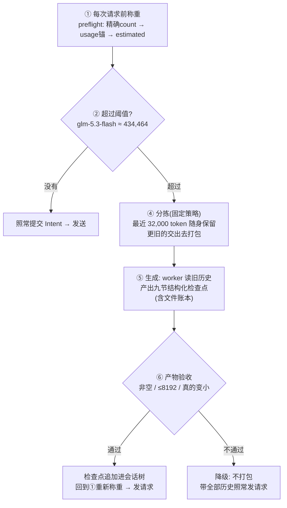
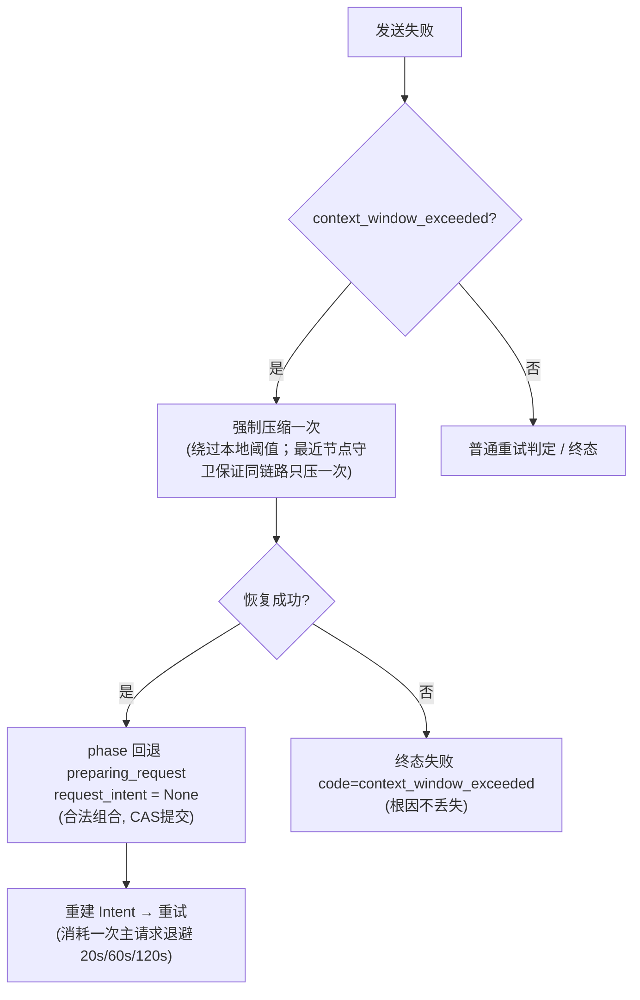

# HistoryCompaction 压缩设计方案

**日期**：2026-08-30
**状态**：评审稿。批次 A/B/C 已实施（分支 `feature/history-compaction-upgrade`，提交 `43445af`–`4d2e8a2`）；批次 E（前缀复用）按本文 §11 评审后实施。
**范围**：压缩全链路——触发、选材、生成、可靠发送、产物校验、提交投影、失败语义、溢出恢复、输入前缀复用。
**不在范围**：Goal/Plan 重构、分段摘要（map-reduce）、projection 级 tool-result 替换。
**术语**：以 [`Agent Runtime 重构命名约束`](./2026-08-10-agent-runtime-naming.md) 为准；本文是压缩子系统的设计与实施记录，不替代合同。

## 1. 设计原则（不变量）

| 不变量 | 含义 |
| --- | --- |
| 三个接缝 | token preflight 只触发；`HistoryCompactionGenerator` 只产出内容；OperationDriver 经 ConversationService 追加节点并重新投影 |
| 树不可变 | append-only Conversation Tree；压缩以新节点表达，原始历史永不删除、永不改写 |
| worker 调用走可靠底座 | 每次尝试一行 ModelCall、SendGate CAS 防双发、失败统一记账；压缩不是旁路裸调 |
| 重试知识单一来源 | 判定与退避收敛于 `AgentRuntimePolicy` 的纯方法；主/worker 各一套参数 |
| 失败不外溢 | 优化失败（压缩没做成）不终止任务；结构性无解才快速失败 |

## 2. 全链路主干



两类异常出口见 §9/§10：结构性失败终止、provider 拒收触发一次强制压缩。

## 3. 触发（token preflight）

- **口径**：`counted`（provider count API）→ `anchor`（复用最近一次匹配前缀的 usage 只估算新增尾部）→ `estimated`（本地估算）。不允许伪装成 counted。
- **阈值公式**（冻结 Package 的主模型配置）：

```text
compaction_threshold = min(
    max_input_tokens（已知时）,
    floor(context_window_tokens × effect_rate) − max_output_tokens,
)
```

- code-glm 实际值：`1,000,000 × 0.5 − 65,536 = 434,464` input tokens。
- 每次请求提交 Intent 前检查；压缩节点提交后回到①重新称重。
- worker 调用是 session 级 ModelCall（`purpose=history_compaction`），不经过 AgentRun preflight，**没有递归压缩**。
- 数字来源：`effect_rate=0.5` 相比 Claude Code/Codex 的 ~90% 窗口利用率偏早触发（业界另有 20% 早压派）；属可调策略，非合同常数。

## 4. 选材（固定策略，零模型成本）

三条规则按顺序执行，产出切点 `first_kept_node_id`：

| # | 规则 | 依据 |
| --- | --- | --- |
| 1 | 从最新向旧累加节点成本，保留尾部 ≤ `compaction_tail_tokens`（32,000） | pi 默认 20k、DSH 默认窗口×16%；32k 是两者之间的工程默认值，无实证依据（DSH 自认无 corpus 支撑），按 agent 可配 |
| 2 | 配对硬规则：切点落在 ToolResult 上时，下修到其 ToolCall 所在节点；不允许"有结果无调用" | pi "never cut at tool results" + DSH "preserve tool-call/result pairing but not whole turns"；**刻意不按完整用户 turn 切**（命名合同无 Turn 实体；turn 粒度过粗） |
| 3 | 可读性调整：保留区以孤立 Assistant 开头时，连同紧邻 User 一并保留（软规则） | 避免"凭空出现的回答"；只会扩大保留区，不破坏规则 2 |

**成本口径**：选材用 `节点 JSON 字节数 ÷ 4` 启发式，**不接入 preflight 正式口径**。理由：选材只影响切点偏移、无正确性后果；preflight 错了会溢出，错误代价差两个量级。已知缺陷：对中文系统性低估（CJK 约 0.5–0.67 token/字，chars/4 只算 0.25），即标称 32k 的保留区中文场景实际可达 5–6 万真实 token（DSH Dev Note 承认同一问题）。升级路径：给估算模块增加按消息列表的入口后由选材复用（独立小改进，已记录观测结论文档）。

## 5. 生成（worker 摘要）

### 5.1 两种输入形态

| 形态 | system | messages | 使用场景 |
| --- | --- | --- | --- |
| 合成形态（现状已实施） | 九节骨架的 SystemSection | 待压缩历史逐节点渲染 `[序号] {json}` 的单条 user 消息 | 兜底：无上次请求可读、或批次 E 未启用 |
| 前缀重放形态（批次 E，§11） | **沿用上次请求的 system 原样** | **投影(待压缩区) + 尾部压缩指令 user 消息** | worker 与主请求同模型且开关开启 |

### 5.2 九节骨架（两种形态共用同一份文本）

```text
## 目标与意图
## 关键决策            ← 格式：**[决策]**：[理由]
## 已验证的命令与结果
## 文件与代码          ← 精确路径：为什么重要 / 关键改动
## 错误与修复
## 未完成事项
## 当前进展
## 下一步              ← 单个动作，与最近请求直接对应
## 关键上下文          ← 约束、用户偏好、环境事实、开放问题
```

规则：每节保留、空节写「（无）」不得删节；保留精确的路径/命令/错误原文/标识符/数值/签名；忠实记录用户纠正；不提及压缩本身；已有检查点则合并去重。
来源：结构为 DSH 八节骨架的中文改写（技术概念并入关键上下文，进度拆为"已验证命令与结果 + 当前进展"），类别沿用基线提示词既有的保留要求；措辞为本项目自己的。

### 5.3 文件账本

`HistoryCompaction` 携带 `read_files` / `modified_files`，由两部分并集构成：待压缩区内内置 `read` / `edit` / `write` 调用的 `path` 参数（bash 等自由工具不参与），加上区内前序压缩节点账本的累积合并。账本跨压缩累积、随检查点回喂下一次摘要（pi 的累积文件账本思路）；旧节点解码缺字段落空元组。

### 5.4 工具输出截断（仅合成形态的输入端）

超 2000 字符的 tool result 文本在**渲染给 worker 的副本**中截为 head 1200 + 标记 + tail 600。历史节点不被改写（与实体决策合同"不动态重写旧 ToolResult"一致）。**前缀重放形态禁止截断**——截断会改变 token 序列、破坏缓存对齐。

## 6. 可靠发送（WorkerCallSender）

| 环节 | 行为 |
| --- | --- |
| 逐 attempt 落库 | `prepare_session_call(request_attempt=N, model_role="worker", purpose=...)`，每次尝试一行 ModelCall |
| 发送 | `ModelCallSendGate` CAS in_flight 防双发 |
| 失败记账 | `record_send_failure` 统一：不完整流 → 存 partial 内容 + `mark_incomplete`（仅诊断，不可伪装成完整结果）；其余 → `mark_failed` |
| 重试 | `should_retry_worker_request`：retryable、未收到任何输出、attempts < `worker_request_max_attempts`(2)；退避 `worker_retry_delay_ms` = (5000, 15000) 递增封顶 |
| 耗尽 | 抛 `WorkerCallSendError`，由调用方决定降级或失败 |

与主请求的差别只有参数：主请求 3 次 / (20s, 60s, 120s)——压缩发生在请求准备中段，长退避会卡住交互，且存在降级兜底，短退避 + 快速降级更合理。判定知识共用同一对策略方法。

## 7. 产物校验（对 worker 的输出验收）

| 检查 | 规则 | 失败码 |
| --- | --- | --- |
| 非空 | 摘要必须含文本块内容 | `history_compaction_empty` |
| 输出预算 | 摘要估算 ≤ `compaction_max_summary_tokens`；**批次 E 提议 4096 → 8192**（对齐 DSH 的 8192：40 万影子区的 2%，且给 reasoning token 留余量） | `history_compaction_summary_too_long` |
| 收缩校验 | 摘要估算 < 被压缩区域估算（同 chars/4 口径）；没变小等于白付调用费 | `history_compaction_no_shrink` |
| 输入预算（批次 E） | 输入估算 ≤ **worker 模型自己的 `effective_input_token_limit()`**（拍板：预算=模型能力，不手拍数字）。同模型时影子区 402k < 434k 由构造保证恒成立；worker 换小窗口模型时该检查变为真实约束 | `history_compaction_input_overflow` |

以上均为内容性失败 → 走降级（§9）。

## 8. 提交与投影

- 通过验收后 `HistoryCompaction(summary, first_kept_node_id, read_files, modified_files)` 经 ConversationService 追加节点（append-only），回到 preflight 对重建后的投影重新计数。
- 投影时 `first_kept_node_id` 之前的历史被检查点替换；原始节点仍在树中可审计。
- 重复压缩防护：Driver 以 `compaction_step_id` 记录"本 step 已尝试压缩"；最近节点已是压缩节点时拒绝再压（结构性守卫）。

## 9. 失败语义（三类出口）

| 出口 | 触发条件（检验位置） | 行为 | 典型例子 |
| --- | --- | --- | --- |
| **降级**（内容性失败） | 产物验收不过（empty / too_long / no_shrink / input_overflow）或 worker 重试耗尽 | logger.warning + `compaction_step_id = step.step_id` + **直接以全量 Context 提交 Intent**；下个 step 重新尝试 | worker 返回空正文；摘要写超预算；压缩区太小没变小 |
| **快速终止**（结构性失败） | `history_compaction_unavailable`（未配 generator/worker）、`history_compaction_no_progress`（压缩已提交仍超阈值 / 同 step 已尝试过） | `_fail_preflight` 终止 Operation，真实原因进错误 | 单个巨型节点挤占窗口；配置缺失 |
| **溢出恢复**（provider 拒收） | `classify_provider_error` 按错误文本与 HTTP 响应体识别 → `context_window_exceeded`，retryable=False | 见 §10 | provider 返回 "context length exceeded" |

分界线是 `HistoryCompactionError.code` 的值：`unavailable` / `no_progress` 进终止分支，其余进降级分支。

已知取舍：降级后同一 step 内若再遇可重试发送失败，重入预检会撞 `no_progress` 快速失败——全量 Context 下的发送失败大概率就是溢出，而溢出有自己的恢复路径，不值得再兜一圈。

## 10. 溢出恢复



前提认知：本地称重低估了真实占用（或 provider 按"输入+输出"算账）。恢复不可用时按原溢出错误终态，不吞根因。压缩后仍溢出属结构性超限，由守卫终止。

## 11. 批次 E：输入前缀复用（待评审）

### 11.1 原理

服务端前缀缓存按 **token 序列**匹配：请求前缀与缓存中某请求逐 token 相同的部分按缓存价计（约全价 1/4–1/10）、prefill 更快。压缩要读的影子区（≈402k token）与上一次真实请求的消息**几乎同源**——投影是确定性的、树是 append-only 的，因此 `投影(待压缩区)` **按值等于**上次请求消息列表的对应前缀。把它直接放进请求，provider 自动匹配到多长就命中多长——**无需我们在应用层做任何前缀比较**（此前设计的 LCP 对齐因此取消）。

### 11.2 请求构造（最终形态）

```text
压缩请求 = replace(上次请求的 ModelContext,
              messages = 投影(待压缩区) + [user: 身份声明 + 九节骨架指令])
```

- system 与 tools **原样沿用**上次请求的（缓存命中的前提；个性化只能放尾部——头部一个字节分叉整条前缀作废，这就是不采用独立 subagent system 的原因）。
- 指令是最后一条 user 消息，开头声明角色（DSH 同款："你现在作为压缩引擎…"）+ §5.2 骨架。
- 语义：**同一个 agent 给接任者写交接备忘**；"独立摘要员"形态在 worker 配置为不同模型时自然出现（§11.4）。
- 待压缩区内新增消息（上次请求之后落库的回答/工具结果）由投影天然包含，它们不在缓存中、按全价计——分叉点之后的量很小。

### 11.3 新增接缝（约百行）

| 接缝 | 位置 | 内容 |
| --- | --- | --- |
| 读回 | `ModelCallService.load_latest_agent_request(session_id, operation_id)` | 底层复用 `list_model_calls` 过滤 `purpose=agent_step` 按 created_at 取最新，经 content store 解码；返回 `(ModelContext, provider, requested_model) | None` |
| 编排 | `_execute_history_compaction` | 开关开启时读回上次请求，作为 `warm_prefix` 传入 generate；并传 `input_budget_tokens = worker.effective_input_token_limit()` |
| 分支 | `generate` 内部 | `warm_prefix` 为 None → 合成形态；否则构造 §11.2 的重放上下文；任何异常回到合成（fail-open） |

### 11.4 前提与已知边界

| 项 | 说明 |
| --- | --- |
| 同模型前提 | 重放假设 worker 与主请求同模型（code-glm 即 glm-5.3-flash）；**不做事前身份比对**（按拍板简化）——不同模型时请求内容仍然正确（投影就是该压的历史），只是缓存不命中、按全价 |
| 端点能力 | opencode-go 已确认有前缀缓存；开关 `compaction_warm_prefix_enabled` 默认 True |
| 缓存过期 | 上次请求久远（如崩溃恢复）时前缀仍正确，只是全价——省钱是 best-effort，正确性无条件 |
| 边界落在压缩节点之前 | 切点早于最近一个压缩节点时，切片投影按更旧的压缩折叠，与上次请求前缀不一致 → 该次缓存 0 命中、全价；正确性不受影响 |
| 预算超限 | 输入估算 > worker 有效窗口 → `input_overflow` 内容性失败 → 降级（同模型时由构造保证不触发） |

### 11.5 实施清单

1. 策略：`compaction_warm_prefix_enabled=True`、`compaction_max_summary_tokens` 4096→8192（format 5 序列化同步）；
2. `load_latest_agent_request` 读回方法（约 30 行）；
3. 生成器：投影重放分支 + `input_budget_tokens` 检查 + **移除 64k 渲染预算**（`summary_input_tokens` 及头尾省略机制整体删除——它以丢失 84% 中段历史为代价，在 worker 同为 1M 窗口时不成立）；
4. Driver 接线 + 协议加 `warm_prefix: ModelContext | None = None`；
5. 测试：重放形状（system/tools 沿用、消息=投影+尾部指令、与上次请求前缀逐值相等）、回退路径、预算边界、策略 roundtrip；
6. 文档校对一句带过（命名合同 §6 + 观测结论文档）。

## 12. 参数一览

| 参数 | 值 | 来源 |
| --- | --- | --- |
| `effect_rate` | 0.5 | 策略默认；比 Claude/Codex(~90%) 早触发，业界另有 20% 早压派；可调 |
| 触发阈值（code-glm） | 434,464 input tokens | 公式计算，非拍脑袋 |
| `compaction_tail_tokens` | 32,000 | pi(20k)/DSH(16%) 之间的工程默认，无实证 |
| 选材成本口径 | chars ÷ 4 | 压缩内部决策；CJK 低估已知，升级路径已记录 |
| `compaction_max_summary_tokens` | 现状 4096 → 批次 E 提议 8192 | DSH 对齐 + reasoning 余量 |
| 摘要输入预算 | 现状 64k 渲染截断 → 批次 E 改为 worker 有效窗口 | 拍板：模型能力即约束 |
| 工具输出截断 | 2,000 字符（head 1200 + tail 600） | pi 同款，仅合成形态输入端 |
| worker 重试 | 2 次，(5s, 15s) | 存在降级兜底，短退避 |
| 主请求重试 | 3 次，(20s, 60s, 120s) | 既有策略 |
| 溢出强制压缩 | 1 次 | DSH maxOverflowRetries 同语义 |
| warm 开关 | 默认 True | opencode-go 已确认有前缀缓存 |

## 13. 业界对照

| 实现 | 分层 | 触发 | 摘要输入 | 摘要上限 |
| --- | --- | --- | --- | --- |
| **本方案** | 预检触发 → 配对/账本（零成本）→ 结构化 LLM 摘要；降级+溢出恢复 | 50% 窗口 | 前缀重放（E）/合成；全量 | 8192（提议） |
| DSH | prune(工具输出) → 前缀重放摘要 → /compact | 80% 窗口 | 重放上次请求前缀 + 尾部指令（热缓存） | 8192 |
| pi | 无修剪层 | window − 16k | 合成转录本（2000 字符截断） | 无硬上限 |
| Claude Code | 工具结果裁剪 → 缓存友好 → 9 节摘要 | ~90%+ | 同 provider 重放 | 无公开硬上限 |
| Codex | Session Memory Compact 先行 | 有效窗口 − 13k | 整条线程 handoff summary | 无公开硬上限 |
| OpenCode | 时间戳隐藏 → 5 节摘要 | 阶梯式 | 合成 | 无硬上限 |

核心共识：append-only 日志 + 投影替换 + 原始历史可回放；分歧在触发时机与输入形态。本方案尚未引入的业界层次：**零成本修剪层**（超限先裁旧工具输出，可能免除 LLM 调用）——列为后续可选项。

## 14. 实施状态与后续

**已实施**（批次 A–C）：策略方法收敛、worker 可靠发送（记账/重试/落库）、协议回归 context 纯接缝（含护栏）、配对硬规则、优雅降级、结构化检查点 + 预算/收缩校验 + 文件账本、溢出恢复。

**待评审后实施**（批次 E）：§11 全部。

**后续可选**（不承诺批次）：选材口径接入估算入口（解决 CJK 低估）；零成本修剪层；worker 换小窗口模型时的分段摘要（map-reduce，多次请求）；`effect_rate` 依据真实会话数据再校准。
