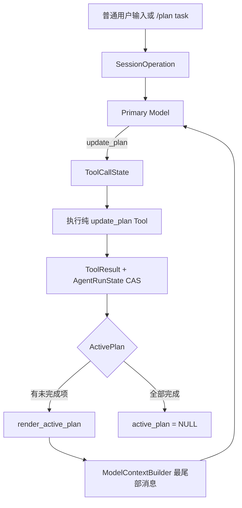
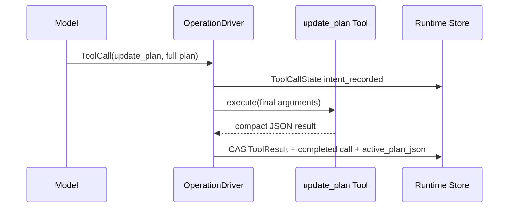

# ActivePlan 设计与实施方案

**日期**：2026-09-01
**状态**：已实施并通过全量验收
**范围**：`update_plan`、Operation 内活动计划、SQLite 持久化、ModelContext 尾部注入、CLI `/plan <task>`、旧 Plan Mode 清理，以及已确认的 HistoryCompaction 重复压缩缺陷
**不在范围**：Goal 重构、计划审批与编辑界面、只读权限模式、独立 Plan 表、Plan 专用压缩、跨 Operation 计划、Web UI

本文记录已实施方案及验收边界；命中的当前合同已经同步更新，不再保留旧的
`CollaborationState(mode="plan")` 合同。

实现依据：

- [`Agent Runtime 重构命名约束`](./2026-08-10-agent-runtime-naming.md)；
- [`Runtime 实体决策`](./2026-08-24-runtime-entity-decisions.md)；
- [`Operation 持久化与恢复模型`](./2026-08-11-operation-recovery-model.md)；
- [`数据库实体设计`](./2026-07-12-db-entities.md)；
- [`HistoryCompaction 压缩设计方案`](./2026-08-30-history-compaction-design.md)；
- [`观测驱动 Runtime 评审结论`](./2026-08-27-observation-driven-runtime-findings.md)。

## 1. 结论

本项目不再实现独立的 Plan Mode。第一版只提供一种由模型主动维护的 Operation 工作记忆：

```text
ActivePlan
```

模型通过始终可见的 `update_plan` Tool 创建、替换和完成计划。用户通过 `/plan <task>`
要求模型先创建计划，但该命令不切换 Runtime 模式。

| 主题 | 决策 |
| --- | --- |
| Runtime 模式 | 不存在 Plan Mode |
| 模型触发 | 模型可在任意 Operation 中主动调用 `update_plan` |
| 用户触发 | 仅支持 `/plan <task>`；无参数报错 |
| Tool Catalog | `update_plan` 始终存在；Plan 不动态隐藏任何 Tool |
| 权限 | Plan 不改变 Tool 权限、审批或执行能力 |
| 状态所有者 | `AgentRunState.active_plan` |
| 生命周期 | 当前 Operation；完成或 Operation 终态后销毁 |
| 持久化 | `agent_run_states.active_plan_json` |
| 展示格式 | 结构化 ActivePlan 临时渲染为 Markdown |
| 上下文位置 | Recall/Hook 之后，ModelContext messages 最尾部 |
| Conversation | `plan.md` 不写入 ConversationNode |
| 压缩 | HistoryCompaction 不感知 ActivePlan |
| 用户审批 | 第一版不做 |

核心原则：

> HistoryCompaction 负责压缩过去发生的 Conversation；ActivePlan 负责保存当前
> Operation 接下来准备做什么。二者只在最终 ModelContext 中组合。

## 2. 目标架构



所有权关系：

```text
SessionOperation
└── AgentRunState
    ├── current_step
    └── active_plan: ActivePlan | None
```

不增加：

- `PlanManager`；
- `PlanService`；
- `PlanDriver`；
- `PlanStore`；
- `plans` 表；
- `PlanMode` 状态机；
- `enter_plan_mode` / `exit_plan_mode` Tool；
- Plan 事件投影或 Conversation 扫描恢复。

## 3. 数据模型

建议在 `src/pickel/operations/active_plan.py` 定义值对象：

```python
from dataclasses import dataclass
from typing import Literal

PlanItemStatus = Literal["pending", "in_progress", "completed"]


@dataclass(frozen=True)
class PlanItem:
    step: str
    status: PlanItemStatus


@dataclass(frozen=True)
class ActivePlan:
    items: tuple[PlanItem, ...]
```

`ActivePlan` 不是独立 Entity：它没有稳定 ID，没有独立生命周期，也不被其他聚合引用。
它是嵌入 `AgentRunState` 的持久化值对象。

### 3.1 JSON 形态

```json
{
  "items": [
    {"step": "分析现有实现", "status": "completed"},
    {"step": "实现状态持久化", "status": "in_progress"},
    {"step": "补充恢复测试", "status": "pending"}
  ]
}
```

不保存：

- `plan_id`；
- `active`；
- `created_at` / `updated_at`；
- `explanation`；
- 渲染后的 Markdown；
- 当前步骤索引。

`active_plan IS NULL` 已经表达“当前没有活动计划”；不要再增加 `active=false`。

### 3.2 校验

第一版使用固定、简单的结构约束：

| 约束 | 规则 |
| --- | --- |
| 计划项数量 | `1..20` |
| step | trim 后非空，最多 500 字符 |
| status | `pending / in_progress / completed` |
| in_progress | 最多一个 |
| 全部 completed | 不构造 ActivePlan，返回 `None` |

Runtime 不强制活动计划必须恰好一个 `in_progress`。稳定 System Guidance 要求模型在实际执行时
尽量保持一个 `in_progress`，但允许首次草拟或重排时全部为 `pending`，避免无意义的 Tool 调用失败。

允许模型：

- 增加、删除、重排和改写步骤；
- 把 `completed` 重新打开为 `pending` 或 `in_progress`；
- 直接用全新计划替换旧计划；
- 一次把全部项目设为 `completed` 并结束计划。

Runtime 不推断步骤完成情况，不自动推进状态，也不根据文件变更猜测进度。

## 4. `update_plan` Tool

### 4.1 Tool schema

建议新增 `src/pickel/tools/update_plan.py`，并由 `tools.catalog.builtin_tools()` 始终注册。
仅注册到 ToolBus 还不够：当前 PackageBuilder 会使用 Agent 配置中的 `allowed_tools` 构造
ToolSnapshot。`update_plan` 是 Runtime 控制 Tool，不是可选的 Workspace 能力，因此构建
Package 时必须把它确定性加入 activation：

```python
active_tool_names = frozenset((*agent_config.tools, "update_plan"))
tool_snapshot = tool_bus.snapshot(ToolActivation(allowed=active_tool_names))
```

这样每个新 AgentPackageVersion 都冻结同一份 `update_plan` schema；旧冻结 Package 继续按其
原合同恢复，不在加载时动态注入 ToolDefinition。

输入：

```json
{
  "type": "object",
  "additionalProperties": false,
  "properties": {
    "explanation": {
      "type": "string",
      "description": "可选。说明为什么创建或重写计划。"
    },
    "plan": {
      "type": "array",
      "minItems": 1,
      "maxItems": 20,
      "items": {
        "type": "object",
        "additionalProperties": false,
        "properties": {
          "step": {"type": "string", "minLength": 1, "maxLength": 500},
          "status": {
            "type": "string",
            "enum": ["pending", "in_progress", "completed"]
          }
        },
        "required": ["step", "status"]
      }
    }
  },
  "required": ["plan"]
}
```

输出：

```json
{
  "type": "object",
  "additionalProperties": false,
  "properties": {
    "updated": {"type": "boolean"},
    "active": {"type": "boolean"},
    "item_count": {"type": "integer", "minimum": 0},
    "completed_count": {"type": "integer", "minimum": 0}
  },
  "required": ["updated", "active", "item_count", "completed_count"]
}
```

ToolResult 只返回计数和是否活动，不复制完整计划。完整计划已经存在于最终
`ToolCallState.arguments` 和 `AgentRunState.active_plan`，重复返回只会浪费 Context。

### 4.2 执行边界

`update_plan` Tool 本身保持纯：

```text
arguments
→ 结构化校验
→ 返回简短 JSONValue
```

它不直接依赖 `OperationStore`，不自行提交数据库，不持有 AgentRunState。

`ToolSpec.replay_policy` 固定为 `safe`。真正的状态更新由 `OperationDriver` 在 Tool 成功后处理：

```text
最终 ToolCallState.arguments
→ parse_active_plan()
→ ToolResultMessage
+ completed ToolCallState
+ AgentRunState.active_plan
→ commit_run_transition(expected_revision)
```

这三项必须在同一个 State CAS + ConversationNode 事务提交。使用 PreToolUse 最终冻结在
`ToolCallState.arguments` 中的参数，不重新解析 AssistantMessage 中的原始参数。

### 4.3 崩溃语义

| 崩溃位置 | 恢复行为 |
| --- | --- |
| Tool Intent 前 | Tool 尚未执行，按正常状态推进 |
| `intent_recorded` 后、Result 提交前 | `safe` 使用同一 tool_call_id 重放纯 Tool |
| Result + ActivePlan 提交后 | 从 AgentRunState 直接恢复，不重放 |

不要让 Tool 先写 ActivePlan、Driver 后写 ToolResult；这会制造“计划已更新但模型看不到结果”的
半提交状态。

### 4.4 多次调用

同一个 AssistantMessage 中如果出现多个 `update_plan`，沿现有 ToolCall 顺序执行：

- 每个成功调用完整替换当前计划；
- 最后一个成功调用获胜；
- 失败调用不改变当前计划；
- 不增加“每轮最多调用一次”的专用限制。

## 5. AgentRunState 与 SQLite v14

### 5.1 Python 状态

扩展 `AgentRunState`：

```python
@dataclass(frozen=True)
class AgentRunState:
    operation_id: str
    revision: int
    status: AgentRunStatus
    waiting_reason: WaitingReason | None
    completed_step_count: int
    current_step: ModelStepState | None
    active_plan: ActivePlan | None
    final_assistant_node_id: str | None
    error: AgentRunError | None
    cancellation: Cancellation | None
```

不把 ActivePlan 放入 `current_step_json`。计划跨越多个 ModelStep，Step 完成时不能随
`current_step` 一起清除。

状态不变量：

```text
queued 初始状态                    → active_plan = None
running / waiting / cancelling      → active_plan 可为空或非空
succeeded / failed / cancelled      → active_plan 必须为空
```

Operation 进入任一终态时，即使模型忘记完成计划，也必须在同一终态事务中清空 ActivePlan。

### 5.2 数据库

当前生产 schema 已经是 SQLite v13。新增：

```text
agent_run_states.active_plan_json TEXT NULL
```

目标 schema 为 v14。迁移：

```sql
ALTER TABLE agent_run_states
ADD COLUMN active_plan_json TEXT NULL;
```

迁移后对所有已有行保持 `NULL`。Store 写入时：

- `None` 写为 SQL `NULL`；
- 非空值写 canonical JSON；
- 读取时严格解码字段、枚举和组合约束；
- 非终态允许非空，终态发现非空视为完整性错误；
- 更新与其他 AgentRunState 字段使用同一个 revision CAS。

不要新增 `plans` 表。ActivePlan 只有当前值，没有历史查询、独立引用和单独并发需求。
历史更新事实已经由 Assistant ToolCall 和 ToolResult ConversationNode 保存。

### 5.3 需要修改的持久化边界

- 新增 `sqlite_schema_v14.py`；
- 新增 v13 → v14 一次性迁移；
- `sqlite_runtime_store.py` 的 create/read/CAS/update SQL；
- `in_memory_runtime_store.py` 的 AgentRunState 保存；
- `agent_run_state.py` 的 strict codec；
- schema、迁移、round-trip 和坏数据测试。

不保留 v13/v14 生产双读写。旧数据库只通过迁移进入 v14。

## 6. ModelContext 与稳定提示词

### 6.1 稳定 System Guidance

对包含 `update_plan` ToolVersion 的新 Package，Plan 使用规则始终存在于固定 System 前缀，
不根据 ActivePlan 是否存在动态增加或删除。历史冻结 Package 如果不包含该 Tool，则不追加这段
Guidance；这个判断只依赖不可变 Package 内容，不依赖运行时 Plan 状态，因此不会造成同一
Operation 的前缀漂移。建议新增固定命名 section：

```text
work_plan_guidance
```

建议内容：

```md
## Work plans

你可以使用 `update_plan` 为复杂、模糊或多阶段任务维护工作计划。

- 简单、单步任务不要创建计划。
- 多步任务应尽早创建计划，并在执行中维护状态。
- 每次调用必须提交完整计划，而不是局部补丁。
- 同时最多一个步骤处于 `in_progress`；执行时应尽量保持一个。
- 完成工作后及时把步骤设为 `completed`。
- 范围变化时可以增删、重排、改写或重新打开步骤。
- 计划不能代替实际工作；创建计划后继续执行任务。
- 所有工作完成后，把全部步骤设为 `completed`。
- 不要在普通 Assistant 文本中重复完整计划；Runtime 会展示并重新注入当前计划。
```

System 顺序保持固定：

```text
behavior
multi_agent_guidance
work_plan_guidance
skills guidance/catalog
extension sections
request hook sections
```

不得在 ActivePlan 创建后才增加 System section，也不得动态修改 Tool Catalog。

### 6.2 ActivePlan 尾部消息

`ModelContextBuilder` 接收显式参数：

```python
active_plan: ActivePlan | None = None
```

Messages 顺序：

```text
1. ConversationProjector 输出
2. Recall messages
3. before_request Hook messages
4. ActivePlan 临时消息（仅 active_plan 非空）
```

渲染示例：

```md
<active_plan>

# Work Plan

- [x] 分析现有实现
- [~] 实现状态持久化
- [ ] 补充恢复测试

</active_plan>
```

映射：

```text
completed   → [x]
in_progress → [~]
pending     → [ ]
```

该消息：

- 是一次请求的临时 `UserMessage`；
- 不追加到 Conversation Tree；
- 不进入 Inbox；
- 不由 Hook 构造；
- 必须包含在最终 token preflight；
- 必须随最终 ModelContext 进入 ModelRequestIntent；
- 每个最终 ModelContext 最多追加一次。

恢复到 `request_ready` 时直接使用已冻结的 ModelRequestIntent，不重新渲染 ActivePlan。
准备下一次新 ModelStep 时，才从最新 AgentRunState 重新渲染。

## 7. HistoryCompaction 边界

不实现 Plan-aware Compaction。

| 内容 | 压缩处理 |
| --- | --- |
| `AgentRunState.active_plan` | 不读取、不摘要 |
| 临时 `plan.md` 消息 | 不在 Conversation，worker 看不到 |
| 历史 `update_plan` ToolCall/ToolResult | 按普通 Conversation 历史处理 |
| 实际代码、命令和测试结果 | 正常摘要 |

压缩流程：

```text
build candidate Context（包含 ActivePlan）
→ token preflight
→ 只压缩 Conversation suffix
→ 追加 HistoryCompaction checkpoint
→ 使用同一 AgentRunState 重新 build Context
→ ActivePlan 再次追加到尾部
→ 再次 token preflight
```

不增加：

- checkpoint 中的 `active_plan` 字段；
- Plan retained-message 过滤；
- Plan 去重或 fingerprint；
- 从 summary 恢复 Plan；
- Plan 独立压缩预算；
- Plan 专用 worker prompt 分支。

历史 `update_plan` 和尾部 ActivePlan 可能暂时语义重复，这是正常的：前者是历史事实，后者是
当前状态。不要为了去重破坏 ToolCall/ToolResult 配对或 append-only Conversation。

### 7.1 现有重复压缩缺陷

当前 `OperationDriver` 使用：

```python
built_context.has_history_compaction
```

它由“Context nodes 的第一个节点是否为 checkpoint”计算。一旦 Session 曾压缩过，该值会在
后续 Context 中持续为真，导致 checkpoint 后产生大量新消息时也无法再次压缩。

目标改为：

```python
leaf_is_history_compaction
```

只判断当前 active leaf 本身是不是 checkpoint：

```python
leaf_is_history_compaction = bool(
    nodes and nodes[-1].content_type == "history_compaction"
)
```

预检保护：

```python
if (
    compaction_step_id == step.step_id
    or built_context.leaf_is_history_compaction
):
    fail("history_compaction_no_progress")
```

效果：

- 同一 Step 刚压缩后仍超限：停止循环；
- checkpoint 提交后崩溃并恢复：不立即重复压缩；
- checkpoint 后已有新消息：未来允许再次压缩；
- 不给 HistoryCompaction 增加 step_id 或 Plan 字段。

这个修复属于现有通用压缩合同，应作为独立批次完成，不写进 Plan 领域代码。

## 8. CLI `/plan <task>`

命令元数据改为：

```text
summary: Create a work plan and execute the task
usage:   /plan <task>
```

行为：

```text
/plan 实现用户登录和权限验证
```

转换为普通用户输入：

```text
请先调用 update_plan 创建工作计划，然后按照计划完成以下任务：

实现用户登录和权限验证
```

然后走与普通输入完全相同的：

```text
UserMessage → Inbox → SessionOperation → AgentRun
```

无参数：

```text
用法：/plan <任务描述>
```

明确不支持：

- `/plan` 空命令进入模式；
- `/plan off`；
- `/exit-plan`；
- 初始计划由 CLI 解析为步骤；
- CLI 直接写 ActivePlan；
- CLI 绕过普通 AgentRun 流程。

实现时让 Slash dispatch 返回待转发的普通用户文本，再复用现有聊天发送路径；不要在
`_command_plan()` 内部复制事件订阅、flush、取消和错误渲染流程。

## 9. 旧 Plan Mode 清理

当前旧实现必须删除以下行为：

| 位置 | 删除或修改 |
| --- | --- |
| `shared/collaboration.py` | 删除 `plan` mode、`plan` tuple、`PLAN_READ_ONLY_TOOL_NAMES` 和 Plan prompt |
| `runtime/operation_driver.py` | 删除 Plan Tool 可见性过滤和执行前只读限制 |
| `context/model_context_builder.py` | 删除动态 Plan collaboration section；保留 Goal 现状 |
| `app/runtime_host.py` | 不再保存 Session 内存 Plan；现有 Goal 状态暂时保留 |
| `app/conversation_runtime.py` | `/plan` 不再调用 `set_collaboration_mode("plan")` |
| `cli/chat.py` | 删除 `/plan off` 和“只读模式”提示 |
| `cli/slash.py` | usage 改为 `/plan <task>` |

本批不重构 Goal。为减少范围，可以让 `CollaborationState` 暂时只承载：

```text
normal / goal
```

不要为了 Plan 清理顺带设计新的 Goal 持久化方案。

## 10. 原子状态变化

### 10.1 创建或替换计划



### 10.2 完成计划

```text
update_plan(all completed)
→ Tool 成功
→ next_active_plan = None
→ ToolResult + active_plan_json=NULL 原子提交
→ 下一次 ModelContext 不再追加 plan.md
```

### 10.3 Operation 终态

```text
succeeded / failed / cancelled
→ active_plan_json = NULL
→ Session.active_operation_id = NULL
```

这两个事实进入现有 Operation 终态事务。历史 ToolCall 继续保留，但不能污染下一个 Operation。

## 11. 实施批次

### A. 合同校对

更新现有文档，不另建同主题 v2/v3：

1. `2026-08-10-agent-runtime-naming.md`：删除 Plan CollaborationMode 和只读过滤合同；增加 ActivePlan、`update_plan` 和尾部注入命名。
2. `2026-08-24-runtime-entity-decisions.md`：给 AgentRunState 增加 ActivePlan 值对象，更新 Context 合成顺序。
3. `2026-08-11-operation-recovery-model.md`：增加 ToolResult 与 ActivePlan 原子状态迁移、终态清理。
4. `2026-07-12-db-entities.md`：增加 v14 `active_plan_json` 字段和迁移。
5. `2026-08-30-history-compaction-design.md`：明确无 Plan-aware 压缩，并修正重复压缩门禁。
6. `2026-08-27-observation-driven-runtime-findings.md`：校对 v13 当前实施状态和重复压缩缺陷。

### B. 通用压缩修复

先修复 `has_history_compaction` 的语义并补回归测试。该批不包含任何 Plan 代码。

### C. Plan 值对象与持久化

实现 ActivePlan、strict codec、AgentRunState 字段、SQLite v14 和 InMemory Store。

### D. Tool 与状态转换

注册 `update_plan`，接入 OperationDriver 的 ToolResult 原子提交和恢复路径。

### E. Context 与提示词

加入稳定 Guidance、尾部渲染和完整 token preflight，删除旧 Plan Tool 过滤。

### F. CLI 与旧路径清理

实现 `/plan <task>` 转发，删除 `/plan off` 和旧 Session Plan 状态。

### G. 全量验收与文档校对

运行分层测试和全量测试，最后反向校对第 A 批命中文档与实现。

## 12. 逐文件实施清单

| 文件或目录 | 目标改动 |
| --- | --- |
| `src/pickel/operations/active_plan.py` | 新增 PlanItem、ActivePlan、codec、校验和完整替换纯函数 |
| `src/pickel/operations/agent_run_state.py` | 增加 `active_plan` 和 strict codec |
| `src/pickel/persistence/sqlite_schema_v14.py` | 当前 schema v14 |
| `src/pickel/persistence/*migration*` | v13 → v14 添加 nullable 列 |
| `src/pickel/persistence/sqlite_runtime_store.py` | AgentRunState SQL 读写与 CAS |
| `src/pickel/persistence/in_memory_runtime_store.py` | 同一 Store 合同 |
| `src/pickel/tools/update_plan.py` | 内置纯 Tool、schema、render |
| `src/pickel/tools/catalog.py` | 始终注册 update_plan |
| `src/pickel/agents/agent_package_builder.py` | 不受用户 allowed_tools 排除，确定性冻结 update_plan ToolVersion |
| `src/pickel/runtime/operation_driver.py` | Tool 成功后的 ActivePlan 原子状态变化；压缩门禁修复；删除 Plan Tool 限制 |
| `src/pickel/context/active_plan.py` | 纯 Markdown renderer；若内容很少可与 operations 值对象同文件，避免空模块 |
| `src/pickel/context/model_context_builder.py` | 固定 Guidance 和最终尾部消息 |
| `src/pickel/shared/collaboration.py` | 删除 Plan，只保留当前 Goal 行为 |
| `src/pickel/app/runtime_host.py` | 删除 Plan 内存状态路径 |
| `src/pickel/app/conversation_runtime.py` | 删除 Plan mode API 调用 |
| `src/pickel/cli/slash.py` | `/plan <task>` 元数据 |
| `src/pickel/cli/chat.py` | 转换并转发普通用户任务 |
| `tests/**` | 见第 13 节 |

不要创建 `ActivePlanManager`、`PlanCoordinator`、`PlanPolicy` 或通用 Tool state reducer registry。
第一版允许 OperationDriver 对 Runtime 内置控制 Tool 做一个窄的显式分支；出现第二个同类状态
Tool 后再评审是否提取纯 reducer 接缝。

## 13. 测试与验收

### 13.1 值对象

- 三种状态严格 round-trip；
- 空计划、空 step、超长 step、超过 20 项被拒绝；
- 两个 `in_progress` 被拒绝；
- 全部 completed 返回 `None`；
- 重排、删除、增加和重新打开 completed 成功；
- renderer 顺序和 checkbox 精确。

### 13.2 Tool 与 Operation

- `update_plan` 出现在冻结 Package Tool Catalog；
- 即使 Agent 配置没有列出 update_plan，新构建 Package 仍包含它；
- 无 ActivePlan 时首次成功调用创建计划；
- 后续调用完整替换；
- Tool 错误不修改旧计划；
- 全部完成时 ToolResult 与 `NULL` 原子提交；
- PreToolUse 修改后的最终 arguments 成为实际计划；
- `intent_recorded` 崩溃后按 safe policy 重放；
- Result 已提交后恢复不重放；
- 多个 update_plan 按 ToolCall 顺序最后成功者获胜；
- Operation 三种终态都清空 ActivePlan。

### 13.3 持久化

- 新数据库创建为 v14；
- v13 数据库迁移后历史状态保持且 ActivePlan 为 NULL；
- 非空 ActivePlan 重启后恢复；
- 非法 JSON、未知状态、终态非空计划被拒绝；
- SQLite 与 InMemory Store 行为一致；
- revision CAS 冲突不覆盖新计划。

### 13.4 Context

- 无 ActivePlan 时不增加消息；
- 有 ActivePlan 时只在 messages 最尾部增加一次；
- 顺序为 Conversation、Recall、Hook、ActivePlan；
- 新 Package 的 Work Plan Guidance 始终存在，不随计划有无变化；历史无 update_plan Package 不伪造 Guidance；
- Tool Catalog 在计划有无之间完全一致；
- preflight 对包含计划的完整 Context 计数；
- 压缩后重新构建仍注入同一计划；
- request_ready 恢复使用冻结 Intent，不重复渲染。

### 13.5 HistoryCompaction

- checkpoint leaf 重建后仍超限，只失败一次；
- checkpoint leaf 崩溃恢复不重复调用 worker；
- checkpoint 后有普通消息并再次超阈值时允许第二次压缩；
- 第二次压缩只读取最近 checkpoint 与 suffix；
- HistoryCompaction 内容不增加 ActivePlan；
- 历史 update_plan ToolCall/ToolResult 保持普通配对语义。

### 13.6 CLI 与回归

- `/plan <task>` 转换成预期普通 UserMessage；
- `/plan` 和空白参数显示用法错误且不创建 Operation；
- `/plan off` 被当作普通任务文本或明确不再具备退出语义；建议直接按任务文本处理，避免保留隐式模式兼容；
- `/help` 显示新 usage；
- Session summary 不显示 Plan collaboration mode；
- Goal 现有行为和测试不回归；
- Root/Child Tool 可见性现有规则不回归；
- 全量测试通过。

## 14. 完成定义

以下条件全部满足才算完成：

1. Runtime 中不存在 Plan Mode 状态和 Plan 专用 Tool 限制。
2. 模型始终能看到 `update_plan`，也始终能看到其他原有 Tool。
3. ActivePlan 可以跨 ModelStep 和进程重启恢复。
4. ToolResult、ToolCall 完成状态和 ActivePlan 使用同一个 revision CAS 提交。
5. 全部 completed 或 Operation 终态后数据库中不再保留活动计划。
6. ActivePlan 只在最终 ModelContext 尾部临时出现一次。
7. HistoryCompaction 不保存、恢复、过滤或去重 Plan。
8. checkpoint 后新增历史可以再次触发通用压缩。
9. `/plan` 只接受任务参数并走普通 UserMessage/Operation 流程。
10. SQLite v14 迁移、恢复测试和全量回归通过。

## 15. 设计取舍

| 备选 | 不采用原因 |
| --- | --- |
| 保存 `plan.md` 文本 | 需要解析 Markdown，展示格式变成数据库合同，形成第二份权威 |
| 从 Conversation ToolCall 持续投影当前计划 | 每次构建扫描历史，压缩与恢复复杂，当前状态权威不直接 |
| 独立 Plan 表 | 只有一个 Operation 当前值，没有独立查询或引用需求 |
| Session 级 Plan | 会污染下一次不相关 Operation，生命周期不明确 |
| 动态 Tool Catalog | 破坏稳定前缀和 prompt cache |
| Plan 时拒绝写 Tool | 用户明确要求模型可自由执行，且本功能不是权限模式 |
| Plan 专用 HistoryCompaction | ActivePlan 已独立持久化并在最后重注入，没有必要 |
| Runtime 自动推断进度 | 会产生第二个决策者，与模型维护计划冲突 |
| 用户审批/编辑流程 | 当前 CLI 第一版不需要，显著扩大状态机和交互复杂度 |

最终抽象保持为：

```text
ActivePlan                 Operation 当前工作记忆值
update_plan                模型维护完整计划的 Runtime Tool
AgentRunState              唯一持久化执行状态
ModelContextBuilder        最终尾部组合入口
HistoryCompaction          与 Plan 无关的 Conversation checkpoint
```
